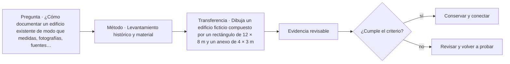

# ARQ-452 · Levantamiento histórico y material

**Parte 46 · Clase desarrollada · Incorporada en v0.26.0.**

Prerrequisitos conceptuales: ARQ-451. Sin calendario. Casos, cantidades y resultados son ficticios salvo antecedentes expresamente atribuidos. Material educativo: no constituye diagnóstico pericial, proyecto ejecutable, autorización, certificación ni habilitación profesional. Revisión externa especializada pendiente.

## Pregunta central

¿Cómo documentar un edificio existente de modo que medidas, fotografías, fuentes históricas y fases constructivas puedan compararse sin mezclar observación e interpretación?

## Resultado y continuidad

ARQ-452 abre un tramo nuevo dentro de la Parte 46 y recibe métodos previos sin heredar cifras. Elaborarás un registro trazable, resolverás un caso reproducible, formularás una práctica distinta y cerrarás separando dato, inferencia, requisito, decisión y pendiente.

El trabajo sobre existentes requiere conservar una separación estricta entre **registro**, **interpretación** y **propuesta**. Una intervención no se justifica porque una imagen parezca dañada ni porque una técnica sea habitual. Antes de decidir se reconstruyen material, historia, funcionamiento y significación. Las decisiones se revisan cuando aparece evidencia nueva y se documenta lo que no pudo observarse.

## 1. Del edificio observado al registro verificable

Un levantamiento patrimonial no comienza con una reconstrucción ideal del edificio, sino con un sistema de referencias: fecha, autor del registro, instrumento, punto observado, orientación y nivel de confianza. Planta, sección, fotografía y nota histórica responden preguntas distintas. Una cota medida hoy no demuestra la fecha de un muro; un plano antiguo no prueba que todo lo dibujado siga existiendo. La utilidad del dossier está en permitir comparar capas de evidencia sin convertir una de ellas en verdad absoluta.

## 2. Fases, cambios y anacronismos

Las fases se proponen a partir de juntas, materiales, huellas, documentos y relaciones geométricas. Una abertura tapiada puede sugerir un cambio, pero su fecha necesita otra evidencia. El método conserva hipótesis alternativas cuando dos secuencias siguen siendo plausibles. Dibujar cada fase con un código distinto ayuda a visualizar qué se observó, qué proviene de archivo y qué fue inferido.

## 3. Medición y cierre geométrico

Las medidas deben formar redes comprobables. En recintos irregulares, diagonales y referencias comunes permiten detectar errores de captura. Cerrar un polígono no demuestra que cada detalle esté correcto, pero revela inconsistencias. La documentación HABS del NPS se usa como referencia metodológica para dibujos medidos y reportes, sin trasladar sus requisitos formales como obligación chilena.

## 4. Materiales y estratigrafía visible

Describir material significa registrar lo que puede observarse: tipo aparente, acabado, juntas, alteraciones y relación con otras capas. No se raspa, perfora o toma muestra sin autorización, método y competencia. Cuando un revestimiento oculta el soporte, el campo correcto puede ser “no observado”, no una suposición basada en otra pared.

## 5. Caso trabajado

Caso **HER-LEV-01**. Una sala comunitaria ficticia tiene un cuerpo rectangular observado de 18 × 10 m y una ampliación norte de 6 × 4 m. El área de huella actual es 204 m². Un croquis de 1965 representa solo el cuerpo principal: 180 m². La diferencia geométrica de 24 m² coincide con la ampliación observada, pero no demuestra que se construyera inmediatamente después de 1965. Una fotografía sin fecha muestra la fachada antes de una abertura lateral; un expediente municipal menciona una obra en 1984, pero todavía no se ha comprobado que corresponda a esa ampliación. La conclusión correcta conserva tres capas: geometría actual comprobada, estado histórico documentado y cronología pendiente de corroborar.

## 6. Profundización: diagnóstico, intervención y punto de detención

La intervención responsable mantiene una cadena: **manifestación → hipótesis → evidencia → criterio → alternativa → comprobación**. Saltarse un eslabón suele convertir una preferencia de reparación en diagnóstico. El punto de detención se usa cuando la evidencia disponible no permite distinguir alternativas o cuando avanzar podría destruir material, ocultar información o crear un riesgo que requiere competencia específica.

En patrimonio, la significación y la condición se registran por separado y luego se coordinan. Un elemento puede tener alta significación y mal estado; también puede estar en buen estado y carecer de valor particular dentro del caso. La decisión no se obtiene de una suma automática. Se documenta qué servicio debe mantenerse, qué valor está en juego, qué riesgos se conocen y quién debe revisar la intervención.

## 7. Interfaces profesionales y control de cambios

Las decisiones de esta clase cruzan disciplinas y etapas. Cada registro debe identificar **objeto, ubicación, fuente, fecha o versión, responsable de producir evidencia, responsable de revisarla y condición de cierre**. Una modificación no obliga a repetir todo el proyecto, pero sí a rastrear qué afirmaciones dependían del dato que cambió.

Cuando una evidencia pertenece a otra jurisdicción, producto, material o edificio, se conserva como referencia conceptual y no como resultado del caso. La aceptación del cliente, la presencia de un archivo o una cifra aritméticamente correcta tampoco sustituyen la comprobación técnica o administrativa que corresponda.

## 8. Errores frecuentes y comprobaciones de calidad

Evita convertir **ausencia de evidencia en evidencia de ausencia**, promediar estados que necesitan conservarse por separado, compensar una condición necesaria con un buen puntaje en otro criterio, o eliminar un resultado desfavorable porque complica la narrativa. También evita citar una norma o guía sin registrar su edición, jurisdicción y alcance de consulta.

Una entrega robusta permite repetir las cuentas y localizar la procedencia de cada afirmación. Si una cifra cambia al modificar una hipótesis, la sensibilidad se documenta; no se inventa una probabilidad. Si el modelo deja fuera un fenómeno relevante, se indica qué conclusión sigue siendo válida y cuál debe reabrirse.

*Figura 452. Esquema didáctico de relaciones y estados. No representa una obra, diagnóstico, autorización ni certificación real.*

## 9. Práctica independiente

Dibuja un edificio ficticio compuesto por un rectángulo de 12 × 8 m y un anexo de 4 × 3 m. Un plano antiguo muestra solo el rectángulo. Calcula ambas huellas y redacta cuatro afirmaciones: dos observaciones, una inferencia y una pregunta histórica pendiente.

10. Solución razonada

La huella principal es 96 m²; con el anexo, 108 m². Se puede afirmar que la geometría actual del ejercicio contiene 12 m² adicionales y que el plano antiguo no los representa. No se puede fechar el anexo solo con esa diferencia. La inferencia debe etiquetarse como tal y pedir evidencia adicional.

La solución corresponde solo al modelo declarado. En un proyecto real se deben confirmar legislación, permisos, condiciones del sitio, productos, ensayos, contratos, competencias profesionales, participación y responsabilidades aplicables.

## 11. Autoevaluación y transferencia

Puedes avanzar cuando eres capaz de reconstruir el caso sin consultar la respuesta, explicar una conclusión que **sí** está respaldada y otra que **no**, y nombrar el documento, ensayo, participante o especialista que debería aportar la evidencia pendiente. La meta no es memorizar el número final, sino mantener coherencia entre pregunta, método, resultado y decisión.

La clase siguiente conserva el método, no las cifras, salvo cuando el texto declara explícitamente un caso continuo.

<!-- pedagogia-2026:inicio -->
## Mapa visual de aprendizaje

El diagrama representa el ciclo de aprendizaje de esta clase, no una secuencia de obra ni un procedimiento profesional.

## Resultado observable, evidencia y evaluación

**Tipo de clase:** histórica y crítica.

**Evidencia mínima:** ficha comparativa con fuente, observación, interpretación, contraejemplo y límite de transferencia.

**Archivo sugerido:** `evidence/ARQ-452/evidencia.md`.

| Criterio | Evidencia observable |
|---|---|
| Precisión y representación · 20 % | Los conceptos, unidades y convenciones se usan de forma coherente y pueden ser reconstruidos por otra persona. |
| Evidencia y trazabilidad · 25 % | Cada afirmación importante se vincula con dato, cálculo, observación o fuente; hipótesis y desconocidos permanecen visibles. |
| Decisión y alternativas · 25 % | La decisión responde a la pregunta, compara al menos una alternativa y declara qué condición la haría cambiar. |
| Integración y ciclo de vida · 20 % | Se identifica una interfaz y una consecuencia para construcción, uso, mantenimiento, adaptación o fin de vida. |
| Comunicación, ética y límites · 10 % | El alcance se entiende sin explicación oral adicional y no se atribuyen permisos, competencias o certezas inexistentes. |

**Criterio de aceptación:** 80/100 y ningún criterio bajo 60 %. Una entrega genérica que podría reutilizarse sin cambios en otra clase no demuestra dominio. Si existe una condición crítica de seguridad, accesibilidad, evidencia o responsabilidad sin resolver, la entrega permanece pendiente aunque el promedio supere 80.

### Errores diagnósticos

En esta clase conviene vigilar especialmente: confundir descripción con explicación; atribuir intención sin fuente; copiar una forma sin sus condiciones.

## Autoevaluación, recuperación y continuidad

Antes de avanzar, responde sin consultar la solución:

1. ¿Qué decisión concreta puedes tomar ahora que no podías justificar antes?
2. ¿Qué evidencia de tu entrega es comprobada y cuál continúa siendo una hipótesis?
3. ¿Qué cambio de contexto invalidaría la transferencia realizada?

Revisa la entrega a las 24–48 horas y nuevamente al cerrar la parte. Conserva la primera versión, la crítica recibida y la versión revisada: el aprendizaje se demuestra también mediante el cambio entre versiones.
<!-- pedagogia-2026:fin -->

## Fuentes y alcance de uso

### [[HER-HABS-GUIDE]](#FUENTE-HER-HABS-GUIDE) Heritage Documentation Programs — Documentation Guidelines

U.S. National Park Service. [https://www.nps.gov/subjects/heritagedocumentation/guidelines.htm](https://www.nps.gov/subjects/heritagedocumentation/guidelines.htm)

**Consulta:** Página oficial de guías HABS/HAER/HALS y alcance de documentación medida, fotográfica e histórica. **Apoyo:** Organizar levantamientos históricos y materiales con trazabilidad, dibujos medidos, fotografía y fuentes. **Límite:** Marco estadounidense; no sustituye requisitos patrimoniales chilenos ni convierte un levantamiento educativo en documentación oficial.

### [[HER-HSR]](#FUENTE-HER-HSR) Preservation Brief 43 — The Preparation and Use of Historic Structure Reports

U.S. National Park Service. [https://www.nps.gov/orgs/1739/upload/preservation-brief-43-historic-structure-reports.pdf](https://www.nps.gov/orgs/1739/upload/preservation-brief-43-historic-structure-reports.pdf)

**Consulta:** Resumen y apartados sobre recopilación de antecedentes, condición, significación y recomendaciones. **Apoyo:** Relacionar investigación histórica, levantamiento, condición material, usos y alternativas antes de intervenir. **Límite:** No se aplica como formato obligatorio en Chile ni se prescribe investigación destructiva.

### [[HER-BURRA]](#FUENTE-HER-BURRA) The Burra Charter and Practice Notes

Australia ICOMOS. [https://australia.icomos.org/publications/burra-charter-practice-notes/](https://australia.icomos.org/publications/burra-charter-practice-notes/)

**Consulta:** Página de recursos; no lectura integral de la Carta ni de todas las notas. **Apoyo:** Referencia para estudiar significación cultural y gestión de lugares patrimoniales. **Límite:** No se atribuyen requisitos de artículos no consultados ni se determina protección legal de un lugar ficticio.
