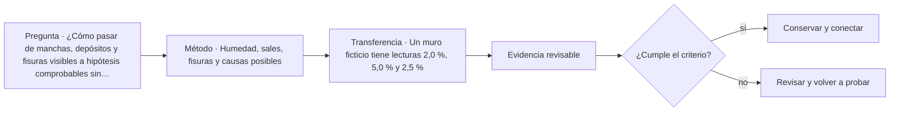

# ARQ-453 · Humedad, sales, fisuras y causas posibles

**Parte 46 · Clase desarrollada · Incorporada en v0.26.0.**

Prerrequisitos conceptuales: ARQ-452. Sin calendario. Casos, cantidades y resultados son ficticios salvo antecedentes expresamente atribuidos. Material educativo: no constituye diagnóstico pericial, proyecto ejecutable, autorización, certificación ni habilitación profesional. Revisión externa especializada pendiente.

## Pregunta central

¿Cómo pasar de manchas, depósitos y fisuras visibles a hipótesis comprobables sin diagnosticar una causa única por apariencia?

## Resultado y continuidad

ARQ-453 continúa desde ARQ-452; cualquier caso o parámetro nuevo se identifica expresamente y no modifica retrospectivamente la clase anterior. Elaborarás un registro trazable, resolverás un caso reproducible, formularás una práctica distinta y cerrarás separando dato, inferencia, requisito, decisión y pendiente.

El trabajo sobre existentes requiere conservar una separación estricta entre **registro**, **interpretación** y **propuesta**. Una intervención no se justifica porque una imagen parezca dañada ni porque una técnica sea habitual. Antes de decidir se reconstruyen material, historia, funcionamiento y significación. Las decisiones se revisan cuando aparece evidencia nueva y se documenta lo que no pudo observarse.

## 1. Manifestación no es mecanismo

Una mancha describe un aspecto; “capilaridad”, “filtración”, “condensación” o “fuga” son hipótesis de mecanismos. El mismo patrón puede depender de más de un proceso y un mismo mecanismo puede producir manifestaciones diferentes. El diagnóstico empieza describiendo ubicación, extensión, material, orientación y cambio en el tiempo.

## 2. Humedad y sales como sistema

El agua transporta solutos, modifica propiedades y puede evaporarse en otra zona. Una eflorescencia no identifica por sí sola la fuente del agua ni la composición de la sal. Deben distinguirse mediciones de humedad, análisis de sales, condiciones ambientales y rutas posibles. Un valor aislado sin referencia, profundidad y método tiene alcance limitado.

## 3. Fisuras: geometría y evolución

Registra posición, orientación, longitud y apertura con una referencia temporal. El cambio puede ser más informativo que una única lectura, pero tampoco explica por sí solo el mecanismo. Temperatura, humedad, acciones y movimientos del soporte pueden interactuar. Una fisura aparentemente estable durante una ventana corta no certifica estabilidad estructural.

## 4. Mapa de hipótesis

La matriz de diagnóstico relaciona manifestación, hipótesis, evidencia a favor, evidencia en contra y prueba siguiente. El objetivo no es puntuar hasta encontrar un “ganador”, sino decidir qué observación o ensayo puede discriminar entre mecanismos plausibles con el menor impacto necesario.

## 5. Caso trabajado

Caso **HER-PAT-01**. En tres zonas se registran contenidos de humedad didácticos de 1,8 %, 4,5 % y 2,1 % mediante el mismo método. La zona central coincide con una bajada de aguas y presenta sales visibles. Una fisura cercana pasa de 0,60 a 0,80 mm entre dos lecturas separadas por seis semanas, mientras la temperatura ambiental también cambia. El aumento de 0,20 mm es un dato de esa ventana; no demuestra asentamiento activo ni relación causal con la humedad. El siguiente paso es separar ruta de agua, composición del depósito y seguimiento geométrico antes de elegir reparación.

## 6. Profundización: diagnóstico, intervención y punto de detención

La intervención responsable mantiene una cadena: **manifestación → hipótesis → evidencia → criterio → alternativa → comprobación**. Saltarse un eslabón suele convertir una preferencia de reparación en diagnóstico. El punto de detención se usa cuando la evidencia disponible no permite distinguir alternativas o cuando avanzar podría destruir material, ocultar información o crear un riesgo que requiere competencia específica.

En patrimonio, la significación y la condición se registran por separado y luego se coordinan. Un elemento puede tener alta significación y mal estado; también puede estar en buen estado y carecer de valor particular dentro del caso. La decisión no se obtiene de una suma automática. Se documenta qué servicio debe mantenerse, qué valor está en juego, qué riesgos se conocen y quién debe revisar la intervención.

## 7. Interfaces profesionales y control de cambios

Las decisiones de esta clase cruzan disciplinas y etapas. Cada registro debe identificar **objeto, ubicación, fuente, fecha o versión, responsable de producir evidencia, responsable de revisarla y condición de cierre**. Una modificación no obliga a repetir todo el proyecto, pero sí a rastrear qué afirmaciones dependían del dato que cambió.

Cuando una evidencia pertenece a otra jurisdicción, producto, material o edificio, se conserva como referencia conceptual y no como resultado del caso. La aceptación del cliente, la presencia de un archivo o una cifra aritméticamente correcta tampoco sustituyen la comprobación técnica o administrativa que corresponda.

## 8. Errores frecuentes y comprobaciones de calidad

Evita convertir **ausencia de evidencia en evidencia de ausencia**, promediar estados que necesitan conservarse por separado, compensar una condición necesaria con un buen puntaje en otro criterio, o eliminar un resultado desfavorable porque complica la narrativa. También evita citar una norma o guía sin registrar su edición, jurisdicción y alcance de consulta.

Una entrega robusta permite repetir las cuentas y localizar la procedencia de cada afirmación. Si una cifra cambia al modificar una hipótesis, la sensibilidad se documenta; no se inventa una probabilidad. Si el modelo deja fuera un fenómeno relevante, se indica qué conclusión sigue siendo válida y cuál debe reabrirse.

*Figura 453. Esquema didáctico de relaciones y estados. No representa una obra, diagnóstico, autorización ni certificación real.*

## 9. Práctica independiente

Un muro ficticio tiene lecturas 2,0 %, 5,0 % y 2,5 %. Una fisura pasa de 0,9 a 1,0 mm. Redacta tres hipótesis y una comprobación capaz de distinguir al menos dos de ellas, sin seleccionar todavía una reparación.

10. Solución razonada

La lectura central es mayor, pero no identifica la fuente. El cambio de fisura es 0,1 mm dentro del método adoptado. Hipótesis posibles incluyen entrada localizada de agua, condensación superficial o fuga próxima; la comprobación debe relacionarse con la ruta y el tiempo, no con una receta de material.

La solución corresponde solo al modelo declarado. En un proyecto real se deben confirmar legislación, permisos, condiciones del sitio, productos, ensayos, contratos, competencias profesionales, participación y responsabilidades aplicables.

## 11. Autoevaluación y transferencia

Puedes avanzar cuando eres capaz de reconstruir el caso sin consultar la respuesta, explicar una conclusión que **sí** está respaldada y otra que **no**, y nombrar el documento, ensayo, participante o especialista que debería aportar la evidencia pendiente. La meta no es memorizar el número final, sino mantener coherencia entre pregunta, método, resultado y decisión.

La clase siguiente conserva el método, no las cifras, salvo cuando el texto declara explícitamente un caso continuo.

<!-- pedagogia-2026:inicio -->
## Mapa visual de aprendizaje

El diagrama representa el ciclo de aprendizaje de esta clase, no una secuencia de obra ni un procedimiento profesional.

## Resultado observable, evidencia y evaluación

**Tipo de clase:** histórica y crítica.

**Evidencia mínima:** ficha comparativa con fuente, observación, interpretación, contraejemplo y límite de transferencia.

**Archivo sugerido:** `evidence/ARQ-453/evidencia.md`.

| Criterio | Evidencia observable |
|---|---|
| Precisión y representación · 20 % | Los conceptos, unidades y convenciones se usan de forma coherente y pueden ser reconstruidos por otra persona. |
| Evidencia y trazabilidad · 25 % | Cada afirmación importante se vincula con dato, cálculo, observación o fuente; hipótesis y desconocidos permanecen visibles. |
| Decisión y alternativas · 25 % | La decisión responde a la pregunta, compara al menos una alternativa y declara qué condición la haría cambiar. |
| Integración y ciclo de vida · 20 % | Se identifica una interfaz y una consecuencia para construcción, uso, mantenimiento, adaptación o fin de vida. |
| Comunicación, ética y límites · 10 % | El alcance se entiende sin explicación oral adicional y no se atribuyen permisos, competencias o certezas inexistentes. |

**Criterio de aceptación:** 80/100 y ningún criterio bajo 60 %. Una entrega genérica que podría reutilizarse sin cambios en otra clase no demuestra dominio. Si existe una condición crítica de seguridad, accesibilidad, evidencia o responsabilidad sin resolver, la entrega permanece pendiente aunque el promedio supere 80.

### Errores diagnósticos

En esta clase conviene vigilar especialmente: confundir descripción con explicación; atribuir intención sin fuente; copiar una forma sin sus condiciones.

## Autoevaluación, recuperación y continuidad

Antes de avanzar, responde sin consultar la solución:

1. ¿Qué decisión concreta puedes tomar ahora que no podías justificar antes?
2. ¿Qué evidencia de tu entrega es comprobada y cuál continúa siendo una hipótesis?
3. ¿Qué cambio de contexto invalidaría la transferencia realizada?

Revisa la entrega a las 24–48 horas y nuevamente al cerrar la parte. Conserva la primera versión, la crítica recibida y la versión revisada: el aprendizaje se demuestra también mediante el cambio entre versiones.
<!-- pedagogia-2026:fin -->

## Fuentes y alcance de uso

### [[MAT-WATER-NPS]](#FUENTE-MAT-WATER-NPS) Preservation Brief 39: Holding the Line—Controlling Unwanted Moisture in Historic Buildings

Sharon C. Park / National Park Service. [https://www.nps.gov/orgs/1739/upload/preservation-brief-39-controlling-moisture.pdf](https://www.nps.gov/orgs/1739/upload/preservation-brief-39-controlling-moisture.pdf)

**Consulta:** PDF: pp. 1–5, mecanismos de entrada y enfoque de diagnóstico. **Apoyo:** Distinguir fuentes de humedad, recorridos, manifestaciones y causas. **Límite:** No se prescribe tratamiento, diagnóstico remoto ni retirada de materiales.

### [[MAT-MORTAR-NPS]](#FUENTE-MAT-MORTAR-NPS) Preservation Brief 2: Repointing Mortar Joints in Historic Masonry Buildings

National Park Service. [https://www.nps.gov/orgs/1739/upload/preservation-brief-02-repointing.pdf](https://www.nps.gov/orgs/1739/upload/preservation-brief-02-repointing.pdf)

**Consulta:** PDF: introducción, evaluación y propiedades de compatibilidad, especialmente pp. 1–7. **Apoyo:** Relacionar mortero existente, unidades, deformación y transporte de humedad. **Límite:** No se trasladan dosificaciones, procedimientos de intervención ni requisitos normativos a una obra.

### [[HER-HSR]](#FUENTE-HER-HSR) Preservation Brief 43 — The Preparation and Use of Historic Structure Reports

U.S. National Park Service. [https://www.nps.gov/orgs/1739/upload/preservation-brief-43-historic-structure-reports.pdf](https://www.nps.gov/orgs/1739/upload/preservation-brief-43-historic-structure-reports.pdf)

**Consulta:** Resumen y apartados sobre recopilación de antecedentes, condición, significación y recomendaciones. **Apoyo:** Relacionar investigación histórica, levantamiento, condición material, usos y alternativas antes de intervenir. **Límite:** No se aplica como formato obligatorio en Chile ni se prescribe investigación destructiva.
