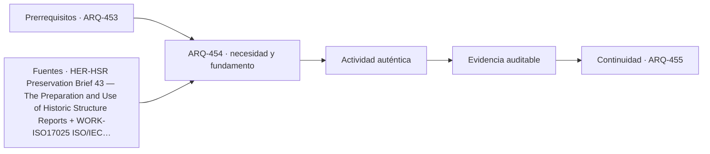

# ARQ-454 · Inspección, ensayos y diagnóstico diferencial

**Parte 46 · Clase desarrollada · Incorporada en v0.26.0.**

Prerrequisitos conceptuales: ARQ-453. Sin calendario. Casos, cantidades y resultados son ficticios salvo antecedentes expresamente atribuidos. Material educativo: no constituye diagnóstico pericial, proyecto ejecutable, autorización, certificación ni habilitación profesional. Revisión externa especializada pendiente.

## Pregunta central

¿Cómo elegir observaciones y ensayos que realmente reduzcan la incertidumbre del diagnóstico, manteniendo alcance, trazabilidad y puntos de detención?

## Resultado y continuidad

ARQ-454 continúa desde ARQ-453; cualquier caso o parámetro nuevo se identifica expresamente y no modifica retrospectivamente la clase anterior. Elaborarás un registro trazable, resolverás un caso reproducible, formularás una práctica distinta y cerrarás separando dato, inferencia, requisito, decisión y pendiente.

El trabajo sobre existentes requiere conservar una separación estricta entre **registro**, **interpretación** y **propuesta**. Una intervención no se justifica porque una imagen parezca dañada ni porque una técnica sea habitual. Antes de decidir se reconstruyen material, historia, funcionamiento y significación. Las decisiones se revisan cuando aparece evidencia nueva y se documenta lo que no pudo observarse.

## 1. Planificar antes de ensayar

Un ensayo solo es útil si responde a una pregunta. “Medir humedad” es insuficiente sin definir dónde, por qué, con qué método y cómo cambiaría una decisión. Primero se construyen hipótesis; después se seleccionan observaciones o pruebas que puedan discriminar entre ellas.

## 2. Escalas de evidencia

Inspección visual, termografía, humedad superficial, apertura localizada, ensayo de material y monitoreo estructural no son equivalentes. Cada técnica observa una variable bajo condiciones y profundidad determinadas. Un resultado favorable en un punto no generaliza automáticamente a todo el elemento.

## 3. Trazabilidad y competencia

La muestra necesita identidad, ubicación, fecha, método y cadena de custodia cuando corresponda. La competencia del laboratorio o especialista tiene un alcance concreto. ISO/IEC 17025 se usa como referencia para recordar que la calidad del resultado depende de método y competencia, sin suponer acreditación por citar la norma.

## 4. Diagnóstico diferencial

El diagnóstico mejora cuando una nueva evidencia vuelve menos plausibles ciertas hipótesis y mantiene otras abiertas. No hace falta asignar probabilidades inventadas. Basta registrar qué evidencia es compatible, incompatible o todavía no discriminante y qué decisión puede tomarse sin excederla.

## 5. Caso trabajado

Caso **HER-DIAG-01**. Tres hipótesis intentan explicar una mancha: H1 ingreso desde cubierta, H2 fuga de instalación, H3 condensación interior. La inspección encuentra que la mancha crece después de lluvia y que la instalación cercana permanece sin variación de presión durante una prueba documentada. Esto debilita H2 y apoya investigar H1, pero no elimina H3 porque no se han registrado condiciones higrotérmicas. El plan siguiente combina inspección exterior del encuentro, registro temporal de lluvia y temperatura/humedad interior. No se abre el muro hasta justificar que la información no puede obtenerse de manera menos invasiva.

## 6. Profundización: diagnóstico, intervención y punto de detención

La intervención responsable mantiene una cadena: **manifestación → hipótesis → evidencia → criterio → alternativa → comprobación**. Saltarse un eslabón suele convertir una preferencia de reparación en diagnóstico. El punto de detención se usa cuando la evidencia disponible no permite distinguir alternativas o cuando avanzar podría destruir material, ocultar información o crear un riesgo que requiere competencia específica.

En patrimonio, la significación y la condición se registran por separado y luego se coordinan. Un elemento puede tener alta significación y mal estado; también puede estar en buen estado y carecer de valor particular dentro del caso. La decisión no se obtiene de una suma automática. Se documenta qué servicio debe mantenerse, qué valor está en juego, qué riesgos se conocen y quién debe revisar la intervención.

## 7. Interfaces profesionales y control de cambios

Las decisiones de esta clase cruzan disciplinas y etapas. Cada registro debe identificar **objeto, ubicación, fuente, fecha o versión, responsable de producir evidencia, responsable de revisarla y condición de cierre**. Una modificación no obliga a repetir todo el proyecto, pero sí a rastrear qué afirmaciones dependían del dato que cambió.

Cuando una evidencia pertenece a otra jurisdicción, producto, material o edificio, se conserva como referencia conceptual y no como resultado del caso. La aceptación del cliente, la presencia de un archivo o una cifra aritméticamente correcta tampoco sustituyen la comprobación técnica o administrativa que corresponda.

## 8. Errores frecuentes y comprobaciones de calidad

Evita convertir **ausencia de evidencia en evidencia de ausencia**, promediar estados que necesitan conservarse por separado, compensar una condición necesaria con un buen puntaje en otro criterio, o eliminar un resultado desfavorable porque complica la narrativa. También evita citar una norma o guía sin registrar su edición, jurisdicción y alcance de consulta.

Una entrega robusta permite repetir las cuentas y localizar la procedencia de cada afirmación. Si una cifra cambia al modificar una hipótesis, la sensibilidad se documenta; no se inventa una probabilidad. Si el modelo deja fuera un fenómeno relevante, se indica qué conclusión sigue siendo válida y cuál debe reabrirse.

*Figura 454. Esquema didáctico de relaciones y estados. No representa una obra, diagnóstico, autorización ni certificación real.*

## 9. Práctica independiente

Construye una matriz con tres hipótesis para una pintura descascarada. Añade dos observaciones compatibles con más de una hipótesis y una prueba que podría discriminar. Indica un punto de detención antes de una intervención destructiva.

10. Solución razonada

Una respuesta sólida no elige causa por mayoría de casillas. Identifica qué evidencia cambia la decisión y qué autorización/competencia se necesita para avanzar. Si ninguna prueba propuesta discrimina, el plan todavía no está bien formulado.

La solución corresponde solo al modelo declarado. En un proyecto real se deben confirmar legislación, permisos, condiciones del sitio, productos, ensayos, contratos, competencias profesionales, participación y responsabilidades aplicables.

## 11. Autoevaluación y transferencia

Puedes avanzar cuando eres capaz de reconstruir el caso sin consultar la respuesta, explicar una conclusión que **sí** está respaldada y otra que **no**, y nombrar el documento, ensayo, participante o especialista que debería aportar la evidencia pendiente. La meta no es memorizar el número final, sino mantener coherencia entre pregunta, método, resultado y decisión.

La clase siguiente conserva el método, no las cifras, salvo cuando el texto declara explícitamente un caso continuo.

<!-- pedagogia-2026:inicio -->
## Decisión pedagógica y posición curricular

### Por qué existe

Esta clase existe para resolver una necesidad concreta del recorrido: ¿Cómo elegir observaciones y ensayos que realmente reduzcan la incertidumbre del diagnóstico, manteniendo alcance, trazabilidad y puntos de detención?

### Por qué está exactamente aquí

Ocupa el lugar 4 de la Parte 46. Se estudia después de ARQ-453 · Humedad, sales, fisuras y causas posibles porque usa esa base para responder «¿Cómo elegir observaciones y ensayos que realmente reduzcan la incertidumbre del diagnóstico, manteniendo alcance, trazabilidad y puntos de detención?». Se ubica antes de ARQ-455 · Compatibilidad de reparaciones porque la evidencia producida aquí debe estar disponible para ese paso.

- **Prerrequisitos:** `ARQ-453`
- **Capacidad que introduce:** ARQ-454 continúa desde ARQ-453; cualquier caso o parámetro nuevo se identifica expresamente y no modifica retrospectivamente la clase anterior. Elaborarás un registro trazable, resolverás un caso reproducible, formularás una práctica distinta y cerrarás separando dato, inferencia, requisito, decisión y pendiente. El trabajo sobre existentes requiere conservar una separación estricta entre registro , interpretación y propuesta .
- **Clases o experiencias que dependen de ella:** `ARQ-455`

El diagrama permite comprobar una relación que el texto lineal oculta con facilidad: esta clase recibe capacidades previas, toma decisiones apoyadas por fuentes, exige una experiencia y produce evidencia que habilita trabajo posterior. No representa un procedimiento de obra.

## Resultado observable, evidencia y evaluación

1. Identificar y delimitar las condiciones necesarias para responder la pregunta central de inspección, ensayos y diagnóstico diferencial.
2. Producir y comprobar la evidencia declarada por la clase: ARQ-454 continúa desde ARQ-453; cualquier caso o parámetro nuevo se identifica expresamente y no modifica retrospectivamente la clase anterior. Elaborarás un registro trazable, resolverás un caso reproducible, formularás una práctica distinta y cerrarás separando dato, inferencia, requisito, decisión y pendiente. El trabajo sobre existentes requiere conservar una separación estricta entre registro , interpretación y propuesta .
3. Justificar una decisión de inspección, ensayos y diagnóstico diferencial mediante fuentes, supuestos, alternativas y límites explícitos.

## Actividad, evidencia y criterio de aceptación

**Actividad:** Construye una matriz con tres hipótesis para una pintura descascarada. Añade dos observaciones compatibles con más de una hipótesis y una prueba que podría discriminar. Indica un punto de detención antes de una intervención destructiva.

**Evidencia mínima:** ARQ-454 continúa desde ARQ-453; cualquier caso o parámetro nuevo se identifica expresamente y no modifica retrospectivamente la clase anterior. Elaborarás un registro trazable, resolverás un caso reproducible, formularás una práctica distinta y cerrarás separando dato, inferencia, requisito, decisión y pendiente. El trabajo sobre existentes requiere conservar una separación estricta entre registro , interpretación y propuesta .

**Archivo sugerido:** `evidence/ARQ-454/evidencia.md`.

**Criterio de aceptación:** la entrega se acepta cuando:

- La entrega responde explícitamente a la pregunta: ¿Cómo elegir observaciones y ensayos que realmente reduzcan la incertidumbre del diagnóstico, manteniendo alcance, trazabilidad y puntos de detención?
- La actividad conserva las fronteras del caso y permite reconstruir el procedimiento: Construye una matriz con tres hipótesis para una pintura descascarada. Añade dos observaciones compatibles con más de una hipótesis y una prueba que podría discriminar. Indica un punto de detención antes de una intervención destructiva.
- Cada afirmación externa puede seguirse hasta una fuente, su alcance consultado y su límite.
- La evidencia deja disponible una entrada comprobable para ARQ-455.
- Evita convertir ausencia de evidencia en evidencia de ausencia , promediar estados que necesitan conservarse por separado, compensar una condición necesaria con un buen puntaje en otro criterio, o eliminar un resultado desfavorable porque complica la narrativa. También evita citar una norma o guía sin registrar su edición, jurisdicción y alcance de consulta.

La [rúbrica común](../../docs/RUBRICA_COMUN.md) complementa estos criterios; no los reemplaza. Una entrega puede superar un promedio y continuar pendiente si oculta una condición crítica.

## Trazabilidad de las decisiones

| # | Decisión o fundamento | Fuente utilizada | Aplicación y límite en esta clase |
|---:|---|---|---|
| 1 | Relacionar investigación histórica, levantamiento, condición material, usos y alternativas antes de intervenir. | [HER-HSR Preservation Brief 43 — The Preparation and Use of Historic…](https://www.nps.gov/orgs/1739/upload/preservation-brief-43-historic-structure-reports.pdf) | Consulta: Resumen y apartados sobre recopilación de antecedentes, condición, significación y recomendaciones. Límite: No se aplica como formato obligatorio en Chile ni se prescribe investigación destructiva. |
| 2 | Diferenciar competencia, imparcialidad y funcionamiento de laboratorios de la clasificación de una sala. | [WORK-ISO17025 ISO/IEC 17025:2017 — Competence of testing and…](https://www.iso.org/standard/66912.html) | Consulta: Ficha pública y alcance de la edición 2017. Límite: No se leyó íntegramente la norma ni se afirma acreditación por disponer de determinados recintos. |
| 3 | Distinguir fuentes de humedad, recorridos, manifestaciones y causas. | [MAT-WATER-NPS Preservation Brief 39: Holding the Line—Controlling…](https://www.nps.gov/orgs/1739/upload/preservation-brief-39-controlling-moisture.pdf) | Consulta: PDF: pp. 1–5, mecanismos de entrada y enfoque de diagnóstico. Límite: No se prescribe tratamiento, diagnóstico remoto ni retirada de materiales. |

La tabla permite auditar las relaciones; la explicación, el caso y la práctica de la clase siguen siendo la documentación principal.

## Autoevaluación, recuperación y continuidad

### Errores diagnósticos

Antes de avanzar, comprueba si puedes reconstruir cada resultado sin mirar la solución, señalar qué evidencia lo sostiene y nombrar una condición que obligaría a revisar tu decisión. Conserva la primera versión, la objeción recibida y la revisión.

**Conexión siguiente:** La continuidad inmediata es ARQ-455 · Compatibilidad de reparaciones; conserva el método y vuelve a verificar datos y límites.
<!-- pedagogia-2026:fin -->

## Fuentes y alcance de uso

### [[HER-HSR]](#FUENTE-HER-HSR) Preservation Brief 43 — The Preparation and Use of Historic Structure Reports

U.S. National Park Service. [https://www.nps.gov/orgs/1739/upload/preservation-brief-43-historic-structure-reports.pdf](https://www.nps.gov/orgs/1739/upload/preservation-brief-43-historic-structure-reports.pdf)

**Consulta:** Resumen y apartados sobre recopilación de antecedentes, condición, significación y recomendaciones. **Apoyo:** Relacionar investigación histórica, levantamiento, condición material, usos y alternativas antes de intervenir. **Límite:** No se aplica como formato obligatorio en Chile ni se prescribe investigación destructiva.

### [[WORK-ISO17025]](#FUENTE-WORK-ISO17025) ISO/IEC 17025:2017 — Competence of testing and calibration laboratories

International Organization for Standardization. [https://www.iso.org/standard/66912.html](https://www.iso.org/standard/66912.html)

**Consulta:** Ficha pública y alcance de la edición 2017. **Apoyo:** Diferenciar competencia, imparcialidad y funcionamiento de laboratorios de la clasificación de una sala. **Límite:** No se leyó íntegramente la norma ni se afirma acreditación por disponer de determinados recintos.

### [[MAT-WATER-NPS]](#FUENTE-MAT-WATER-NPS) Preservation Brief 39: Holding the Line—Controlling Unwanted Moisture in Historic Buildings

Sharon C. Park / National Park Service. [https://www.nps.gov/orgs/1739/upload/preservation-brief-39-controlling-moisture.pdf](https://www.nps.gov/orgs/1739/upload/preservation-brief-39-controlling-moisture.pdf)

**Consulta:** PDF: pp. 1–5, mecanismos de entrada y enfoque de diagnóstico. **Apoyo:** Distinguir fuentes de humedad, recorridos, manifestaciones y causas. **Límite:** No se prescribe tratamiento, diagnóstico remoto ni retirada de materiales.
