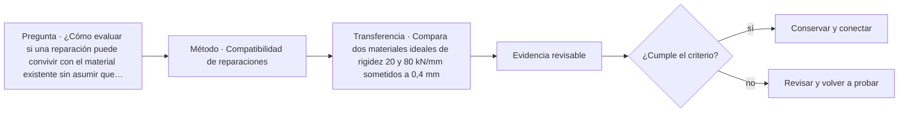

# ARQ-455 · Compatibilidad de reparaciones

**Parte 46 · Clase desarrollada · Incorporada en v0.26.0.**

Prerrequisitos conceptuales: ARQ-454. Sin calendario. Casos, cantidades y resultados son ficticios salvo antecedentes expresamente atribuidos. Material educativo: no constituye diagnóstico pericial, proyecto ejecutable, autorización, certificación ni habilitación profesional. Revisión externa especializada pendiente.

## Pregunta central

¿Cómo evaluar si una reparación puede convivir con el material existente sin asumir que “más resistente” significa “más compatible”?

## Resultado y continuidad

ARQ-455 continúa desde ARQ-454; cualquier caso o parámetro nuevo se identifica expresamente y no modifica retrospectivamente la clase anterior. Elaborarás un registro trazable, resolverás un caso reproducible, formularás una práctica distinta y cerrarás separando dato, inferencia, requisito, decisión y pendiente.

El trabajo sobre existentes requiere conservar una separación estricta entre **registro**, **interpretación** y **propuesta**. Una intervención no se justifica porque una imagen parezca dañada ni porque una técnica sea habitual. Antes de decidir se reconstruyen material, historia, funcionamiento y significación. Las decisiones se revisan cuando aparece evidencia nueva y se documenta lo que no pudo observarse.

## 1. Compatibilidad por función

Una reparación debe cumplir una función concreta: restituir continuidad, proteger, permitir evaporación, transmitir fuerzas o recuperar geometría. La propiedad deseable depende de ese papel. Mayor rigidez o impermeabilidad puede ser perjudicial si concentra deformaciones o bloquea secado.

## 2. Material viejo y material nuevo

La interfaz combina propiedades, geometría, preparación y ambiente. Cambios térmicos, higrométricos o estructurales pueden generar deformación diferencial. Un parche no debe evaluarse solo por su resistencia aislada: hay que estudiar cómo comparte movimiento y humedad con el soporte.

## 3. Ensayo y muestra representativa

Una muestra de reparación ayuda a comprobar apariencia, ejecución y ciertos desempeños, pero no reproduce todas las exposiciones futuras. Debe identificarse qué se observó y durante cuánto tiempo. Un resultado favorable no se extrapola a materiales o detalles distintos sin justificación.

## 4. Reversibilidad y daño secundario

Cuando es relevante al valor del edificio, conviene estudiar cuánto altera la reparación al soporte y qué ocurriría si fuera necesario retirarla. Reversibilidad no significa que todo deba desmontarse sin huella; funciona como pregunta sobre consecuencias futuras y pérdida de información.

## 5. Caso trabajado

Caso **HER-REP-01**. Dos zonas ideales reciben el mismo movimiento impuesto de 0,50 mm. El soporte se representa con rigidez 30 kN/mm y un parche alternativo con 120 kN/mm. Bajo el modelo simple F=k·δ, el soporte desarrollaría 15 kN y el parche 60 kN si ambos fueran forzados a esa deformación de manera equivalente. El cálculo no representa una junta real, pero demuestra que cuadruplicar rigidez puede cambiar fuertemente la demanda de interfaz. La selección necesita propiedades reales, geometría, exposición y función.

## 6. Profundización: diagnóstico, intervención y punto de detención

La intervención responsable mantiene una cadena: **manifestación → hipótesis → evidencia → criterio → alternativa → comprobación**. Saltarse un eslabón suele convertir una preferencia de reparación en diagnóstico. El punto de detención se usa cuando la evidencia disponible no permite distinguir alternativas o cuando avanzar podría destruir material, ocultar información o crear un riesgo que requiere competencia específica.

En patrimonio, la significación y la condición se registran por separado y luego se coordinan. Un elemento puede tener alta significación y mal estado; también puede estar en buen estado y carecer de valor particular dentro del caso. La decisión no se obtiene de una suma automática. Se documenta qué servicio debe mantenerse, qué valor está en juego, qué riesgos se conocen y quién debe revisar la intervención.

## 7. Interfaces profesionales y control de cambios

Las decisiones de esta clase cruzan disciplinas y etapas. Cada registro debe identificar **objeto, ubicación, fuente, fecha o versión, responsable de producir evidencia, responsable de revisarla y condición de cierre**. Una modificación no obliga a repetir todo el proyecto, pero sí a rastrear qué afirmaciones dependían del dato que cambió.

Cuando una evidencia pertenece a otra jurisdicción, producto, material o edificio, se conserva como referencia conceptual y no como resultado del caso. La aceptación del cliente, la presencia de un archivo o una cifra aritméticamente correcta tampoco sustituyen la comprobación técnica o administrativa que corresponda.

## 8. Errores frecuentes y comprobaciones de calidad

Evita convertir **ausencia de evidencia en evidencia de ausencia**, promediar estados que necesitan conservarse por separado, compensar una condición necesaria con un buen puntaje en otro criterio, o eliminar un resultado desfavorable porque complica la narrativa. También evita citar una norma o guía sin registrar su edición, jurisdicción y alcance de consulta.

Una entrega robusta permite repetir las cuentas y localizar la procedencia de cada afirmación. Si una cifra cambia al modificar una hipótesis, la sensibilidad se documenta; no se inventa una probabilidad. Si el modelo deja fuera un fenómeno relevante, se indica qué conclusión sigue siendo válida y cuál debe reabrirse.

*Figura 455. Esquema didáctico de relaciones y estados. No representa una obra, diagnóstico, autorización ni certificación real.*

## 9. Práctica independiente

Compara dos materiales ideales de rigidez 20 y 80 kN/mm sometidos a 0,4 mm. Calcula fuerzas y explica por qué el valor mayor no identifica una reparación superior.

10. Solución razonada

Las fuerzas ideales son 8 y 32 kN. La diferencia muestra sensibilidad a rigidez bajo la hipótesis de deformación impuesta. No es una capacidad ni un criterio de aceptación. La compatibilidad debe relacionarse con soporte, interfaz, humedad, movimiento y objetivos de conservación.

La solución corresponde solo al modelo declarado. En un proyecto real se deben confirmar legislación, permisos, condiciones del sitio, productos, ensayos, contratos, competencias profesionales, participación y responsabilidades aplicables.

## 11. Autoevaluación y transferencia

Puedes avanzar cuando eres capaz de reconstruir el caso sin consultar la respuesta, explicar una conclusión que **sí** está respaldada y otra que **no**, y nombrar el documento, ensayo, participante o especialista que debería aportar la evidencia pendiente. La meta no es memorizar el número final, sino mantener coherencia entre pregunta, método, resultado y decisión.

La clase siguiente conserva el método, no las cifras, salvo cuando el texto declara explícitamente un caso continuo.

<!-- pedagogia-2026:inicio -->
## Mapa visual de aprendizaje

El diagrama representa el ciclo de aprendizaje de esta clase, no una secuencia de obra ni un procedimiento profesional.

## Resultado observable, evidencia y evaluación

**Tipo de clase:** histórica y crítica.

**Evidencia mínima:** ficha comparativa con fuente, observación, interpretación, contraejemplo y límite de transferencia.

**Archivo sugerido:** `evidence/ARQ-455/evidencia.md`.

| Criterio | Evidencia observable |
|---|---|
| Precisión y representación · 20 % | Los conceptos, unidades y convenciones se usan de forma coherente y pueden ser reconstruidos por otra persona. |
| Evidencia y trazabilidad · 25 % | Cada afirmación importante se vincula con dato, cálculo, observación o fuente; hipótesis y desconocidos permanecen visibles. |
| Decisión y alternativas · 25 % | La decisión responde a la pregunta, compara al menos una alternativa y declara qué condición la haría cambiar. |
| Integración y ciclo de vida · 20 % | Se identifica una interfaz y una consecuencia para construcción, uso, mantenimiento, adaptación o fin de vida. |
| Comunicación, ética y límites · 10 % | El alcance se entiende sin explicación oral adicional y no se atribuyen permisos, competencias o certezas inexistentes. |

**Criterio de aceptación:** 80/100 y ningún criterio bajo 60 %. Una entrega genérica que podría reutilizarse sin cambios en otra clase no demuestra dominio. Si existe una condición crítica de seguridad, accesibilidad, evidencia o responsabilidad sin resolver, la entrega permanece pendiente aunque el promedio supere 80.

### Errores diagnósticos

En esta clase conviene vigilar especialmente: confundir descripción con explicación; atribuir intención sin fuente; copiar una forma sin sus condiciones.

## Autoevaluación, recuperación y continuidad

Antes de avanzar, responde sin consultar la solución:

1. ¿Qué decisión concreta puedes tomar ahora que no podías justificar antes?
2. ¿Qué evidencia de tu entrega es comprobada y cuál continúa siendo una hipótesis?
3. ¿Qué cambio de contexto invalidaría la transferencia realizada?

Revisa la entrega a las 24–48 horas y nuevamente al cerrar la parte. Conserva la primera versión, la crítica recibida y la versión revisada: el aprendizaje se demuestra también mediante el cambio entre versiones.
<!-- pedagogia-2026:fin -->

## Fuentes y alcance de uso

### [[WORK-REUSE]](#FUENTE-WORK-REUSE) Rehabilitation as a treatment and Standards for Rehabilitation

U.S. National Park Service. [https://www.nps.gov/articles/000/treatment-standards-rehabilitation.htm](https://www.nps.gov/articles/000/treatment-standards-rehabilitation.htm)

**Consulta:** Texto web de los criterios generales de rehabilitación. **Apoyo:** Compatibilidad de uso, conservación de características documentadas y evaluación de adiciones. **Límite:** Referencia conceptual estadounidense, no permiso ni normativa patrimonial aplicable automáticamente en Chile. No se prescribe intervención material.

### [[MAT-MORTAR-NPS]](#FUENTE-MAT-MORTAR-NPS) Preservation Brief 2: Repointing Mortar Joints in Historic Masonry Buildings

National Park Service. [https://www.nps.gov/orgs/1739/upload/preservation-brief-02-repointing.pdf](https://www.nps.gov/orgs/1739/upload/preservation-brief-02-repointing.pdf)

**Consulta:** PDF: introducción, evaluación y propiedades de compatibilidad, especialmente pp. 1–7. **Apoyo:** Relacionar mortero existente, unidades, deformación y transporte de humedad. **Límite:** No se trasladan dosificaciones, procedimientos de intervención ni requisitos normativos a una obra.

### [[HER-BURRA]](#FUENTE-HER-BURRA) The Burra Charter and Practice Notes

Australia ICOMOS. [https://australia.icomos.org/publications/burra-charter-practice-notes/](https://australia.icomos.org/publications/burra-charter-practice-notes/)

**Consulta:** Página de recursos; no lectura integral de la Carta ni de todas las notas. **Apoyo:** Referencia para estudiar significación cultural y gestión de lugares patrimoniales. **Límite:** No se atribuyen requisitos de artículos no consultados ni se determina protección legal de un lugar ficticio.
