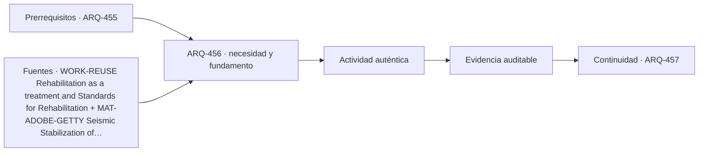

# ARQ-456 · Refuerzo estructural y coordinación patrimonial

**Parte 46 · Clase desarrollada · Incorporada en v0.26.0.**

Prerrequisitos conceptuales: ARQ-455. Sin calendario. Casos, cantidades y resultados son ficticios salvo antecedentes expresamente atribuidos. Material educativo: no constituye diagnóstico pericial, proyecto ejecutable, autorización, certificación ni habilitación profesional. Revisión externa especializada pendiente.

## Pregunta central

¿Cómo introducir una intervención resistente sin borrar la lógica material, espacial e histórica del edificio ni trasladar cargas a elementos no revisados?

## Resultado y continuidad

ARQ-456 continúa desde ARQ-455; cualquier caso o parámetro nuevo se identifica expresamente y no modifica retrospectivamente la clase anterior. Elaborarás un registro trazable, resolverás un caso reproducible, formularás una práctica distinta y cerrarás separando dato, inferencia, requisito, decisión y pendiente.

El trabajo sobre existentes requiere conservar una separación estricta entre **registro**, **interpretación** y **propuesta**. Una intervención no se justifica porque una imagen parezca dañada ni porque una técnica sea habitual. Antes de decidir se reconstruyen material, historia, funcionamiento y significación. Las decisiones se revisan cuando aparece evidencia nueva y se documenta lo que no pudo observarse.

## 1. Refuerzo como cambio de sistema

Añadir una pieza resistente modifica rigidez, camino de cargas, masa, conexiones y estados de construcción. No es un objeto autónomo pegado al edificio. El análisis debe mostrar qué demanda toma, qué descarga y qué nuevos puntos de transferencia aparecen.

## 2. Valor patrimonial y legibilidad

Una intervención puede afectar material original, proporciones, acabados y lectura histórica. La discusión no se reduce a ocultar o mostrar el refuerzo: debe explicar qué valores se intenta conservar y qué pérdida o cambio se acepta bajo un objetivo documentado.

## 3. Estados temporales

Durante una intervención, el edificio puede tener menos continuidad que en el estado final. Apuntalamientos, desmontajes parciales y secuencias requieren análisis propio. Esta clase no prescribe obras temporales; enseña a no justificar un estado intermedio con la capacidad del sistema terminado.

## 4. Coordinación interdisciplinaria

Arquitectura, estructuras, patrimonio, instalaciones y obra comparten interfaces. Una placa puede interferir con molduras; un anclaje puede atravesar una capa sensible; una nueva rigidez puede aumentar demanda en otra unión. El expediente debe identificar cada interfaz antes de cerrar el detalle.

## 5. Caso trabajado

Caso **HER-REF-01**. Una demanda lateral ficticia de 90 kN se reparte entre un muro existente idealizado con k=20 kN/mm y un nuevo marco con k=40 kN/mm, unidos por un diafragma rígido ideal. El desplazamiento común es 90/(20+40)=1,50 mm: el muro toma 30 kN y el marco 60. Si el marco se duplica a 80 kN/mm, el desplazamiento baja a 0,90 mm, pero el muro toma 18 kN y el marco 72. “Más rígido” cambia la distribución; no basta celebrar menor desplazamiento. Deben revisarse conexiones, fundaciones y elementos receptores.

## 6. Profundización: diagnóstico, intervención y punto de detención

La intervención responsable mantiene una cadena: **manifestación → hipótesis → evidencia → criterio → alternativa → comprobación**. Saltarse un eslabón suele convertir una preferencia de reparación en diagnóstico. El punto de detención se usa cuando la evidencia disponible no permite distinguir alternativas o cuando avanzar podría destruir material, ocultar información o crear un riesgo que requiere competencia específica.

En patrimonio, la significación y la condición se registran por separado y luego se coordinan. Un elemento puede tener alta significación y mal estado; también puede estar en buen estado y carecer de valor particular dentro del caso. La decisión no se obtiene de una suma automática. Se documenta qué servicio debe mantenerse, qué valor está en juego, qué riesgos se conocen y quién debe revisar la intervención.

## 7. Interfaces profesionales y control de cambios

Las decisiones de esta clase cruzan disciplinas y etapas. Cada registro debe identificar **objeto, ubicación, fuente, fecha o versión, responsable de producir evidencia, responsable de revisarla y condición de cierre**. Una modificación no obliga a repetir todo el proyecto, pero sí a rastrear qué afirmaciones dependían del dato que cambió.

Cuando una evidencia pertenece a otra jurisdicción, producto, material o edificio, se conserva como referencia conceptual y no como resultado del caso. La aceptación del cliente, la presencia de un archivo o una cifra aritméticamente correcta tampoco sustituyen la comprobación técnica o administrativa que corresponda.

## 8. Errores frecuentes y comprobaciones de calidad

Evita convertir **ausencia de evidencia en evidencia de ausencia**, promediar estados que necesitan conservarse por separado, compensar una condición necesaria con un buen puntaje en otro criterio, o eliminar un resultado desfavorable porque complica la narrativa. También evita citar una norma o guía sin registrar su edición, jurisdicción y alcance de consulta.

Una entrega robusta permite repetir las cuentas y localizar la procedencia de cada afirmación. Si una cifra cambia al modificar una hipótesis, la sensibilidad se documenta; no se inventa una probabilidad. Si el modelo deja fuera un fenómeno relevante, se indica qué conclusión sigue siendo válida y cuál debe reabrirse.

*Figura 456. Esquema didáctico de relaciones y estados. No representa una obra, diagnóstico, autorización ni certificación real.*

## 9. Práctica independiente

Demanda 100 kN; rigideces 25 y 75 kN/mm. Calcula desplazamiento y reparto. Duplica solo la segunda rigidez y repite. Explica qué elementos del edificio deberían reabrirse a revisión.

10. Solución razonada

Inicial: u=1 mm; fuerzas 25/75 kN. Con segunda rigidez 150: u=100/175=0,5714 mm; fuerzas 14,286/85,714 kN. Cambian las transferencias y deben revisarse conexiones, apoyos, fundaciones y compatibilidad con elementos existentes.

La solución corresponde solo al modelo declarado. En un proyecto real se deben confirmar legislación, permisos, condiciones del sitio, productos, ensayos, contratos, competencias profesionales, participación y responsabilidades aplicables.

## 11. Autoevaluación y transferencia

Puedes avanzar cuando eres capaz de reconstruir el caso sin consultar la respuesta, explicar una conclusión que **sí** está respaldada y otra que **no**, y nombrar el documento, ensayo, participante o especialista que debería aportar la evidencia pendiente. La meta no es memorizar el número final, sino mantener coherencia entre pregunta, método, resultado y decisión.

La clase siguiente conserva el método, no las cifras, salvo cuando el texto declara explícitamente un caso continuo.

<!-- pedagogia-2026:inicio -->
## Decisión pedagógica y posición curricular

### Por qué existe

Esta clase existe para resolver una necesidad concreta del recorrido: ¿Cómo introducir una intervención resistente sin borrar la lógica material, espacial e histórica del edificio ni trasladar cargas a elementos no revisados?

### Por qué está exactamente aquí

Ocupa el lugar 6 de la Parte 46. Se estudia después de ARQ-455 · Compatibilidad de reparaciones porque usa esa base para responder «¿Cómo introducir una intervención resistente sin borrar la lógica material, espacial e histórica del edificio ni trasladar cargas a elementos no revisados?». Se ubica antes de ARQ-457 · Rehabilitación energética y riesgos de humedad porque la evidencia producida aquí debe estar disponible para ese paso.

- **Prerrequisitos:** `ARQ-455`
- **Capacidad que introduce:** ARQ-456 continúa desde ARQ-455; cualquier caso o parámetro nuevo se identifica expresamente y no modifica retrospectivamente la clase anterior. Elaborarás un registro trazable, resolverás un caso reproducible, formularás una práctica distinta y cerrarás separando dato, inferencia, requisito, decisión y pendiente. El trabajo sobre existentes requiere conservar una separación estricta entre registro , interpretación y propuesta .
- **Clases o experiencias que dependen de ella:** `ARQ-457`

El diagrama permite comprobar una relación que el texto lineal oculta con facilidad: esta clase recibe capacidades previas, toma decisiones apoyadas por fuentes, exige una experiencia y produce evidencia que habilita trabajo posterior. No representa un procedimiento de obra.

## Resultado observable, evidencia y evaluación

1. Identificar y delimitar las condiciones necesarias para responder la pregunta central de refuerzo estructural y coordinación patrimonial.
2. Producir y comprobar la evidencia declarada por la clase: ARQ-456 continúa desde ARQ-455; cualquier caso o parámetro nuevo se identifica expresamente y no modifica retrospectivamente la clase anterior. Elaborarás un registro trazable, resolverás un caso reproducible, formularás una práctica distinta y cerrarás separando dato, inferencia, requisito, decisión y pendiente. El trabajo sobre existentes requiere conservar una separación estricta entre registro , interpretación y propuesta .
3. Justificar una decisión de refuerzo estructural y coordinación patrimonial mediante fuentes, supuestos, alternativas y límites explícitos.

## Actividad, evidencia y criterio de aceptación

**Actividad:** Demanda 100 kN; rigideces 25 y 75 kN/mm. Calcula desplazamiento y reparto. Duplica solo la segunda rigidez y repite.

**Evidencia mínima:** ARQ-456 continúa desde ARQ-455; cualquier caso o parámetro nuevo se identifica expresamente y no modifica retrospectivamente la clase anterior. Elaborarás un registro trazable, resolverás un caso reproducible, formularás una práctica distinta y cerrarás separando dato, inferencia, requisito, decisión y pendiente. El trabajo sobre existentes requiere conservar una separación estricta entre registro , interpretación y propuesta .

**Archivo sugerido:** `evidence/ARQ-456/evidencia.md`.

**Criterio de aceptación:** la entrega se acepta cuando:

- La entrega responde explícitamente a la pregunta: ¿Cómo introducir una intervención resistente sin borrar la lógica material, espacial e histórica del edificio ni trasladar cargas a elementos no revisados?
- La actividad conserva las fronteras del caso y permite reconstruir el procedimiento: Demanda 100 kN; rigideces 25 y 75 kN/mm. Calcula desplazamiento y reparto. Duplica solo la segunda rigidez y repite.
- Cada afirmación externa puede seguirse hasta una fuente, su alcance consultado y su límite.
- La evidencia deja disponible una entrada comprobable para ARQ-457.
- Evita convertir ausencia de evidencia en evidencia de ausencia , promediar estados que necesitan conservarse por separado, compensar una condición necesaria con un buen puntaje en otro criterio, o eliminar un resultado desfavorable porque complica la narrativa. También evita citar una norma o guía sin registrar su edición, jurisdicción y alcance de consulta.

La [rúbrica común](../../docs/RUBRICA_COMUN.md) complementa estos criterios; no los reemplaza. Una entrega puede superar un promedio y continuar pendiente si oculta una condición crítica.

## Trazabilidad de las decisiones

| # | Decisión o fundamento | Fuente utilizada | Aplicación y límite en esta clase |
|---:|---|---|---|
| 1 | Compatibilidad de uso, conservación de características documentadas y evaluación de adiciones. | [WORK-REUSE Rehabilitation as a treatment and Standards for…](https://www.nps.gov/articles/000/treatment-standards-rehabilitation.htm) | Consulta: Texto web de los criterios generales de rehabilitación. Límite: Referencia conceptual estadounidense, no permiso ni normativa patrimonial aplicable automáticamente en Chile. No se prescribe intervención material. |
| 2 | Distinguir evidencia experimental situada de una garantía universal de comportamiento sísmico. | [MAT-ADOBE-GETTY Seismic Stabilization of Historic Adobe Structures:…](https://shop.getty.edu/products/seismic-stabilization-of-historic-adobe-structures-978-0892365876) | Consulta: Presentación editorial oficial del informe de 2000: investigación mediante modelos y mesas vibratorias. Límite: No se consultó el informe completo ni se reproducen sus técnicas de refuerzo o ensayos. |
| 3 | Línea base, trazabilidad y análisis del impacto de cambios | [Organismo: National Aeronautics and Space Administration. Consulta:…](https://www.nasa.gov/reference/6-0-crosscutting-technical-management/) | Consulta: Apartados 6.2 y 6.5 sobre requisitos y configuración Límite: Los formularios y el caso arquitectónico son originales; no se copian procedimientos contractuales. |

La tabla permite auditar las relaciones; la explicación, el caso y la práctica de la clase siguen siendo la documentación principal.

## Autoevaluación, recuperación y continuidad

### Errores diagnósticos

Antes de avanzar, comprueba si puedes reconstruir cada resultado sin mirar la solución, señalar qué evidencia lo sostiene y nombrar una condición que obligaría a revisar tu decisión. Conserva la primera versión, la objeción recibida y la revisión.

**Conexión siguiente:** La continuidad inmediata es ARQ-457 · Rehabilitación energética y riesgos de humedad; conserva el método y vuelve a verificar datos y límites.
<!-- pedagogia-2026:fin -->

## Fuentes y alcance de uso

### [[WORK-REUSE]](#FUENTE-WORK-REUSE) Rehabilitation as a treatment and Standards for Rehabilitation

U.S. National Park Service. [https://www.nps.gov/articles/000/treatment-standards-rehabilitation.htm](https://www.nps.gov/articles/000/treatment-standards-rehabilitation.htm)

**Consulta:** Texto web de los criterios generales de rehabilitación. **Apoyo:** Compatibilidad de uso, conservación de características documentadas y evaluación de adiciones. **Límite:** Referencia conceptual estadounidense, no permiso ni normativa patrimonial aplicable automáticamente en Chile. No se prescribe intervención material.

### [[MAT-ADOBE-GETTY]](#FUENTE-MAT-ADOBE-GETTY) Seismic Stabilization of Historic Adobe Structures: Final Report of the Getty Seismic Adobe Project

E. Leroy Tolles, Edna E. Kimbro, Frederick A. Webster y William S. Ginell / Getty Conservation Institute. [https://shop.getty.edu/products/seismic-stabilization-of-historic-adobe-structures-978-0892365876](https://shop.getty.edu/products/seismic-stabilization-of-historic-adobe-structures-978-0892365876)

**Consulta:** Presentación editorial oficial del informe de 2000: investigación mediante modelos y mesas vibratorias. **Apoyo:** Distinguir evidencia experimental situada de una garantía universal de comportamiento sísmico. **Límite:** No se consultó el informe completo ni se reproducen sus técnicas de refuerzo o ensayos.

### [[NASA-CHANGE]](#FUENTE-NASA-CHANGE) NASA Systems Engineering Handbook, 6.0: Crosscutting Technical Management

National Aeronautics and Space Administration. [https://www.nasa.gov/reference/6-0-crosscutting-technical-management/](https://www.nasa.gov/reference/6-0-crosscutting-technical-management/)

**Consulta:** Apartados 6.2 y 6.5 sobre requisitos y configuración **Apoyo:** Línea base, trazabilidad y análisis del impacto de cambios **Límite:** Los formularios y el caso arquitectónico son originales; no se copian procedimientos contractuales.
