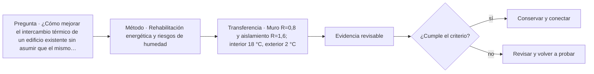

# ARQ-457 · Rehabilitación energética y riesgos de humedad

**Parte 46 · Clase desarrollada · Incorporada en v0.26.0.**

Prerrequisitos conceptuales: ARQ-456. Sin calendario. Casos, cantidades y resultados son ficticios salvo antecedentes expresamente atribuidos. Material educativo: no constituye diagnóstico pericial, proyecto ejecutable, autorización, certificación ni habilitación profesional. Revisión externa especializada pendiente.

## Pregunta central

¿Cómo mejorar el intercambio térmico de un edificio existente sin asumir que el mismo valor U produce el mismo comportamiento higrotérmico?

## Resultado y continuidad

ARQ-457 continúa desde ARQ-456; cualquier caso o parámetro nuevo se identifica expresamente y no modifica retrospectivamente la clase anterior. Elaborarás un registro trazable, resolverás un caso reproducible, formularás una práctica distinta y cerrarás separando dato, inferencia, requisito, decisión y pendiente.

El trabajo sobre existentes requiere conservar una separación estricta entre **registro**, **interpretación** y **propuesta**. Una intervención no se justifica porque una imagen parezca dañada ni porque una técnica sea habitual. Antes de decidir se reconstruyen material, historia, funcionamiento y significación. Las decisiones se revisan cuando aparece evidencia nueva y se documenta lo que no pudo observarse.

## 1. Energía y humedad no son la misma pregunta

Reducir transmisión térmica puede mover temperaturas internas de las capas y modificar potenciales de condensación o secado. Una solución debe estudiarse como conjunto: material existente, aislamiento, barreras, lluvia, aire, uso y clima.

## 2. Intervenir por dentro o por fuera

Dos capas con la misma resistencia total pueden ubicar la masa existente a temperaturas muy diferentes. Esto afecta no solo humedad, sino movimientos y durabilidad. La comparación necesita conservar la misma frontera térmica y luego revisar las nuevas condiciones internas.

## 3. Edificio histórico y reversibilidad

Una estrategia puede alterar fachada, interiores, molduras o acabados. El objetivo energético no elimina el valor cultural. Deben documentarse alternativas y las consecuencias de cada una antes de seleccionar por un indicador único.

## 4. Monitoreo y cambio de uso

El desempeño real depende de ventilación, ocupación y mantenimiento. En un edificio rehabilitado, el monitoreo inicial puede revelar condiciones no previstas. Eso no convierte al edificio en experimento sin control: requiere criterios, responsables y respuesta ante resultados adversos.

## 5. Caso trabajado

Caso **HER-ENE-01**. Un muro ideal tiene resistencia térmica existente R=0,50 m²K/W y se añaden R=2,00 m²K/W de aislamiento. Interior 20 °C, exterior 0 °C. Si el aislamiento está por el interior, la caída a través de él es 20×2/2,5=16 K y la interfaz con el muro queda aproximadamente a 4 °C. Si el aislamiento está por el exterior, el muro existente queda cerca de 16 °C en su cara de contacto con el aislamiento. El U total es igual en ambos modelos, 1/2,5=0,40 W/(m²K), pero la temperatura de la fábrica existente no. El cálculo no evalúa condensación, lluvia, puentes ni capacidad de secado.

## 6. Profundización: diagnóstico, intervención y punto de detención

La intervención responsable mantiene una cadena: **manifestación → hipótesis → evidencia → criterio → alternativa → comprobación**. Saltarse un eslabón suele convertir una preferencia de reparación en diagnóstico. El punto de detención se usa cuando la evidencia disponible no permite distinguir alternativas o cuando avanzar podría destruir material, ocultar información o crear un riesgo que requiere competencia específica.

En patrimonio, la significación y la condición se registran por separado y luego se coordinan. Un elemento puede tener alta significación y mal estado; también puede estar en buen estado y carecer de valor particular dentro del caso. La decisión no se obtiene de una suma automática. Se documenta qué servicio debe mantenerse, qué valor está en juego, qué riesgos se conocen y quién debe revisar la intervención.

## 7. Interfaces profesionales y control de cambios

Las decisiones de esta clase cruzan disciplinas y etapas. Cada registro debe identificar **objeto, ubicación, fuente, fecha o versión, responsable de producir evidencia, responsable de revisarla y condición de cierre**. Una modificación no obliga a repetir todo el proyecto, pero sí a rastrear qué afirmaciones dependían del dato que cambió.

Cuando una evidencia pertenece a otra jurisdicción, producto, material o edificio, se conserva como referencia conceptual y no como resultado del caso. La aceptación del cliente, la presencia de un archivo o una cifra aritméticamente correcta tampoco sustituyen la comprobación técnica o administrativa que corresponda.

## 8. Errores frecuentes y comprobaciones de calidad

Evita convertir **ausencia de evidencia en evidencia de ausencia**, promediar estados que necesitan conservarse por separado, compensar una condición necesaria con un buen puntaje en otro criterio, o eliminar un resultado desfavorable porque complica la narrativa. También evita citar una norma o guía sin registrar su edición, jurisdicción y alcance de consulta.

Una entrega robusta permite repetir las cuentas y localizar la procedencia de cada afirmación. Si una cifra cambia al modificar una hipótesis, la sensibilidad se documenta; no se inventa una probabilidad. Si el modelo deja fuera un fenómeno relevante, se indica qué conclusión sigue siendo válida y cuál debe reabrirse.

*Figura 457. Esquema didáctico de relaciones y estados. No representa una obra, diagnóstico, autorización ni certificación real.*

## 9. Práctica independiente

Muro R=0,8 y aislamiento R=1,6; interior 18 °C, exterior 2 °C. Calcula la temperatura de interfaz con aislamiento interior y con aislamiento exterior bajo el modelo 1D estacionario.

10. Solución razonada

ΔT=16 K; Rtotal=2,4. Con aislamiento interior, caída en aislamiento=10,667 K y la interfaz queda 7,333 °C. Con aislamiento exterior, la caída en el muro interior=5,333 K y la interfaz queda 12,667 °C. Igual U no implica igual estado interno.

La solución corresponde solo al modelo declarado. En un proyecto real se deben confirmar legislación, permisos, condiciones del sitio, productos, ensayos, contratos, competencias profesionales, participación y responsabilidades aplicables.

## 11. Autoevaluación y transferencia

Puedes avanzar cuando eres capaz de reconstruir el caso sin consultar la respuesta, explicar una conclusión que **sí** está respaldada y otra que **no**, y nombrar el documento, ensayo, participante o especialista que debería aportar la evidencia pendiente. La meta no es memorizar el número final, sino mantener coherencia entre pregunta, método, resultado y decisión.

La clase siguiente conserva el método, no las cifras, salvo cuando el texto declara explícitamente un caso continuo.

<!-- pedagogia-2026:inicio -->
## Mapa visual de aprendizaje

El diagrama representa el ciclo de aprendizaje de esta clase, no una secuencia de obra ni un procedimiento profesional.

## Resultado observable, evidencia y evaluación

**Tipo de clase:** histórica y crítica.

**Evidencia mínima:** ficha comparativa con fuente, observación, interpretación, contraejemplo y límite de transferencia.

**Archivo sugerido:** `evidence/ARQ-457/evidencia.md`.

| Criterio | Evidencia observable |
|---|---|
| Precisión y representación · 20 % | Los conceptos, unidades y convenciones se usan de forma coherente y pueden ser reconstruidos por otra persona. |
| Evidencia y trazabilidad · 25 % | Cada afirmación importante se vincula con dato, cálculo, observación o fuente; hipótesis y desconocidos permanecen visibles. |
| Decisión y alternativas · 25 % | La decisión responde a la pregunta, compara al menos una alternativa y declara qué condición la haría cambiar. |
| Integración y ciclo de vida · 20 % | Se identifica una interfaz y una consecuencia para construcción, uso, mantenimiento, adaptación o fin de vida. |
| Comunicación, ética y límites · 10 % | El alcance se entiende sin explicación oral adicional y no se atribuyen permisos, competencias o certezas inexistentes. |

**Criterio de aceptación:** 80/100 y ningún criterio bajo 60 %. Una entrega genérica que podría reutilizarse sin cambios en otra clase no demuestra dominio. Si existe una condición crítica de seguridad, accesibilidad, evidencia o responsabilidad sin resolver, la entrega permanece pendiente aunque el promedio supere 80.

### Errores diagnósticos

En esta clase conviene vigilar especialmente: confundir descripción con explicación; atribuir intención sin fuente; copiar una forma sin sus condiciones.

## Autoevaluación, recuperación y continuidad

Antes de avanzar, responde sin consultar la solución:

1. ¿Qué decisión concreta puedes tomar ahora que no podías justificar antes?
2. ¿Qué evidencia de tu entrega es comprobada y cuál continúa siendo una hipótesis?
3. ¿Qué cambio de contexto invalidaría la transferencia realizada?

Revisa la entrega a las 24–48 horas y nuevamente al cerrar la parte. Conserva la primera versión, la crítica recibida y la versión revisada: el aprendizaje se demuestra también mediante el cambio entre versiones.
<!-- pedagogia-2026:fin -->

## Fuentes y alcance de uso

### [[MAT-WATER-NPS]](#FUENTE-MAT-WATER-NPS) Preservation Brief 39: Holding the Line—Controlling Unwanted Moisture in Historic Buildings

Sharon C. Park / National Park Service. [https://www.nps.gov/orgs/1739/upload/preservation-brief-39-controlling-moisture.pdf](https://www.nps.gov/orgs/1739/upload/preservation-brief-39-controlling-moisture.pdf)

**Consulta:** PDF: pp. 1–5, mecanismos de entrada y enfoque de diagnóstico. **Apoyo:** Distinguir fuentes de humedad, recorridos, manifestaciones y causas. **Límite:** No se prescribe tratamiento, diagnóstico remoto ni retirada de materiales.

### [[WORK-REUSE]](#FUENTE-WORK-REUSE) Rehabilitation as a treatment and Standards for Rehabilitation

U.S. National Park Service. [https://www.nps.gov/articles/000/treatment-standards-rehabilitation.htm](https://www.nps.gov/articles/000/treatment-standards-rehabilitation.htm)

**Consulta:** Texto web de los criterios generales de rehabilitación. **Apoyo:** Compatibilidad de uso, conservación de características documentadas y evaluación de adiciones. **Límite:** Referencia conceptual estadounidense, no permiso ni normativa patrimonial aplicable automáticamente en Chile. No se prescribe intervención material.

### [[ENE-ISO52016]](#FUENTE-ENE-ISO52016) ISO 52016-1:2017 — Calculation procedures for energy needs, temperatures and loads

International Organization for Standardization. [https://www.iso.org/standard/65696.html](https://www.iso.org/standard/65696.html)

**Consulta:** Ficha pública, resumen y alcance; confirmación 2022 indicada en catálogo. **Apoyo:** Distinguir energía, carga, humedad y zona térmica en procedimientos de desempeño. **Límite:** No se leyó ni implementó el texto normativo íntegro. No se afirma cumplimiento.
