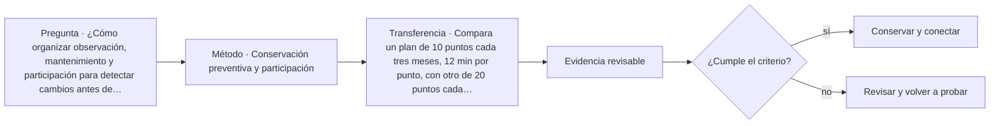

# ARQ-459 · Conservación preventiva y participación

**Parte 46 · Clase desarrollada · Incorporada en v0.26.0.**

Prerrequisitos conceptuales: ARQ-458. Sin calendario. Casos, cantidades y resultados son ficticios salvo antecedentes expresamente atribuidos. Material educativo: no constituye diagnóstico pericial, proyecto ejecutable, autorización, certificación ni habilitación profesional. Revisión externa especializada pendiente.

## Pregunta central

¿Cómo organizar observación, mantenimiento y participación para detectar cambios antes de que la única respuesta disponible sea una intervención mayor?

## Resultado y continuidad

ARQ-459 continúa desde ARQ-458; cualquier caso o parámetro nuevo se identifica expresamente y no modifica retrospectivamente la clase anterior. Elaborarás un registro trazable, resolverás un caso reproducible, formularás una práctica distinta y cerrarás separando dato, inferencia, requisito, decisión y pendiente.

El trabajo sobre existentes requiere conservar una separación estricta entre **registro**, **interpretación** y **propuesta**. Una intervención no se justifica porque una imagen parezca dañada ni porque una técnica sea habitual. Antes de decidir se reconstruyen material, historia, funcionamiento y significación. Las decisiones se revisan cuando aparece evidencia nueva y se documenta lo que no pudo observarse.

## 1. Prevenir no significa intervenir constantemente

Conservación preventiva combina conocimiento del edificio, inspección periódica, mantenimiento y respuesta proporcionada. Más frecuencia no siempre significa mejor control si se observan variables irrelevantes o si nadie analiza los resultados.

## 2. Indicadores visibles y puntos de referencia

Fotografías desde puntos repetibles, mapas de humedad, fisuras monitorizadas y registros de mantenimiento permiten comparar estados. La referencia debe mantenerse. Cambiar cámara, escala o ubicación sin anotarlo puede aparentar un cambio que pertenece al método.

## 3. Personas como fuente de conocimiento

Usuarios, mantenedores y comunidades pueden reconocer cambios de uso, filtraciones estacionales o significados que no aparecen en planos. Participar no significa transferirles responsabilidad técnica. La consulta debe definir qué se pregunta y cómo se devolverán resultados.

## 4. Plan de respuesta

Cada indicador necesita un estado y una acción: continuar observación, solicitar revisión especializada, restringir temporalmente una condición o actualizar documentación. El plan evita tanto ignorar señales como ejecutar reparaciones sin diagnóstico.

## 5. Caso trabajado

Caso **HER-PREV-01**. Se seleccionan 12 puntos de observación trimestral: cuatro de cubierta, cuatro de muros y cuatro de carpinterías. Revisar todos requiere 15 minutos por punto: 3 horas por campaña, 12 horas al año. Una variante propone 24 puntos mensuales: 6 horas por campaña, 72 al año. La segunda estrategia produce seis veces más carga de observación, pero no se declara mejor sin justificar qué incertidumbre adicional reduce y si existe capacidad para responder a los hallazgos.

## 6. Profundización: diagnóstico, intervención y punto de detención

La intervención responsable mantiene una cadena: **manifestación → hipótesis → evidencia → criterio → alternativa → comprobación**. Saltarse un eslabón suele convertir una preferencia de reparación en diagnóstico. El punto de detención se usa cuando la evidencia disponible no permite distinguir alternativas o cuando avanzar podría destruir material, ocultar información o crear un riesgo que requiere competencia específica.

En patrimonio, la significación y la condición se registran por separado y luego se coordinan. Un elemento puede tener alta significación y mal estado; también puede estar en buen estado y carecer de valor particular dentro del caso. La decisión no se obtiene de una suma automática. Se documenta qué servicio debe mantenerse, qué valor está en juego, qué riesgos se conocen y quién debe revisar la intervención.

## 7. Interfaces profesionales y control de cambios

Las decisiones de esta clase cruzan disciplinas y etapas. Cada registro debe identificar **objeto, ubicación, fuente, fecha o versión, responsable de producir evidencia, responsable de revisarla y condición de cierre**. Una modificación no obliga a repetir todo el proyecto, pero sí a rastrear qué afirmaciones dependían del dato que cambió.

Cuando una evidencia pertenece a otra jurisdicción, producto, material o edificio, se conserva como referencia conceptual y no como resultado del caso. La aceptación del cliente, la presencia de un archivo o una cifra aritméticamente correcta tampoco sustituyen la comprobación técnica o administrativa que corresponda.

## 8. Errores frecuentes y comprobaciones de calidad

Evita convertir **ausencia de evidencia en evidencia de ausencia**, promediar estados que necesitan conservarse por separado, compensar una condición necesaria con un buen puntaje en otro criterio, o eliminar un resultado desfavorable porque complica la narrativa. También evita citar una norma o guía sin registrar su edición, jurisdicción y alcance de consulta.

Una entrega robusta permite repetir las cuentas y localizar la procedencia de cada afirmación. Si una cifra cambia al modificar una hipótesis, la sensibilidad se documenta; no se inventa una probabilidad. Si el modelo deja fuera un fenómeno relevante, se indica qué conclusión sigue siendo válida y cuál debe reabrirse.

*Figura 459. Esquema didáctico de relaciones y estados. No representa una obra, diagnóstico, autorización ni certificación real.*

## 9. Práctica independiente

Compara un plan de 10 puntos cada tres meses, 12 min por punto, con otro de 20 puntos cada mes, mismo tiempo por punto. Calcula horas anuales y explica qué criterios usarías para seleccionar frecuencia.

10. Solución razonada

Plan A: 10×12=120 min=2 h por campaña; 4 campañas=8 h/año. Plan B: 20×12=240 min=4 h; 12 campañas=48 h/año. La decisión requiere criticidad, variabilidad esperada, capacidad de respuesta y costo de perder un cambio relevante.

La solución corresponde solo al modelo declarado. En un proyecto real se deben confirmar legislación, permisos, condiciones del sitio, productos, ensayos, contratos, competencias profesionales, participación y responsabilidades aplicables.

## 11. Autoevaluación y transferencia

Puedes avanzar cuando eres capaz de reconstruir el caso sin consultar la respuesta, explicar una conclusión que **sí** está respaldada y otra que **no**, y nombrar el documento, ensayo, participante o especialista que debería aportar la evidencia pendiente. La meta no es memorizar el número final, sino mantener coherencia entre pregunta, método, resultado y decisión.

La clase siguiente conserva el método, no las cifras, salvo cuando el texto declara explícitamente un caso continuo.

<!-- pedagogia-2026:inicio -->
## Mapa visual de aprendizaje

El diagrama representa el ciclo de aprendizaje de esta clase, no una secuencia de obra ni un procedimiento profesional.

## Resultado observable, evidencia y evaluación

**Tipo de clase:** histórica y crítica.

**Evidencia mínima:** ficha comparativa con fuente, observación, interpretación, contraejemplo y límite de transferencia.

**Archivo sugerido:** `evidence/ARQ-459/evidencia.md`.

| Criterio | Evidencia observable |
|---|---|
| Precisión y representación · 20 % | Los conceptos, unidades y convenciones se usan de forma coherente y pueden ser reconstruidos por otra persona. |
| Evidencia y trazabilidad · 25 % | Cada afirmación importante se vincula con dato, cálculo, observación o fuente; hipótesis y desconocidos permanecen visibles. |
| Decisión y alternativas · 25 % | La decisión responde a la pregunta, compara al menos una alternativa y declara qué condición la haría cambiar. |
| Integración y ciclo de vida · 20 % | Se identifica una interfaz y una consecuencia para construcción, uso, mantenimiento, adaptación o fin de vida. |
| Comunicación, ética y límites · 10 % | El alcance se entiende sin explicación oral adicional y no se atribuyen permisos, competencias o certezas inexistentes. |

**Criterio de aceptación:** 80/100 y ningún criterio bajo 60 %. Una entrega genérica que podría reutilizarse sin cambios en otra clase no demuestra dominio. Si existe una condición crítica de seguridad, accesibilidad, evidencia o responsabilidad sin resolver, la entrega permanece pendiente aunque el promedio supere 80.

### Errores diagnósticos

En esta clase conviene vigilar especialmente: confundir descripción con explicación; atribuir intención sin fuente; copiar una forma sin sus condiciones.

## Autoevaluación, recuperación y continuidad

Antes de avanzar, responde sin consultar la solución:

1. ¿Qué decisión concreta puedes tomar ahora que no podías justificar antes?
2. ¿Qué evidencia de tu entrega es comprobada y cuál continúa siendo una hipótesis?
3. ¿Qué cambio de contexto invalidaría la transferencia realizada?

Revisa la entrega a las 24–48 horas y nuevamente al cerrar la parte. Conserva la primera versión, la crítica recibida y la versión revisada: el aprendizaje se demuestra también mediante el cambio entre versiones.
<!-- pedagogia-2026:fin -->

## Fuentes y alcance de uso

### [[HER-BURRA]](#FUENTE-HER-BURRA) The Burra Charter and Practice Notes

Australia ICOMOS. [https://australia.icomos.org/publications/burra-charter-practice-notes/](https://australia.icomos.org/publications/burra-charter-practice-notes/)

**Consulta:** Página de recursos; no lectura integral de la Carta ni de todas las notas. **Apoyo:** Referencia para estudiar significación cultural y gestión de lugares patrimoniales. **Límite:** No se atribuyen requisitos de artículos no consultados ni se determina protección legal de un lugar ficticio.

### [[HER-HSR]](#FUENTE-HER-HSR) Preservation Brief 43 — The Preparation and Use of Historic Structure Reports

U.S. National Park Service. [https://www.nps.gov/orgs/1739/upload/preservation-brief-43-historic-structure-reports.pdf](https://www.nps.gov/orgs/1739/upload/preservation-brief-43-historic-structure-reports.pdf)

**Consulta:** Resumen y apartados sobre recopilación de antecedentes, condición, significación y recomendaciones. **Apoyo:** Relacionar investigación histórica, levantamiento, condición material, usos y alternativas antes de intervenir. **Límite:** No se aplica como formato obligatorio en Chile ni se prescribe investigación destructiva.

### [[RES-SHARING]](#FUENTE-RES-SHARING) Sharing user research findings

Government Digital Service / GOV.UK. [https://www.gov.uk/service-manual/user-research/sharing-user-research-findings](https://www.gov.uk/service-manual/user-research/sharing-user-research-findings)

**Consulta:** Guía web; comunicación de hallazgos **Apoyo:** Compartir evidencia y conectar hallazgos con decisiones **Límite:** Las reglas de devolución comunitaria de la clase son una propuesta docente propia.
