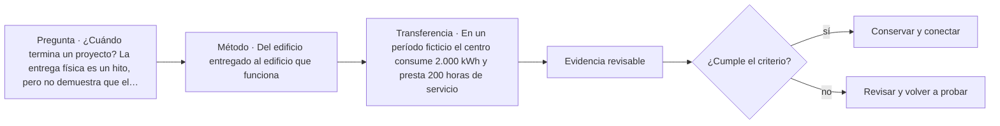

# ARQ-461 · Del edificio entregado al edificio que funciona

**Parte 47 · Clase redactada, primera edición de estudio.**

El material es educativo: no constituye un proyecto construible, cálculo firmado, informe pericial ni habilitación profesional. Los casos y cifras son sintéticos salvo indicación explícita. La revisión externa por especialistas está pendiente.

## Pregunta central

¿Cuándo termina un proyecto? La entrega física es un hito, pero no demuestra que el edificio pueda operar, mantenerse y adaptarse. Un equipo puede recibir llaves, manuales y un modelo digital y seguir sin saber cómo resolver una alarma, identificar un equipo o planificar una reparación. Esta clase trata la transferencia de capacidad, no únicamente de archivos.

## Resultado de aprendizaje

Construirás una matriz de entrega y un plan inicial de evaluación de uso. Distinguirás aceptación documental, comprobación funcional y satisfacción de usuarios. El caso es ficticio: no se establecen procedimientos reales de intervención en equipos ni frecuencias normativas de mantenimiento.

## Tres tipos de cierre

El cierre contractual se refiere a obligaciones y condiciones pactadas. La aceptación técnica debe comprobar lo que corresponda mediante documentos, pruebas y revisiones. La capacidad operativa exige que las personas dispongan de información, formación y recursos para usar el edificio. Estos cierres se relacionan, pero uno no demuestra automáticamente los demás.

Los principios de gestión de calidad ayudan a pensar en procesos y evidencia [[ISO-9001]](#FUENTE-ISO-9001). La gestión de información durante la entrega aporta un marco para no tratar documentación como un archivo sin destinatario [[ISO-19650-2]](#FUENTE-ISO-19650-2). En esta clase proponemos una matriz propia; no la presentamos como formato oficial de esas normas.

## Inventario útil y criticidad

Un inventario de activos debería responder qué existe, dónde está, para qué sirve y qué información permite sostenerlo. La criticidad no depende solamente de su precio. Un componente barato puede interrumpir un servicio importante o dificultar una salida si falla. La evaluación debe considerar consecuencias, dependencias, posibilidad de reparación y recursos disponibles.

Para el ejercicio clasificamos activos con criticidad alta, media o baja mediante justificación narrativa. No multiplicamos números arbitrarios para fingir un análisis cuantitativo de riesgo. La clasificación debe revisarse cuando cambia el uso o aparecen nuevas dependencias.

## Caso trabajado: centro comunitario al momento de entrega

El edificio ficticio incluye salas, servicios sanitarios, iluminación, ventilación y un pequeño recinto técnico. El equipo operador recibe una carpeta con documentos mezclados. Dos archivos se llaman «manual final» y no identifican el activo. Existe una lista de pendientes, pero no distingue defectos de documentación de problemas de funcionamiento.

La primera acción es construir una relación entre activos, documentos y pruebas. Si un manual no identifica a qué equipo corresponde, su presencia en la carpeta no satisface el requisito. Si una prueba corresponde a una versión anterior, hay que determinar si sigue siendo pertinente. El objetivo no es contar archivos, sino relacionar evidencia con objeto y condición.

La segunda acción es separar pendientes. Un rótulo faltante, una prueba no realizada y una diferencia de plano no tienen necesariamente la misma consecuencia. Se registra responsable, impacto y condición para cierre. Ningún pendiente de seguridad debe desaparecer por conveniencia del informe de entrega.

La tercera acción es comprobar capacidad operativa. El personal debe saber dónde encontrar información y a quién escalar una incidencia. Esta clase no enseña a manipular tableros, gas o equipos especializados; la formación y las intervenciones corresponden a personas competentes. Saber cuándo no intervenir también forma parte de operar responsablemente.

## Matriz de entrega resuelta

<table>
<thead>
<tr>
  <th>Objeto de entrega</th>
  <th>Evidencia</th>
  <th>Comprobación de utilidad</th>
</tr>
</thead>
<tbody>
<tr>
  <td>Planos del estado ejecutado</td>
  <td>Documentos identificados y revisados</td>
  <td>Relacionarlos con una ubicación real</td>
</tr>
<tr>
  <td>Inventario de activos</td>
  <td>Identificadores y propiedades requeridas</td>
  <td>Encontrar activo, documento y responsable</td>
</tr>
<tr>
  <td>Manuales</td>
  <td>Versión y equipo correctos</td>
  <td>Localizar instrucciones sin ambigüedad</td>
</tr>
<tr>
  <td>Pruebas y verificaciones</td>
  <td>Alcance, resultado y responsable</td>
  <td>Saber qué se comprobó y qué no</td>
</tr>
<tr>
  <td>Pendientes</td>
  <td>Registro con consecuencias y cierre</td>
  <td>Evitar ocultar asuntos no resueltos</td>
</tr>
<tr>
  <td>Formación de usuarios</td>
  <td>Contenido y demostración pertinente</td>
  <td>Verificar comprensión, no solo asistencia</td>
</tr>
</tbody>
</table>

No se confunde una firma de asistencia con aprendizaje. Una comprobación puede pedir que la persona localice el contacto de soporte, identifique un documento o explique el límite de su actuación. Las demostraciones deben respetar seguridad y competencias.

## Mantenimiento y ciclo de vida

Mantenimiento preventivo, correctivo y otras estrategias deben elegirse por características del activo, instrucciones autorizadas y consecuencias. No se inventan aquí intervalos universales como «revisar todo cada seis meses». La frecuencia debe tener fundamento y responsable. Un plan que exige tareas para las que no hay acceso o recursos es una intención, no una capacidad real.

El mantenimiento también afecta comparación ambiental y vida útil [[ISO-14040]](#FUENTE-ISO-14040). Por tanto, si el diseño supone reposición o cuidado periódico, ese supuesto debe transmitirse y ser viable. La decisión de especificar un componente y la decisión de sostenerlo pertenecen al mismo ciclo de vida.

## Evaluar el edificio en uso

La evaluación posocupacional pregunta cómo se comporta el edificio para quienes lo usan. Puede integrar mediciones, observación y relatos, con consentimiento y protección de datos cuando corresponda. No se reduce a preguntar si el lugar «gusta». Es útil distinguir una falla de diseño, un cambio de uso, una condición operacional y un dato no explicado.

Por ejemplo, mayor consumo eléctrico no demuestra automáticamente menor eficiencia. Puede haber más horas de servicio, ocupación distinta o clima diferente. Para interpretar hay que registrar denominadores y contexto. Un indicador necesita una pregunta, no solo una unidad.

## Ejercicio numérico de interpretación

En un período ficticio el centro consume 2.000 kWh y presta 200 horas de servicio. En otro consume 2.400 kWh y presta 300 horas. El consumo total aumenta 20 %, pero la razón simple por hora pasa de 10 a 8 kWh/h de servicio, una reducción de 20 %. Ninguna cifra por sí sola prueba mejora de eficiencia: faltan condiciones climáticas, ocupación, cargas y equivalencia del servicio.

Si el informe afirma «el edificio empeoró porque consumió más», omite el cambio de actividad. Si afirma «mejoró 20 % porque bajó el indicador», también excede la evidencia. Una formulación adecuada describe ambos datos y señala qué información hace falta para interpretar la diferencia.

## Accesibilidad durante la operación

Un recorrido diseñado como accesible puede perder esa condición de uso por almacenamiento, señalización confusa o cambios no revisados. Por ello la evaluación no termina con el dibujo. La accesibilidad y usabilidad requieren examinar la experiencia de las personas dentro del alcance pertinente [[ISO-21542]](#FUENTE-ISO-21542). No se deduce cumplimiento legal a partir de una encuesta de satisfacción.

## Práctica y solución orientativa

Elabora una lista de cinco activos y tres documentos que cada uno necesita realmente. Después redacta dos incidencias: una documental y otra funcional. Finalmente construye una pregunta de evaluación de uso que no induzca la respuesta. «¿Qué dificultades encuentras al orientarte desde la entrada?» es más abierta que «¿te gusta la excelente señalización?».

Una buena entrega relaciona cada información con una decisión operativa y reconoce lo pendiente. No solicita datos innecesarios solo para hacer la tabla más grande. La calidad reside en poder usarlos y actualizarlos.

## Evaluación

La rúbrica propuesta considera utilidad documental 30 %, gestión de pendientes 25 %, interpretación de indicadores 25 % y límites de actuación 20 %. Son errores críticos presentar consumo como explicación causal sin contexto, cerrar una incidencia sin evidencia y atribuir a usuarios tareas técnicas para las que no están capacitados. La operación devuelve conocimiento al diseño: cada dificultad bien documentada puede mejorar decisiones futuras.

<!-- pedagogia-2026:inicio -->
## Mapa visual de aprendizaje

El diagrama representa el ciclo de aprendizaje de esta clase, no una secuencia de obra ni un procedimiento profesional.

## Resultado observable, evidencia y evaluación

**Tipo de clase:** profesional y de coordinación.

**Evidencia mínima:** registro de decisión con alcance, interfaces, versiones, responsables, evidencia y condición de cierre.

**Archivo sugerido:** `evidence/ARQ-461/evidencia.md`.

| Criterio | Evidencia observable |
|---|---|
| Precisión y representación · 20 % | Los conceptos, unidades y convenciones se usan de forma coherente y pueden ser reconstruidos por otra persona. |
| Evidencia y trazabilidad · 25 % | Cada afirmación importante se vincula con dato, cálculo, observación o fuente; hipótesis y desconocidos permanecen visibles. |
| Decisión y alternativas · 25 % | La decisión responde a la pregunta, compara al menos una alternativa y declara qué condición la haría cambiar. |
| Integración y ciclo de vida · 20 % | Se identifica una interfaz y una consecuencia para construcción, uso, mantenimiento, adaptación o fin de vida. |
| Comunicación, ética y límites · 10 % | El alcance se entiende sin explicación oral adicional y no se atribuyen permisos, competencias o certezas inexistentes. |

**Criterio de aceptación:** 80/100 y ningún criterio bajo 60 %. Una entrega genérica que podría reutilizarse sin cambios en otra clase no demuestra dominio. Si existe una condición crítica de seguridad, accesibilidad, evidencia o responsabilidad sin resolver, la entrega permanece pendiente aunque el promedio supere 80.

### Errores diagnósticos

En esta clase conviene vigilar especialmente: confundir coordinación con aprobación; perder versión o responsable; cerrar un pendiente sin evidencia.

## Autoevaluación, recuperación y continuidad

Antes de avanzar, responde sin consultar la solución:

1. ¿Qué decisión concreta puedes tomar ahora que no podías justificar antes?
2. ¿Qué evidencia de tu entrega es comprobada y cuál continúa siendo una hipótesis?
3. ¿Qué cambio de contexto invalidaría la transferencia realizada?

Revisa la entrega a las 24–48 horas y nuevamente al cerrar la parte. Conserva la primera versión, la crítica recibida y la versión revisada: el aprendizaje se demuestra también mediante el cambio entre versiones.
<!-- pedagogia-2026:fin -->

## Fuentes y alcance de uso

- **[[ISO-9001]](#FUENTE-ISO-9001) ISO 9001:2026 — Quality management systems — Requirements** — ISO. [https://www.iso.org/standard/9001](https://www.iso.org/standard/9001)
Uso: Sistema de gestión de calidad; edición publicada y ámbito general. Alcance de consulta: Ficha pública; publicación 16-09-2026. Límite: Texto normativo íntegro no adquirido; no se inventan cláusulas ni plazos universales de transición de certificación.

- **[[ISO-19650-2]](#FUENTE-ISO-19650-2) ISO 19650-2:2018 — Delivery phase of the assets** — ISO. [https://www.iso.org/standard/68080.html](https://www.iso.org/standard/68080.html)
Uso: Gestión de información durante la entrega del proyecto. Alcance de consulta: Ficha pública; edición publicada con revisión en curso. Límite: Un proyecto de revisión no reemplaza por sí solo la edición publicada. Texto íntegro no consultado.

- **[[ISO-14040]](#FUENTE-ISO-14040) ISO 14040:2006 — Life cycle assessment — Principles and framework** — ISO. [https://www.iso.org/standard/37456.html](https://www.iso.org/standard/37456.html)
Uso: Objetivo y alcance, inventario, evaluación e interpretación de ACV. Alcance de consulta: Ficha pública. Límite: Revisar enmiendas aplicables; no se reproduce el texto normativo.

- **[[ISO-21542]](#FUENTE-ISO-21542) ISO 21542:2021 — Accessibility and usability of the built environment** — ISO. [https://www.iso.org/standard/71860.html](https://www.iso.org/standard/71860.html)
Uso: Accesibilidad y usabilidad del entorno edificado dentro de su alcance. Alcance de consulta: Ficha pública. Límite: No usar medidas de referencia como anchos legales; confirmar OGUC y demás requisitos locales. No cubre por sí sola todo el espacio público.

Consulta de referencias: **20 de septiembre de 2026**. Los razonamientos, datos de ejercicio y soluciones son elaboración didáctica original; no se atribuyen a las fuentes como estudios de casos reales.
