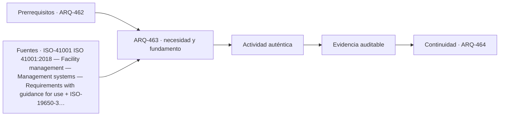

# ARQ-463 · Manuales útiles y formación de usuarios

**Parte 47 · Clase desarrollada · Incorporada en v0.26.0.**

Prerrequisitos conceptuales: ARQ-462. Sin calendario. Casos, cantidades y resultados son ficticios salvo antecedentes expresamente atribuidos. Material educativo: no constituye diagnóstico pericial, proyecto ejecutable, autorización, certificación ni habilitación profesional. Revisión externa especializada pendiente.

## Pregunta central

¿Cómo transformar una carpeta de manuales en capacidad operativa sin confundir asistencia a una capacitación con comprensión?

## Resultado y continuidad

ARQ-463 continúa desde ARQ-462; cualquier caso o parámetro nuevo se identifica expresamente y no modifica retrospectivamente la clase anterior. Elaborarás un registro trazable, resolverás un caso reproducible, formularás una práctica distinta y cerrarás separando dato, inferencia, requisito, decisión y pendiente.

Durante la operación, un edificio cambia por uso, mantenimiento, sustituciones y fallas. La evidencia debe conservar fecha, estado y configuración. Un buen sistema de gestión no persigue datos por acumulación: mantiene la información necesaria para sostener servicios, investigar incidencias y aprender de la experiencia.

## 1. Información orientada a tareas

Un manual útil responde a tareas reales: localizar una alarma, reconocer un estado, encontrar un contacto o conocer el límite de actuación. Reunir PDFs por proveedor sin índice de activos obliga a buscar bajo presión y aumenta riesgo de usar una versión incorrecta.

## 2. Capas de información

La operación necesita vistas distintas: guía rápida para tareas frecuentes, procedimientos autorizados para personal competente, documentación de fabricante y registros de cambios. Simplificar no significa ocultar advertencias o competencias requeridas.

## 3. Formación verificable

Una firma de asistencia registra presencia, no aprendizaje. Puede comprobarse de forma segura mediante preguntas, localización de información, simulaciones de escritorio o demostraciones no peligrosas. La formación debe reconocer cuándo la acción correcta es escalar a un especialista.

## 4. Actualización

Cuando cambia un equipo, una configuración o un responsable, los materiales deben actualizarse. Un manual correcto para la versión anterior puede ser más peligroso que un campo marcado pendiente, porque produce confianza falsa.

## 5. Caso trabajado

Caso **OPS-MAN-01** usa ocho tareas simuladas de escritorio. Con una carpeta sin índice se encuentran correctamente cinco documentos dentro del tiempo del ejercicio; después de relacionar activo–tarea–documento, se encuentran siete. El cambio de 5/8 a 7/8 describe este ensayo ficticio, no una mejora del 25 % en competencia humana. La octava tarea continúa sin documento vigente y se conserva como pendiente.

## 6. Profundización: operación como sistema de aprendizaje

Operar un edificio significa comparar el **estado esperado** con el **estado observado** y decidir qué hacer con la diferencia. Eso exige datos con fecha y contexto, responsables capaces de actuar y una ruta de escalamiento. Un indicador sin capacidad de respuesta puede producir tableros muy completos y edificios mal mantenidos.

La operación también devuelve conocimiento al diseño. Una incidencia repetida puede revelar un detalle difícil de mantener; una modificación de uso puede volver insuficiente una reserva; una encuesta puede mostrar una barrera que el plano no anticipó. La retroalimentación debe llegar a estándares, especificaciones y futuros proyectos, no quedar archivada como anécdota.

## 7. Interfaces profesionales y control de cambios

Las decisiones de esta clase cruzan disciplinas y etapas. Cada registro debe identificar **objeto, ubicación, fuente, fecha o versión, responsable de producir evidencia, responsable de revisarla y condición de cierre**. Una modificación no obliga a repetir todo el proyecto, pero sí a rastrear qué afirmaciones dependían del dato que cambió.

Cuando una evidencia pertenece a otra jurisdicción, producto, material o edificio, se conserva como referencia conceptual y no como resultado del caso. La aceptación del cliente, la presencia de un archivo o una cifra aritméticamente correcta tampoco sustituyen la comprobación técnica o administrativa que corresponda.

## 8. Errores frecuentes y comprobaciones de calidad

Evita convertir **ausencia de evidencia en evidencia de ausencia**, promediar estados que necesitan conservarse por separado, compensar una condición necesaria con un buen puntaje en otro criterio, o eliminar un resultado desfavorable porque complica la narrativa. También evita citar una norma o guía sin registrar su edición, jurisdicción y alcance de consulta.

Una entrega robusta permite repetir las cuentas y localizar la procedencia de cada afirmación. Si una cifra cambia al modificar una hipótesis, la sensibilidad se documenta; no se inventa una probabilidad. Si el modelo deja fuera un fenómeno relevante, se indica qué conclusión sigue siendo válida y cuál debe reabrirse.

*Figura 463. Esquema didáctico de relaciones y estados. No representa una obra, diagnóstico, autorización ni certificación real.*

## 9. Práctica independiente

Diseña seis tareas de búsqueda documental. En una versión inicial resuelve cuatro; tras reorganizar, cinco. Explica qué puedes afirmar y qué no sobre la formación de usuarios.

10. Solución razonada

Puede afirmarse que en el ensayo simulado aumentó la cantidad de tareas documentales resueltas de 4 a 5 bajo esas condiciones. No se prueba competencia general ni seguridad operativa. La tarea restante debe mantenerse visible.

La solución corresponde solo al modelo declarado. En un proyecto real se deben confirmar legislación, permisos, condiciones del sitio, productos, ensayos, contratos, competencias profesionales, participación y responsabilidades aplicables.

## 11. Autoevaluación y transferencia

Puedes avanzar cuando eres capaz de reconstruir el caso sin consultar la respuesta, explicar una conclusión que **sí** está respaldada y otra que **no**, y nombrar el documento, ensayo, participante o especialista que debería aportar la evidencia pendiente. La meta no es memorizar el número final, sino mantener coherencia entre pregunta, método, resultado y decisión.

La clase siguiente conserva el método, no las cifras, salvo cuando el texto declara explícitamente un caso continuo.

<!-- pedagogia-2026:inicio -->
## Decisión pedagógica y posición curricular

### Por qué existe

Esta clase existe para resolver una necesidad concreta del recorrido: ¿Cómo transformar una carpeta de manuales en capacidad operativa sin confundir asistencia a una capacitación con comprensión?

### Por qué está exactamente aquí

Ocupa el lugar 3 de la Parte 47. Se estudia después de ARQ-462 · Inventario de activos y criticidad porque usa esa base para responder «¿Cómo transformar una carpeta de manuales en capacidad operativa sin confundir asistencia a una capacitación con comprensión?». Se ubica antes de ARQ-464 · Mantenimiento preventivo, predictivo y correctivo porque la evidencia producida aquí debe estar disponible para ese paso.

- **Prerrequisitos:** `ARQ-462`
- **Capacidad que introduce:** ARQ-463 continúa desde ARQ-462; cualquier caso o parámetro nuevo se identifica expresamente y no modifica retrospectivamente la clase anterior. Elaborarás un registro trazable, resolverás un caso reproducible, formularás una práctica distinta y cerrarás separando dato, inferencia, requisito, decisión y pendiente. Durante la operación, un edificio cambia por uso, mantenimiento, sustituciones y fallas.
- **Clases o experiencias que dependen de ella:** `ARQ-464`

El diagrama permite comprobar una relación que el texto lineal oculta con facilidad: esta clase recibe capacidades previas, toma decisiones apoyadas por fuentes, exige una experiencia y produce evidencia que habilita trabajo posterior. No representa un procedimiento de obra.

## Resultado observable, evidencia y evaluación

1. Identificar y delimitar las condiciones necesarias para responder la pregunta central de manuales útiles y formación de usuarios.
2. Producir y comprobar la evidencia declarada por la clase: ARQ-463 continúa desde ARQ-462; cualquier caso o parámetro nuevo se identifica expresamente y no modifica retrospectivamente la clase anterior. Elaborarás un registro trazable, resolverás un caso reproducible, formularás una práctica distinta y cerrarás separando dato, inferencia, requisito, decisión y pendiente. Durante la operación, un edificio cambia por uso, mantenimiento, sustituciones y fallas.
3. Justificar una decisión de manuales útiles y formación de usuarios mediante fuentes, supuestos, alternativas y límites explícitos.

## Actividad, evidencia y criterio de aceptación

**Actividad:** Diseña seis tareas de búsqueda documental. En una versión inicial resuelve cuatro; tras reorganizar, cinco. Explica qué puedes afirmar y qué no sobre la formación de usuarios.

**Evidencia mínima:** ARQ-463 continúa desde ARQ-462; cualquier caso o parámetro nuevo se identifica expresamente y no modifica retrospectivamente la clase anterior. Elaborarás un registro trazable, resolverás un caso reproducible, formularás una práctica distinta y cerrarás separando dato, inferencia, requisito, decisión y pendiente. Durante la operación, un edificio cambia por uso, mantenimiento, sustituciones y fallas.

**Archivo sugerido:** `evidence/ARQ-463/evidencia.md`.

**Criterio de aceptación:** la entrega se acepta cuando:

- La entrega responde explícitamente a la pregunta: ¿Cómo transformar una carpeta de manuales en capacidad operativa sin confundir asistencia a una capacitación con comprensión?
- La actividad conserva las fronteras del caso y permite reconstruir el procedimiento: Diseña seis tareas de búsqueda documental. En una versión inicial resuelve cuatro; tras reorganizar, cinco. Explica qué puedes afirmar y qué no sobre la formación de usuarios.
- Cada afirmación externa puede seguirse hasta una fuente, su alcance consultado y su límite.
- La evidencia deja disponible una entrada comprobable para ARQ-464.
- Evita convertir ausencia de evidencia en evidencia de ausencia , promediar estados que necesitan conservarse por separado, compensar una condición necesaria con un buen puntaje en otro criterio, o eliminar un resultado desfavorable porque complica la narrativa. También evita citar una norma o guía sin registrar su edición, jurisdicción y alcance de consulta.

La [rúbrica común](../../docs/RUBRICA_COMUN.md) complementa estos criterios; no los reemplaza. Una entrega puede superar un promedio y continuar pendiente si oculta una condición crítica.

## Trazabilidad de las decisiones

| # | Decisión o fundamento | Fuente utilizada | Aplicación y límite en esta clase |
|---:|---|---|---|
| 1 | Relacionar facility management, objetivos de la organización, necesidades de partes interesadas y mejora sistemática. | [ISO-41001 ISO 41001:2018 — Facility management — Management systems —…](https://www.iso.org/standard/68021.html) | Consulta: Ficha pública; edición 2018 publicada, con enmienda climática 2024 y revisión en desarrollo. Límite: No se leyó el texto íntegro ni se afirma certificación o cumplimiento del sistema de gestión. |
| 2 | Gestión de información durante la fase operativa de los activos y sus intercambios. | [ISO-19650-3 ISO 19650-3:2020 — Information management using BIM —…](https://www.iso.org/standard/75109.html) | Consulta: Ficha pública; edición 2020 confirmada en 2024. Límite: No se leyó el texto íntegro ni se prescribe un CDE o esquema contractual concreto. |
| 3 | Considerar distintas barreras y canales de acceso | [Organismo: Government Digital Service / GOV.UK. Consulta: 2026-09-21.](https://www.gov.uk/service-manual/helping-people-to-use-your-service/making-your-service-accessible-an-introduction) | Consulta: Guía web; investigación e inclusión en servicios Límite: Su ámbito incluye servicios digitales; no reemplaza exigencias arquitectónicas de accesibilidad. |

La tabla permite auditar las relaciones; la explicación, el caso y la práctica de la clase siguen siendo la documentación principal.

## Autoevaluación, recuperación y continuidad

### Errores diagnósticos

Antes de avanzar, comprueba si puedes reconstruir cada resultado sin mirar la solución, señalar qué evidencia lo sostiene y nombrar una condición que obligaría a revisar tu decisión. Conserva la primera versión, la objeción recibida y la revisión.

**Conexión siguiente:** La continuidad inmediata es ARQ-464 · Mantenimiento preventivo, predictivo y correctivo; conserva el método y vuelve a verificar datos y límites.
<!-- pedagogia-2026:fin -->

## Fuentes y alcance de uso

### [[ISO-41001]](#FUENTE-ISO-41001) ISO 41001:2018 — Facility management — Management systems — Requirements with guidance for use

International Organization for Standardization. [https://www.iso.org/standard/68021.html](https://www.iso.org/standard/68021.html)

**Consulta:** Ficha pública; edición 2018 publicada, con enmienda climática 2024 y revisión en desarrollo. **Apoyo:** Relacionar facility management, objetivos de la organización, necesidades de partes interesadas y mejora sistemática. **Límite:** No se leyó el texto íntegro ni se afirma certificación o cumplimiento del sistema de gestión.

### [[ISO-19650-3]](#FUENTE-ISO-19650-3) ISO 19650-3:2020 — Information management using BIM — Operational phase of assets

International Organization for Standardization. [https://www.iso.org/standard/75109.html](https://www.iso.org/standard/75109.html)

**Consulta:** Ficha pública; edición 2020 confirmada en 2024. **Apoyo:** Gestión de información durante la fase operativa de los activos y sus intercambios. **Límite:** No se leyó el texto íntegro ni se prescribe un CDE o esquema contractual concreto.

### [[RES-ACCESS]](#FUENTE-RES-ACCESS) Making your service accessible: an introduction

Government Digital Service / GOV.UK. [https://www.gov.uk/service-manual/helping-people-to-use-your-service/making-your-service-accessible-an-introduction](https://www.gov.uk/service-manual/helping-people-to-use-your-service/making-your-service-accessible-an-introduction)

**Consulta:** Guía web; investigación e inclusión en servicios **Apoyo:** Considerar distintas barreras y canales de acceso **Límite:** Su ámbito incluye servicios digitales; no reemplaza exigencias arquitectónicas de accesibilidad.
