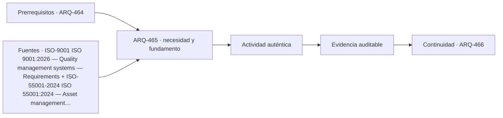

# ARQ-465 · Inspecciones, garantías y trazabilidad

**Parte 47 · Clase desarrollada · Incorporada en v0.26.0.**

Prerrequisitos conceptuales: ARQ-464. Sin calendario. Casos, cantidades y resultados son ficticios salvo antecedentes expresamente atribuidos. Material educativo: no constituye diagnóstico pericial, proyecto ejecutable, autorización, certificación ni habilitación profesional. Revisión externa especializada pendiente.

## Pregunta central

¿Cómo relacionar una inspección y una garantía con el objeto exacto, su versión y la condición observada sin convertir una garantía en prueba de desempeño?

## Resultado y continuidad

ARQ-465 continúa desde ARQ-464; cualquier caso o parámetro nuevo se identifica expresamente y no modifica retrospectivamente la clase anterior. Elaborarás un registro trazable, resolverás un caso reproducible, formularás una práctica distinta y cerrarás separando dato, inferencia, requisito, decisión y pendiente.

Durante la operación, un edificio cambia por uso, mantenimiento, sustituciones y fallas. La evidencia debe conservar fecha, estado y configuración. Un buen sistema de gestión no persigue datos por acumulación: mantiene la información necesaria para sostener servicios, investigar incidencias y aprender de la experiencia.

## 1. Garantía no es inspección

Una garantía describe obligaciones bajo condiciones contractuales; una inspección registra un estado; un ensayo produce evidencia bajo un método. Tener los tres documentos no los hace intercambiables.

## 2. Tiempo y versión

La fecha importa: una inspección antes de una modificación no verifica el estado posterior. Una garantía puede exigir notificación o mantenimiento documentado. El curso no fija plazos legales; enseña a registrar la relación temporal.

## 3. Ubicación inequívoca

La incidencia debe señalar activo, componente y lugar. “Ventana norte” puede ser ambiguo en un edificio con veinte ventanas. Identificadores estables permiten vincular fotografías, órdenes, repuestos y cierre.

## 4. Cierre basado en evidencia

Emitir una orden de reparación no cierra una incidencia. Debe registrarse ejecución, comprobación y, si corresponde, actualización de documentos. Un caso rechazado o pendiente no desaparece por vencer una garantía.

## 5. Caso trabajado

Caso **OPS-GAR-01** tiene tres incidencias I1–I3. I1 se inspecciona antes de una modificación; I2 después; I3 carece de ubicación inequívoca. La garantía del producto cubre un período, pero no demuestra que I2 sea un defecto cubierto ni que I1 represente el estado actual. El registro final mantiene tres preguntas distintas: aplicabilidad contractual, condición técnica y trazabilidad documental.

## 6. Profundización: operación como sistema de aprendizaje

Operar un edificio significa comparar el **estado esperado** con el **estado observado** y decidir qué hacer con la diferencia. Eso exige datos con fecha y contexto, responsables capaces de actuar y una ruta de escalamiento. Un indicador sin capacidad de respuesta puede producir tableros muy completos y edificios mal mantenidos.

La operación también devuelve conocimiento al diseño. Una incidencia repetida puede revelar un detalle difícil de mantener; una modificación de uso puede volver insuficiente una reserva; una encuesta puede mostrar una barrera que el plano no anticipó. La retroalimentación debe llegar a estándares, especificaciones y futuros proyectos, no quedar archivada como anécdota.

## 7. Interfaces profesionales y control de cambios

Las decisiones de esta clase cruzan disciplinas y etapas. Cada registro debe identificar **objeto, ubicación, fuente, fecha o versión, responsable de producir evidencia, responsable de revisarla y condición de cierre**. Una modificación no obliga a repetir todo el proyecto, pero sí a rastrear qué afirmaciones dependían del dato que cambió.

Cuando una evidencia pertenece a otra jurisdicción, producto, material o edificio, se conserva como referencia conceptual y no como resultado del caso. La aceptación del cliente, la presencia de un archivo o una cifra aritméticamente correcta tampoco sustituyen la comprobación técnica o administrativa que corresponda.

## 8. Errores frecuentes y comprobaciones de calidad

Evita convertir **ausencia de evidencia en evidencia de ausencia**, promediar estados que necesitan conservarse por separado, compensar una condición necesaria con un buen puntaje en otro criterio, o eliminar un resultado desfavorable porque complica la narrativa. También evita citar una norma o guía sin registrar su edición, jurisdicción y alcance de consulta.

Una entrega robusta permite repetir las cuentas y localizar la procedencia de cada afirmación. Si una cifra cambia al modificar una hipótesis, la sensibilidad se documenta; no se inventa una probabilidad. Si el modelo deja fuera un fenómeno relevante, se indica qué conclusión sigue siendo válida y cuál debe reabrirse.

*Figura 465. Esquema didáctico de relaciones y estados. No representa una obra, diagnóstico, autorización ni certificación real.*

## 9. Práctica independiente

Crea cuatro incidencias con fechas y dos modificaciones. Identifica qué inspecciones quedan desactualizadas respecto de la versión actual y qué información falta para evaluar garantía.

10. Solución razonada

Toda inspección anterior a una modificación relevante necesita revisión de aplicabilidad. Para garantía se necesitan objeto, fecha, condiciones, contrato y evidencia. No se puede inferir cobertura solo porque la incidencia ocurrió dentro de un plazo.

La solución corresponde solo al modelo declarado. En un proyecto real se deben confirmar legislación, permisos, condiciones del sitio, productos, ensayos, contratos, competencias profesionales, participación y responsabilidades aplicables.

## 11. Autoevaluación y transferencia

Puedes avanzar cuando eres capaz de reconstruir el caso sin consultar la respuesta, explicar una conclusión que **sí** está respaldada y otra que **no**, y nombrar el documento, ensayo, participante o especialista que debería aportar la evidencia pendiente. La meta no es memorizar el número final, sino mantener coherencia entre pregunta, método, resultado y decisión.

La clase siguiente conserva el método, no las cifras, salvo cuando el texto declara explícitamente un caso continuo.

<!-- pedagogia-2026:inicio -->
## Decisión pedagógica y posición curricular

### Por qué existe

Esta clase existe para resolver una necesidad concreta del recorrido: ¿Cómo relacionar una inspección y una garantía con el objeto exacto, su versión y la condición observada sin convertir una garantía en prueba de desempeño?

### Por qué está exactamente aquí

Ocupa el lugar 5 de la Parte 47. Se estudia después de ARQ-464 · Mantenimiento preventivo, predictivo y correctivo porque usa esa base para responder «¿Cómo relacionar una inspección y una garantía con el objeto exacto, su versión y la condición observada sin convertir una garantía en prueba de desempeño?». Se ubica antes de ARQ-466 · Medición de confort, consumo y satisfacción porque la evidencia producida aquí debe estar disponible para ese paso.

- **Prerrequisitos:** `ARQ-464`
- **Capacidad que introduce:** ARQ-465 continúa desde ARQ-464; cualquier caso o parámetro nuevo se identifica expresamente y no modifica retrospectivamente la clase anterior. Elaborarás un registro trazable, resolverás un caso reproducible, formularás una práctica distinta y cerrarás separando dato, inferencia, requisito, decisión y pendiente. Durante la operación, un edificio cambia por uso, mantenimiento, sustituciones y fallas.
- **Clases o experiencias que dependen de ella:** `ARQ-466`

El diagrama permite comprobar una relación que el texto lineal oculta con facilidad: esta clase recibe capacidades previas, toma decisiones apoyadas por fuentes, exige una experiencia y produce evidencia que habilita trabajo posterior. No representa un procedimiento de obra.

## Resultado observable, evidencia y evaluación

1. Identificar y delimitar las condiciones necesarias para responder la pregunta central de inspecciones, garantías y trazabilidad.
2. Producir y comprobar la evidencia declarada por la clase: ARQ-465 continúa desde ARQ-464; cualquier caso o parámetro nuevo se identifica expresamente y no modifica retrospectivamente la clase anterior. Elaborarás un registro trazable, resolverás un caso reproducible, formularás una práctica distinta y cerrarás separando dato, inferencia, requisito, decisión y pendiente. Durante la operación, un edificio cambia por uso, mantenimiento, sustituciones y fallas.
3. Justificar una decisión de inspecciones, garantías y trazabilidad mediante fuentes, supuestos, alternativas y límites explícitos.

## Actividad, evidencia y criterio de aceptación

**Actividad:** Crea cuatro incidencias con fechas y dos modificaciones. Identifica qué inspecciones quedan desactualizadas respecto de la versión actual y qué información falta para evaluar garantía.

**Evidencia mínima:** ARQ-465 continúa desde ARQ-464; cualquier caso o parámetro nuevo se identifica expresamente y no modifica retrospectivamente la clase anterior. Elaborarás un registro trazable, resolverás un caso reproducible, formularás una práctica distinta y cerrarás separando dato, inferencia, requisito, decisión y pendiente. Durante la operación, un edificio cambia por uso, mantenimiento, sustituciones y fallas.

**Archivo sugerido:** `evidence/ARQ-465/evidencia.md`.

**Criterio de aceptación:** la entrega se acepta cuando:

- La entrega responde explícitamente a la pregunta: ¿Cómo relacionar una inspección y una garantía con el objeto exacto, su versión y la condición observada sin convertir una garantía en prueba de desempeño?
- La actividad conserva las fronteras del caso y permite reconstruir el procedimiento: Crea cuatro incidencias con fechas y dos modificaciones. Identifica qué inspecciones quedan desactualizadas respecto de la versión actual y qué información falta para evaluar garantía.
- Cada afirmación externa puede seguirse hasta una fuente, su alcance consultado y su límite.
- La evidencia deja disponible una entrada comprobable para ARQ-466.
- Evita convertir ausencia de evidencia en evidencia de ausencia , promediar estados que necesitan conservarse por separado, compensar una condición necesaria con un buen puntaje en otro criterio, o eliminar un resultado desfavorable porque complica la narrativa. También evita citar una norma o guía sin registrar su edición, jurisdicción y alcance de consulta.

La [rúbrica común](../../docs/RUBRICA_COMUN.md) complementa estos criterios; no los reemplaza. Una entrega puede superar un promedio y continuar pendiente si oculta una condición crítica.

## Trazabilidad de las decisiones

| # | Decisión o fundamento | Fuente utilizada | Aplicación y límite en esta clase |
|---:|---|---|---|
| 1 | Sistema de gestión de calidad; edición publicada y ámbito general | [ISO-9001 ISO 9001:2026 — Quality management systems — Requirements](https://www.iso.org/standard/9001) | Consulta: Ficha pública; publicación 16-09-2026 Límite: Texto normativo íntegro no adquirido; no se inventan cláusulas ni plazos universales de transición de certificación. |
| 2 | Gestión sistemática de activos y equilibrio entre desempeño, riesgo y gasto a lo largo del ciclo de vida. | [ISO-55001-2024 ISO 55001:2024 — Asset management — Asset management…](https://www.iso.org/standard/83054.html) | Consulta: Ficha pública; edición 2 publicada en julio de 2024. Límite: No se implementa ni certifica un sistema de gestión de activos; los criterios de criticidad del curso son didácticos. |
| 3 | Línea base, trazabilidad y análisis del impacto de cambios | [Organismo: National Aeronautics and Space Administration. Consulta:…](https://www.nasa.gov/reference/6-0-crosscutting-technical-management/) | Consulta: Apartados 6.2 y 6.5 sobre requisitos y configuración Límite: Los formularios y el caso arquitectónico son originales; no se copian procedimientos contractuales. |

La tabla permite auditar las relaciones; la explicación, el caso y la práctica de la clase siguen siendo la documentación principal.

## Autoevaluación, recuperación y continuidad

### Errores diagnósticos

Antes de avanzar, comprueba si puedes reconstruir cada resultado sin mirar la solución, señalar qué evidencia lo sostiene y nombrar una condición que obligaría a revisar tu decisión. Conserva la primera versión, la objeción recibida y la revisión.

**Conexión siguiente:** La continuidad inmediata es ARQ-466 · Medición de confort, consumo y satisfacción; conserva el método y vuelve a verificar datos y límites.
<!-- pedagogia-2026:fin -->

## Fuentes y alcance de uso

### [[ISO-9001]](#FUENTE-ISO-9001) ISO 9001:2026 — Quality management systems — Requirements

ISO. [https://www.iso.org/standard/9001](https://www.iso.org/standard/9001)

**Consulta:** Ficha pública; publicación 16-09-2026 **Apoyo:** Sistema de gestión de calidad; edición publicada y ámbito general **Límite:** Texto normativo íntegro no adquirido; no se inventan cláusulas ni plazos universales de transición de certificación.

### [[ISO-55001-2024]](#FUENTE-ISO-55001-2024) ISO 55001:2024 — Asset management — Asset management system — Requirements

International Organization for Standardization. [https://www.iso.org/standard/83054.html](https://www.iso.org/standard/83054.html)

**Consulta:** Ficha pública; edición 2 publicada en julio de 2024. **Apoyo:** Gestión sistemática de activos y equilibrio entre desempeño, riesgo y gasto a lo largo del ciclo de vida. **Límite:** No se implementa ni certifica un sistema de gestión de activos; los criterios de criticidad del curso son didácticos.

### [[NASA-CHANGE]](#FUENTE-NASA-CHANGE) NASA Systems Engineering Handbook, 6.0: Crosscutting Technical Management

National Aeronautics and Space Administration. [https://www.nasa.gov/reference/6-0-crosscutting-technical-management/](https://www.nasa.gov/reference/6-0-crosscutting-technical-management/)

**Consulta:** Apartados 6.2 y 6.5 sobre requisitos y configuración **Apoyo:** Línea base, trazabilidad y análisis del impacto de cambios **Límite:** Los formularios y el caso arquitectónico son originales; no se copian procedimientos contractuales.
