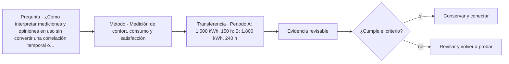

# ARQ-466 · Medición de confort, consumo y satisfacción

**Parte 47 · Clase desarrollada · Incorporada en v0.26.0.**

Prerrequisitos conceptuales: ARQ-465. Sin calendario. Casos, cantidades y resultados son ficticios salvo antecedentes expresamente atribuidos. Material educativo: no constituye diagnóstico pericial, proyecto ejecutable, autorización, certificación ni habilitación profesional. Revisión externa especializada pendiente.

## Pregunta central

¿Cómo interpretar mediciones y opiniones en uso sin convertir una correlación temporal o un promedio en explicación causal?

## Resultado y continuidad

ARQ-466 continúa desde ARQ-465; cualquier caso o parámetro nuevo se identifica expresamente y no modifica retrospectivamente la clase anterior. Elaborarás un registro trazable, resolverás un caso reproducible, formularás una práctica distinta y cerrarás separando dato, inferencia, requisito, decisión y pendiente.

Durante la operación, un edificio cambia por uso, mantenimiento, sustituciones y fallas. La evidencia debe conservar fecha, estado y configuración. Un buen sistema de gestión no persigue datos por acumulación: mantiene la información necesaria para sostener servicios, investigar incidencias y aprender de la experiencia.

## 1. Tres familias de evidencia

Confort físico, consumo y satisfacción pueden relacionarse, pero no son la misma variable. Temperatura o ruido medido no resume experiencia; una encuesta no reemplaza el instrumento; un kWh no explica por qué se consumió.

## 2. Denominadores y condiciones

Compara períodos conservando horas de servicio, ocupación, clima y funciones. Un total mayor puede coexistir con menor intensidad; una intensidad menor puede deberse a otro uso. Los denominadores deben ser transparentes.

## 3. Distribución y minorías

Un promedio de satisfacción puede ocultar a un grupo que experimenta una barrera sistemática. Conviene conservar distribuciones, contexto y comentarios, respetando privacidad. No se necesita identificar personas para que una dificultad sea visible.

## 4. Medición repetible

Hora, ubicación, instrumento y estado operativo deben registrarse. Cambiar el lugar del sensor o la escala de encuesta dificulta comparar períodos. La consistencia del método es parte de la evidencia.

## 5. Caso trabajado

Caso **OPS-POE-01** compara dos meses ficticios. Mes A: 2.000 kWh, 200 h de servicio y 4.000 grado-hora de diferencia térmica acumulada; Mes B: 2.400 kWh, 300 h y 6.600 grado-hora. kWh/h baja de 10 a 8, pero kWh por grado-hora cambia de 0,50 a 0,364. Ninguno de esos cocientes prueba mejora energética porque ocupación y cargas internas no están controladas. Las encuestas simuladas además muestran mayor satisfacción térmica y menor satisfacción acústica: no se promedian en una nota única.

## 6. Profundización: operación como sistema de aprendizaje

Operar un edificio significa comparar el **estado esperado** con el **estado observado** y decidir qué hacer con la diferencia. Eso exige datos con fecha y contexto, responsables capaces de actuar y una ruta de escalamiento. Un indicador sin capacidad de respuesta puede producir tableros muy completos y edificios mal mantenidos.

La operación también devuelve conocimiento al diseño. Una incidencia repetida puede revelar un detalle difícil de mantener; una modificación de uso puede volver insuficiente una reserva; una encuesta puede mostrar una barrera que el plano no anticipó. La retroalimentación debe llegar a estándares, especificaciones y futuros proyectos, no quedar archivada como anécdota.

## 7. Interfaces profesionales y control de cambios

Las decisiones de esta clase cruzan disciplinas y etapas. Cada registro debe identificar **objeto, ubicación, fuente, fecha o versión, responsable de producir evidencia, responsable de revisarla y condición de cierre**. Una modificación no obliga a repetir todo el proyecto, pero sí a rastrear qué afirmaciones dependían del dato que cambió.

Cuando una evidencia pertenece a otra jurisdicción, producto, material o edificio, se conserva como referencia conceptual y no como resultado del caso. La aceptación del cliente, la presencia de un archivo o una cifra aritméticamente correcta tampoco sustituyen la comprobación técnica o administrativa que corresponda.

## 8. Errores frecuentes y comprobaciones de calidad

Evita convertir **ausencia de evidencia en evidencia de ausencia**, promediar estados que necesitan conservarse por separado, compensar una condición necesaria con un buen puntaje en otro criterio, o eliminar un resultado desfavorable porque complica la narrativa. También evita citar una norma o guía sin registrar su edición, jurisdicción y alcance de consulta.

Una entrega robusta permite repetir las cuentas y localizar la procedencia de cada afirmación. Si una cifra cambia al modificar una hipótesis, la sensibilidad se documenta; no se inventa una probabilidad. Si el modelo deja fuera un fenómeno relevante, se indica qué conclusión sigue siendo válida y cuál debe reabrirse.

*Figura 466. Esquema didáctico de relaciones y estados. No representa una obra, diagnóstico, autorización ni certificación real.*

## 9. Práctica independiente

Periodo A: 1.500 kWh, 150 h; B: 1.800 kWh, 240 h. Calcula kWh/h y redacta tres variables adicionales necesarias para interpretar el cambio.

10. Solución razonada

A=10 kWh/h; B=7,5 kWh/h. La intensidad baja 25 %, pero faltan clima, ocupación, cargas, áreas y equivalencia del servicio, entre otros. No se atribuye causalidad a una intervención sin diseño apropiado.

La solución corresponde solo al modelo declarado. En un proyecto real se deben confirmar legislación, permisos, condiciones del sitio, productos, ensayos, contratos, competencias profesionales, participación y responsabilidades aplicables.

## 11. Autoevaluación y transferencia

Puedes avanzar cuando eres capaz de reconstruir el caso sin consultar la respuesta, explicar una conclusión que **sí** está respaldada y otra que **no**, y nombrar el documento, ensayo, participante o especialista que debería aportar la evidencia pendiente. La meta no es memorizar el número final, sino mantener coherencia entre pregunta, método, resultado y decisión.

La clase siguiente conserva el método, no las cifras, salvo cuando el texto declara explícitamente un caso continuo.

<!-- pedagogia-2026:inicio -->
## Mapa visual de aprendizaje

El diagrama representa el ciclo de aprendizaje de esta clase, no una secuencia de obra ni un procedimiento profesional.

## Resultado observable, evidencia y evaluación

**Tipo de clase:** profesional y de coordinación.

**Evidencia mínima:** registro de decisión con alcance, interfaces, versiones, responsables, evidencia y condición de cierre.

**Archivo sugerido:** `evidence/ARQ-466/evidencia.md`.

| Criterio | Evidencia observable |
|---|---|
| Precisión y representación · 20 % | Los conceptos, unidades y convenciones se usan de forma coherente y pueden ser reconstruidos por otra persona. |
| Evidencia y trazabilidad · 25 % | Cada afirmación importante se vincula con dato, cálculo, observación o fuente; hipótesis y desconocidos permanecen visibles. |
| Decisión y alternativas · 25 % | La decisión responde a la pregunta, compara al menos una alternativa y declara qué condición la haría cambiar. |
| Integración y ciclo de vida · 20 % | Se identifica una interfaz y una consecuencia para construcción, uso, mantenimiento, adaptación o fin de vida. |
| Comunicación, ética y límites · 10 % | El alcance se entiende sin explicación oral adicional y no se atribuyen permisos, competencias o certezas inexistentes. |

**Criterio de aceptación:** 80/100 y ningún criterio bajo 60 %. Una entrega genérica que podría reutilizarse sin cambios en otra clase no demuestra dominio. Si existe una condición crítica de seguridad, accesibilidad, evidencia o responsabilidad sin resolver, la entrega permanece pendiente aunque el promedio supere 80.

### Errores diagnósticos

En esta clase conviene vigilar especialmente: confundir coordinación con aprobación; perder versión o responsable; cerrar un pendiente sin evidencia.

## Autoevaluación, recuperación y continuidad

Antes de avanzar, responde sin consultar la solución:

1. ¿Qué decisión concreta puedes tomar ahora que no podías justificar antes?
2. ¿Qué evidencia de tu entrega es comprobada y cuál continúa siendo una hipótesis?
3. ¿Qué cambio de contexto invalidaría la transferencia realizada?

Revisa la entrega a las 24–48 horas y nuevamente al cerrar la parte. Conserva la primera versión, la crítica recibida y la versión revisada: el aprendizaje se demuestra también mediante el cambio entre versiones.
<!-- pedagogia-2026:fin -->

## Fuentes y alcance de uso

### [[EQU-LIBRARY]](#FUENTE-EQU-LIBRARY) Questionnaire on Post-Occupancy Evaluation of Library Buildings

International Federation of Library Associations and Institutions. [https://www.ifla.org/publications/questionnaire-on-post-occupancy-evaluation-of-library-buildings/](https://www.ifla.org/publications/questionnaire-on-post-occupancy-evaluation-of-library-buildings/)

**Consulta:** Presentación indexada del cuestionario; no se reprodujo el instrumento completo. **Apoyo:** Comparar objetivos del proyecto bibliotecario con su uso posterior y documentar aprendizajes. **Límite:** El cuestionario es una referencia de evaluación, no una receta universal de estanterías, aforo o programa.

### [[RES-OBS]](#FUENTE-RES-OBS) Contextual research and observation

Government Digital Service / GOV.UK. [https://www.gov.uk/service-manual/user-research/contextual-research-and-observation](https://www.gov.uk/service-manual/user-research/contextual-research-and-observation)

**Consulta:** Guía web; observación contextual **Apoyo:** Estudiar actividades en su entorno y distinguir modalidades de observación **Límite:** Las fichas, historias y datos de los ejercicios no provienen de participantes reales.

### [[ISO-41001]](#FUENTE-ISO-41001) ISO 41001:2018 — Facility management — Management systems — Requirements with guidance for use

International Organization for Standardization. [https://www.iso.org/standard/68021.html](https://www.iso.org/standard/68021.html)

**Consulta:** Ficha pública; edición 2018 publicada, con enmienda climática 2024 y revisión en desarrollo. **Apoyo:** Relacionar facility management, objetivos de la organización, necesidades de partes interesadas y mejora sistemática. **Límite:** No se leyó el texto íntegro ni se afirma certificación o cumplimiento del sistema de gestión.
