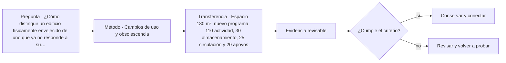

# ARQ-468 · Cambios de uso y obsolescencia

**Parte 47 · Clase desarrollada · Incorporada en v0.26.0.**

Prerrequisitos conceptuales: ARQ-467. Sin calendario. Casos, cantidades y resultados son ficticios salvo antecedentes expresamente atribuidos. Material educativo: no constituye diagnóstico pericial, proyecto ejecutable, autorización, certificación ni habilitación profesional. Revisión externa especializada pendiente.

## Pregunta central

¿Cómo distinguir un edificio físicamente envejecido de uno que ya no responde a su servicio, y cómo adaptar sin confundir superficie disponible con capacidad funcional?

## Resultado y continuidad

ARQ-468 continúa desde ARQ-467; cualquier caso o parámetro nuevo se identifica expresamente y no modifica retrospectivamente la clase anterior. Elaborarás un registro trazable, resolverás un caso reproducible, formularás una práctica distinta y cerrarás separando dato, inferencia, requisito, decisión y pendiente.

Durante la operación, un edificio cambia por uso, mantenimiento, sustituciones y fallas. La evidencia debe conservar fecha, estado y configuración. Un buen sistema de gestión no persigue datos por acumulación: mantiene la información necesaria para sostener servicios, investigar incidencias y aprender de la experiencia.

## 1. Obsolescencia tiene varias dimensiones

Puede ser funcional, técnica, regulatoria, informacional o económica. Un componente puede funcionar y no tener repuestos; un espacio puede estar intacto y no soportar la actividad nueva. Definir la dimensión evita reemplazar por reflejo.

## 2. Cambio de uso como nuevo encargo

El nuevo uso requiere reconstruir programa, cargas, accesibilidad, instalaciones, incendio, operación y autorizaciones. La condición existente se estudia como punto de partida, no como garantía de compatibilidad.

## 3. Adaptabilidad y reversibilidad

Una intervención adaptable permite cambios futuros sin pérdida desproporcionada de material o servicio. ISO 20887 se usa como marco de preguntas sobre desmontaje y adaptabilidad, no como receta de tabiques móviles.

## 4. Vida restante e incertidumbre

La vida útil remanente no se obtiene restando edad cronológica de una cifra genérica. Necesita condición, exposición, mantenimiento y definición de servicio. La planificación de vida útil organiza esas preguntas sin prometer una fecha exacta.

## 5. Caso trabajado

Caso **OPS-OBS-01**: un espacio de 240 m² funcionaba como archivo y se estudia como taller comunitario. El área total “cabe”, pero el taller exige 160 m² de actividad, 40 de almacenamiento seguro, 24 de circulación específica y 30 de apoyos: 254 m². La suma revela 14 m² de déficit antes de revisar estructura, ventilación o accesibilidad. “Hay 240 m² disponibles” no equivale a “el nuevo uso cabe”.

## 6. Profundización: operación como sistema de aprendizaje

Operar un edificio significa comparar el **estado esperado** con el **estado observado** y decidir qué hacer con la diferencia. Eso exige datos con fecha y contexto, responsables capaces de actuar y una ruta de escalamiento. Un indicador sin capacidad de respuesta puede producir tableros muy completos y edificios mal mantenidos.

La operación también devuelve conocimiento al diseño. Una incidencia repetida puede revelar un detalle difícil de mantener; una modificación de uso puede volver insuficiente una reserva; una encuesta puede mostrar una barrera que el plano no anticipó. La retroalimentación debe llegar a estándares, especificaciones y futuros proyectos, no quedar archivada como anécdota.

## 7. Interfaces profesionales y control de cambios

Las decisiones de esta clase cruzan disciplinas y etapas. Cada registro debe identificar **objeto, ubicación, fuente, fecha o versión, responsable de producir evidencia, responsable de revisarla y condición de cierre**. Una modificación no obliga a repetir todo el proyecto, pero sí a rastrear qué afirmaciones dependían del dato que cambió.

Cuando una evidencia pertenece a otra jurisdicción, producto, material o edificio, se conserva como referencia conceptual y no como resultado del caso. La aceptación del cliente, la presencia de un archivo o una cifra aritméticamente correcta tampoco sustituyen la comprobación técnica o administrativa que corresponda.

## 8. Errores frecuentes y comprobaciones de calidad

Evita convertir **ausencia de evidencia en evidencia de ausencia**, promediar estados que necesitan conservarse por separado, compensar una condición necesaria con un buen puntaje en otro criterio, o eliminar un resultado desfavorable porque complica la narrativa. También evita citar una norma o guía sin registrar su edición, jurisdicción y alcance de consulta.

Una entrega robusta permite repetir las cuentas y localizar la procedencia de cada afirmación. Si una cifra cambia al modificar una hipótesis, la sensibilidad se documenta; no se inventa una probabilidad. Si el modelo deja fuera un fenómeno relevante, se indica qué conclusión sigue siendo válida y cuál debe reabrirse.

*Figura 468. Esquema didáctico de relaciones y estados. No representa una obra, diagnóstico, autorización ni certificación real.*

## 9. Práctica independiente

Espacio 180 m²; nuevo programa: 110 actividad, 30 almacenamiento, 25 circulación y 20 apoyos. Calcula déficit y propone dos preguntas antes de ampliar o reducir programa.

10. Solución razonada

Total requerido=185 m²; déficit=5. Deben revisarse simultaneidad, posibilidad de compartir funciones, condiciones de seguridad y alternativas espaciales. No se elimina circulación o apoyo para forzar la suma.

La solución corresponde solo al modelo declarado. En un proyecto real se deben confirmar legislación, permisos, condiciones del sitio, productos, ensayos, contratos, competencias profesionales, participación y responsabilidades aplicables.

## 11. Autoevaluación y transferencia

Puedes avanzar cuando eres capaz de reconstruir el caso sin consultar la respuesta, explicar una conclusión que **sí** está respaldada y otra que **no**, y nombrar el documento, ensayo, participante o especialista que debería aportar la evidencia pendiente. La meta no es memorizar el número final, sino mantener coherencia entre pregunta, método, resultado y decisión.

La clase siguiente conserva el método, no las cifras, salvo cuando el texto declara explícitamente un caso continuo.

<!-- pedagogia-2026:inicio -->
## Mapa visual de aprendizaje

El diagrama representa el ciclo de aprendizaje de esta clase, no una secuencia de obra ni un procedimiento profesional.

## Resultado observable, evidencia y evaluación

**Tipo de clase:** profesional y de coordinación.

**Evidencia mínima:** registro de decisión con alcance, interfaces, versiones, responsables, evidencia y condición de cierre.

**Archivo sugerido:** `evidence/ARQ-468/evidencia.md`.

| Criterio | Evidencia observable |
|---|---|
| Precisión y representación · 20 % | Los conceptos, unidades y convenciones se usan de forma coherente y pueden ser reconstruidos por otra persona. |
| Evidencia y trazabilidad · 25 % | Cada afirmación importante se vincula con dato, cálculo, observación o fuente; hipótesis y desconocidos permanecen visibles. |
| Decisión y alternativas · 25 % | La decisión responde a la pregunta, compara al menos una alternativa y declara qué condición la haría cambiar. |
| Integración y ciclo de vida · 20 % | Se identifica una interfaz y una consecuencia para construcción, uso, mantenimiento, adaptación o fin de vida. |
| Comunicación, ética y límites · 10 % | El alcance se entiende sin explicación oral adicional y no se atribuyen permisos, competencias o certezas inexistentes. |

**Criterio de aceptación:** 80/100 y ningún criterio bajo 60 %. Una entrega genérica que podría reutilizarse sin cambios en otra clase no demuestra dominio. Si existe una condición crítica de seguridad, accesibilidad, evidencia o responsabilidad sin resolver, la entrega permanece pendiente aunque el promedio supere 80.

### Errores diagnósticos

En esta clase conviene vigilar especialmente: confundir coordinación con aprobación; perder versión o responsable; cerrar un pendiente sin evidencia.

## Autoevaluación, recuperación y continuidad

Antes de avanzar, responde sin consultar la solución:

1. ¿Qué decisión concreta puedes tomar ahora que no podías justificar antes?
2. ¿Qué evidencia de tu entrega es comprobada y cuál continúa siendo una hipótesis?
3. ¿Qué cambio de contexto invalidaría la transferencia realizada?

Revisa la entrega a las 24–48 horas y nuevamente al cerrar la parte. Conserva la primera versión, la crítica recibida y la versión revisada: el aprendizaje se demuestra también mediante el cambio entre versiones.
<!-- pedagogia-2026:fin -->

## Fuentes y alcance de uso

### [[ISO-20887]](#FUENTE-ISO-20887) ISO 20887:2020 — Design for disassembly and adaptability — Principles, requirements and guidance

International Organization for Standardization. [https://www.iso.org/standard/69370.html](https://www.iso.org/standard/69370.html)

**Consulta:** Ficha pública de catálogo y resumen; edición 2020, confirmación indicada en 2025. **Apoyo:** Marco de diseño para desmontaje y adaptabilidad en edificios y obras civiles. **Límite:** No se leyó el texto normativo completo. La ficha no fija niveles específicos de desempeño y no equivale a certificación del caso.

### [[ISO-15686-1]](#FUENTE-ISO-15686-1) ISO 15686-1:2011 — Service life planning — General principles and framework

International Organization for Standardization. [https://www.iso.org/standard/45798.html](https://www.iso.org/standard/45798.html)

**Consulta:** Ficha pública; edición 2011 confirmada en 2020, con reemplazo en desarrollo. **Apoyo:** Planificación de vida útil durante el ciclo de vida y vida restante de edificios existentes. **Límite:** No se extraen factores de vida útil ni se predice durabilidad de componentes reales.

### [[ISO-41001]](#FUENTE-ISO-41001) ISO 41001:2018 — Facility management — Management systems — Requirements with guidance for use

International Organization for Standardization. [https://www.iso.org/standard/68021.html](https://www.iso.org/standard/68021.html)

**Consulta:** Ficha pública; edición 2018 publicada, con enmienda climática 2024 y revisión en desarrollo. **Apoyo:** Relacionar facility management, objetivos de la organización, necesidades de partes interesadas y mejora sistemática. **Límite:** No se leyó el texto íntegro ni se afirma certificación o cumplimiento del sistema de gestión.
