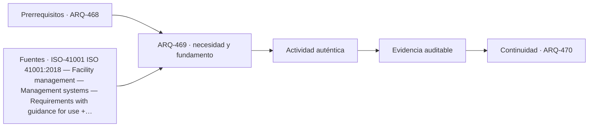

# ARQ-469 · Gestión de instalaciones y continuidad

**Parte 47 · Clase desarrollada · Incorporada en v0.26.0.**

Prerrequisitos conceptuales: ARQ-468. Sin calendario. Casos, cantidades y resultados son ficticios salvo antecedentes expresamente atribuidos. Material educativo: no constituye diagnóstico pericial, proyecto ejecutable, autorización, certificación ni habilitación profesional. Revisión externa especializada pendiente.

## Pregunta central

¿Cómo gestionar servicios interdependientes para que disponibilidad de componentes no se confunda con continuidad de la función completa?

## Resultado y continuidad

ARQ-469 continúa desde ARQ-468; cualquier caso o parámetro nuevo se identifica expresamente y no modifica retrospectivamente la clase anterior. Elaborarás un registro trazable, resolverás un caso reproducible, formularás una práctica distinta y cerrarás separando dato, inferencia, requisito, decisión y pendiente.

Durante la operación, un edificio cambia por uso, mantenimiento, sustituciones y fallas. La evidencia debe conservar fecha, estado y configuración. Un buen sistema de gestión no persigue datos por acumulación: mantiene la información necesaria para sostener servicios, investigar incidencias y aprender de la experiencia.

## 1. Servicio frente a activo

El objetivo operativo es una función: iluminar, ventilar, abastecer, comunicar. Varios activos pueden cooperar o respaldarse. La gestión necesita saber qué servicio depende de qué componentes y qué estados degradados siguen siendo aceptables.

## 2. Disponibilidad y solapamiento

Sumar horas de falla de varios componentes puede contar dos veces intervalos simultáneos. Para una función con redundancia, una falla individual puede no producir interrupción; para una dependencia en serie, sí. El cálculo necesita topología.

## 3. Prioridad de recuperación

La criticidad orienta qué restaurar primero, pero depende de usuarios, horarios y consecuencias. No se fija una prioridad universal desde el curso. El plan debe ser acordado por la organización y revisado cuando cambian servicios.

## 4. Información operativa

ISO 19650-3 ayuda a situar gestión de información en fase operativa. La información debe poder actualizarse cuando cambian activos, no permanecer como fotografía congelada de la entrega.

## 5. Caso trabajado

Caso **OPS-CONT-01** observa una semana de 168 h. El servicio S depende de A y B en serie. A está indisponible 5 h; B, 6 h; 2 h se superponen. La interrupción del servicio por estas dos causas es la unión: 5+6−2=9 h, no 11. Disponibilidad dentro del ejercicio: 159/168=94,64 %. Si A y B fueran redundantes en paralelo, la lógica cambiaría y la interrupción común sería solo el solapamiento bajo supuestos adicionales.

## 6. Profundización: operación como sistema de aprendizaje

Operar un edificio significa comparar el **estado esperado** con el **estado observado** y decidir qué hacer con la diferencia. Eso exige datos con fecha y contexto, responsables capaces de actuar y una ruta de escalamiento. Un indicador sin capacidad de respuesta puede producir tableros muy completos y edificios mal mantenidos.

La operación también devuelve conocimiento al diseño. Una incidencia repetida puede revelar un detalle difícil de mantener; una modificación de uso puede volver insuficiente una reserva; una encuesta puede mostrar una barrera que el plano no anticipó. La retroalimentación debe llegar a estándares, especificaciones y futuros proyectos, no quedar archivada como anécdota.

## 7. Interfaces profesionales y control de cambios

Las decisiones de esta clase cruzan disciplinas y etapas. Cada registro debe identificar **objeto, ubicación, fuente, fecha o versión, responsable de producir evidencia, responsable de revisarla y condición de cierre**. Una modificación no obliga a repetir todo el proyecto, pero sí a rastrear qué afirmaciones dependían del dato que cambió.

Cuando una evidencia pertenece a otra jurisdicción, producto, material o edificio, se conserva como referencia conceptual y no como resultado del caso. La aceptación del cliente, la presencia de un archivo o una cifra aritméticamente correcta tampoco sustituyen la comprobación técnica o administrativa que corresponda.

## 8. Errores frecuentes y comprobaciones de calidad

Evita convertir **ausencia de evidencia en evidencia de ausencia**, promediar estados que necesitan conservarse por separado, compensar una condición necesaria con un buen puntaje en otro criterio, o eliminar un resultado desfavorable porque complica la narrativa. También evita citar una norma o guía sin registrar su edición, jurisdicción y alcance de consulta.

Una entrega robusta permite repetir las cuentas y localizar la procedencia de cada afirmación. Si una cifra cambia al modificar una hipótesis, la sensibilidad se documenta; no se inventa una probabilidad. Si el modelo deja fuera un fenómeno relevante, se indica qué conclusión sigue siendo válida y cuál debe reabrirse.

*Figura 469. Esquema didáctico de relaciones y estados. No representa una obra, diagnóstico, autorización ni certificación real.*

## 9. Práctica independiente

En 100 h, A falla 8 h, B 7 h y se superponen 3. Calcula interrupción de un servicio que necesita ambos en serie. Explica por qué no puedes reutilizar el resultado si los componentes son redundantes.

10. Solución razonada

Unión de indisponibilidades=8+7−3=12 h; disponibilidad=88 %. Con redundancia, la función podría fallar solo cuando ambos estén indisponibles, si no existen dependencias comunes. La arquitectura de servicio debe declararse.

La solución corresponde solo al modelo declarado. En un proyecto real se deben confirmar legislación, permisos, condiciones del sitio, productos, ensayos, contratos, competencias profesionales, participación y responsabilidades aplicables.

## 11. Autoevaluación y transferencia

Puedes avanzar cuando eres capaz de reconstruir el caso sin consultar la respuesta, explicar una conclusión que **sí** está respaldada y otra que **no**, y nombrar el documento, ensayo, participante o especialista que debería aportar la evidencia pendiente. La meta no es memorizar el número final, sino mantener coherencia entre pregunta, método, resultado y decisión.

La clase siguiente conserva el método, no las cifras, salvo cuando el texto declara explícitamente un caso continuo.

<!-- pedagogia-2026:inicio -->
## Decisión pedagógica y posición curricular

### Por qué existe

Esta clase existe para resolver una necesidad concreta del recorrido: ¿Cómo gestionar servicios interdependientes para que disponibilidad de componentes no se confunda con continuidad de la función completa?

### Por qué está exactamente aquí

Ocupa el lugar 9 de la Parte 47. Se estudia después de ARQ-468 · Cambios de uso y obsolescencia porque usa esa base para responder «¿Cómo gestionar servicios interdependientes para que disponibilidad de componentes no se confunda con continuidad de la función completa?». Se ubica antes de ARQ-470 · Evaluación posocupacional y retroalimentación al diseño porque la evidencia producida aquí debe estar disponible para ese paso.

- **Prerrequisitos:** `ARQ-468`
- **Capacidad que introduce:** ARQ-469 continúa desde ARQ-468; cualquier caso o parámetro nuevo se identifica expresamente y no modifica retrospectivamente la clase anterior. Elaborarás un registro trazable, resolverás un caso reproducible, formularás una práctica distinta y cerrarás separando dato, inferencia, requisito, decisión y pendiente. Durante la operación, un edificio cambia por uso, mantenimiento, sustituciones y fallas.
- **Clases o experiencias que dependen de ella:** `ARQ-470`

El diagrama permite comprobar una relación que el texto lineal oculta con facilidad: esta clase recibe capacidades previas, toma decisiones apoyadas por fuentes, exige una experiencia y produce evidencia que habilita trabajo posterior. No representa un procedimiento de obra.

## Resultado observable, evidencia y evaluación

1. Identificar y delimitar las condiciones necesarias para responder la pregunta central de gestión de instalaciones y continuidad.
2. Producir y comprobar la evidencia declarada por la clase: ARQ-469 continúa desde ARQ-468; cualquier caso o parámetro nuevo se identifica expresamente y no modifica retrospectivamente la clase anterior. Elaborarás un registro trazable, resolverás un caso reproducible, formularás una práctica distinta y cerrarás separando dato, inferencia, requisito, decisión y pendiente. Durante la operación, un edificio cambia por uso, mantenimiento, sustituciones y fallas.
3. Justificar una decisión de gestión de instalaciones y continuidad mediante fuentes, supuestos, alternativas y límites explícitos.

## Actividad, evidencia y criterio de aceptación

**Actividad:** En 100 h, A falla 8 h, B 7 h y se superponen 3. Calcula interrupción de un servicio que necesita ambos en serie. Explica por qué no puedes reutilizar el resultado si los componentes son redundantes.

**Evidencia mínima:** ARQ-469 continúa desde ARQ-468; cualquier caso o parámetro nuevo se identifica expresamente y no modifica retrospectivamente la clase anterior. Elaborarás un registro trazable, resolverás un caso reproducible, formularás una práctica distinta y cerrarás separando dato, inferencia, requisito, decisión y pendiente. Durante la operación, un edificio cambia por uso, mantenimiento, sustituciones y fallas.

**Archivo sugerido:** `evidence/ARQ-469/evidencia.md`.

**Criterio de aceptación:** la entrega se acepta cuando:

- La entrega responde explícitamente a la pregunta: ¿Cómo gestionar servicios interdependientes para que disponibilidad de componentes no se confunda con continuidad de la función completa?
- La actividad conserva las fronteras del caso y permite reconstruir el procedimiento: En 100 h, A falla 8 h, B 7 h y se superponen 3. Calcula interrupción de un servicio que necesita ambos en serie. Explica por qué no puedes reutilizar el resultado si los componentes son redundantes.
- Cada afirmación externa puede seguirse hasta una fuente, su alcance consultado y su límite.
- La evidencia deja disponible una entrada comprobable para ARQ-470.
- Evita convertir ausencia de evidencia en evidencia de ausencia , promediar estados que necesitan conservarse por separado, compensar una condición necesaria con un buen puntaje en otro criterio, o eliminar un resultado desfavorable porque complica la narrativa. También evita citar una norma o guía sin registrar su edición, jurisdicción y alcance de consulta.

La [rúbrica común](../../docs/RUBRICA_COMUN.md) complementa estos criterios; no los reemplaza. Una entrega puede superar un promedio y continuar pendiente si oculta una condición crítica.

## Trazabilidad de las decisiones

| # | Decisión o fundamento | Fuente utilizada | Aplicación y límite en esta clase |
|---:|---|---|---|
| 1 | Relacionar facility management, objetivos de la organización, necesidades de partes interesadas y mejora sistemática. | [ISO-41001 ISO 41001:2018 — Facility management — Management systems —…](https://www.iso.org/standard/68021.html) | Consulta: Ficha pública; edición 2018 publicada, con enmienda climática 2024 y revisión en desarrollo. Límite: No se leyó el texto íntegro ni se afirma certificación o cumplimiento del sistema de gestión. |
| 2 | Gestión sistemática de activos y equilibrio entre desempeño, riesgo y gasto a lo largo del ciclo de vida. | [ISO-55001-2024 ISO 55001:2024 — Asset management — Asset management…](https://www.iso.org/standard/83054.html) | Consulta: Ficha pública; edición 2 publicada en julio de 2024. Límite: No se implementa ni certifica un sistema de gestión de activos; los criterios de criticidad del curso son didácticos. |
| 3 | Gestión de información durante la fase operativa de los activos y sus intercambios. | [ISO-19650-3 ISO 19650-3:2020 — Information management using BIM —…](https://www.iso.org/standard/75109.html) | Consulta: Ficha pública; edición 2020 confirmada en 2024. Límite: No se leyó el texto íntegro ni se prescribe un CDE o esquema contractual concreto. |

La tabla permite auditar las relaciones; la explicación, el caso y la práctica de la clase siguen siendo la documentación principal.

## Autoevaluación, recuperación y continuidad

### Errores diagnósticos

Antes de avanzar, comprueba si puedes reconstruir cada resultado sin mirar la solución, señalar qué evidencia lo sostiene y nombrar una condición que obligaría a revisar tu decisión. Conserva la primera versión, la objeción recibida y la revisión.

**Conexión siguiente:** La continuidad inmediata es ARQ-470 · Evaluación posocupacional y retroalimentación al diseño; conserva el método y vuelve a verificar datos y límites.
<!-- pedagogia-2026:fin -->

## Fuentes y alcance de uso

### [[ISO-41001]](#FUENTE-ISO-41001) ISO 41001:2018 — Facility management — Management systems — Requirements with guidance for use

International Organization for Standardization. [https://www.iso.org/standard/68021.html](https://www.iso.org/standard/68021.html)

**Consulta:** Ficha pública; edición 2018 publicada, con enmienda climática 2024 y revisión en desarrollo. **Apoyo:** Relacionar facility management, objetivos de la organización, necesidades de partes interesadas y mejora sistemática. **Límite:** No se leyó el texto íntegro ni se afirma certificación o cumplimiento del sistema de gestión.

### [[ISO-55001-2024]](#FUENTE-ISO-55001-2024) ISO 55001:2024 — Asset management — Asset management system — Requirements

International Organization for Standardization. [https://www.iso.org/standard/83054.html](https://www.iso.org/standard/83054.html)

**Consulta:** Ficha pública; edición 2 publicada en julio de 2024. **Apoyo:** Gestión sistemática de activos y equilibrio entre desempeño, riesgo y gasto a lo largo del ciclo de vida. **Límite:** No se implementa ni certifica un sistema de gestión de activos; los criterios de criticidad del curso son didácticos.

### [[ISO-19650-3]](#FUENTE-ISO-19650-3) ISO 19650-3:2020 — Information management using BIM — Operational phase of assets

International Organization for Standardization. [https://www.iso.org/standard/75109.html](https://www.iso.org/standard/75109.html)

**Consulta:** Ficha pública; edición 2020 confirmada en 2024. **Apoyo:** Gestión de información durante la fase operativa de los activos y sus intercambios. **Límite:** No se leyó el texto íntegro ni se prescribe un CDE o esquema contractual concreto.
