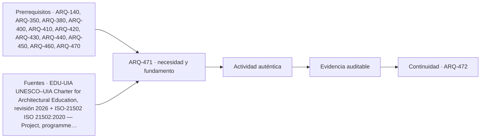

# ARQ-471 · Encargo integrador y organización interdisciplinaria

**Parte 48 · Clase desarrollada · Incorporada en v0.26.0.**

Prerrequisitos conceptuales: ARQ-140, ARQ-350, ARQ-380, ARQ-400, ARQ-410, ARQ-420, ARQ-430, ARQ-440, ARQ-450, ARQ-460, ARQ-470. Sin calendario. Casos, cantidades y resultados son ficticios salvo antecedentes expresamente atribuidos. Material educativo: no constituye diagnóstico pericial, proyecto ejecutable, autorización, certificación ni habilitación profesional. Revisión externa especializada pendiente.

## Pregunta central

¿Cómo iniciar un proyecto integral sin convertir la complejidad del programa en una lista de especialidades desconectadas?

## Resultado y continuidad

ARQ-471 abre un tramo nuevo dentro de la Parte 48 y recibe métodos previos sin heredar cifras. Elaborarás un registro trazable, resolverás un caso reproducible, formularás una práctica distinta y cerrarás separando dato, inferencia, requisito, decisión y pendiente.

El taller final integra métodos, no resultados numéricos de otros casos. El proyecto ficticio se usa para practicar coordinación y defensa crítica. Ninguna cuenta se presenta como cálculo firmado, ninguna referencia sustituye permisos y ningún resultado de clase otorga atribuciones profesionales.

## 1. Caso integrador nuevo

La Parte 48 abre **INT-BASE-01**, un caso ficticio independiente: edificio existente de 1.350 m² en un sitio de 2.700 m² que se estudia como centro comunitario de aprendizaje, talleres y servicios. No es ninguno de los casos previos. Su condición estructural, patrimonial, ambiental y legal permanece por investigar.

## 2. Encargo y problema

El cliente pide “recuperar el edificio y abrirlo pronto”. El equipo transforma esa frase en necesidades, funciones, restricciones y preguntas. Aún no se decide conservar todo, demoler o ampliar. El encargo debe dejar espacio para descubrir que otra estrategia sea más adecuada.

## 3. Roles y autoridad

Arquitectura coordina relaciones, pero no absorbe competencias de geotecnia, estructura, instalaciones, patrimonio, costos o autoridades. Una matriz de responsabilidades distingue quién produce, quién revisa, quién consulta y quién decide dentro del encargo.

## 4. Interfaces desde el inicio

Las interfaces críticas se registran temprano: existente–nuevo, estructura–instalaciones, patrimonio–accesibilidad, operación–mantenimiento, sitio–riesgo. No se espera al detalle para descubrir que dos disciplinas asumieron geometrías incompatibles.

## 5. Caso trabajado

Caso **INT-ORG-01**. El equipo identifica 12 decisiones iniciales. Cuatro dependen de información del sitio, tres del edificio existente, dos de operación y tres de requisitos externos. Ninguna puede cerrarse solo con un render. La matriz asigna un responsable de producción y uno de revisión por decisión; si una misma persona ocupa varios roles, se conserva la distinción de funciones. El producto de la clase es un mapa de dependencias, no un organigrama decorativo.

## 6. Profundización: integrar sin borrar fronteras

El taller integral exige que cada disciplina mantenga su **unidad, método, versión y autoridad**. La integración ocurre en las interfaces: una decisión espacial afecta estructura, instalaciones, costo, operación y experiencia; cada efecto se comprueba con la herramienta adecuada. No se fusionan indicadores incompatibles para producir una apariencia de síntesis.

La calidad de la defensa se reconoce cuando otra persona puede reconstruir el camino desde necesidad hasta decisión, identificar qué alternativas se estudiaron y entender qué información todavía falta. El proyecto final no necesita fingir certeza total; necesita demostrar que las incertidumbres relevantes están controladas y que existe un siguiente paso responsable.

## 7. Interfaces profesionales y control de cambios

Las decisiones de esta clase cruzan disciplinas y etapas. Cada registro debe identificar **objeto, ubicación, fuente, fecha o versión, responsable de producir evidencia, responsable de revisarla y condición de cierre**. Una modificación no obliga a repetir todo el proyecto, pero sí a rastrear qué afirmaciones dependían del dato que cambió.

Cuando una evidencia pertenece a otra jurisdicción, producto, material o edificio, se conserva como referencia conceptual y no como resultado del caso. La aceptación del cliente, la presencia de un archivo o una cifra aritméticamente correcta tampoco sustituyen la comprobación técnica o administrativa que corresponda.

## 8. Errores frecuentes y comprobaciones de calidad

Evita convertir **ausencia de evidencia en evidencia de ausencia**, promediar estados que necesitan conservarse por separado, compensar una condición necesaria con un buen puntaje en otro criterio, o eliminar un resultado desfavorable porque complica la narrativa. También evita citar una norma o guía sin registrar su edición, jurisdicción y alcance de consulta.

Una entrega robusta permite repetir las cuentas y localizar la procedencia de cada afirmación. Si una cifra cambia al modificar una hipótesis, la sensibilidad se documenta; no se inventa una probabilidad. Si el modelo deja fuera un fenómeno relevante, se indica qué conclusión sigue siendo válida y cuál debe reabrirse.

*Figura 471. Esquema didáctico de relaciones y estados. No representa una obra, diagnóstico, autorización ni certificación real.*

## 9. Práctica independiente

Para un proyecto ficticio de reutilización, lista diez decisiones y clasifícalas por sitio, edificio, usuarios, normativa y operación. Asigna productor, revisor y decisión pendiente.

10. Solución razonada

Una buena respuesta evita que “arquitecto” aparezca como productor y aprobador universal. Las decisiones se distribuyen según competencia y contrato. Si falta autoridad o evidencia, el estado es pendiente.

La solución corresponde solo al modelo declarado. En un proyecto real se deben confirmar legislación, permisos, condiciones del sitio, productos, ensayos, contratos, competencias profesionales, participación y responsabilidades aplicables.

## 11. Autoevaluación y transferencia

Puedes avanzar cuando eres capaz de reconstruir el caso sin consultar la respuesta, explicar una conclusión que **sí** está respaldada y otra que **no**, y nombrar el documento, ensayo, participante o especialista que debería aportar la evidencia pendiente. La meta no es memorizar el número final, sino mantener coherencia entre pregunta, método, resultado y decisión.

La clase siguiente conserva el método, no las cifras, salvo cuando el texto declara explícitamente un caso continuo.

<!-- pedagogia-2026:inicio -->
## Decisión pedagógica y posición curricular

### Por qué existe

Esta clase existe para resolver una necesidad concreta del recorrido: ¿Cómo iniciar un proyecto integral sin convertir la complejidad del programa en una lista de especialidades desconectadas?

### Por qué está exactamente aquí

Abre la Parte 48 porque plantea primero el problema «¿Cómo iniciar un proyecto integral sin convertir la complejidad del programa en una lista de especialidades desconectadas?». La transición desde ARQ-470 · Evaluación posocupacional y retroalimentación al diseño conserva métodos de evidencia y límites, pero no traslada parámetros del bloque anterior. Establece la pregunta y el producto base que ARQ-472 · Investigación de sitio y definición de necesidades desarrollará a continuación.

- **Prerrequisitos:** `ARQ-140`, `ARQ-350`, `ARQ-380`, `ARQ-400`, `ARQ-410`, `ARQ-420`, `ARQ-430`, `ARQ-440`, `ARQ-450`, `ARQ-460`, `ARQ-470`
- **Capacidad que introduce:** ARQ-471 abre un tramo nuevo dentro de la Parte 48 y recibe métodos previos sin heredar cifras. Elaborarás un registro trazable, resolverás un caso reproducible, formularás una práctica distinta y cerrarás separando dato, inferencia, requisito, decisión y pendiente. El taller final integra métodos, no resultados numéricos de otros casos.
- **Clases o experiencias que dependen de ella:** `ARQ-472`

El diagrama permite comprobar una relación que el texto lineal oculta con facilidad: esta clase recibe capacidades previas, toma decisiones apoyadas por fuentes, exige una experiencia y produce evidencia que habilita trabajo posterior. No representa un procedimiento de obra.

## Resultado observable, evidencia y evaluación

1. Identificar y delimitar las condiciones necesarias para responder la pregunta central de encargo integrador y organización interdisciplinaria.
2. Producir y comprobar la evidencia declarada por la clase: ARQ-471 abre un tramo nuevo dentro de la Parte 48 y recibe métodos previos sin heredar cifras. Elaborarás un registro trazable, resolverás un caso reproducible, formularás una práctica distinta y cerrarás separando dato, inferencia, requisito, decisión y pendiente. El taller final integra métodos, no resultados numéricos de otros casos.
3. Justificar una decisión de encargo integrador y organización interdisciplinaria mediante fuentes, supuestos, alternativas y límites explícitos.

## Actividad, evidencia y criterio de aceptación

**Actividad:** Para un proyecto ficticio de reutilización, lista diez decisiones y clasifícalas por sitio, edificio, usuarios, normativa y operación. Asigna productor, revisor y decisión pendiente.

**Evidencia mínima:** ARQ-471 abre un tramo nuevo dentro de la Parte 48 y recibe métodos previos sin heredar cifras. Elaborarás un registro trazable, resolverás un caso reproducible, formularás una práctica distinta y cerrarás separando dato, inferencia, requisito, decisión y pendiente. El taller final integra métodos, no resultados numéricos de otros casos.

**Archivo sugerido:** `evidence/ARQ-471/evidencia.md`.

**Criterio de aceptación:** la entrega se acepta cuando:

- La entrega responde explícitamente a la pregunta: ¿Cómo iniciar un proyecto integral sin convertir la complejidad del programa en una lista de especialidades desconectadas?
- La actividad conserva las fronteras del caso y permite reconstruir el procedimiento: Para un proyecto ficticio de reutilización, lista diez decisiones y clasifícalas por sitio, edificio, usuarios, normativa y operación. Asigna productor, revisor y decisión pendiente.
- Cada afirmación externa puede seguirse hasta una fuente, su alcance consultado y su límite.
- La evidencia deja disponible una entrada comprobable para ARQ-472.
- Evita convertir ausencia de evidencia en evidencia de ausencia , promediar estados que necesitan conservarse por separado, compensar una condición necesaria con un buen puntaje en otro criterio, o eliminar un resultado desfavorable porque complica la narrativa. También evita citar una norma o guía sin registrar su edición, jurisdicción y alcance de consulta.

La [rúbrica común](../../docs/RUBRICA_COMUN.md) complementa estos criterios; no los reemplaza. Una entrega puede superar un promedio y continuar pendiente si oculta una condición crítica.

## Trazabilidad de las decisiones

| # | Decisión o fundamento | Fuente utilizada | Aplicación y límite en esta clase |
|---:|---|---|---|
| 1 | Amplitud de la formación arquitectónica y uso de IA complementario al pensamiento de diseño | [EDU-UIA UNESCO–UIA Charter for Architectural Education, revisión 2026](https://www.uia-architectes.org/en/news/unesco-uia-charter-for-architectural-education-revised-edition-2026/) | Consulta: Noticia oficial y alcance de la revisión Límite: No se revisó aquí el texto integral de la Carta ni se obtuvo validación o acreditación del programa. |
| 2 | Marco de gestión de proyectos y relación entre prácticas, ciclo de vida y entregables. | [ISO-21502 ISO 21502:2020 — Project, programme and portfolio management…](https://www.iso.org/standard/74947.html) | Consulta: Ficha pública; edición 1 publicada 2020-12, actualmente en revisión sistemática. Límite: No se leyó íntegramente la norma; no se reproducen procesos ni se presenta como contrato o metodología obligatoria. |
| 3 | Línea base, trazabilidad y análisis del impacto de cambios | [Organismo: National Aeronautics and Space Administration. Consulta:…](https://www.nasa.gov/reference/6-0-crosscutting-technical-management/) | Consulta: Apartados 6.2 y 6.5 sobre requisitos y configuración Límite: Los formularios y el caso arquitectónico son originales; no se copian procedimientos contractuales. |

La tabla permite auditar las relaciones; la explicación, el caso y la práctica de la clase siguen siendo la documentación principal.

## Autoevaluación, recuperación y continuidad

### Errores diagnósticos

Antes de avanzar, comprueba si puedes reconstruir cada resultado sin mirar la solución, señalar qué evidencia lo sostiene y nombrar una condición que obligaría a revisar tu decisión. Conserva la primera versión, la objeción recibida y la revisión.

**Conexión siguiente:** La continuidad inmediata es ARQ-472 · Investigación de sitio y definición de necesidades; conserva el método y vuelve a verificar datos y límites.
<!-- pedagogia-2026:fin -->

## Fuentes y alcance de uso

### [[EDU-UIA]](#FUENTE-EDU-UIA) UNESCO–UIA Charter for Architectural Education, revisión 2026

Unión Internacional de Arquitectos. [https://www.uia-architectes.org/en/news/unesco-uia-charter-for-architectural-education-revised-edition-2026/](https://www.uia-architectes.org/en/news/unesco-uia-charter-for-architectural-education-revised-edition-2026/)

**Consulta:** Noticia oficial y alcance de la revisión **Apoyo:** Amplitud de la formación arquitectónica y uso de IA complementario al pensamiento de diseño **Límite:** No se revisó aquí el texto integral de la Carta ni se obtuvo validación o acreditación del programa.

### [[ISO-21502]](#FUENTE-ISO-21502) ISO 21502:2020 — Project, programme and portfolio management — Guidance on project management

ISO. [https://www.iso.org/standard/74947.html](https://www.iso.org/standard/74947.html)

**Consulta:** Ficha pública; edición 1 publicada 2020-12, actualmente en revisión sistemática. **Apoyo:** Marco de gestión de proyectos y relación entre prácticas, ciclo de vida y entregables. **Límite:** No se leyó íntegramente la norma; no se reproducen procesos ni se presenta como contrato o metodología obligatoria.

### [[NASA-CHANGE]](#FUENTE-NASA-CHANGE) NASA Systems Engineering Handbook, 6.0: Crosscutting Technical Management

National Aeronautics and Space Administration. [https://www.nasa.gov/reference/6-0-crosscutting-technical-management/](https://www.nasa.gov/reference/6-0-crosscutting-technical-management/)

**Consulta:** Apartados 6.2 y 6.5 sobre requisitos y configuración **Apoyo:** Línea base, trazabilidad y análisis del impacto de cambios **Límite:** Los formularios y el caso arquitectónico son originales; no se copian procedimientos contractuales.
