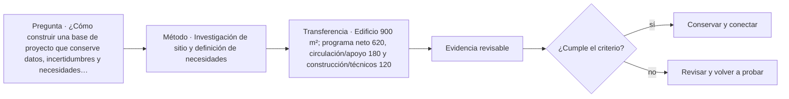

# ARQ-472 · Investigación de sitio y definición de necesidades

**Parte 48 · Clase desarrollada · Incorporada en v0.26.0.**

Prerrequisitos conceptuales: ARQ-471. Sin calendario. Casos, cantidades y resultados son ficticios salvo antecedentes expresamente atribuidos. Material educativo: no constituye diagnóstico pericial, proyecto ejecutable, autorización, certificación ni habilitación profesional. Revisión externa especializada pendiente.

## Pregunta central

¿Cómo construir una base de proyecto que conserve datos, incertidumbres y necesidades antes de generar alternativas?

## Resultado y continuidad

ARQ-472 continúa desde ARQ-471; cualquier caso o parámetro nuevo se identifica expresamente y no modifica retrospectivamente la clase anterior. Elaborarás un registro trazable, resolverás un caso reproducible, formularás una práctica distinta y cerrarás separando dato, inferencia, requisito, decisión y pendiente.

El taller final integra métodos, no resultados numéricos de otros casos. El proyecto ficticio se usa para practicar coordinación y defensa crítica. Ninguna cuenta se presenta como cálculo firmado, ninguna referencia sustituye permisos y ningún resultado de clase otorga atribuciones profesionales.

## 1. Base territorial

INT-BASE-01 necesita límites, topografía, accesos, servicios, amenazas, clima y contexto urbano. Un mapa público orienta; no sustituye levantamiento o certificado aplicable. Cada capa registra fecha, resolución y alcance.

## 2. Edificio existente

Se requieren geometría, materiales, modificaciones, estructura, instalaciones y condición. El levantamiento identifica lo observado y lo oculto. No se llenan huecos con valores de otros edificios.

## 3. Necesidades y usuarios

Las actividades se estudian con usuarios y operadores: talleres ruidosos, lectura, atención reservada, reuniones, almacenamiento, limpieza y mantenimiento. La demanda espacial surge de tareas y simultaneidad, no de copiar un programa genérico.

## 4. Puntos de detención

Ciertas decisiones no deben cerrarse antes de obtener información: estabilidad de elementos dañados, presencia de materiales peligrosos o restricciones legales. El expediente debe hacer visibles esos puntos, no enterrarlos en notas.

## 5. Caso trabajado

Caso **INT-INV-01**. El sitio tiene 2.700 m² y el edificio 1.350 m² de huella/pisos existentes. El programa preliminar suma 900 m² netos de actividades, 250 de circulación/apoyos y 200 de construcción/técnicos: 1.350. La suma cabe exactamente, pero deja cero reserva para ajustes. La investigación identifica además un patio exterior de 1.350 m², sin asumir que sea edificable. El caso demuestra que cerrar el área no cierra el proyecto.

## 6. Profundización: integrar sin borrar fronteras

El taller integral exige que cada disciplina mantenga su **unidad, método, versión y autoridad**. La integración ocurre en las interfaces: una decisión espacial afecta estructura, instalaciones, costo, operación y experiencia; cada efecto se comprueba con la herramienta adecuada. No se fusionan indicadores incompatibles para producir una apariencia de síntesis.

La calidad de la defensa se reconoce cuando otra persona puede reconstruir el camino desde necesidad hasta decisión, identificar qué alternativas se estudiaron y entender qué información todavía falta. El proyecto final no necesita fingir certeza total; necesita demostrar que las incertidumbres relevantes están controladas y que existe un siguiente paso responsable.

## 7. Interfaces profesionales y control de cambios

Las decisiones de esta clase cruzan disciplinas y etapas. Cada registro debe identificar **objeto, ubicación, fuente, fecha o versión, responsable de producir evidencia, responsable de revisarla y condición de cierre**. Una modificación no obliga a repetir todo el proyecto, pero sí a rastrear qué afirmaciones dependían del dato que cambió.

Cuando una evidencia pertenece a otra jurisdicción, producto, material o edificio, se conserva como referencia conceptual y no como resultado del caso. La aceptación del cliente, la presencia de un archivo o una cifra aritméticamente correcta tampoco sustituyen la comprobación técnica o administrativa que corresponda.

## 8. Errores frecuentes y comprobaciones de calidad

Evita convertir **ausencia de evidencia en evidencia de ausencia**, promediar estados que necesitan conservarse por separado, compensar una condición necesaria con un buen puntaje en otro criterio, o eliminar un resultado desfavorable porque complica la narrativa. También evita citar una norma o guía sin registrar su edición, jurisdicción y alcance de consulta.

Una entrega robusta permite repetir las cuentas y localizar la procedencia de cada afirmación. Si una cifra cambia al modificar una hipótesis, la sensibilidad se documenta; no se inventa una probabilidad. Si el modelo deja fuera un fenómeno relevante, se indica qué conclusión sigue siendo válida y cuál debe reabrirse.

*Figura 472. Esquema didáctico de relaciones y estados. No representa una obra, diagnóstico, autorización ni certificación real.*

## 9. Práctica independiente

Edificio 900 m²; programa neto 620, circulación/apoyo 180 y construcción/técnicos 120. Calcula reserva y redacta cinco preguntas antes de declarar factibilidad.

10. Solución razonada

Total requerido=920 m², por lo que existe déficit de 20 m². Deben revisarse simultaneidades, áreas, estructura, accesos, instalaciones y alternativas de uso/sitio; no se reduce automáticamente circulación.

La solución corresponde solo al modelo declarado. En un proyecto real se deben confirmar legislación, permisos, condiciones del sitio, productos, ensayos, contratos, competencias profesionales, participación y responsabilidades aplicables.

## 11. Autoevaluación y transferencia

Puedes avanzar cuando eres capaz de reconstruir el caso sin consultar la respuesta, explicar una conclusión que **sí** está respaldada y otra que **no**, y nombrar el documento, ensayo, participante o especialista que debería aportar la evidencia pendiente. La meta no es memorizar el número final, sino mantener coherencia entre pregunta, método, resultado y decisión.

La clase siguiente conserva el método, no las cifras, salvo cuando el texto declara explícitamente un caso continuo.

<!-- pedagogia-2026:inicio -->
## Mapa visual de aprendizaje

El diagrama representa el ciclo de aprendizaje de esta clase, no una secuencia de obra ni un procedimiento profesional.

## Resultado observable, evidencia y evaluación

**Tipo de clase:** profesional y de coordinación.

**Evidencia mínima:** registro de decisión con alcance, interfaces, versiones, responsables, evidencia y condición de cierre.

**Archivo sugerido:** `evidence/ARQ-472/evidencia.md`.

| Criterio | Evidencia observable |
|---|---|
| Precisión y representación · 20 % | Los conceptos, unidades y convenciones se usan de forma coherente y pueden ser reconstruidos por otra persona. |
| Evidencia y trazabilidad · 25 % | Cada afirmación importante se vincula con dato, cálculo, observación o fuente; hipótesis y desconocidos permanecen visibles. |
| Decisión y alternativas · 25 % | La decisión responde a la pregunta, compara al menos una alternativa y declara qué condición la haría cambiar. |
| Integración y ciclo de vida · 20 % | Se identifica una interfaz y una consecuencia para construcción, uso, mantenimiento, adaptación o fin de vida. |
| Comunicación, ética y límites · 10 % | El alcance se entiende sin explicación oral adicional y no se atribuyen permisos, competencias o certezas inexistentes. |

**Criterio de aceptación:** 80/100 y ningún criterio bajo 60 %. Una entrega genérica que podría reutilizarse sin cambios en otra clase no demuestra dominio. Si existe una condición crítica de seguridad, accesibilidad, evidencia o responsabilidad sin resolver, la entrega permanece pendiente aunque el promedio supere 80.

### Errores diagnósticos

En esta clase conviene vigilar especialmente: confundir coordinación con aprobación; perder versión o responsable; cerrar un pendiente sin evidencia.

## Autoevaluación, recuperación y continuidad

Antes de avanzar, responde sin consultar la solución:

1. ¿Qué decisión concreta puedes tomar ahora que no podías justificar antes?
2. ¿Qué evidencia de tu entrega es comprobada y cuál continúa siendo una hipótesis?
3. ¿Qué cambio de contexto invalidaría la transferencia realizada?

Revisa la entrega a las 24–48 horas y nuevamente al cerrar la parte. Conserva la primera versión, la crítica recibida y la versión revisada: el aprendizaje se demuestra también mediante el cambio entre versiones.
<!-- pedagogia-2026:fin -->

## Fuentes y alcance de uso

### [[RISK-UN]](#FUENTE-RISK-UN) Disaster risk: terminology

UNDRR. [https://www.undrr.org/terminology/disaster-risk](https://www.undrr.org/terminology/disaster-risk)

**Consulta:** Definición institucional **Apoyo:** Amenaza, exposición, vulnerabilidad, capacidad e incertidumbre del riesgo **Límite:** No es una fórmula universal multiplicativa ni una cuantificación parcelaria.

### [[RES-OBS]](#FUENTE-RES-OBS) Contextual research and observation

Government Digital Service / GOV.UK. [https://www.gov.uk/service-manual/user-research/contextual-research-and-observation](https://www.gov.uk/service-manual/user-research/contextual-research-and-observation)

**Consulta:** Guía web; observación contextual **Apoyo:** Estudiar actividades en su entorno y distinguir modalidades de observación **Límite:** Las fichas, historias y datos de los ejercicios no provienen de participantes reales.

### [[CL-OGUC]](#FUENTE-CL-OGUC) Decreto 47: Ordenanza General de Urbanismo y Construcciones

BCN / LeyChile. [https://www.bcn.cl/leychile/navegar?idNorma=8201](https://www.bcn.cl/leychile/navegar?idNorma=8201)

**Consulta:** Texto consolidado disponible; revisión de marco, no de cada disposición **Apoyo:** Localizador principal para verificar requisitos urbanísticos y de edificación **Límite:** Una ficha educativa no reemplaza lectura del artículo vigente, sus modificaciones, transitorios y antecedentes del proyecto.

### [[HER-HABS-GUIDE]](#FUENTE-HER-HABS-GUIDE) Heritage Documentation Programs — Documentation Guidelines

U.S. National Park Service. [https://www.nps.gov/subjects/heritagedocumentation/guidelines.htm](https://www.nps.gov/subjects/heritagedocumentation/guidelines.htm)

**Consulta:** Página oficial de guías HABS/HAER/HALS y alcance de documentación medida, fotográfica e histórica. **Apoyo:** Organizar levantamientos históricos y materiales con trazabilidad, dibujos medidos, fotografía y fuentes. **Límite:** Marco estadounidense; no sustituye requisitos patrimoniales chilenos ni convierte un levantamiento educativo en documentación oficial.
