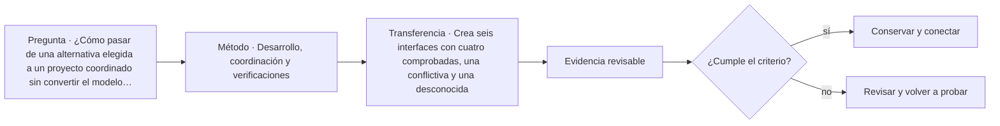

# ARQ-474 · Desarrollo, coordinación y verificaciones

**Parte 48 · Clase desarrollada · Incorporada en v0.26.0.**

Prerrequisitos conceptuales: ARQ-473. Sin calendario. Casos, cantidades y resultados son ficticios salvo antecedentes expresamente atribuidos. Material educativo: no constituye diagnóstico pericial, proyecto ejecutable, autorización, certificación ni habilitación profesional. Revisión externa especializada pendiente.

## Pregunta central

¿Cómo pasar de una alternativa elegida a un proyecto coordinado sin convertir el modelo digital en sustituto de cálculos, ensayos y revisiones?

## Resultado y continuidad

ARQ-474 continúa desde ARQ-473; cualquier caso o parámetro nuevo se identifica expresamente y no modifica retrospectivamente la clase anterior. Elaborarás un registro trazable, resolverás un caso reproducible, formularás una práctica distinta y cerrarás separando dato, inferencia, requisito, decisión y pendiente.

El taller final integra métodos, no resultados numéricos de otros casos. El proyecto ficticio se usa para practicar coordinación y defensa crítica. Ninguna cuenta se presenta como cálculo firmado, ninguna referencia sustituye permisos y ningún resultado de clase otorga atribuciones profesionales.

## 1. Desarrollar significa hacer explícitas interfaces

El anteproyecto contiene intenciones. El desarrollo define geometrías, materiales, sistemas y conexiones suficientes para verificar requisitos. Cada definición crea nuevas dependencias que deben registrarse.

## 2. Coordinación multidimensional

Una interferencia geométrica es solo un tipo de conflicto. También hay incompatibilidad de movimientos, acceso de mantenimiento, secuencia, versiones y desempeño. Las comprobaciones deben corresponder a la naturaleza del requisito.

## 3. Plan de verificación

Cada requisito se vincula con método: cálculo, inspección, simulación, ensayo, revisión documental o prueba de uso. Verificar que el modelo contiene un objeto no valida su desempeño.

## 4. Control de cambios

Cuando una especialidad mueve un elemento, el cambio debe propagarse a documentos dependientes. La coordinación se basa en versiones y responsabilidades, no en recordar verbalmente que “ya se cambió”.

## 5. Caso trabajado

Caso **INT-COORD-01** registra ocho interfaces críticas. Seis están comprobadas, una presenta conflicto geométrico entre ducto y viga y otra queda pendiente porque falta capacidad de movimiento de una junta. El resumen correcto es 6 comprobadas, 1 conflicto, 1 pendiente; no “75 % coordinado” como aprobación global. Corregir el ducto reabre altura libre y pérdida de carga; resolver una vista no cierra otras verificaciones.

## 6. Profundización: integrar sin borrar fronteras

El taller integral exige que cada disciplina mantenga su **unidad, método, versión y autoridad**. La integración ocurre en las interfaces: una decisión espacial afecta estructura, instalaciones, costo, operación y experiencia; cada efecto se comprueba con la herramienta adecuada. No se fusionan indicadores incompatibles para producir una apariencia de síntesis.

La calidad de la defensa se reconoce cuando otra persona puede reconstruir el camino desde necesidad hasta decisión, identificar qué alternativas se estudiaron y entender qué información todavía falta. El proyecto final no necesita fingir certeza total; necesita demostrar que las incertidumbres relevantes están controladas y que existe un siguiente paso responsable.

## 7. Interfaces profesionales y control de cambios

Las decisiones de esta clase cruzan disciplinas y etapas. Cada registro debe identificar **objeto, ubicación, fuente, fecha o versión, responsable de producir evidencia, responsable de revisarla y condición de cierre**. Una modificación no obliga a repetir todo el proyecto, pero sí a rastrear qué afirmaciones dependían del dato que cambió.

Cuando una evidencia pertenece a otra jurisdicción, producto, material o edificio, se conserva como referencia conceptual y no como resultado del caso. La aceptación del cliente, la presencia de un archivo o una cifra aritméticamente correcta tampoco sustituyen la comprobación técnica o administrativa que corresponda.

## 8. Errores frecuentes y comprobaciones de calidad

Evita convertir **ausencia de evidencia en evidencia de ausencia**, promediar estados que necesitan conservarse por separado, compensar una condición necesaria con un buen puntaje en otro criterio, o eliminar un resultado desfavorable porque complica la narrativa. También evita citar una norma o guía sin registrar su edición, jurisdicción y alcance de consulta.

Una entrega robusta permite repetir las cuentas y localizar la procedencia de cada afirmación. Si una cifra cambia al modificar una hipótesis, la sensibilidad se documenta; no se inventa una probabilidad. Si el modelo deja fuera un fenómeno relevante, se indica qué conclusión sigue siendo válida y cuál debe reabrirse.

*Figura 474. Esquema didáctico de relaciones y estados. No representa una obra, diagnóstico, autorización ni certificación real.*

## 9. Práctica independiente

Crea seis interfaces con cuatro comprobadas, una conflictiva y una desconocida. Para el conflicto, propone una variante y enumera dos verificaciones que deben reabrirse.

10. Solución razonada

El estado mantiene las tres categorías. La variante no se acepta por eliminar la colisión: debe revisar las funciones dependientes. La desconocida permanece pendiente.

La solución corresponde solo al modelo declarado. En un proyecto real se deben confirmar legislación, permisos, condiciones del sitio, productos, ensayos, contratos, competencias profesionales, participación y responsabilidades aplicables.

## 11. Autoevaluación y transferencia

Puedes avanzar cuando eres capaz de reconstruir el caso sin consultar la respuesta, explicar una conclusión que **sí** está respaldada y otra que **no**, y nombrar el documento, ensayo, participante o especialista que debería aportar la evidencia pendiente. La meta no es memorizar el número final, sino mantener coherencia entre pregunta, método, resultado y decisión.

La clase siguiente conserva el método, no las cifras, salvo cuando el texto declara explícitamente un caso continuo.

<!-- pedagogia-2026:inicio -->
## Mapa visual de aprendizaje

El diagrama representa el ciclo de aprendizaje de esta clase, no una secuencia de obra ni un procedimiento profesional.

## Resultado observable, evidencia y evaluación

**Tipo de clase:** profesional y de coordinación.

**Evidencia mínima:** registro de decisión con alcance, interfaces, versiones, responsables, evidencia y condición de cierre.

**Archivo sugerido:** `evidence/ARQ-474/evidencia.md`.

| Criterio | Evidencia observable |
|---|---|
| Precisión y representación · 20 % | Los conceptos, unidades y convenciones se usan de forma coherente y pueden ser reconstruidos por otra persona. |
| Evidencia y trazabilidad · 25 % | Cada afirmación importante se vincula con dato, cálculo, observación o fuente; hipótesis y desconocidos permanecen visibles. |
| Decisión y alternativas · 25 % | La decisión responde a la pregunta, compara al menos una alternativa y declara qué condición la haría cambiar. |
| Integración y ciclo de vida · 20 % | Se identifica una interfaz y una consecuencia para construcción, uso, mantenimiento, adaptación o fin de vida. |
| Comunicación, ética y límites · 10 % | El alcance se entiende sin explicación oral adicional y no se atribuyen permisos, competencias o certezas inexistentes. |

**Criterio de aceptación:** 80/100 y ningún criterio bajo 60 %. Una entrega genérica que podría reutilizarse sin cambios en otra clase no demuestra dominio. Si existe una condición crítica de seguridad, accesibilidad, evidencia o responsabilidad sin resolver, la entrega permanece pendiente aunque el promedio supere 80.

### Errores diagnósticos

En esta clase conviene vigilar especialmente: confundir coordinación con aprobación; perder versión o responsable; cerrar un pendiente sin evidencia.

## Autoevaluación, recuperación y continuidad

Antes de avanzar, responde sin consultar la solución:

1. ¿Qué decisión concreta puedes tomar ahora que no podías justificar antes?
2. ¿Qué evidencia de tu entrega es comprobada y cuál continúa siendo una hipótesis?
3. ¿Qué cambio de contexto invalidaría la transferencia realizada?

Revisa la entrega a las 24–48 horas y nuevamente al cerrar la parte. Conserva la primera versión, la crítica recibida y la versión revisada: el aprendizaje se demuestra también mediante el cambio entre versiones.
<!-- pedagogia-2026:fin -->

## Fuentes y alcance de uso

### [[ISO-19650-2]](#FUENTE-ISO-19650-2) ISO 19650-2:2018 — Delivery phase of the assets

ISO. [https://www.iso.org/standard/68080.html](https://www.iso.org/standard/68080.html)

**Consulta:** Ficha pública; edición publicada con revisión en curso **Apoyo:** Gestión de información durante la entrega del proyecto **Límite:** Un proyecto de revisión no reemplaza por sí solo la edición publicada. Texto íntegro no consultado.

### [[NASA-VERIFY]](#FUENTE-NASA-VERIFY) NASA Systems Engineering Handbook, 5.0: Product Realization

National Aeronautics and Space Administration. [https://www.nasa.gov/reference/5-0-product-realization/](https://www.nasa.gov/reference/5-0-product-realization/)

**Consulta:** Apartados web de verificación y validación **Apoyo:** Distinguir conformidad con requisitos de adecuación al uso **Límite:** La verificación de cálculos no constituye validación de un edificio.

### [[ISO-9001]](#FUENTE-ISO-9001) ISO 9001:2026 — Quality management systems — Requirements

ISO. [https://www.iso.org/standard/9001](https://www.iso.org/standard/9001)

**Consulta:** Ficha pública; publicación 16-09-2026 **Apoyo:** Sistema de gestión de calidad; edición publicada y ámbito general **Límite:** Texto normativo íntegro no adquirido; no se inventan cláusulas ni plazos universales de transición de certificación.

### [[NASA-CHANGE]](#FUENTE-NASA-CHANGE) NASA Systems Engineering Handbook, 6.0: Crosscutting Technical Management

National Aeronautics and Space Administration. [https://www.nasa.gov/reference/6-0-crosscutting-technical-management/](https://www.nasa.gov/reference/6-0-crosscutting-technical-management/)

**Consulta:** Apartados 6.2 y 6.5 sobre requisitos y configuración **Apoyo:** Línea base, trazabilidad y análisis del impacto de cambios **Límite:** Los formularios y el caso arquitectónico son originales; no se copian procedimientos contractuales.
