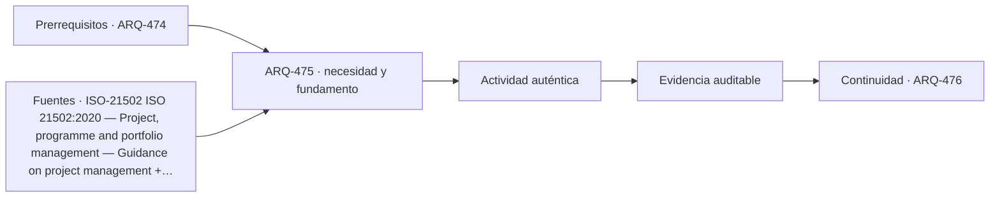

# ARQ-475 · Documentación, costo y estrategia de construcción

**Parte 48 · Clase desarrollada · Incorporada en v0.26.0.**

Prerrequisitos conceptuales: ARQ-474. Sin calendario. Casos, cantidades y resultados son ficticios salvo antecedentes expresamente atribuidos. Material educativo: no constituye diagnóstico pericial, proyecto ejecutable, autorización, certificación ni habilitación profesional. Revisión externa especializada pendiente.

## Pregunta central

¿Cómo alinear planos, especificaciones, cantidades, costo y secuencia para que el proyecto pueda contratarse y construirse sin versiones incompatibles?

## Resultado y continuidad

ARQ-475 continúa desde ARQ-474; cualquier caso o parámetro nuevo se identifica expresamente y no modifica retrospectivamente la clase anterior. Elaborarás un registro trazable, resolverás un caso reproducible, formularás una práctica distinta y cerrarás separando dato, inferencia, requisito, decisión y pendiente.

El taller final integra métodos, no resultados numéricos de otros casos. El proyecto ficticio se usa para practicar coordinación y defensa crítica. Ninguna cuenta se presenta como cálculo firmado, ninguna referencia sustituye permisos y ningún resultado de clase otorga atribuciones profesionales.

## 1. Documento y cantidad

Una cantidad necesita referencia geométrica y regla de medición. Cuando cambia el plano, la cubicación debe indicar qué versión usa. Un presupuesto exacto sobre una geometría obsoleta no es evidencia vigente.

## 2. Costo y alcance

Precio unitario, costos fijos, indirectos y contingencias tienen bases diferentes. La comparación debe conservar exclusiones. Un precio menor puede omitir partidas o riesgos que otra oferta incluye.

## 3. Secuencia constructiva

El estado final no demuestra viabilidad de montaje. Intervenciones en existentes requieren fases, apoyos, accesos y continuidad de servicios. La secuencia de estudio no sustituye planificación de seguridad.

## 4. Licitación y aclaraciones

Las consultas deben resolver contradicciones antes de que cada oferente asuma algo distinto. Una aclaración forma parte de la línea base cuando el contrato la incorpora; no debe vivir solo en un correo aislado.

## 5. Caso trabajado

Caso **INT-DOC-01**. Un plano v3 contiene 320 m² de revestimiento; el presupuesto v2 usa 300 m² a 42 unidades/m². La diferencia de 20 m² equivale a 840 unidades bajo ese precio, pero antes de sumarla debe comprobarse que el precio aplica a la nueva configuración y que no existen costos fijos. La inconsistencia de versión se corrige primero; después se actualiza el costo.

## 6. Profundización: integrar sin borrar fronteras

El taller integral exige que cada disciplina mantenga su **unidad, método, versión y autoridad**. La integración ocurre en las interfaces: una decisión espacial afecta estructura, instalaciones, costo, operación y experiencia; cada efecto se comprueba con la herramienta adecuada. No se fusionan indicadores incompatibles para producir una apariencia de síntesis.

La calidad de la defensa se reconoce cuando otra persona puede reconstruir el camino desde necesidad hasta decisión, identificar qué alternativas se estudiaron y entender qué información todavía falta. El proyecto final no necesita fingir certeza total; necesita demostrar que las incertidumbres relevantes están controladas y que existe un siguiente paso responsable.

## 7. Interfaces profesionales y control de cambios

Las decisiones de esta clase cruzan disciplinas y etapas. Cada registro debe identificar **objeto, ubicación, fuente, fecha o versión, responsable de producir evidencia, responsable de revisarla y condición de cierre**. Una modificación no obliga a repetir todo el proyecto, pero sí a rastrear qué afirmaciones dependían del dato que cambió.

Cuando una evidencia pertenece a otra jurisdicción, producto, material o edificio, se conserva como referencia conceptual y no como resultado del caso. La aceptación del cliente, la presencia de un archivo o una cifra aritméticamente correcta tampoco sustituyen la comprobación técnica o administrativa que corresponda.

## 8. Errores frecuentes y comprobaciones de calidad

Evita convertir **ausencia de evidencia en evidencia de ausencia**, promediar estados que necesitan conservarse por separado, compensar una condición necesaria con un buen puntaje en otro criterio, o eliminar un resultado desfavorable porque complica la narrativa. También evita citar una norma o guía sin registrar su edición, jurisdicción y alcance de consulta.

Una entrega robusta permite repetir las cuentas y localizar la procedencia de cada afirmación. Si una cifra cambia al modificar una hipótesis, la sensibilidad se documenta; no se inventa una probabilidad. Si el modelo deja fuera un fenómeno relevante, se indica qué conclusión sigue siendo válida y cuál debe reabrirse.

*Figura 475. Esquema didáctico de relaciones y estados. No representa una obra, diagnóstico, autorización ni certificación real.*

## 9. Práctica independiente

Plano nuevo 450 m², presupuesto anterior 420 m² a 35/u. Calcula diferencia simple y enumera tres razones por las que el cambio contractual podría no ser exactamente ese resultado.

10. Solución razonada

Diferencia geométrica simple=30×35=1.050 unidades. Pueden cambiar rendimiento, movilización, producto, desperdicio, impuestos o condiciones contractuales. El cálculo no fija un precio contractual.

La solución corresponde solo al modelo declarado. En un proyecto real se deben confirmar legislación, permisos, condiciones del sitio, productos, ensayos, contratos, competencias profesionales, participación y responsabilidades aplicables.

## 11. Autoevaluación y transferencia

Puedes avanzar cuando eres capaz de reconstruir el caso sin consultar la respuesta, explicar una conclusión que **sí** está respaldada y otra que **no**, y nombrar el documento, ensayo, participante o especialista que debería aportar la evidencia pendiente. La meta no es memorizar el número final, sino mantener coherencia entre pregunta, método, resultado y decisión.

La clase siguiente conserva el método, no las cifras, salvo cuando el texto declara explícitamente un caso continuo.

<!-- pedagogia-2026:inicio -->
## Decisión pedagógica y posición curricular

### Por qué existe

Esta clase existe para resolver una necesidad concreta del recorrido: ¿Cómo alinear planos, especificaciones, cantidades, costo y secuencia para que el proyecto pueda contratarse y construirse sin versiones incompatibles?

### Por qué está exactamente aquí

Ocupa el lugar 5 de la Parte 48. Se estudia después de ARQ-474 · Desarrollo, coordinación y verificaciones porque usa esa base para responder «¿Cómo alinear planos, especificaciones, cantidades, costo y secuencia para que el proyecto pueda contratarse y construirse sin versiones incompatibles?». Se ubica antes de ARQ-476 · Entrega, operación y fin de vida del caso porque la evidencia producida aquí debe estar disponible para ese paso.

- **Prerrequisitos:** `ARQ-474`
- **Capacidad que introduce:** ARQ-475 continúa desde ARQ-474; cualquier caso o parámetro nuevo se identifica expresamente y no modifica retrospectivamente la clase anterior. Elaborarás un registro trazable, resolverás un caso reproducible, formularás una práctica distinta y cerrarás separando dato, inferencia, requisito, decisión y pendiente. El taller final integra métodos, no resultados numéricos de otros casos.
- **Clases o experiencias que dependen de ella:** `ARQ-476`

El diagrama permite comprobar una relación que el texto lineal oculta con facilidad: esta clase recibe capacidades previas, toma decisiones apoyadas por fuentes, exige una experiencia y produce evidencia que habilita trabajo posterior. No representa un procedimiento de obra.

## Resultado observable, evidencia y evaluación

1. Identificar y delimitar las condiciones necesarias para responder la pregunta central de documentación, costo y estrategia de construcción.
2. Producir y comprobar la evidencia declarada por la clase: ARQ-475 continúa desde ARQ-474; cualquier caso o parámetro nuevo se identifica expresamente y no modifica retrospectivamente la clase anterior. Elaborarás un registro trazable, resolverás un caso reproducible, formularás una práctica distinta y cerrarás separando dato, inferencia, requisito, decisión y pendiente. El taller final integra métodos, no resultados numéricos de otros casos.
3. Justificar una decisión de documentación, costo y estrategia de construcción mediante fuentes, supuestos, alternativas y límites explícitos.

## Actividad, evidencia y criterio de aceptación

**Actividad:** Plano nuevo 450 m², presupuesto anterior 420 m² a 35/u. Calcula diferencia simple y enumera tres razones por las que el cambio contractual podría no ser exactamente ese resultado.

**Evidencia mínima:** ARQ-475 continúa desde ARQ-474; cualquier caso o parámetro nuevo se identifica expresamente y no modifica retrospectivamente la clase anterior. Elaborarás un registro trazable, resolverás un caso reproducible, formularás una práctica distinta y cerrarás separando dato, inferencia, requisito, decisión y pendiente. El taller final integra métodos, no resultados numéricos de otros casos.

**Archivo sugerido:** `evidence/ARQ-475/evidencia.md`.

**Criterio de aceptación:** la entrega se acepta cuando:

- La entrega responde explícitamente a la pregunta: ¿Cómo alinear planos, especificaciones, cantidades, costo y secuencia para que el proyecto pueda contratarse y construirse sin versiones incompatibles?
- La actividad conserva las fronteras del caso y permite reconstruir el procedimiento: Plano nuevo 450 m², presupuesto anterior 420 m² a 35/u. Calcula diferencia simple y enumera tres razones por las que el cambio contractual podría no ser exactamente ese resultado.
- Cada afirmación externa puede seguirse hasta una fuente, su alcance consultado y su límite.
- La evidencia deja disponible una entrada comprobable para ARQ-476.
- Evita convertir ausencia de evidencia en evidencia de ausencia , promediar estados que necesitan conservarse por separado, compensar una condición necesaria con un buen puntaje en otro criterio, o eliminar un resultado desfavorable porque complica la narrativa. También evita citar una norma o guía sin registrar su edición, jurisdicción y alcance de consulta.

La [rúbrica común](../../docs/RUBRICA_COMUN.md) complementa estos criterios; no los reemplaza. Una entrega puede superar un promedio y continuar pendiente si oculta una condición crítica.

## Trazabilidad de las decisiones

| # | Decisión o fundamento | Fuente utilizada | Aplicación y límite en esta clase |
|---:|---|---|---|
| 1 | Marco de gestión de proyectos y relación entre prácticas, ciclo de vida y entregables. | [ISO-21502 ISO 21502:2020 — Project, programme and portfolio management…](https://www.iso.org/standard/74947.html) | Consulta: Ficha pública; edición 1 publicada 2020-12, actualmente en revisión sistemática. Límite: No se leyó íntegramente la norma; no se reproducen procesos ni se presenta como contrato o metodología obligatoria. |
| 2 | Distinguir forma contractual, edición y tipo de contratación antes de citar una condición. | [FIDIC-CONTRACTS-FAQ Frequently Asked Questions — Contracts & Agreements](https://fidic.org/faq-page/240) | Consulta: Página oficial consultada el 23-09-2026; identifica distintas familias y ediciones de contratos FIDIC. Límite: No proporciona asesoría jurídica ni sustituye contrato particular, condiciones especiales o legislación aplicable. |
| 3 | Línea base, trazabilidad y análisis del impacto de cambios | [Organismo: National Aeronautics and Space Administration. Consulta:…](https://www.nasa.gov/reference/6-0-crosscutting-technical-management/) | Consulta: Apartados 6.2 y 6.5 sobre requisitos y configuración Límite: Los formularios y el caso arquitectónico son originales; no se copian procedimientos contractuales. |

La tabla permite auditar las relaciones; la explicación, el caso y la práctica de la clase siguen siendo la documentación principal.

## Autoevaluación, recuperación y continuidad

### Errores diagnósticos

Antes de avanzar, comprueba si puedes reconstruir cada resultado sin mirar la solución, señalar qué evidencia lo sostiene y nombrar una condición que obligaría a revisar tu decisión. Conserva la primera versión, la objeción recibida y la revisión.

**Conexión siguiente:** La continuidad inmediata es ARQ-476 · Entrega, operación y fin de vida del caso; conserva el método y vuelve a verificar datos y límites.
<!-- pedagogia-2026:fin -->

## Fuentes y alcance de uso

### [[ISO-21502]](#FUENTE-ISO-21502) ISO 21502:2020 — Project, programme and portfolio management — Guidance on project management

ISO. [https://www.iso.org/standard/74947.html](https://www.iso.org/standard/74947.html)

**Consulta:** Ficha pública; edición 1 publicada 2020-12, actualmente en revisión sistemática. **Apoyo:** Marco de gestión de proyectos y relación entre prácticas, ciclo de vida y entregables. **Límite:** No se leyó íntegramente la norma; no se reproducen procesos ni se presenta como contrato o metodología obligatoria.

### [[FIDIC-CONTRACTS-FAQ]](#FUENTE-FIDIC-CONTRACTS-FAQ) Frequently Asked Questions — Contracts & Agreements

International Federation of Consulting Engineers. [https://fidic.org/faq-page/240](https://fidic.org/faq-page/240)

**Consulta:** Página oficial consultada el 23-09-2026; identifica distintas familias y ediciones de contratos FIDIC. **Apoyo:** Distinguir forma contractual, edición y tipo de contratación antes de citar una condición. **Límite:** No proporciona asesoría jurídica ni sustituye contrato particular, condiciones especiales o legislación aplicable.

### [[NASA-CHANGE]](#FUENTE-NASA-CHANGE) NASA Systems Engineering Handbook, 6.0: Crosscutting Technical Management

National Aeronautics and Space Administration. [https://www.nasa.gov/reference/6-0-crosscutting-technical-management/](https://www.nasa.gov/reference/6-0-crosscutting-technical-management/)

**Consulta:** Apartados 6.2 y 6.5 sobre requisitos y configuración **Apoyo:** Línea base, trazabilidad y análisis del impacto de cambios **Límite:** Los formularios y el caso arquitectónico son originales; no se copian procedimientos contractuales.
