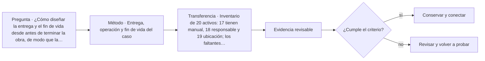

# ARQ-476 · Entrega, operación y fin de vida del caso

**Parte 48 · Clase desarrollada · Incorporada en v0.26.0.**

Prerrequisitos conceptuales: ARQ-475. Sin calendario. Casos, cantidades y resultados son ficticios salvo antecedentes expresamente atribuidos. Material educativo: no constituye diagnóstico pericial, proyecto ejecutable, autorización, certificación ni habilitación profesional. Revisión externa especializada pendiente.

## Pregunta central

¿Cómo diseñar la entrega y el fin de vida desde antes de terminar la obra, de modo que la información y las decisiones sigan siendo útiles después del proyecto?

## Resultado y continuidad

ARQ-476 continúa desde ARQ-475; cualquier caso o parámetro nuevo se identifica expresamente y no modifica retrospectivamente la clase anterior. Elaborarás un registro trazable, resolverás un caso reproducible, formularás una práctica distinta y cerrarás separando dato, inferencia, requisito, decisión y pendiente.

El taller final integra métodos, no resultados numéricos de otros casos. El proyecto ficticio se usa para practicar coordinación y defensa crítica. Ninguna cuenta se presenta como cálculo firmado, ninguna referencia sustituye permisos y ningún resultado de clase otorga atribuciones profesionales.

## 1. Entrega como transferencia de capacidad

Planos, modelos y manuales deben vincularse con activos y tareas. La operación necesita información actual, localizable y comprensible. La entrega no es descargar una carpeta final.

## 2. Operación desde el diseño

Accesos de mantenimiento, repuestos, consumos y competencias se consideran durante proyecto. Si un filtro no puede reemplazarse sin desmontar otra instalación, el problema nació antes de la entrega.

## 3. Fin de vida y adaptabilidad

La estrategia puede registrar qué elementos son desmontables, qué información se requiere para reutilizarlos y qué materiales necesitan tratamiento especial. Diseñar para desmontaje no garantiza un mercado futuro ni condición adecuada.

## 4. Cierre del caso integral

INT-BASE-01 conserva decisiones abiertas: valor patrimonial, comportamiento real, mantenimiento y escenarios futuros. La entrega final debe distinguir comprobado, supuesto y pendiente para no convertir el dossier en una ficción de certeza.

## 5. Caso trabajado

Caso **INT-HAND-01** contiene 30 activos. Veinticuatro tienen ID, ubicación, manual y responsable; cuatro carecen de manual vigente y dos de responsable. La completitud por campos puede parecer alta, pero seis activos no están listos para la tarea operativa definida. El plan de cierre prioriza por criticidad y mantiene las carencias visibles. En paralelo, diez componentes se etiquetan como candidatos a desmontaje futuro, sin afirmar reutilización garantizada.

## 6. Profundización: integrar sin borrar fronteras

El taller integral exige que cada disciplina mantenga su **unidad, método, versión y autoridad**. La integración ocurre en las interfaces: una decisión espacial afecta estructura, instalaciones, costo, operación y experiencia; cada efecto se comprueba con la herramienta adecuada. No se fusionan indicadores incompatibles para producir una apariencia de síntesis.

La calidad de la defensa se reconoce cuando otra persona puede reconstruir el camino desde necesidad hasta decisión, identificar qué alternativas se estudiaron y entender qué información todavía falta. El proyecto final no necesita fingir certeza total; necesita demostrar que las incertidumbres relevantes están controladas y que existe un siguiente paso responsable.

## 7. Interfaces profesionales y control de cambios

Las decisiones de esta clase cruzan disciplinas y etapas. Cada registro debe identificar **objeto, ubicación, fuente, fecha o versión, responsable de producir evidencia, responsable de revisarla y condición de cierre**. Una modificación no obliga a repetir todo el proyecto, pero sí a rastrear qué afirmaciones dependían del dato que cambió.

Cuando una evidencia pertenece a otra jurisdicción, producto, material o edificio, se conserva como referencia conceptual y no como resultado del caso. La aceptación del cliente, la presencia de un archivo o una cifra aritméticamente correcta tampoco sustituyen la comprobación técnica o administrativa que corresponda.

## 8. Errores frecuentes y comprobaciones de calidad

Evita convertir **ausencia de evidencia en evidencia de ausencia**, promediar estados que necesitan conservarse por separado, compensar una condición necesaria con un buen puntaje en otro criterio, o eliminar un resultado desfavorable porque complica la narrativa. También evita citar una norma o guía sin registrar su edición, jurisdicción y alcance de consulta.

Una entrega robusta permite repetir las cuentas y localizar la procedencia de cada afirmación. Si una cifra cambia al modificar una hipótesis, la sensibilidad se documenta; no se inventa una probabilidad. Si el modelo deja fuera un fenómeno relevante, se indica qué conclusión sigue siendo válida y cuál debe reabrirse.

*Figura 476. Esquema didáctico de relaciones y estados. No representa una obra, diagnóstico, autorización ni certificación real.*

## 9. Práctica independiente

Inventario de 20 activos: 17 tienen manual, 18 responsable y 19 ubicación; los faltantes no coinciden. Explica por qué no basta promediar porcentajes para declarar lista la operación.

10. Solución razonada

La tarea se evalúa por activo y requisito. Si un activo crítico carece de uno de los campos necesarios, la operación correspondiente sigue pendiente aunque el promedio de celdas sea alto. Debe analizarse la intersección de datos completos.

La solución corresponde solo al modelo declarado. En un proyecto real se deben confirmar legislación, permisos, condiciones del sitio, productos, ensayos, contratos, competencias profesionales, participación y responsabilidades aplicables.

## 11. Autoevaluación y transferencia

Puedes avanzar cuando eres capaz de reconstruir el caso sin consultar la respuesta, explicar una conclusión que **sí** está respaldada y otra que **no**, y nombrar el documento, ensayo, participante o especialista que debería aportar la evidencia pendiente. La meta no es memorizar el número final, sino mantener coherencia entre pregunta, método, resultado y decisión.

La clase siguiente conserva el método, no las cifras, salvo cuando el texto declara explícitamente un caso continuo.

<!-- pedagogia-2026:inicio -->
## Mapa visual de aprendizaje

El diagrama representa el ciclo de aprendizaje de esta clase, no una secuencia de obra ni un procedimiento profesional.

## Resultado observable, evidencia y evaluación

**Tipo de clase:** profesional y de coordinación.

**Evidencia mínima:** registro de decisión con alcance, interfaces, versiones, responsables, evidencia y condición de cierre.

**Archivo sugerido:** `evidence/ARQ-476/evidencia.md`.

| Criterio | Evidencia observable |
|---|---|
| Precisión y representación · 20 % | Los conceptos, unidades y convenciones se usan de forma coherente y pueden ser reconstruidos por otra persona. |
| Evidencia y trazabilidad · 25 % | Cada afirmación importante se vincula con dato, cálculo, observación o fuente; hipótesis y desconocidos permanecen visibles. |
| Decisión y alternativas · 25 % | La decisión responde a la pregunta, compara al menos una alternativa y declara qué condición la haría cambiar. |
| Integración y ciclo de vida · 20 % | Se identifica una interfaz y una consecuencia para construcción, uso, mantenimiento, adaptación o fin de vida. |
| Comunicación, ética y límites · 10 % | El alcance se entiende sin explicación oral adicional y no se atribuyen permisos, competencias o certezas inexistentes. |

**Criterio de aceptación:** 80/100 y ningún criterio bajo 60 %. Una entrega genérica que podría reutilizarse sin cambios en otra clase no demuestra dominio. Si existe una condición crítica de seguridad, accesibilidad, evidencia o responsabilidad sin resolver, la entrega permanece pendiente aunque el promedio supere 80.

### Errores diagnósticos

En esta clase conviene vigilar especialmente: confundir coordinación con aprobación; perder versión o responsable; cerrar un pendiente sin evidencia.

## Autoevaluación, recuperación y continuidad

Antes de avanzar, responde sin consultar la solución:

1. ¿Qué decisión concreta puedes tomar ahora que no podías justificar antes?
2. ¿Qué evidencia de tu entrega es comprobada y cuál continúa siendo una hipótesis?
3. ¿Qué cambio de contexto invalidaría la transferencia realizada?

Revisa la entrega a las 24–48 horas y nuevamente al cerrar la parte. Conserva la primera versión, la crítica recibida y la versión revisada: el aprendizaje se demuestra también mediante el cambio entre versiones.
<!-- pedagogia-2026:fin -->

## Fuentes y alcance de uso

### [[ISO-19650-3]](#FUENTE-ISO-19650-3) ISO 19650-3:2020 — Information management using BIM — Operational phase of assets

International Organization for Standardization. [https://www.iso.org/standard/75109.html](https://www.iso.org/standard/75109.html)

**Consulta:** Ficha pública; edición 2020 confirmada en 2024. **Apoyo:** Gestión de información durante la fase operativa de los activos y sus intercambios. **Límite:** No se leyó el texto íntegro ni se prescribe un CDE o esquema contractual concreto.

### [[ISO-41001]](#FUENTE-ISO-41001) ISO 41001:2018 — Facility management — Management systems — Requirements with guidance for use

International Organization for Standardization. [https://www.iso.org/standard/68021.html](https://www.iso.org/standard/68021.html)

**Consulta:** Ficha pública; edición 2018 publicada, con enmienda climática 2024 y revisión en desarrollo. **Apoyo:** Relacionar facility management, objetivos de la organización, necesidades de partes interesadas y mejora sistemática. **Límite:** No se leyó el texto íntegro ni se afirma certificación o cumplimiento del sistema de gestión.

### [[ISO-20887]](#FUENTE-ISO-20887) ISO 20887:2020 — Design for disassembly and adaptability — Principles, requirements and guidance

International Organization for Standardization. [https://www.iso.org/standard/69370.html](https://www.iso.org/standard/69370.html)

**Consulta:** Ficha pública de catálogo y resumen; edición 2020, confirmación indicada en 2025. **Apoyo:** Marco de diseño para desmontaje y adaptabilidad en edificios y obras civiles. **Límite:** No se leyó el texto normativo completo. La ficha no fija niveles específicos de desempeño y no equivale a certificación del caso.

### [[ISO-14040]](#FUENTE-ISO-14040) ISO 14040:2006 — Life cycle assessment — Principles and framework

ISO. [https://www.iso.org/standard/37456.html](https://www.iso.org/standard/37456.html)

**Consulta:** Ficha pública **Apoyo:** Objetivo y alcance, inventario, evaluación e interpretación de ACV **Límite:** Revisar enmiendas aplicables; no se reproduce el texto normativo.
