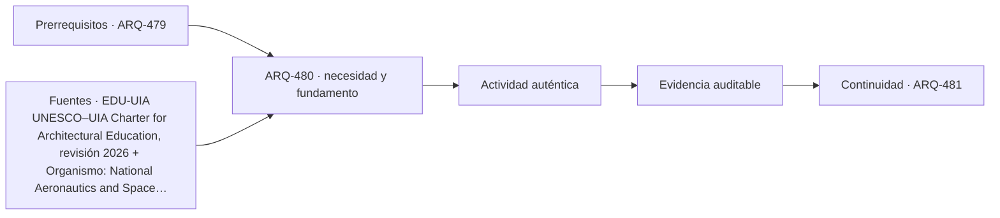

# ARQ-480 · Defensa final: evidencia, límites y decisiones pendientes

**Parte 48 · Clase desarrollada · Incorporada en v0.26.0.**

Prerrequisitos conceptuales: ARQ-479. Sin calendario. Casos, cantidades y resultados son ficticios salvo antecedentes expresamente atribuidos. Material educativo: no constituye diagnóstico pericial, proyecto ejecutable, autorización, certificación ni habilitación profesional. Revisión externa especializada pendiente.

## Pregunta central

¿Cómo defender un proyecto integral demostrando razonamiento y evidencia sin fingir que todo está resuelto?

## Resultado y continuidad

ARQ-480 continúa desde ARQ-479; cualquier caso o parámetro nuevo se identifica expresamente y no modifica retrospectivamente la clase anterior. Elaborarás un registro trazable, resolverás un caso reproducible, formularás una práctica distinta y cerrarás separando dato, inferencia, requisito, decisión y pendiente.

El taller final integra métodos, no resultados numéricos de otros casos. El proyecto ficticio se usa para practicar coordinación y defensa crítica. Ninguna cuenta se presenta como cálculo firmado, ninguna referencia sustituye permisos y ningún resultado de clase otorga atribuciones profesionales.

## 1. La defensa como argumento verificable

La defensa final no es una narración heroica del proyecto. Expone la pregunta, alternativas, decisiones, evidencia y límites. Cada afirmación importante debe poder rastrearse a un cálculo, fuente, observación, requisito o responsable.

## 2. Distinguir cierre y pendiente

Un proyecto maduro puede tener decisiones pendientes si están bien identificadas y no bloquean indebidamente la etapa. Lo peligroso es esconderlas. La matriz final usa estados: comprobado dentro de alcance, conflicto, pendiente y no aplicable justificado.

## 3. Integración

INT-BASE-01 reúne sitio, existente, usuarios, estructura, sistemas, costo, construcción, operación y fin de vida. Integrar no significa sumar todos los números del programa. Significa conservar interfaces y decisiones coherentes entre disciplinas.

## 4. Límites personales y profesionales

La defensa reconoce qué trabajo realizó el estudiante y qué necesitaría especialistas, autoridades o ensayos. Esa honestidad no reduce calidad: demuestra comprensión del ciclo completo y de las responsabilidades.

## 5. Caso trabajado

Caso **INT-DEF-01** presenta 20 afirmaciones finales. Catorce están comprobadas dentro del alcance didáctico; dos muestran conflictos abiertos y cuatro dependen de evidencia externa. El resultado no se expresa como “70 % de proyecto aprobado”. La defensa selecciona cinco decisiones críticas y muestra: problema, alternativa descartada, evidencia usada, consecuencia, documento afectado y siguiente responsable. Una de las dos condiciones en conflicto impide cerrar la propuesta para ejecución; el proyecto se defiende como estudio coordinado con un punto de detención explícito.

## 6. Profundización: integrar sin borrar fronteras

El taller integral exige que cada disciplina mantenga su **unidad, método, versión y autoridad**. La integración ocurre en las interfaces: una decisión espacial afecta estructura, instalaciones, costo, operación y experiencia; cada efecto se comprueba con la herramienta adecuada. No se fusionan indicadores incompatibles para producir una apariencia de síntesis.

La calidad de la defensa se reconoce cuando otra persona puede reconstruir el camino desde necesidad hasta decisión, identificar qué alternativas se estudiaron y entender qué información todavía falta. El proyecto final no necesita fingir certeza total; necesita demostrar que las incertidumbres relevantes están controladas y que existe un siguiente paso responsable.

## 7. Interfaces profesionales y control de cambios

Las decisiones de esta clase cruzan disciplinas y etapas. Cada registro debe identificar **objeto, ubicación, fuente, fecha o versión, responsable de producir evidencia, responsable de revisarla y condición de cierre**. Una modificación no obliga a repetir todo el proyecto, pero sí a rastrear qué afirmaciones dependían del dato que cambió.

Cuando una evidencia pertenece a otra jurisdicción, producto, material o edificio, se conserva como referencia conceptual y no como resultado del caso. La aceptación del cliente, la presencia de un archivo o una cifra aritméticamente correcta tampoco sustituyen la comprobación técnica o administrativa que corresponda.

## 8. Errores frecuentes y comprobaciones de calidad

Evita convertir **ausencia de evidencia en evidencia de ausencia**, promediar estados que necesitan conservarse por separado, compensar una condición necesaria con un buen puntaje en otro criterio, o eliminar un resultado desfavorable porque complica la narrativa. También evita citar una norma o guía sin registrar su edición, jurisdicción y alcance de consulta.

Una entrega robusta permite repetir las cuentas y localizar la procedencia de cada afirmación. Si una cifra cambia al modificar una hipótesis, la sensibilidad se documenta; no se inventa una probabilidad. Si el modelo deja fuera un fenómeno relevante, se indica qué conclusión sigue siendo válida y cuál debe reabrirse.

*Figura 480. Esquema didáctico de relaciones y estados. No representa una obra, diagnóstico, autorización ni certificación real.*

## 9. Práctica independiente

Construye una matriz de 12 afirmaciones: 7 comprobadas, 2 conflictos y 3 pendientes. Elige tres decisiones y redacta una defensa de 300 palabras que no use porcentajes como sustituto del estado.

10. Solución razonada

La defensa debe nombrar conflictos y pendientes, explicar por qué importan y qué evidencia o actor permitiría resolverlos. Las siete comprobaciones permanecen válidas dentro de su alcance, pero no compensan las condiciones abiertas. El cierre es una base revisable, no una certificación profesional.

La solución corresponde solo al modelo declarado. En un proyecto real se deben confirmar legislación, permisos, condiciones del sitio, productos, ensayos, contratos, competencias profesionales, participación y responsabilidades aplicables.

## 11. Autoevaluación y transferencia

Puedes avanzar cuando eres capaz de reconstruir el caso sin consultar la respuesta, explicar una conclusión que **sí** está respaldada y otra que **no**, y nombrar el documento, ensayo, participante o especialista que debería aportar la evidencia pendiente. La meta no es memorizar el número final, sino mantener coherencia entre pregunta, método, resultado y decisión.

La clase siguiente conserva el método, no las cifras, salvo cuando el texto declara explícitamente un caso continuo.

<!-- pedagogia-2026:inicio -->
## Decisión pedagógica y posición curricular

### Por qué existe

Esta clase existe para resolver una necesidad concreta del recorrido: ¿Cómo defender un proyecto integral demostrando razonamiento y evidencia sin fingir que todo está resuelto?

### Por qué está exactamente aquí

Cierra la Parte 48: integra lo producido en ARQ-479 · Investigación arquitectónica y comunicación de resultados para responder «¿Cómo defender un proyecto integral demostrando razonamiento y evidencia sin fingir que todo está resuelto?». La transición hacia ARQ-481 · Casa unifamiliar: sitio, programa y ciclo de vida transfiere el método y la disciplina de evidencia, no los datos o parámetros particulares de esta parte.

- **Prerrequisitos:** `ARQ-479`
- **Capacidad que introduce:** ARQ-480 continúa desde ARQ-479; cualquier caso o parámetro nuevo se identifica expresamente y no modifica retrospectivamente la clase anterior. Elaborarás un registro trazable, resolverás un caso reproducible, formularás una práctica distinta y cerrarás separando dato, inferencia, requisito, decisión y pendiente. El taller final integra métodos, no resultados numéricos de otros casos.
- **Clases o experiencias que dependen de ella:** `ARQ-481`

El diagrama permite comprobar una relación que el texto lineal oculta con facilidad: esta clase recibe capacidades previas, toma decisiones apoyadas por fuentes, exige una experiencia y produce evidencia que habilita trabajo posterior. No representa un procedimiento de obra.

## Resultado observable, evidencia y evaluación

1. Identificar y delimitar las condiciones necesarias para responder la pregunta central de defensa final: evidencia, límites y decisiones pendientes.
2. Producir y comprobar la evidencia declarada por la clase: ARQ-480 continúa desde ARQ-479; cualquier caso o parámetro nuevo se identifica expresamente y no modifica retrospectivamente la clase anterior. Elaborarás un registro trazable, resolverás un caso reproducible, formularás una práctica distinta y cerrarás separando dato, inferencia, requisito, decisión y pendiente. El taller final integra métodos, no resultados numéricos de otros casos.
3. Justificar una decisión de defensa final: evidencia, límites y decisiones pendientes mediante fuentes, supuestos, alternativas y límites explícitos.

## Actividad, evidencia y criterio de aceptación

**Actividad:** Construye una matriz de 12 afirmaciones: 7 comprobadas, 2 conflictos y 3 pendientes. Elige tres decisiones y redacta una defensa de 300 palabras que no use porcentajes como sustituto del estado.

**Evidencia mínima:** ARQ-480 continúa desde ARQ-479; cualquier caso o parámetro nuevo se identifica expresamente y no modifica retrospectivamente la clase anterior. Elaborarás un registro trazable, resolverás un caso reproducible, formularás una práctica distinta y cerrarás separando dato, inferencia, requisito, decisión y pendiente. El taller final integra métodos, no resultados numéricos de otros casos.

**Archivo sugerido:** `evidence/ARQ-480/evidencia.md`.

**Criterio de aceptación:** la entrega se acepta cuando:

- La entrega responde explícitamente a la pregunta: ¿Cómo defender un proyecto integral demostrando razonamiento y evidencia sin fingir que todo está resuelto?
- La actividad conserva las fronteras del caso y permite reconstruir el procedimiento: Construye una matriz de 12 afirmaciones: 7 comprobadas, 2 conflictos y 3 pendientes. Elige tres decisiones y redacta una defensa de 300 palabras que no use porcentajes como sustituto del estado.
- Cada afirmación externa puede seguirse hasta una fuente, su alcance consultado y su límite.
- La evidencia deja disponible una entrada comprobable para ARQ-481.
- Evita convertir ausencia de evidencia en evidencia de ausencia , promediar estados que necesitan conservarse por separado, compensar una condición necesaria con un buen puntaje en otro criterio, o eliminar un resultado desfavorable porque complica la narrativa. También evita citar una norma o guía sin registrar su edición, jurisdicción y alcance de consulta.

La [rúbrica común](../../docs/RUBRICA_COMUN.md) complementa estos criterios; no los reemplaza. Una entrega puede superar un promedio y continuar pendiente si oculta una condición crítica.

## Trazabilidad de las decisiones

| # | Decisión o fundamento | Fuente utilizada | Aplicación y límite en esta clase |
|---:|---|---|---|
| 1 | Amplitud de la formación arquitectónica y uso de IA complementario al pensamiento de diseño | [EDU-UIA UNESCO–UIA Charter for Architectural Education, revisión 2026](https://www.uia-architectes.org/en/news/unesco-uia-charter-for-architectural-education-revised-edition-2026/) | Consulta: Noticia oficial y alcance de la revisión Límite: No se revisó aquí el texto integral de la Carta ni se obtuvo validación o acreditación del programa. |
| 2 | Distinguir conformidad con requisitos de adecuación al uso | [Organismo: National Aeronautics and Space Administration. Consulta:…](https://www.nasa.gov/reference/5-0-product-realization/) | Consulta: Apartados web de verificación y validación Límite: La verificación de cálculos no constituye validación de un edificio. |
| 3 | Principios generales de sostenibilidad aplicados al ciclo de vida de obras de construcción. | [ISO-15392 ISO 15392:2019 — Sustainability in buildings and civil…](https://www.iso.org/standard/69947.html) | Consulta: Ficha pública; edición 2019 confirmada en 2025. Límite: La propia ficha indica que no proporciona niveles de desempeño para sustentar afirmaciones absolutas de sostenibilidad. |
| 4 | Amenaza, exposición, vulnerabilidad, capacidad e incertidumbre del riesgo | [RISK-UN Disaster risk: terminology](https://www.undrr.org/terminology/disaster-risk) | Consulta: Definición institucional Límite: No es una fórmula universal multiplicativa ni una cuantificación parcelaria. |

La tabla permite auditar las relaciones; la explicación, el caso y la práctica de la clase siguen siendo la documentación principal.

## Autoevaluación, recuperación y continuidad

### Errores diagnósticos

Antes de avanzar, comprueba si puedes reconstruir cada resultado sin mirar la solución, señalar qué evidencia lo sostiene y nombrar una condición que obligaría a revisar tu decisión. Conserva la primera versión, la objeción recibida y la revisión.

**Conexión siguiente:** La continuidad inmediata es ARQ-481 · Casa unifamiliar: sitio, programa y ciclo de vida; conserva el método y vuelve a verificar datos y límites.
<!-- pedagogia-2026:fin -->

## Fuentes y alcance de uso

### [[EDU-UIA]](#FUENTE-EDU-UIA) UNESCO–UIA Charter for Architectural Education, revisión 2026

Unión Internacional de Arquitectos. [https://www.uia-architectes.org/en/news/unesco-uia-charter-for-architectural-education-revised-edition-2026/](https://www.uia-architectes.org/en/news/unesco-uia-charter-for-architectural-education-revised-edition-2026/)

**Consulta:** Noticia oficial y alcance de la revisión **Apoyo:** Amplitud de la formación arquitectónica y uso de IA complementario al pensamiento de diseño **Límite:** No se revisó aquí el texto integral de la Carta ni se obtuvo validación o acreditación del programa.

### [[NASA-VERIFY]](#FUENTE-NASA-VERIFY) NASA Systems Engineering Handbook, 5.0: Product Realization

National Aeronautics and Space Administration. [https://www.nasa.gov/reference/5-0-product-realization/](https://www.nasa.gov/reference/5-0-product-realization/)

**Consulta:** Apartados web de verificación y validación **Apoyo:** Distinguir conformidad con requisitos de adecuación al uso **Límite:** La verificación de cálculos no constituye validación de un edificio.

### [[ISO-15392]](#FUENTE-ISO-15392) ISO 15392:2019 — Sustainability in buildings and civil engineering works — General principles

ISO. [https://www.iso.org/standard/69947.html](https://www.iso.org/standard/69947.html)

**Consulta:** Ficha pública; edición 2019 confirmada en 2025. **Apoyo:** Principios generales de sostenibilidad aplicados al ciclo de vida de obras de construcción. **Límite:** La propia ficha indica que no proporciona niveles de desempeño para sustentar afirmaciones absolutas de sostenibilidad.

### [[RISK-UN]](#FUENTE-RISK-UN) Disaster risk: terminology

UNDRR. [https://www.undrr.org/terminology/disaster-risk](https://www.undrr.org/terminology/disaster-risk)

**Consulta:** Definición institucional **Apoyo:** Amenaza, exposición, vulnerabilidad, capacidad e incertidumbre del riesgo **Límite:** No es una fórmula universal multiplicativa ni una cuantificación parcelaria.
