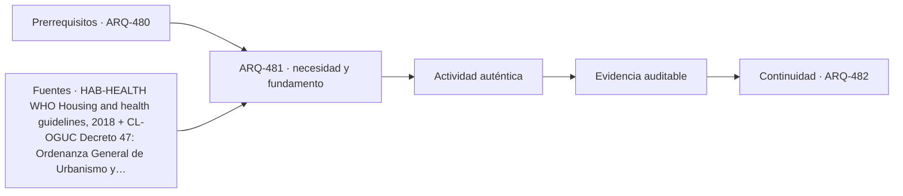

# ARQ-481 · Casa unifamiliar: sitio, programa y ciclo de vida

**Parte 49 · Fase II · Clase desarrollada · Incorporada en v0.27.0.**

Prerrequisitos conceptuales: ARQ-480. Sin calendario. Casos, cantidades y resultados son ficticios salvo antecedentes expresamente atribuidos. Material educativo: no constituye proyecto ejecutable, cálculo firmado, autorización, certificación ni habilitación profesional. Revisión externa especializada pendiente.

## Pregunta central

¿Cómo diseñar una casa como sistema de vida cotidiana y no como una planta aislada?

## Resultado y continuidad

Esta clase aplica los fundamentos de la Fase I a una tipología concreta. El resultado esperado es poder explicar decisiones, interfaces y evidencia sin copiar soluciones de otro edificio. La clase siguiente conserva el método, no las cifras, salvo cuando un caso continuo se declara expresamente.

## 1. Tipo, programa y contexto

La casa comienza antes del muro. Topografía, acceso, clima, vistas, ruido, agua y redes condicionan decisiones, pero el programa también nace de actividades: dormir, cocinar, cuidar, recibir, trabajar, almacenar, limpiar y mantener. Una casa bien resuelta relaciona ambos conjuntos sin convertir una preferencia inicial en una geometría inevitable.

## 2. Organización espacial y usuarios

Dormitorios y baños no bastan para explicar vivienda. Hay recorridos, umbrales, almacenamiento, lavado, residuos, instalaciones, mantenimiento exterior y lugares de transición. El proyecto debe estudiar simultaneidad: una distribución que funciona con dos personas puede entrar en conflicto con trabajo remoto, visitas o cuidados.

## 3. Sistema constructivo y técnico

Una casa cambia con edad, composición del hogar, clima y recursos. Prever cambios no significa diseñar infinitas posibilidades; significa reconocer qué decisiones son difíciles de revertir y cuáles pueden adaptarse. Estructura, núcleo húmedo y accesos condicionan futuras transformaciones.

## 4. Representar vivienda como secuencia de actividades

En vivienda conviene trabajar simultáneamente con planta, corte y secuencia de uso. La planta muestra relaciones y superficies; el corte permite estudiar niveles, luz, privacidad, envolvente e instalaciones; la secuencia obliga a seguir actividades reales como llegar con compras, cocinar, acompañar a otra persona, trabajar, dormir, lavar, almacenar y sacar residuos. Una propuesta puede parecer ordenada en planta y fallar al seguir una de estas cadenas completas.

La documentación debe diferenciar **área privada, área compartida, circulación, apoyo técnico y espacio exterior**. No todas son intercambiables. Aumentar una categoría manteniendo el total obliga a reconocer qué otra disminuye. Esa disciplina evita presentar una ganancia de superficie como si fuera gratuita.

## 5. Estructura, instalaciones y construcción desde el comienzo

La vivienda contiene redes de agua, saneamiento, electricidad, ventilación y, según el caso, climatización y datos. Concentrarlas puede simplificar trazados, pero también crear dependencias o limitar futuras transformaciones. La estructura condiciona luces, aperturas y crecimiento; la envolvente condiciona confort y mantenimiento. Ninguna de estas capas debe aparecer después de cerrar la distribución como si solo necesitara “acomodarse”.

Durante construcción, las tolerancias y la secuencia importan incluso en edificios pequeños. Una junta, una pendiente o una cota mal coordinada puede afectar agua, puertas, mobiliario o acabados. La escala doméstica no convierte esos encuentros en triviales: los acerca a la vida cotidiana y los repite durante años de uso.

## 6. Operación, mantenimiento y transformación

Una vivienda necesita ser limpiada, reparada, ventilada, calentada o enfriada, abastecida y modificada. El proyecto debe preguntar quién accede a cubiertas, equipos, filtros, fachadas o llaves de corte y qué ocurre cuando una parte queda fuera de servicio. Una solución técnicamente posible pero inaccesible para mantenimiento puede trasladar costos y riesgos al futuro.

También se estudia la **reversibilidad**: qué tabiques pueden cambiar, qué redes están atrapadas, qué aperturas dependen de elementos resistentes y qué dimensiones permiten otros usos. Adaptabilidad no significa que cualquier espacio sirva para cualquier cosa; significa que las transformaciones previstas tienen caminos y límites comprensibles.

## Caso trabajado

Caso **CASA-01**: predio ficticio de 20×30 m. Se reserva una banda de acceso de 60 m² y un patio permeable mínimo didáctico de 240 m². La casa propuesta ocupa 180 m² de huella. El balance deja 120 m² exteriores adicionales. Una alternativa de 210 m² de huella conserva el programa interior pero reduce ese remanente a 90 m². La cuenta no decide cuál es mejor: obliga a identificar qué actividades exteriores se perderían y qué parte del programa justificó crecer.

## Lectura paso a paso del caso

- **Fija la frontera.** Identifica qué superficies, plantas, equipos o intervalos pertenecen al caso y cuáles proceden de otros ejercicios.

- **Conserva las unidades.** Antes de comparar porcentajes o razones, verifica que numerador y denominador representen la misma versión y el mismo servicio.

- **Cambia una hipótesis cada vez.** Una variante debe indicar qué modifica y qué mantiene; de lo contrario no podrás atribuir la diferencia observada.

- **Comprueba por otra vía cuando sea posible.** Suma y resta áreas, revisa equilibrio, reconstruye una secuencia o compara con un límite geométrico.

- **Escribe lo que el número no demuestra.** La cuenta puede ser correcta y aun faltar normativa, comportamiento físico, participación de usuarios, costo, mantenimiento o aprobación profesional.

Este procedimiento convierte el ejemplo en una herramienta transferible. La meta no es memorizar la cifra, sino poder reconstruir por qué aparece y reconocer cuándo otra tipología exigiría cambiar el modelo.

## Profundización: interfaces que deben permanecer visibles

En esta tipología, una decisión espacial rara vez pertenece a una sola disciplina. Programa, estructura, envolvente, instalaciones, accesibilidad, incendio, costo, construcción y mantenimiento se encuentran en interfaces. La clase exige identificar qué dato alimenta cada decisión y quién debería producir o revisar la evidencia en un proyecto real. Un resultado geométrico favorable no compensa una condición necesaria desconocida.

## Errores frecuentes y comprobaciones de calidad

Evita transferir automáticamente dimensiones o capacidades desde ejemplos anteriores, presentar un promedio como descripción de todos los estados, confundir área con funcionamiento, o utilizar una fuente de otra jurisdicción como autorización. Comprueba unidades, fronteras, versión del caso y coherencia entre planta, sección y operación. Si una afirmación depende de una norma, ensayo o especialista no consultado, permanece pendiente.

*Figura 481. Relaciones conceptuales de la clase. No constituye plano ni detalle ejecutable.*

## Práctica independiente

En un predio de 18×25 m reserva 50 m² para acceso y 180 m² para patio permeable. Calcula la huella máxima restante y compara una casa de 150 m² y otra de 190 m². Explica qué información falta antes de elegir.

Solución razonada

El predio tiene 450 m². Tras reservar 230 quedan 220 m² de huella máxima bajo el ejercicio. La casa de 150 deja 70 m² adicionales; la de 190, 30. Falta programa, orientación, topografía, normativa, estructura, costo, operación y calidad espacial; el balance es una condición geométrica, no una selección.

La solución corresponde al modelo declarado. En una obra real deben confirmarse terreno, programa, legislación, permisos, productos, ensayos, responsabilidades profesionales, operación y condiciones de mantenimiento aplicables.

## Autoevaluación y transferencia

Puedes avanzar cuando reconstruyes el caso sin mirar la respuesta, explicas al menos una conclusión respaldada y otra que no puede sostenerse con los datos, y señalas qué documento, medición o especialista permitiría resolver la incertidumbre. El objetivo es transferir el razonamiento a otra tipología sin copiar la forma.

<!-- pedagogia-2026:inicio -->
## Decisión pedagógica y posición curricular

### Por qué existe

Esta clase existe para resolver una necesidad concreta del recorrido: ¿Cómo diseñar una casa como sistema de vida cotidiana y no como una planta aislada?

### Por qué está exactamente aquí

Abre la Parte 49 porque plantea primero el problema «¿Cómo diseñar una casa como sistema de vida cotidiana y no como una planta aislada?». La transición desde ARQ-480 · Defensa final: evidencia, límites y decisiones pendientes conserva métodos de evidencia y límites, pero no traslada parámetros del bloque anterior. Establece la pregunta y el producto base que ARQ-482 · Casa patio, pareada y en hilera: densidad baja y media desarrollará a continuación.

- **Prerrequisitos:** `ARQ-480`
- **Capacidad que introduce:** Esta clase aplica los fundamentos de la Fase I a una tipología concreta. El resultado esperado es poder explicar decisiones, interfaces y evidencia sin copiar soluciones de otro edificio. La clase siguiente conserva el método, no las cifras, salvo cuando un caso continuo se declara expresamente.
- **Clases o experiencias que dependen de ella:** `ARQ-482`

El diagrama permite comprobar una relación que el texto lineal oculta con facilidad: esta clase recibe capacidades previas, toma decisiones apoyadas por fuentes, exige una experiencia y produce evidencia que habilita trabajo posterior. No representa un procedimiento de obra.

## Resultado observable, evidencia y evaluación

1. Identificar y delimitar las condiciones necesarias para responder la pregunta central de casa unifamiliar: sitio, programa y ciclo de vida.
2. Producir y comprobar la evidencia declarada por la clase: Esta clase aplica los fundamentos de la Fase I a una tipología concreta. El resultado esperado es poder explicar decisiones, interfaces y evidencia sin copiar soluciones de otro edificio. La clase siguiente conserva el método, no las cifras, salvo cuando un caso continuo se declara expresamente.
3. Justificar una decisión de casa unifamiliar: sitio, programa y ciclo de vida mediante fuentes, supuestos, alternativas y límites explícitos.

## Actividad, evidencia y criterio de aceptación

**Actividad:** En un predio de 18×25 m reserva 50 m² para acceso y 180 m² para patio permeable. Calcula la huella máxima restante y compara una casa de 150 m² y otra de 190 m². Explica qué información falta antes de elegir.

**Evidencia mínima:** Esta clase aplica los fundamentos de la Fase I a una tipología concreta. El resultado esperado es poder explicar decisiones, interfaces y evidencia sin copiar soluciones de otro edificio. La clase siguiente conserva el método, no las cifras, salvo cuando un caso continuo se declara expresamente.

**Archivo sugerido:** `evidence/ARQ-481/evidencia.md`.

**Criterio de aceptación:** la entrega se acepta cuando:

- La entrega responde explícitamente a la pregunta: ¿Cómo diseñar una casa como sistema de vida cotidiana y no como una planta aislada?
- La actividad conserva las fronteras del caso y permite reconstruir el procedimiento: En un predio de 18×25 m reserva 50 m² para acceso y 180 m² para patio permeable. Calcula la huella máxima restante y compara una casa de 150 m² y otra de 190 m². Explica qué información falta antes de elegir.
- Cada afirmación externa puede seguirse hasta una fuente, su alcance consultado y su límite.
- La evidencia deja disponible una entrada comprobable para ARQ-482.
- Evita transferir automáticamente dimensiones o capacidades desde ejemplos anteriores, presentar un promedio como descripción de todos los estados, confundir área con funcionamiento, o utilizar una fuente de otra jurisdicción como autorización. Comprueba unidades, fronteras, versión del caso y coherencia entre planta, sección y operación.

La [rúbrica común](../../docs/RUBRICA_COMUN.md) complementa estos criterios; no los reemplaza. Una entrega puede superar un promedio y continuar pendiente si oculta una condición crítica.

## Trazabilidad de las decisiones

| # | Decisión o fundamento | Fuente utilizada | Aplicación y límite en esta clase |
|---:|---|---|---|
| 1 | Amplitud de condiciones de vivienda relacionadas con salud: ocupación, temperatura, accesibilidad y riesgos. | [HAB-HEALTH WHO Housing and health guidelines, 2018](https://www.who.int/publications/i/item/9789241550376) | Consulta: Página de presentación y alcance de la guía. Límite: No se revisó íntegramente la guía ni se adoptan umbrales médicos o constructivos. Los casos no diagnostican salud ni habilitan obras. |
| 2 | Localizador principal para verificar requisitos urbanísticos y de edificación | [CL-OGUC Decreto 47: Ordenanza General de Urbanismo y Construcciones](https://www.bcn.cl/leychile/navegar?idNorma=8201) | Consulta: Texto consolidado disponible; revisión de marco, no de cada disposición Límite: Una ficha educativa no reemplaza lectura del artículo vigente, sus modificaciones, transitorios y antecedentes del proyecto. |
| 3 | Amplitud de la formación arquitectónica y uso de IA complementario al pensamiento de diseño | [EDU-UIA UNESCO–UIA Charter for Architectural Education, revisión 2026](https://www.uia-architectes.org/en/news/unesco-uia-charter-for-architectural-education-revised-edition-2026/) | Consulta: Noticia oficial y alcance de la revisión Límite: No se revisó aquí el texto integral de la Carta ni se obtuvo validación o acreditación del programa. |

La tabla permite auditar las relaciones; la explicación, el caso y la práctica de la clase siguen siendo la documentación principal.

## Autoevaluación, recuperación y continuidad

### Errores diagnósticos

Antes de avanzar, comprueba si puedes reconstruir cada resultado sin mirar la solución, señalar qué evidencia lo sostiene y nombrar una condición que obligaría a revisar tu decisión. Conserva la primera versión, la objeción recibida y la revisión.

**Conexión siguiente:** La continuidad inmediata es ARQ-482 · Casa patio, pareada y en hilera: densidad baja y media; conserva el método y vuelve a verificar datos y límites.
<!-- pedagogia-2026:fin -->

## Fuentes y alcance de uso

### [[HAB-HEALTH]](#FUENTE-HAB-HEALTH) WHO Housing and health guidelines, 2018

World Health Organization. [https://www.who.int/publications/i/item/9789241550376](https://www.who.int/publications/i/item/9789241550376)

**Consulta:** Página de presentación y alcance de la guía. **Apoyo:** Amplitud de condiciones de vivienda relacionadas con salud: ocupación, temperatura, accesibilidad y riesgos. **Límite:** No se revisó íntegramente la guía ni se adoptan umbrales médicos o constructivos. Los casos no diagnostican salud ni habilitan obras.

### [[CL-OGUC]](#FUENTE-CL-OGUC) Decreto 47: Ordenanza General de Urbanismo y Construcciones

BCN / LeyChile. [https://www.bcn.cl/leychile/navegar?idNorma=8201](https://www.bcn.cl/leychile/navegar?idNorma=8201)

**Consulta:** Texto consolidado disponible; revisión de marco, no de cada disposición **Apoyo:** Localizador principal para verificar requisitos urbanísticos y de edificación **Límite:** Una ficha educativa no reemplaza lectura del artículo vigente, sus modificaciones, transitorios y antecedentes del proyecto.

### [[EDU-UIA]](#FUENTE-EDU-UIA) UNESCO–UIA Charter for Architectural Education, revisión 2026

Unión Internacional de Arquitectos. [https://www.uia-architectes.org/en/news/unesco-uia-charter-for-architectural-education-revised-edition-2026/](https://www.uia-architectes.org/en/news/unesco-uia-charter-for-architectural-education-revised-edition-2026/)

**Consulta:** Noticia oficial y alcance de la revisión **Apoyo:** Amplitud de la formación arquitectónica y uso de IA complementario al pensamiento de diseño **Límite:** No se revisó aquí el texto integral de la Carta ni se obtuvo validación o acreditación del programa.
