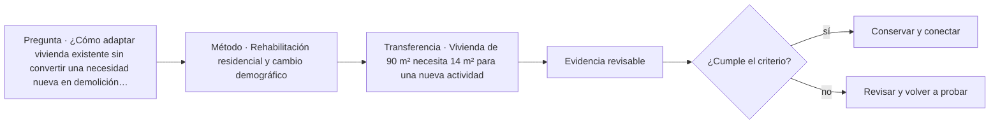

# ARQ-489 · Rehabilitación residencial y cambio demográfico

**Parte 49 · Fase II · Clase desarrollada · Incorporada en v0.27.0.**

Prerrequisitos conceptuales: ARQ-488. Sin calendario. Casos, cantidades y resultados son ficticios salvo antecedentes expresamente atribuidos. Material educativo: no constituye proyecto ejecutable, cálculo firmado, autorización, certificación ni habilitación profesional. Revisión externa especializada pendiente.

## Pregunta central

¿Cómo adaptar vivienda existente sin convertir una necesidad nueva en demolición automática o en conservación intocable?

## Resultado y continuidad

Esta clase aplica los fundamentos de la Fase I a una tipología concreta. El resultado esperado es poder explicar decisiones, interfaces y evidencia sin copiar soluciones de otro edificio. La clase siguiente conserva el método, no las cifras, salvo cuando un caso continuo se declara expresamente.

## 1. Tipo, programa y contexto

La vivienda existente contiene geometría, materiales, modificaciones y usos. Antes de intervenir se distingue documento histórico de condición observada y de hipótesis.

## 2. Organización espacial y usuarios

Teletrabajo, cuidados, envejecimiento o subdivisión cambian tareas. El programa actualizado debe partir de actividades actuales y futuras plausibles, no solo de la planta original.

## 3. Sistema constructivo y técnico

Hay cambios reversibles, reparaciones, redistribuciones y modificaciones estructurales. La alternativa mínima no siempre es la de menor área; es la que satisface el objetivo con impactos justificados y evidencia suficiente.

## 4. Representar vivienda como secuencia de actividades

En vivienda conviene trabajar simultáneamente con planta, corte y secuencia de uso. La planta muestra relaciones y superficies; el corte permite estudiar niveles, luz, privacidad, envolvente e instalaciones; la secuencia obliga a seguir actividades reales como llegar con compras, cocinar, acompañar a otra persona, trabajar, dormir, lavar, almacenar y sacar residuos. Una propuesta puede parecer ordenada en planta y fallar al seguir una de estas cadenas completas.

La documentación debe diferenciar **área privada, área compartida, circulación, apoyo técnico y espacio exterior**. No todas son intercambiables. Aumentar una categoría manteniendo el total obliga a reconocer qué otra disminuye. Esa disciplina evita presentar una ganancia de superficie como si fuera gratuita.

## 5. Estructura, instalaciones y construcción desde el comienzo

La vivienda contiene redes de agua, saneamiento, electricidad, ventilación y, según el caso, climatización y datos. Concentrarlas puede simplificar trazados, pero también crear dependencias o limitar futuras transformaciones. La estructura condiciona luces, aperturas y crecimiento; la envolvente condiciona confort y mantenimiento. Ninguna de estas capas debe aparecer después de cerrar la distribución como si solo necesitara “acomodarse”.

Durante construcción, las tolerancias y la secuencia importan incluso en edificios pequeños. Una junta, una pendiente o una cota mal coordinada puede afectar agua, puertas, mobiliario o acabados. La escala doméstica no convierte esos encuentros en triviales: los acerca a la vida cotidiana y los repite durante años de uso.

## 6. Operación, mantenimiento y transformación

Una vivienda necesita ser limpiada, reparada, ventilada, calentada o enfriada, abastecida y modificada. El proyecto debe preguntar quién accede a cubiertas, equipos, filtros, fachadas o llaves de corte y qué ocurre cuando una parte queda fuera de servicio. Una solución técnicamente posible pero inaccesible para mantenimiento puede trasladar costos y riesgos al futuro.

También se estudia la **reversibilidad**: qué tabiques pueden cambiar, qué redes están atrapadas, qué aperturas dependen de elementos resistentes y qué dimensiones permiten otros usos. Adaptabilidad no significa que cualquier espacio sirva para cualquier cosa; significa que las transformaciones previstas tienen caminos y límites comprensibles.

## Caso trabajado

Caso **REH-VIV-01**: casa existente de 120 m². Se necesitan 12 m² adicionales para trabajo y 6 para un baño accesible. Opción A amplía 18 m²: 138 totales. Opción B redistribuye 20 m² existentes, pierde 4 m² de almacenamiento y mantiene 120. La comparación necesita valorar estructura, luz, accesibilidad, patrimonio, costo y operación; el menor total no es ganador automático.

## Lectura paso a paso del caso

- **Fija la frontera.** Identifica qué superficies, plantas, equipos o intervalos pertenecen al caso y cuáles proceden de otros ejercicios.

- **Conserva las unidades.** Antes de comparar porcentajes o razones, verifica que numerador y denominador representen la misma versión y el mismo servicio.

- **Cambia una hipótesis cada vez.** Una variante debe indicar qué modifica y qué mantiene; de lo contrario no podrás atribuir la diferencia observada.

- **Comprueba por otra vía cuando sea posible.** Suma y resta áreas, revisa equilibrio, reconstruye una secuencia o compara con un límite geométrico.

- **Escribe lo que el número no demuestra.** La cuenta puede ser correcta y aun faltar normativa, comportamiento físico, participación de usuarios, costo, mantenimiento o aprobación profesional.

Este procedimiento convierte el ejemplo en una herramienta transferible. La meta no es memorizar la cifra, sino poder reconstruir por qué aparece y reconocer cuándo otra tipología exigiría cambiar el modelo.

## Profundización: interfaces que deben permanecer visibles

En esta tipología, una decisión espacial rara vez pertenece a una sola disciplina. Programa, estructura, envolvente, instalaciones, accesibilidad, incendio, costo, construcción y mantenimiento se encuentran en interfaces. La clase exige identificar qué dato alimenta cada decisión y quién debería producir o revisar la evidencia en un proyecto real. Un resultado geométrico favorable no compensa una condición necesaria desconocida.

## Errores frecuentes y comprobaciones de calidad

Evita transferir automáticamente dimensiones o capacidades desde ejemplos anteriores, presentar un promedio como descripción de todos los estados, confundir área con funcionamiento, o utilizar una fuente de otra jurisdicción como autorización. Comprueba unidades, fronteras, versión del caso y coherencia entre planta, sección y operación. Si una afirmación depende de una norma, ensayo o especialista no consultado, permanece pendiente.

*Figura 489. Relaciones conceptuales de la clase. No constituye plano ni detalle ejecutable.*

## Práctica independiente

Vivienda de 90 m² necesita 14 m² para una nueva actividad. Compara ampliación de 14 m² con redistribución de 16 m² que reduce almacenamiento en 5 m².

Solución razonada

Ampliación=104 m². Redistribución mantiene 90 pero cambia dos funciones. La selección requiere medir consecuencias, no solo área; una redistribución puede ser menos invasiva o más conflictiva según el caso.

La solución corresponde al modelo declarado. En una obra real deben confirmarse terreno, programa, legislación, permisos, productos, ensayos, responsabilidades profesionales, operación y condiciones de mantenimiento aplicables.

## Autoevaluación y transferencia

Puedes avanzar cuando reconstruyes el caso sin mirar la respuesta, explicas al menos una conclusión respaldada y otra que no puede sostenerse con los datos, y señalas qué documento, medición o especialista permitiría resolver la incertidumbre. El objetivo es transferir el razonamiento a otra tipología sin copiar la forma.

<!-- pedagogia-2026:inicio -->
## Mapa visual de aprendizaje

El diagrama representa el ciclo de aprendizaje de esta clase, no una secuencia de obra ni un procedimiento profesional.

## Resultado observable, evidencia y evaluación

**Tipo de clase:** proyectual.

**Evidencia mínima:** lámina o expediente con alternativas, representación pertinente, decisión argumentada, revisión y asuntos pendientes.

**Archivo sugerido:** `evidence/ARQ-489/evidencia.md`.

| Criterio | Evidencia observable |
|---|---|
| Precisión y representación · 20 % | Los conceptos, unidades y convenciones se usan de forma coherente y pueden ser reconstruidos por otra persona. |
| Evidencia y trazabilidad · 25 % | Cada afirmación importante se vincula con dato, cálculo, observación o fuente; hipótesis y desconocidos permanecen visibles. |
| Decisión y alternativas · 25 % | La decisión responde a la pregunta, compara al menos una alternativa y declara qué condición la haría cambiar. |
| Integración y ciclo de vida · 20 % | Se identifica una interfaz y una consecuencia para construcción, uso, mantenimiento, adaptación o fin de vida. |
| Comunicación, ética y límites · 10 % | El alcance se entiende sin explicación oral adicional y no se atribuyen permisos, competencias o certezas inexistentes. |

**Criterio de aceptación:** 80/100 y ningún criterio bajo 60 %. Una entrega genérica que podría reutilizarse sin cambios en otra clase no demuestra dominio. Si existe una condición crítica de seguridad, accesibilidad, evidencia o responsabilidad sin resolver, la entrega permanece pendiente aunque el promedio supere 80.

### Errores diagnósticos

En esta clase conviene vigilar especialmente: comparar alternativas con alcances distintos; defender la imagen antes que el servicio; borrar las huellas de la revisión.

## Autoevaluación, recuperación y continuidad

Antes de avanzar, responde sin consultar la solución:

1. ¿Qué decisión concreta puedes tomar ahora que no podías justificar antes?
2. ¿Qué evidencia de tu entrega es comprobada y cuál continúa siendo una hipótesis?
3. ¿Qué cambio de contexto invalidaría la transferencia realizada?

Revisa la entrega a las 24–48 horas y nuevamente al cerrar la parte. Conserva la primera versión, la crítica recibida y la versión revisada: el aprendizaje se demuestra también mediante el cambio entre versiones.
<!-- pedagogia-2026:fin -->

## Fuentes y alcance de uso

### [[WORK-REUSE]](#FUENTE-WORK-REUSE) Rehabilitation as a treatment and Standards for Rehabilitation

U.S. National Park Service. [https://www.nps.gov/articles/000/treatment-standards-rehabilitation.htm](https://www.nps.gov/articles/000/treatment-standards-rehabilitation.htm)

**Consulta:** Texto web de los criterios generales de rehabilitación. **Apoyo:** Compatibilidad de uso, conservación de características documentadas y evaluación de adiciones. **Límite:** Referencia conceptual estadounidense, no permiso ni normativa patrimonial aplicable automáticamente en Chile. No se prescribe intervención material.

### [[HAB-HEALTH]](#FUENTE-HAB-HEALTH) WHO Housing and health guidelines, 2018

World Health Organization. [https://www.who.int/publications/i/item/9789241550376](https://www.who.int/publications/i/item/9789241550376)

**Consulta:** Página de presentación y alcance de la guía. **Apoyo:** Amplitud de condiciones de vivienda relacionadas con salud: ocupación, temperatura, accesibilidad y riesgos. **Límite:** No se revisó íntegramente la guía ni se adoptan umbrales médicos o constructivos. Los casos no diagnostican salud ni habilitan obras.

### [[ISO-21542]](#FUENTE-ISO-21542) ISO 21542:2021 — Accessibility and usability of the built environment

ISO. [https://www.iso.org/standard/71860.html](https://www.iso.org/standard/71860.html)

**Consulta:** Ficha pública **Apoyo:** Accesibilidad y usabilidad del entorno edificado dentro de su alcance **Límite:** No usar medidas de referencia como anchos legales; confirmar OGUC y demás requisitos locales. No cubre por sí sola todo el espacio público.
