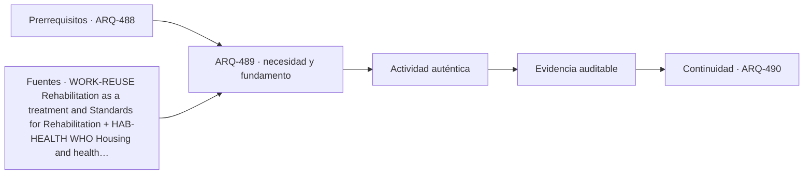

# ARQ-489 · Rehabilitación residencial y cambio demográfico

**Parte 49 · Fase II · Clase desarrollada · Incorporada en v0.27.0.**

Prerrequisitos conceptuales: ARQ-488. Sin calendario. Casos, cantidades y resultados son ficticios salvo antecedentes expresamente atribuidos. Material educativo: no constituye proyecto ejecutable, cálculo firmado, autorización, certificación ni habilitación profesional. Revisión externa especializada pendiente.

## Pregunta central

¿Cómo adaptar vivienda existente sin convertir una necesidad nueva en demolición automática o en conservación intocable?

## Resultado y continuidad

Esta clase aplica los fundamentos de la Fase I a una tipología concreta. El resultado esperado es poder explicar decisiones, interfaces y evidencia sin copiar soluciones de otro edificio. La clase siguiente conserva el método, no las cifras, salvo cuando un caso continuo se declara expresamente.

## 1. Tipo, programa y contexto

La vivienda existente contiene geometría, materiales, modificaciones y usos. Antes de intervenir se distingue documento histórico de condición observada y de hipótesis.

## 2. Organización espacial y usuarios

Teletrabajo, cuidados, envejecimiento o subdivisión cambian tareas. El programa actualizado debe partir de actividades actuales y futuras plausibles, no solo de la planta original.

## 3. Sistema constructivo y técnico

Hay cambios reversibles, reparaciones, redistribuciones y modificaciones estructurales. La alternativa mínima no siempre es la de menor área; es la que satisface el objetivo con impactos justificados y evidencia suficiente.

## 4. Representar vivienda como secuencia de actividades

En vivienda conviene trabajar simultáneamente con planta, corte y secuencia de uso. La planta muestra relaciones y superficies; el corte permite estudiar niveles, luz, privacidad, envolvente e instalaciones; la secuencia obliga a seguir actividades reales como llegar con compras, cocinar, acompañar a otra persona, trabajar, dormir, lavar, almacenar y sacar residuos. Una propuesta puede parecer ordenada en planta y fallar al seguir una de estas cadenas completas.

La documentación debe diferenciar **área privada, área compartida, circulación, apoyo técnico y espacio exterior**. No todas son intercambiables. Aumentar una categoría manteniendo el total obliga a reconocer qué otra disminuye. Esa disciplina evita presentar una ganancia de superficie como si fuera gratuita.

## 5. Estructura, instalaciones y construcción desde el comienzo

La vivienda contiene redes de agua, saneamiento, electricidad, ventilación y, según el caso, climatización y datos. Concentrarlas puede simplificar trazados, pero también crear dependencias o limitar futuras transformaciones. La estructura condiciona luces, aperturas y crecimiento; la envolvente condiciona confort y mantenimiento. Ninguna de estas capas debe aparecer después de cerrar la distribución como si solo necesitara “acomodarse”.

Durante construcción, las tolerancias y la secuencia importan incluso en edificios pequeños. Una junta, una pendiente o una cota mal coordinada puede afectar agua, puertas, mobiliario o acabados. La escala doméstica no convierte esos encuentros en triviales: los acerca a la vida cotidiana y los repite durante años de uso.

## 6. Operación, mantenimiento y transformación

Una vivienda necesita ser limpiada, reparada, ventilada, calentada o enfriada, abastecida y modificada. El proyecto debe preguntar quién accede a cubiertas, equipos, filtros, fachadas o llaves de corte y qué ocurre cuando una parte queda fuera de servicio. Una solución técnicamente posible pero inaccesible para mantenimiento puede trasladar costos y riesgos al futuro.

También se estudia la **reversibilidad**: qué tabiques pueden cambiar, qué redes están atrapadas, qué aperturas dependen de elementos resistentes y qué dimensiones permiten otros usos. Adaptabilidad no significa que cualquier espacio sirva para cualquier cosa; significa que las transformaciones previstas tienen caminos y límites comprensibles.

## Caso trabajado

Caso **REH-VIV-01**: casa existente de 120 m². Se necesitan 12 m² adicionales para trabajo y 6 para un baño accesible. Opción A amplía 18 m²: 138 totales. Opción B redistribuye 20 m² existentes, pierde 4 m² de almacenamiento y mantiene 120. La comparación necesita valorar estructura, luz, accesibilidad, patrimonio, costo y operación; el menor total no es ganador automático.

## Lectura paso a paso del caso

- **Fija la frontera.** Identifica qué superficies, plantas, equipos o intervalos pertenecen al caso y cuáles proceden de otros ejercicios.

- **Conserva las unidades.** Antes de comparar porcentajes o razones, verifica que numerador y denominador representen la misma versión y el mismo servicio.

- **Cambia una hipótesis cada vez.** Una variante debe indicar qué modifica y qué mantiene; de lo contrario no podrás atribuir la diferencia observada.

- **Comprueba por otra vía cuando sea posible.** Suma y resta áreas, revisa equilibrio, reconstruye una secuencia o compara con un límite geométrico.

- **Escribe lo que el número no demuestra.** La cuenta puede ser correcta y aun faltar normativa, comportamiento físico, participación de usuarios, costo, mantenimiento o aprobación profesional.

Este procedimiento convierte el ejemplo en una herramienta transferible. La meta no es memorizar la cifra, sino poder reconstruir por qué aparece y reconocer cuándo otra tipología exigiría cambiar el modelo.

## Profundización: interfaces que deben permanecer visibles

En esta tipología, una decisión espacial rara vez pertenece a una sola disciplina. Programa, estructura, envolvente, instalaciones, accesibilidad, incendio, costo, construcción y mantenimiento se encuentran en interfaces. La clase exige identificar qué dato alimenta cada decisión y quién debería producir o revisar la evidencia en un proyecto real. Un resultado geométrico favorable no compensa una condición necesaria desconocida.

## Errores frecuentes y comprobaciones de calidad

Evita transferir automáticamente dimensiones o capacidades desde ejemplos anteriores, presentar un promedio como descripción de todos los estados, confundir área con funcionamiento, o utilizar una fuente de otra jurisdicción como autorización. Comprueba unidades, fronteras, versión del caso y coherencia entre planta, sección y operación. Si una afirmación depende de una norma, ensayo o especialista no consultado, permanece pendiente.

*Figura 489. Relaciones conceptuales de la clase. No constituye plano ni detalle ejecutable.*

## Práctica independiente

Vivienda de 90 m² necesita 14 m² para una nueva actividad. Compara ampliación de 14 m² con redistribución de 16 m² que reduce almacenamiento en 5 m².

Solución razonada

Ampliación=104 m². Redistribución mantiene 90 pero cambia dos funciones. La selección requiere medir consecuencias, no solo área; una redistribución puede ser menos invasiva o más conflictiva según el caso.

La solución corresponde al modelo declarado. En una obra real deben confirmarse terreno, programa, legislación, permisos, productos, ensayos, responsabilidades profesionales, operación y condiciones de mantenimiento aplicables.

## Autoevaluación y transferencia

Puedes avanzar cuando reconstruyes el caso sin mirar la respuesta, explicas al menos una conclusión respaldada y otra que no puede sostenerse con los datos, y señalas qué documento, medición o especialista permitiría resolver la incertidumbre. El objetivo es transferir el razonamiento a otra tipología sin copiar la forma.

<!-- pedagogia-2026:inicio -->
## Decisión pedagógica y posición curricular

### Por qué existe

Esta clase existe para resolver una necesidad concreta del recorrido: ¿Cómo adaptar vivienda existente sin convertir una necesidad nueva en demolición automática o en conservación intocable?

### Por qué está exactamente aquí

Ocupa el lugar 9 de la Parte 49. Se estudia después de ARQ-488 · Vivienda modular e industrializada porque usa esa base para responder «¿Cómo adaptar vivienda existente sin convertir una necesidad nueva en demolición automática o en conservación intocable?». Se ubica antes de ARQ-490 · Proyecto residencial integral: del terreno a la operación porque la evidencia producida aquí debe estar disponible para ese paso.

- **Prerrequisitos:** `ARQ-488`
- **Capacidad que introduce:** Esta clase aplica los fundamentos de la Fase I a una tipología concreta. El resultado esperado es poder explicar decisiones, interfaces y evidencia sin copiar soluciones de otro edificio. La clase siguiente conserva el método, no las cifras, salvo cuando un caso continuo se declara expresamente.
- **Clases o experiencias que dependen de ella:** `ARQ-490`

El diagrama permite comprobar una relación que el texto lineal oculta con facilidad: esta clase recibe capacidades previas, toma decisiones apoyadas por fuentes, exige una experiencia y produce evidencia que habilita trabajo posterior. No representa un procedimiento de obra.

## Resultado observable, evidencia y evaluación

1. Identificar y delimitar las condiciones necesarias para responder la pregunta central de rehabilitación residencial y cambio demográfico.
2. Producir y comprobar la evidencia declarada por la clase: Esta clase aplica los fundamentos de la Fase I a una tipología concreta. El resultado esperado es poder explicar decisiones, interfaces y evidencia sin copiar soluciones de otro edificio. La clase siguiente conserva el método, no las cifras, salvo cuando un caso continuo se declara expresamente.
3. Justificar una decisión de rehabilitación residencial y cambio demográfico mediante fuentes, supuestos, alternativas y límites explícitos.

## Actividad, evidencia y criterio de aceptación

**Actividad:** Vivienda de 90 m² necesita 14 m² para una nueva actividad. Compara ampliación de 14 m² con redistribución de 16 m² que reduce almacenamiento en 5 m².

**Evidencia mínima:** Esta clase aplica los fundamentos de la Fase I a una tipología concreta. El resultado esperado es poder explicar decisiones, interfaces y evidencia sin copiar soluciones de otro edificio. La clase siguiente conserva el método, no las cifras, salvo cuando un caso continuo se declara expresamente.

**Archivo sugerido:** `evidence/ARQ-489/evidencia.md`.

**Criterio de aceptación:** la entrega se acepta cuando:

- La entrega responde explícitamente a la pregunta: ¿Cómo adaptar vivienda existente sin convertir una necesidad nueva en demolición automática o en conservación intocable?
- La actividad conserva las fronteras del caso y permite reconstruir el procedimiento: Vivienda de 90 m² necesita 14 m² para una nueva actividad. Compara ampliación de 14 m² con redistribución de 16 m² que reduce almacenamiento en 5 m².
- Cada afirmación externa puede seguirse hasta una fuente, su alcance consultado y su límite.
- La evidencia deja disponible una entrada comprobable para ARQ-490.
- Evita transferir automáticamente dimensiones o capacidades desde ejemplos anteriores, presentar un promedio como descripción de todos los estados, confundir área con funcionamiento, o utilizar una fuente de otra jurisdicción como autorización. Comprueba unidades, fronteras, versión del caso y coherencia entre planta, sección y operación.

La [rúbrica común](../../docs/RUBRICA_COMUN.md) complementa estos criterios; no los reemplaza. Una entrega puede superar un promedio y continuar pendiente si oculta una condición crítica.

## Trazabilidad de las decisiones

| # | Decisión o fundamento | Fuente utilizada | Aplicación y límite en esta clase |
|---:|---|---|---|
| 1 | Compatibilidad de uso, conservación de características documentadas y evaluación de adiciones. | [WORK-REUSE Rehabilitation as a treatment and Standards for…](https://www.nps.gov/articles/000/treatment-standards-rehabilitation.htm) | Consulta: Texto web de los criterios generales de rehabilitación. Límite: Referencia conceptual estadounidense, no permiso ni normativa patrimonial aplicable automáticamente en Chile. No se prescribe intervención material. |
| 2 | Amplitud de condiciones de vivienda relacionadas con salud: ocupación, temperatura, accesibilidad y riesgos. | [HAB-HEALTH WHO Housing and health guidelines, 2018](https://www.who.int/publications/i/item/9789241550376) | Consulta: Página de presentación y alcance de la guía. Límite: No se revisó íntegramente la guía ni se adoptan umbrales médicos o constructivos. Los casos no diagnostican salud ni habilitan obras. |
| 3 | Accesibilidad y usabilidad del entorno edificado dentro de su alcance | [ISO-21542 ISO 21542:2021 — Accessibility and usability of the built…](https://www.iso.org/standard/71860.html) | Consulta: Ficha pública Límite: No usar medidas de referencia como anchos legales; confirmar OGUC y demás requisitos locales. No cubre por sí sola todo el espacio público. |

La tabla permite auditar las relaciones; la explicación, el caso y la práctica de la clase siguen siendo la documentación principal.

## Autoevaluación, recuperación y continuidad

### Errores diagnósticos

Antes de avanzar, comprueba si puedes reconstruir cada resultado sin mirar la solución, señalar qué evidencia lo sostiene y nombrar una condición que obligaría a revisar tu decisión. Conserva la primera versión, la objeción recibida y la revisión.

**Conexión siguiente:** La continuidad inmediata es ARQ-490 · Proyecto residencial integral: del terreno a la operación; conserva el método y vuelve a verificar datos y límites.
<!-- pedagogia-2026:fin -->

## Fuentes y alcance de uso

### [[WORK-REUSE]](#FUENTE-WORK-REUSE) Rehabilitation as a treatment and Standards for Rehabilitation

U.S. National Park Service. [https://www.nps.gov/articles/000/treatment-standards-rehabilitation.htm](https://www.nps.gov/articles/000/treatment-standards-rehabilitation.htm)

**Consulta:** Texto web de los criterios generales de rehabilitación. **Apoyo:** Compatibilidad de uso, conservación de características documentadas y evaluación de adiciones. **Límite:** Referencia conceptual estadounidense, no permiso ni normativa patrimonial aplicable automáticamente en Chile. No se prescribe intervención material.

### [[HAB-HEALTH]](#FUENTE-HAB-HEALTH) WHO Housing and health guidelines, 2018

World Health Organization. [https://www.who.int/publications/i/item/9789241550376](https://www.who.int/publications/i/item/9789241550376)

**Consulta:** Página de presentación y alcance de la guía. **Apoyo:** Amplitud de condiciones de vivienda relacionadas con salud: ocupación, temperatura, accesibilidad y riesgos. **Límite:** No se revisó íntegramente la guía ni se adoptan umbrales médicos o constructivos. Los casos no diagnostican salud ni habilitan obras.

### [[ISO-21542]](#FUENTE-ISO-21542) ISO 21542:2021 — Accessibility and usability of the built environment

ISO. [https://www.iso.org/standard/71860.html](https://www.iso.org/standard/71860.html)

**Consulta:** Ficha pública **Apoyo:** Accesibilidad y usabilidad del entorno edificado dentro de su alcance **Límite:** No usar medidas de referencia como anchos legales; confirmar OGUC y demás requisitos locales. No cubre por sí sola todo el espacio público.
