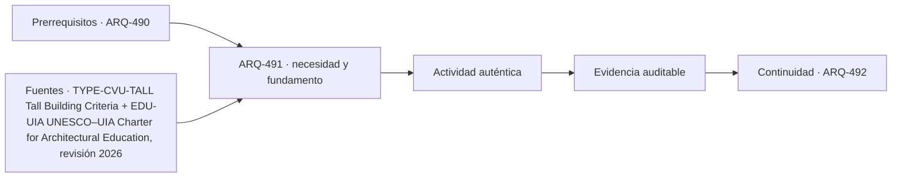

# ARQ-491 · Qué hace alto a un edificio: contexto, proporción y medición

**Parte 50 · Fase II · Clase desarrollada · Incorporada en v0.27.0.**

Prerrequisitos conceptuales: ARQ-490. Sin calendario. Casos, cantidades y resultados son ficticios salvo antecedentes expresamente atribuidos. Material educativo: no constituye proyecto ejecutable, cálculo firmado, autorización, certificación ni habilitación profesional. Revisión externa especializada pendiente.

## Pregunta central

¿Por qué la altura de un edificio no se describe adecuadamente con un único número?

## Resultado y continuidad

Esta clase aplica los fundamentos de la Fase I a una tipología concreta. El resultado esperado es poder explicar decisiones, interfaces y evidencia sin copiar soluciones de otro edificio. La clase siguiente conserva el método, no las cifras, salvo cuando un caso continuo se declara expresamente.

## 1. Tipo, programa y contexto

El Council on Vertical Urbanism señala que no existe una definición absoluta única de edificio alto: contexto y proporción importan. Una torre de catorce pisos puede dominar un entorno bajo y resultar ordinaria en otro de gran altura [[TYPE-CVU-TALL]](#FUENTE-TYPE-CVU-TALL).

## 2. Organización espacial y usuarios

Altura arquitectónica, piso ocupado más alto y punto máximo responden a preguntas distintas. Antenas y equipos pueden afectar una medida y no otra. En proyecto, además, cotas de terreno y accesos exigen declarar el datum.

## 3. Sistema constructivo y técnico

Dos edificios con la misma altura pueden tener proporciones, plantas y respuesta al viento diferentes. Altura no identifica automáticamente complejidad estructural, número de ocupantes ni demanda de ascensores.

## 4. Sección vertical como documento principal

En un edificio alto la sección deja de ser una representación secundaria. Debe mostrar zonas de ascensores, plantas técnicas, cambios de uso, presión de servicios, transferencias estructurales, refugios, accesos de mantenimiento y coronación. La planta repetitiva puede ocultar que el edificio cambia varias veces a lo largo de su altura.

Conviene acompañar la sección con diagramas por **zonas y estados**: qué ascensores sirven cada tramo, qué redes atraviesan o terminan, dónde se transfieren cargas y qué partes continúan operando ante una indisponibilidad. El diagrama no sustituye cálculos ni normas, pero vuelve visibles dependencias que una imagen exterior no revela.

## 5. Repetición, tolerancias y acumulación

Una torre multiplica decisiones. Pequeñas variaciones de cota, acortamientos, tolerancias, espesores o desplazamientos pueden acumularse o repetirse decenas de veces. Por eso la coordinación necesita referencias comunes y control de versiones entre estructura, fachada, ascensores e instalaciones. “Es la misma planta” no significa que todas las condiciones sean idénticas.

La repetición también amplifica la operación: filtros, válvulas, puertas, juntas, vidrios y dispositivos de seguridad se cuentan por cientos o miles. El costo de inspeccionar, limpiar o sustituir debe considerarse junto con el costo inicial. Una fachada espectacular que solo puede repararse mediante una operación excepcional puede ser una decisión operativa importante, no un detalle posterior.

## 6. Edificio alto como infraestructura habitada

La torre combina edificio e infraestructura vertical. Necesita mover personas, agua, aire, energía, datos, residuos y equipos entre cotas muy diferentes. Cada red tiene pérdidas, capacidad, puntos de aislamiento y dependencias. La arquitectura organiza esos sistemas alrededor de programas que también cambian por altura.

El análisis debe separar **resistencia, servicio y continuidad**. Una estructura puede resistir y moverse de forma incómoda; un ascensor puede operar y no aportar suficiente capacidad en un pico; una red puede tener dos bombas y depender de un único suministro. El proyecto tipológico debe revelar esas diferencias, no resumirlas bajo una etiqueta como “rascacielos inteligente”.

## Caso trabajado

Caso **ALTO-01**: torre ficticia de 180 m hasta coronación arquitectónica, 168 m hasta piso ocupado más alto y 195 m hasta punta técnica. Informar “195 m de altura” sin decir referencia puede confundir comparación arquitectónica con alcance técnico. Con planta de 30 m de ancho, la razón H/B es 6 usando 180 m; usando 195 es 6,5. La convención cambia el indicador.

## Lectura paso a paso del caso

- **Fija la frontera.** Identifica qué superficies, plantas, equipos o intervalos pertenecen al caso y cuáles proceden de otros ejercicios.

- **Conserva las unidades.** Antes de comparar porcentajes o razones, verifica que numerador y denominador representen la misma versión y el mismo servicio.

- **Cambia una hipótesis cada vez.** Una variante debe indicar qué modifica y qué mantiene; de lo contrario no podrás atribuir la diferencia observada.

- **Comprueba por otra vía cuando sea posible.** Suma y resta áreas, revisa equilibrio, reconstruye una secuencia o compara con un límite geométrico.

- **Escribe lo que el número no demuestra.** La cuenta puede ser correcta y aun faltar normativa, comportamiento físico, participación de usuarios, costo, mantenimiento o aprobación profesional.

Este procedimiento convierte el ejemplo en una herramienta transferible. La meta no es memorizar la cifra, sino poder reconstruir por qué aparece y reconocer cuándo otra tipología exigiría cambiar el modelo.

## Profundización: interfaces que deben permanecer visibles

En esta tipología, una decisión espacial rara vez pertenece a una sola disciplina. Programa, estructura, envolvente, instalaciones, accesibilidad, incendio, costo, construcción y mantenimiento se encuentran en interfaces. La clase exige identificar qué dato alimenta cada decisión y quién debería producir o revisar la evidencia en un proyecto real. Un resultado geométrico favorable no compensa una condición necesaria desconocida.

## Errores frecuentes y comprobaciones de calidad

Evita transferir automáticamente dimensiones o capacidades desde ejemplos anteriores, presentar un promedio como descripción de todos los estados, confundir área con funcionamiento, o utilizar una fuente de otra jurisdicción como autorización. Comprueba unidades, fronteras, versión del caso y coherencia entre planta, sección y operación. Si una afirmación depende de una norma, ensayo o especialista no consultado, permanece pendiente.

*Figura 491. Relaciones conceptuales de la clase. No constituye plano ni detalle ejecutable.*

## Práctica independiente

Edificio con 150 m arquitectónicos, 142 m al último piso ocupado y 162 m a punta; ancho 25 m. Calcula H/B con las tres referencias y explica cuál usarías para cada pregunta.

Solución razonada

H/B=6,0; 5,68; 6,48. No hay una cifra universal: arquitectura, ocupación y geometría técnica usan referencias diferentes. Debe declararse la convención y el datum.

La solución corresponde al modelo declarado. En una obra real deben confirmarse terreno, programa, legislación, permisos, productos, ensayos, responsabilidades profesionales, operación y condiciones de mantenimiento aplicables.

## Autoevaluación y transferencia

Puedes avanzar cuando reconstruyes el caso sin mirar la respuesta, explicas al menos una conclusión respaldada y otra que no puede sostenerse con los datos, y señalas qué documento, medición o especialista permitiría resolver la incertidumbre. El objetivo es transferir el razonamiento a otra tipología sin copiar la forma.

<!-- pedagogia-2026:inicio -->
## Decisión pedagógica y posición curricular

### Por qué existe

Esta clase existe para resolver una necesidad concreta del recorrido: ¿Por qué la altura de un edificio no se describe adecuadamente con un único número?

### Por qué está exactamente aquí

Abre la Parte 50 porque plantea primero el problema «¿Por qué la altura de un edificio no se describe adecuadamente con un único número?». La transición desde ARQ-490 · Proyecto residencial integral: del terreno a la operación conserva métodos de evidencia y límites, pero no traslada parámetros del bloque anterior. Establece la pregunta y el producto base que ARQ-492 · Historia tecnológica del rascacielos desarrollará a continuación.

- **Prerrequisitos:** `ARQ-490`
- **Capacidad que introduce:** Esta clase aplica los fundamentos de la Fase I a una tipología concreta. El resultado esperado es poder explicar decisiones, interfaces y evidencia sin copiar soluciones de otro edificio. La clase siguiente conserva el método, no las cifras, salvo cuando un caso continuo se declara expresamente.
- **Clases o experiencias que dependen de ella:** `ARQ-492`

El diagrama permite comprobar una relación que el texto lineal oculta con facilidad: esta clase recibe capacidades previas, toma decisiones apoyadas por fuentes, exige una experiencia y produce evidencia que habilita trabajo posterior. No representa un procedimiento de obra.

## Resultado observable, evidencia y evaluación

1. Identificar y delimitar las condiciones necesarias para responder la pregunta central de qué hace alto a un edificio: contexto, proporción y medición.
2. Producir y comprobar la evidencia declarada por la clase: Esta clase aplica los fundamentos de la Fase I a una tipología concreta. El resultado esperado es poder explicar decisiones, interfaces y evidencia sin copiar soluciones de otro edificio. La clase siguiente conserva el método, no las cifras, salvo cuando un caso continuo se declara expresamente.
3. Justificar una decisión de qué hace alto a un edificio: contexto, proporción y medición mediante fuentes, supuestos, alternativas y límites explícitos.

## Actividad, evidencia y criterio de aceptación

**Actividad:** Edificio con 150 m arquitectónicos, 142 m al último piso ocupado y 162 m a punta; ancho 25 m. Calcula H/B con las tres referencias y explica cuál usarías para cada pregunta.

**Evidencia mínima:** Esta clase aplica los fundamentos de la Fase I a una tipología concreta. El resultado esperado es poder explicar decisiones, interfaces y evidencia sin copiar soluciones de otro edificio. La clase siguiente conserva el método, no las cifras, salvo cuando un caso continuo se declara expresamente.

**Archivo sugerido:** `evidence/ARQ-491/evidencia.md`.

**Criterio de aceptación:** la entrega se acepta cuando:

- La entrega responde explícitamente a la pregunta: ¿Por qué la altura de un edificio no se describe adecuadamente con un único número?
- La actividad conserva las fronteras del caso y permite reconstruir el procedimiento: Edificio con 150 m arquitectónicos, 142 m al último piso ocupado y 162 m a punta; ancho 25 m. Calcula H/B con las tres referencias y explica cuál usarías para cada pregunta.
- Cada afirmación externa puede seguirse hasta una fuente, su alcance consultado y su límite.
- La evidencia deja disponible una entrada comprobable para ARQ-492.
- Evita transferir automáticamente dimensiones o capacidades desde ejemplos anteriores, presentar un promedio como descripción de todos los estados, confundir área con funcionamiento, o utilizar una fuente de otra jurisdicción como autorización. Comprueba unidades, fronteras, versión del caso y coherencia entre planta, sección y operación.

La [rúbrica común](../../docs/RUBRICA_COMUN.md) complementa estos criterios; no los reemplaza. Una entrega puede superar un promedio y continuar pendiente si oculta una condición crítica.

## Trazabilidad de las decisiones

| # | Decisión o fundamento | Fuente utilizada | Aplicación y límite en esta clase |
|---:|---|---|---|
| 1 | Distinguir altura relativa al contexto, proporción y diferentes referencias de medición en edificios altos. | [TYPE-CVU-TALL Tall Building Criteria](https://skyscrapercenter.com/criteria) | Consulta: Página pública de criterios de altura y definición de edificios altos. Límite: No constituye código de edificación, criterio de seguridad ni definición jurídica universal de edificio en altura. |
| 2 | Amplitud de la formación arquitectónica y uso de IA complementario al pensamiento de diseño | [EDU-UIA UNESCO–UIA Charter for Architectural Education, revisión 2026](https://www.uia-architectes.org/en/news/unesco-uia-charter-for-architectural-education-revised-edition-2026/) | Consulta: Noticia oficial y alcance de la revisión Límite: No se revisó aquí el texto integral de la Carta ni se obtuvo validación o acreditación del programa. |

La tabla permite auditar las relaciones; la explicación, el caso y la práctica de la clase siguen siendo la documentación principal.

## Autoevaluación, recuperación y continuidad

### Errores diagnósticos

Antes de avanzar, comprueba si puedes reconstruir cada resultado sin mirar la solución, señalar qué evidencia lo sostiene y nombrar una condición que obligaría a revisar tu decisión. Conserva la primera versión, la objeción recibida y la revisión.

**Conexión siguiente:** La continuidad inmediata es ARQ-492 · Historia tecnológica del rascacielos; conserva el método y vuelve a verificar datos y límites.
<!-- pedagogia-2026:fin -->

## Fuentes y alcance de uso

### [[TYPE-CVU-TALL]](#FUENTE-TYPE-CVU-TALL) Tall Building Criteria

Council on Vertical Urbanism (formerly CTBUH). [https://skyscrapercenter.com/criteria](https://skyscrapercenter.com/criteria)

**Consulta:** Página pública de criterios de altura y definición de edificios altos. **Apoyo:** Distinguir altura relativa al contexto, proporción y diferentes referencias de medición en edificios altos. **Límite:** No constituye código de edificación, criterio de seguridad ni definición jurídica universal de edificio en altura.

### [[EDU-UIA]](#FUENTE-EDU-UIA) UNESCO–UIA Charter for Architectural Education, revisión 2026

Unión Internacional de Arquitectos. [https://www.uia-architectes.org/en/news/unesco-uia-charter-for-architectural-education-revised-edition-2026/](https://www.uia-architectes.org/en/news/unesco-uia-charter-for-architectural-education-revised-edition-2026/)

**Consulta:** Noticia oficial y alcance de la revisión **Apoyo:** Amplitud de la formación arquitectónica y uso de IA complementario al pensamiento de diseño **Límite:** No se revisó aquí el texto integral de la Carta ni se obtuvo validación o acreditación del programa.
