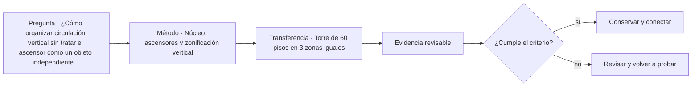

# ARQ-493 · Núcleo, ascensores y zonificación vertical

**Parte 50 · Fase II · Clase desarrollada · Incorporada en v0.27.0.**

Prerrequisitos conceptuales: ARQ-492. Sin calendario. Casos, cantidades y resultados son ficticios salvo antecedentes expresamente atribuidos. Material educativo: no constituye proyecto ejecutable, cálculo firmado, autorización, certificación ni habilitación profesional. Revisión externa especializada pendiente.

## Pregunta central

¿Cómo organizar circulación vertical sin tratar el ascensor como un objeto independiente de la planta y del uso?

## Resultado y continuidad

Esta clase aplica los fundamentos de la Fase I a una tipología concreta. El resultado esperado es poder explicar decisiones, interfaces y evidencia sin copiar soluciones de otro edificio. La clase siguiente conserva el método, no las cifras, salvo cuando un caso continuo se declara expresamente.

## 1. Tipo, programa y contexto

El núcleo reúne ascensores, escaleras, instalaciones, estructura y, a menudo, servicios higiénicos. Su posición condiciona profundidad de planta, recorridos, rigidez y crecimiento de redes.

## 2. Organización espacial y usuarios

Servir todos los pisos con todos los ascensores puede consumir área y aumentar recorridos de cabina. Zonas bajas, medias y altas, sky lobbies o transferencias cambian capacidad y experiencia. La elección depende de población, uso y operación.

## 3. Sistema constructivo y técnico

Un cálculo de tiempo de viaje no equivale a tiempo de espera. Apertura de puertas, embarque, llamadas y agrupamiento importan. Las capacidades deben tratarse con métodos de transporte vertical y requisitos aplicables, no con un solo cociente.

## 4. Sección vertical como documento principal

En un edificio alto la sección deja de ser una representación secundaria. Debe mostrar zonas de ascensores, plantas técnicas, cambios de uso, presión de servicios, transferencias estructurales, refugios, accesos de mantenimiento y coronación. La planta repetitiva puede ocultar que el edificio cambia varias veces a lo largo de su altura.

Conviene acompañar la sección con diagramas por **zonas y estados**: qué ascensores sirven cada tramo, qué redes atraviesan o terminan, dónde se transfieren cargas y qué partes continúan operando ante una indisponibilidad. El diagrama no sustituye cálculos ni normas, pero vuelve visibles dependencias que una imagen exterior no revela.

## 5. Repetición, tolerancias y acumulación

Una torre multiplica decisiones. Pequeñas variaciones de cota, acortamientos, tolerancias, espesores o desplazamientos pueden acumularse o repetirse decenas de veces. Por eso la coordinación necesita referencias comunes y control de versiones entre estructura, fachada, ascensores e instalaciones. “Es la misma planta” no significa que todas las condiciones sean idénticas.

La repetición también amplifica la operación: filtros, válvulas, puertas, juntas, vidrios y dispositivos de seguridad se cuentan por cientos o miles. El costo de inspeccionar, limpiar o sustituir debe considerarse junto con el costo inicial. Una fachada espectacular que solo puede repararse mediante una operación excepcional puede ser una decisión operativa importante, no un detalle posterior.

## 6. Edificio alto como infraestructura habitada

La torre combina edificio e infraestructura vertical. Necesita mover personas, agua, aire, energía, datos, residuos y equipos entre cotas muy diferentes. Cada red tiene pérdidas, capacidad, puntos de aislamiento y dependencias. La arquitectura organiza esos sistemas alrededor de programas que también cambian por altura.

El análisis debe separar **resistencia, servicio y continuidad**. Una estructura puede resistir y moverse de forma incómoda; un ascensor puede operar y no aportar suficiente capacidad en un pico; una red puede tener dos bombas y depender de un único suministro. El proyecto tipológico debe revelar esas diferencias, no resumirlas bajo una etiqueta como “rascacielos inteligente”.

## Caso trabajado

Caso **LIFT-ZONE-01**: 48 pisos se dividen en 3 zonas de 16. Un ascensor que recorre solo su zona tiene desplazamiento vertical máximo menor que uno que sirve 48 pisos, pero necesita transferencia o varios grupos. Si cuatro ascensores requieren 8 m² cada uno, un grupo ocupa 32 m² de huella técnica antes de vestíbulos y estructura; tres grupos no necesariamente se apilan en la misma planta de igual manera.

## Lectura paso a paso del caso

- **Fija la frontera.** Identifica qué superficies, plantas, equipos o intervalos pertenecen al caso y cuáles proceden de otros ejercicios.

- **Conserva las unidades.** Antes de comparar porcentajes o razones, verifica que numerador y denominador representen la misma versión y el mismo servicio.

- **Cambia una hipótesis cada vez.** Una variante debe indicar qué modifica y qué mantiene; de lo contrario no podrás atribuir la diferencia observada.

- **Comprueba por otra vía cuando sea posible.** Suma y resta áreas, revisa equilibrio, reconstruye una secuencia o compara con un límite geométrico.

- **Escribe lo que el número no demuestra.** La cuenta puede ser correcta y aun faltar normativa, comportamiento físico, participación de usuarios, costo, mantenimiento o aprobación profesional.

Este procedimiento convierte el ejemplo en una herramienta transferible. La meta no es memorizar la cifra, sino poder reconstruir por qué aparece y reconocer cuándo otra tipología exigiría cambiar el modelo.

## Profundización: interfaces que deben permanecer visibles

En esta tipología, una decisión espacial rara vez pertenece a una sola disciplina. Programa, estructura, envolvente, instalaciones, accesibilidad, incendio, costo, construcción y mantenimiento se encuentran en interfaces. La clase exige identificar qué dato alimenta cada decisión y quién debería producir o revisar la evidencia en un proyecto real. Un resultado geométrico favorable no compensa una condición necesaria desconocida.

## Errores frecuentes y comprobaciones de calidad

Evita transferir automáticamente dimensiones o capacidades desde ejemplos anteriores, presentar un promedio como descripción de todos los estados, confundir área con funcionamiento, o utilizar una fuente de otra jurisdicción como autorización. Comprueba unidades, fronteras, versión del caso y coherencia entre planta, sección y operación. Si una afirmación depende de una norma, ensayo o especialista no consultado, permanece pendiente.

*Figura 493. Relaciones conceptuales de la clase. No constituye plano ni detalle ejecutable.*

## Práctica independiente

Torre de 60 pisos en 3 zonas iguales. Cinco ascensores por zona, 7,5 m² de hueco cada uno. Calcula superficie bruta de huecos por grupo y explica por qué 112,5 m² no representa automáticamente el núcleo de cada planta.

Solución razonada

Cada grupo: 37,5 m². Tres grupos suman 112,5 m² si coexistieran en una planta, pero la zonificación puede terminar o transferir huecos a distintas alturas. Faltan vestíbulos, muros, escaleras, estructura y equipos.

La solución corresponde al modelo declarado. En una obra real deben confirmarse terreno, programa, legislación, permisos, productos, ensayos, responsabilidades profesionales, operación y condiciones de mantenimiento aplicables.

## Autoevaluación y transferencia

Puedes avanzar cuando reconstruyes el caso sin mirar la respuesta, explicas al menos una conclusión respaldada y otra que no puede sostenerse con los datos, y señalas qué documento, medición o especialista permitiría resolver la incertidumbre. El objetivo es transferir el razonamiento a otra tipología sin copiar la forma.

<!-- pedagogia-2026:inicio -->
## Mapa visual de aprendizaje

El diagrama representa el ciclo de aprendizaje de esta clase, no una secuencia de obra ni un procedimiento profesional.

## Resultado observable, evidencia y evaluación

**Tipo de clase:** cuantitativa.

**Evidencia mínima:** desarrollo reproducible con datos, unidades, hipótesis, control independiente y conclusión limitada al modelo.

**Archivo sugerido:** `evidence/ARQ-493/evidencia.md`.

| Criterio | Evidencia observable |
|---|---|
| Precisión y representación · 20 % | Los conceptos, unidades y convenciones se usan de forma coherente y pueden ser reconstruidos por otra persona. |
| Evidencia y trazabilidad · 25 % | Cada afirmación importante se vincula con dato, cálculo, observación o fuente; hipótesis y desconocidos permanecen visibles. |
| Decisión y alternativas · 25 % | La decisión responde a la pregunta, compara al menos una alternativa y declara qué condición la haría cambiar. |
| Integración y ciclo de vida · 20 % | Se identifica una interfaz y una consecuencia para construcción, uso, mantenimiento, adaptación o fin de vida. |
| Comunicación, ética y límites · 10 % | El alcance se entiende sin explicación oral adicional y no se atribuyen permisos, competencias o certezas inexistentes. |

**Criterio de aceptación:** 80/100 y ningún criterio bajo 60 %. Una entrega genérica que podría reutilizarse sin cambios en otra clase no demuestra dominio. Si existe una condición crítica de seguridad, accesibilidad, evidencia o responsabilidad sin resolver, la entrega permanece pendiente aunque el promedio supere 80.

### Errores diagnósticos

En esta clase conviene vigilar especialmente: perder unidades; ocultar hipótesis; redondear antes de tiempo; convertir el resultado del modelo en autorización.

## Autoevaluación, recuperación y continuidad

Antes de avanzar, responde sin consultar la solución:

1. ¿Qué decisión concreta puedes tomar ahora que no podías justificar antes?
2. ¿Qué evidencia de tu entrega es comprobada y cuál continúa siendo una hipótesis?
3. ¿Qué cambio de contexto invalidaría la transferencia realizada?

Revisa la entrega a las 24–48 horas y nuevamente al cerrar la parte. Conserva la primera versión, la crítica recibida y la versión revisada: el aprendizaje se demuestra también mediante el cambio entre versiones.
<!-- pedagogia-2026:fin -->

## Fuentes y alcance de uso

### [[SERV-LIFT]](#FUENTE-SERV-LIFT) Registro Nacional de Instaladores, Mantenedores y Certificadores de Ascensores

Ministerio de Vivienda y Urbanismo, Chile. [https://proveedores-tecnicos.minvu.gob.cl/registro-nacional-de-ascensores-2/](https://proveedores-tecnicos.minvu.gob.cl/registro-nacional-de-ascensores-2/)

**Consulta:** Página oficial: definición del registro y especialidades de instalación, mantenimiento y certificación. **Apoyo:** Identificar responsabilidades distintas y la necesidad de verificar el alcance de cada prestador. **Límite:** No se comprobaron inscripciones individuales ni todos los reglamentos enlazados. No se reproducen requisitos cuantitativos de habilitación.

### [[TYPE-NIST-EGRESS]](#FUENTE-TYPE-NIST-EGRESS) The Use of Elevators for Evacuation in Fire Emergencies in International Buildings

National Institute of Standards and Technology. [https://www.nist.gov/publications/use-elevators-evacuation-fire-emergencies-international-buildings](https://www.nist.gov/publications/use-elevators-evacuation-fire-emergencies-international-buildings)

**Consulta:** Ficha pública y resumen del NIST Technical Note 1825. **Apoyo:** Problemas de evacuación en edificios altos, uso protegido de ascensores y factores humanos. **Límite:** No se implementa un procedimiento normativo de evacuación ni se trasladan exigencias estadounidenses a Chile.
