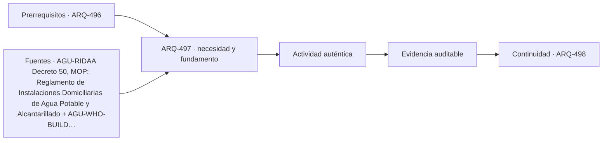

# ARQ-497 · Distribución vertical de agua, energía y climatización

**Parte 50 · Fase II · Clase desarrollada · Incorporada en v0.27.0.**

Prerrequisitos conceptuales: ARQ-496. Sin calendario. Casos, cantidades y resultados son ficticios salvo antecedentes expresamente atribuidos. Material educativo: no constituye proyecto ejecutable, cálculo firmado, autorización, certificación ni habilitación profesional. Revisión externa especializada pendiente.

## Pregunta central

¿Cómo cambia una instalación cuando debe servir decenas de pisos con diferencias de cota, zonas y espacios técnicos?

## Resultado y continuidad

Esta clase aplica los fundamentos de la Fase I a una tipología concreta. El resultado esperado es poder explicar decisiones, interfaces y evidencia sin copiar soluciones de otro edificio. La clase siguiente conserva el método, no las cifras, salvo cuando un caso continuo se declara expresamente.

## 1. Tipo, programa y contexto

En agua, una columna vertical introduce diferencia de presión proporcional a altura. Por eso las torres pueden requerir zonificación, equipos y depósitos; la presión disponible en un punto no se entiende sin su cota y estado.

## 2. Organización espacial y usuarios

Energía, aire, agua, datos y extracción necesitan recorridos verticales y horizontales. Plantas técnicas pueden reducir longitudes o separar zonas, pero consumen volumen y exigen mantenimiento.

## 3. Sistema constructivo y técnico

Una falla en una red vertical puede afectar muchos pisos. Secciones aislables, rutas alternativas o reservas deben definirse por servicio y criticidad; duplicar equipos no garantiza independencia si comparten una dependencia común.

## 4. Sección vertical como documento principal

En un edificio alto la sección deja de ser una representación secundaria. Debe mostrar zonas de ascensores, plantas técnicas, cambios de uso, presión de servicios, transferencias estructurales, refugios, accesos de mantenimiento y coronación. La planta repetitiva puede ocultar que el edificio cambia varias veces a lo largo de su altura.

Conviene acompañar la sección con diagramas por **zonas y estados**: qué ascensores sirven cada tramo, qué redes atraviesan o terminan, dónde se transfieren cargas y qué partes continúan operando ante una indisponibilidad. El diagrama no sustituye cálculos ni normas, pero vuelve visibles dependencias que una imagen exterior no revela.

## 5. Repetición, tolerancias y acumulación

Una torre multiplica decisiones. Pequeñas variaciones de cota, acortamientos, tolerancias, espesores o desplazamientos pueden acumularse o repetirse decenas de veces. Por eso la coordinación necesita referencias comunes y control de versiones entre estructura, fachada, ascensores e instalaciones. “Es la misma planta” no significa que todas las condiciones sean idénticas.

La repetición también amplifica la operación: filtros, válvulas, puertas, juntas, vidrios y dispositivos de seguridad se cuentan por cientos o miles. El costo de inspeccionar, limpiar o sustituir debe considerarse junto con el costo inicial. Una fachada espectacular que solo puede repararse mediante una operación excepcional puede ser una decisión operativa importante, no un detalle posterior.

## 6. Edificio alto como infraestructura habitada

La torre combina edificio e infraestructura vertical. Necesita mover personas, agua, aire, energía, datos, residuos y equipos entre cotas muy diferentes. Cada red tiene pérdidas, capacidad, puntos de aislamiento y dependencias. La arquitectura organiza esos sistemas alrededor de programas que también cambian por altura.

El análisis debe separar **resistencia, servicio y continuidad**. Una estructura puede resistir y moverse de forma incómoda; un ascensor puede operar y no aportar suficiente capacidad en un pico; una red puede tener dos bombas y depender de un único suministro. El proyecto tipológico debe revelar esas diferencias, no resumirlas bajo una etiqueta como “rascacielos inteligente”.

## Caso trabajado

Caso **AGUA-ALTA-01**: diferencia de cota de 120 m. Con agua ideal y g=9,81 m/s², la diferencia hidrostática es ρgh≈1.177 kPa, cerca de 11,77 bar, antes de pérdidas y controles. Dividir en dos zonas de 60 m reduce la diferencia ideal por zona a ≈588,6 kPa. Esto no selecciona válvulas ni bombas.

## Lectura paso a paso del caso

- **Fija la frontera.** Identifica qué superficies, plantas, equipos o intervalos pertenecen al caso y cuáles proceden de otros ejercicios.

- **Conserva las unidades.** Antes de comparar porcentajes o razones, verifica que numerador y denominador representen la misma versión y el mismo servicio.

- **Cambia una hipótesis cada vez.** Una variante debe indicar qué modifica y qué mantiene; de lo contrario no podrás atribuir la diferencia observada.

- **Comprueba por otra vía cuando sea posible.** Suma y resta áreas, revisa equilibrio, reconstruye una secuencia o compara con un límite geométrico.

- **Escribe lo que el número no demuestra.** La cuenta puede ser correcta y aun faltar normativa, comportamiento físico, participación de usuarios, costo, mantenimiento o aprobación profesional.

Este procedimiento convierte el ejemplo en una herramienta transferible. La meta no es memorizar la cifra, sino poder reconstruir por qué aparece y reconocer cuándo otra tipología exigiría cambiar el modelo.

## Profundización: interfaces que deben permanecer visibles

En esta tipología, una decisión espacial rara vez pertenece a una sola disciplina. Programa, estructura, envolvente, instalaciones, accesibilidad, incendio, costo, construcción y mantenimiento se encuentran en interfaces. La clase exige identificar qué dato alimenta cada decisión y quién debería producir o revisar la evidencia en un proyecto real. Un resultado geométrico favorable no compensa una condición necesaria desconocida.

## Errores frecuentes y comprobaciones de calidad

Evita transferir automáticamente dimensiones o capacidades desde ejemplos anteriores, presentar un promedio como descripción de todos los estados, confundir área con funcionamiento, o utilizar una fuente de otra jurisdicción como autorización. Comprueba unidades, fronteras, versión del caso y coherencia entre planta, sección y operación. Si una afirmación depende de una norma, ensayo o especialista no consultado, permanece pendiente.

*Figura 497. Relaciones conceptuales de la clase. No constituye plano ni detalle ejecutable.*

## Práctica independiente

Calcula diferencia hidrostática ideal para 90 m y para tres zonas iguales de 30 m, con agua de 1.000 kg/m³.

Solución razonada

90 m: 882,9 kPa. Cada 30 m: 294,3 kPa. El diseño real requiere presiones de servicio, pérdidas, equipos, transitorios, normativa y cotas precisas.

La solución corresponde al modelo declarado. En una obra real deben confirmarse terreno, programa, legislación, permisos, productos, ensayos, responsabilidades profesionales, operación y condiciones de mantenimiento aplicables.

## Autoevaluación y transferencia

Puedes avanzar cuando reconstruyes el caso sin mirar la respuesta, explicas al menos una conclusión respaldada y otra que no puede sostenerse con los datos, y señalas qué documento, medición o especialista permitiría resolver la incertidumbre. El objetivo es transferir el razonamiento a otra tipología sin copiar la forma.

<!-- pedagogia-2026:inicio -->
## Decisión pedagógica y posición curricular

### Por qué existe

Esta clase existe para resolver una necesidad concreta del recorrido: ¿Cómo cambia una instalación cuando debe servir decenas de pisos con diferencias de cota, zonas y espacios técnicos?

### Por qué está exactamente aquí

Ocupa el lugar 7 de la Parte 50. Se estudia después de ARQ-496 · Fachada de gran altura: presión, movimiento y mantenimiento porque usa esa base para responder «¿Cómo cambia una instalación cuando debe servir decenas de pisos con diferencias de cota, zonas y espacios técnicos?». Se ubica antes de ARQ-498 · Incendio, evacuación, refugio y continuidad porque la evidencia producida aquí debe estar disponible para ese paso.

- **Prerrequisitos:** `ARQ-496`
- **Capacidad que introduce:** Esta clase aplica los fundamentos de la Fase I a una tipología concreta. El resultado esperado es poder explicar decisiones, interfaces y evidencia sin copiar soluciones de otro edificio. La clase siguiente conserva el método, no las cifras, salvo cuando un caso continuo se declara expresamente.
- **Clases o experiencias que dependen de ella:** `ARQ-498`

El diagrama permite comprobar una relación que el texto lineal oculta con facilidad: esta clase recibe capacidades previas, toma decisiones apoyadas por fuentes, exige una experiencia y produce evidencia que habilita trabajo posterior. No representa un procedimiento de obra.

## Resultado observable, evidencia y evaluación

1. Identificar y delimitar las condiciones necesarias para responder la pregunta central de distribución vertical de agua, energía y climatización.
2. Producir y comprobar la evidencia declarada por la clase: Esta clase aplica los fundamentos de la Fase I a una tipología concreta. El resultado esperado es poder explicar decisiones, interfaces y evidencia sin copiar soluciones de otro edificio. La clase siguiente conserva el método, no las cifras, salvo cuando un caso continuo se declara expresamente.
3. Justificar una decisión de distribución vertical de agua, energía y climatización mediante fuentes, supuestos, alternativas y límites explícitos.

## Actividad, evidencia y criterio de aceptación

**Actividad:** Calcula diferencia hidrostática ideal para 90 m y para tres zonas iguales de 30 m, con agua de 1.000 kg/m³.

**Evidencia mínima:** Esta clase aplica los fundamentos de la Fase I a una tipología concreta. El resultado esperado es poder explicar decisiones, interfaces y evidencia sin copiar soluciones de otro edificio. La clase siguiente conserva el método, no las cifras, salvo cuando un caso continuo se declara expresamente.

**Archivo sugerido:** `evidence/ARQ-497/evidencia.md`.

**Criterio de aceptación:** la entrega se acepta cuando:

- La entrega responde explícitamente a la pregunta: ¿Cómo cambia una instalación cuando debe servir decenas de pisos con diferencias de cota, zonas y espacios técnicos?
- La actividad conserva las fronteras del caso y permite reconstruir el procedimiento: Calcula diferencia hidrostática ideal para 90 m y para tres zonas iguales de 30 m, con agua de 1.000 kg/m³.
- Cada afirmación externa puede seguirse hasta una fuente, su alcance consultado y su límite.
- La evidencia deja disponible una entrada comprobable para ARQ-498.
- Evita transferir automáticamente dimensiones o capacidades desde ejemplos anteriores, presentar un promedio como descripción de todos los estados, confundir área con funcionamiento, o utilizar una fuente de otra jurisdicción como autorización. Comprueba unidades, fronteras, versión del caso y coherencia entre planta, sección y operación.

La [rúbrica común](../../docs/RUBRICA_COMUN.md) complementa estos criterios; no los reemplaza. Una entrega puede superar un promedio y continuar pendiente si oculta una condición crítica.

## Trazabilidad de las decisiones

| # | Decisión o fundamento | Fuente utilizada | Aplicación y límite en esta clase |
|---:|---|---|---|
| 1 | Distinguir fronteras, documentos, responsabilidades y coordinación de redes domiciliarias. | [AGU-RIDAA Decreto 50, MOP: Reglamento de Instalaciones Domiciliarias…](https://www.bcn.cl/leychile/navegar?idNorma=207101) | Consulta: Marco inicial, definiciones y apartados pertinentes sobre factibilidad, ventilación, aguas lluvias y recepción; texto consultado el 22-09-2026. Límite: No se releen todos los anexos ni se dimensiona una instalación. Verificar artículos, modificaciones y proyecto concreto con los profesionales competentes. |
| 2 | Relacionar diseño, operación y gestión de riesgos de agua en edificios. | [AGU-WHO-BUILD Water safety in buildings](https://www.who.int/publications/i/item/9789241548106) | Consulta: Presentación institucional y alcance de la guía de 2011. Límite: No se consultó íntegramente la guía ni se fijan temperaturas, dosis de desinfección o protocolos sanitarios. |

La tabla permite auditar las relaciones; la explicación, el caso y la práctica de la clase siguen siendo la documentación principal.

## Autoevaluación, recuperación y continuidad

### Errores diagnósticos

Antes de avanzar, comprueba si puedes reconstruir cada resultado sin mirar la solución, señalar qué evidencia lo sostiene y nombrar una condición que obligaría a revisar tu decisión. Conserva la primera versión, la objeción recibida y la revisión.

**Conexión siguiente:** La continuidad inmediata es ARQ-498 · Incendio, evacuación, refugio y continuidad; conserva el método y vuelve a verificar datos y límites.
<!-- pedagogia-2026:fin -->

## Fuentes y alcance de uso

### [[AGU-RIDAA]](#FUENTE-AGU-RIDAA) Decreto 50, MOP: Reglamento de Instalaciones Domiciliarias de Agua Potable y Alcantarillado

BCN / LeyChile; Ministerio de Obras Públicas. [https://www.bcn.cl/leychile/navegar?idNorma=207101](https://www.bcn.cl/leychile/navegar?idNorma=207101)

**Consulta:** Marco inicial, definiciones y apartados pertinentes sobre factibilidad, ventilación, aguas lluvias y recepción; texto consultado el 22-09-2026. **Apoyo:** Distinguir fronteras, documentos, responsabilidades y coordinación de redes domiciliarias. **Límite:** No se releen todos los anexos ni se dimensiona una instalación. Verificar artículos, modificaciones y proyecto concreto con los profesionales competentes.

### [[AGU-WHO-BUILD]](#FUENTE-AGU-WHO-BUILD) Water safety in buildings

World Health Organization. [https://www.who.int/publications/i/item/9789241548106](https://www.who.int/publications/i/item/9789241548106)

**Consulta:** Presentación institucional y alcance de la guía de 2011. **Apoyo:** Relacionar diseño, operación y gestión de riesgos de agua en edificios. **Límite:** No se consultó íntegramente la guía ni se fijan temperaturas, dosis de desinfección o protocolos sanitarios.
