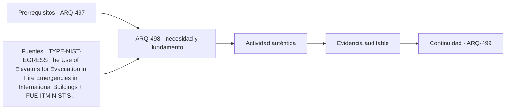

# ARQ-498 · Incendio, evacuación, refugio y continuidad

**Parte 50 · Fase II · Clase desarrollada · Incorporada en v0.27.0.**

Prerrequisitos conceptuales: ARQ-497. Sin calendario. Casos, cantidades y resultados son ficticios salvo antecedentes expresamente atribuidos. Material educativo: no constituye proyecto ejecutable, cálculo firmado, autorización, certificación ni habilitación profesional. Revisión externa especializada pendiente.

## Pregunta central

¿Cómo cambia la estrategia de seguridad de vida cuando una gran población depende de circulación vertical?

## Resultado y continuidad

Esta clase aplica los fundamentos de la Fase I a una tipología concreta. El resultado esperado es poder explicar decisiones, interfaces y evidencia sin copiar soluciones de otro edificio. La clase siguiente conserva el método, no las cifras, salvo cuando un caso continuo se declara expresamente.

## 1. Tipo, programa y contexto

En altura, escaleras, zonas de refugio, compartimentación, comunicaciones y procedimientos deben coordinarse. La estrategia puede ser por fases o total según reglas y caso; el curso no prescribe una opción universal.

## 2. Organización espacial y usuarios

NIST ha estudiado uso de ascensores protegidos para facilitar evacuación y acceso de bomberos en edificios altos [[TYPE-NIST-EGRESS]](#FUENTE-TYPE-NIST-EGRESS). Eso no significa que cualquier ascensor ordinario sea ruta de evacuación.

## 3. Sistema constructivo y técnico

Energía, comunicaciones, presurización, detección y control pueden compartir dependencias. La redundancia debe analizar fallas comunes y estados reales, no solo contar equipos duplicados.

## 4. Sección vertical como documento principal

En un edificio alto la sección deja de ser una representación secundaria. Debe mostrar zonas de ascensores, plantas técnicas, cambios de uso, presión de servicios, transferencias estructurales, refugios, accesos de mantenimiento y coronación. La planta repetitiva puede ocultar que el edificio cambia varias veces a lo largo de su altura.

Conviene acompañar la sección con diagramas por **zonas y estados**: qué ascensores sirven cada tramo, qué redes atraviesan o terminan, dónde se transfieren cargas y qué partes continúan operando ante una indisponibilidad. El diagrama no sustituye cálculos ni normas, pero vuelve visibles dependencias que una imagen exterior no revela.

## 5. Repetición, tolerancias y acumulación

Una torre multiplica decisiones. Pequeñas variaciones de cota, acortamientos, tolerancias, espesores o desplazamientos pueden acumularse o repetirse decenas de veces. Por eso la coordinación necesita referencias comunes y control de versiones entre estructura, fachada, ascensores e instalaciones. “Es la misma planta” no significa que todas las condiciones sean idénticas.

La repetición también amplifica la operación: filtros, válvulas, puertas, juntas, vidrios y dispositivos de seguridad se cuentan por cientos o miles. El costo de inspeccionar, limpiar o sustituir debe considerarse junto con el costo inicial. Una fachada espectacular que solo puede repararse mediante una operación excepcional puede ser una decisión operativa importante, no un detalle posterior.

## 6. Edificio alto como infraestructura habitada

La torre combina edificio e infraestructura vertical. Necesita mover personas, agua, aire, energía, datos, residuos y equipos entre cotas muy diferentes. Cada red tiene pérdidas, capacidad, puntos de aislamiento y dependencias. La arquitectura organiza esos sistemas alrededor de programas que también cambian por altura.

El análisis debe separar **resistencia, servicio y continuidad**. Una estructura puede resistir y moverse de forma incómoda; un ascensor puede operar y no aportar suficiente capacidad en un pico; una red puede tener dos bombas y depender de un único suministro. El proyecto tipológico debe revelar esas diferencias, no resumirlas bajo una etiqueta como “rascacielos inteligente”.

## Caso trabajado

Caso **EGRESS-RED-01** modela tres rutas desde una zona: dos escaleras S1/S2 y un ascensor protegido E. S1 y E dependen del vestíbulo V; S2 usa otro vestíbulo. Si V queda indisponible, dos rutas nominales desaparecen simultáneamente. Contar “tres salidas” sin la red oculta la dependencia compartida. No es un plan real de evacuación.

## Lectura paso a paso del caso

- **Fija la frontera.** Identifica qué superficies, plantas, equipos o intervalos pertenecen al caso y cuáles proceden de otros ejercicios.

- **Conserva las unidades.** Antes de comparar porcentajes o razones, verifica que numerador y denominador representen la misma versión y el mismo servicio.

- **Cambia una hipótesis cada vez.** Una variante debe indicar qué modifica y qué mantiene; de lo contrario no podrás atribuir la diferencia observada.

- **Comprueba por otra vía cuando sea posible.** Suma y resta áreas, revisa equilibrio, reconstruye una secuencia o compara con un límite geométrico.

- **Escribe lo que el número no demuestra.** La cuenta puede ser correcta y aun faltar normativa, comportamiento físico, participación de usuarios, costo, mantenimiento o aprobación profesional.

Este procedimiento convierte el ejemplo en una herramienta transferible. La meta no es memorizar la cifra, sino poder reconstruir por qué aparece y reconocer cuándo otra tipología exigiría cambiar el modelo.

## Profundización: interfaces que deben permanecer visibles

En esta tipología, una decisión espacial rara vez pertenece a una sola disciplina. Programa, estructura, envolvente, instalaciones, accesibilidad, incendio, costo, construcción y mantenimiento se encuentran en interfaces. La clase exige identificar qué dato alimenta cada decisión y quién debería producir o revisar la evidencia en un proyecto real. Un resultado geométrico favorable no compensa una condición necesaria desconocida.

## Errores frecuentes y comprobaciones de calidad

Evita transferir automáticamente dimensiones o capacidades desde ejemplos anteriores, presentar un promedio como descripción de todos los estados, confundir área con funcionamiento, o utilizar una fuente de otra jurisdicción como autorización. Comprueba unidades, fronteras, versión del caso y coherencia entre planta, sección y operación. Si una afirmación depende de una norma, ensayo o especialista no consultado, permanece pendiente.

*Figura 498. Relaciones conceptuales de la clase. No constituye plano ni detalle ejecutable.*

## Práctica independiente

Dibuja un grafo con cuatro rutas donde tres comparten un mismo control. Explica cuántas quedan si falla ese nodo y qué evidencia faltaría para usar el resultado en diseño.

Solución razonada

Si tres dependen exclusivamente del nodo, solo la cuarta permanece topológicamente. Faltan capacidad, protección, tiempos, ocupantes, accesibilidad, procedimientos, códigos y estados de incendio; el grafo solo estudia dependencia.

La solución corresponde al modelo declarado. En una obra real deben confirmarse terreno, programa, legislación, permisos, productos, ensayos, responsabilidades profesionales, operación y condiciones de mantenimiento aplicables.

## Autoevaluación y transferencia

Puedes avanzar cuando reconstruyes el caso sin mirar la respuesta, explicas al menos una conclusión respaldada y otra que no puede sostenerse con los datos, y señalas qué documento, medición o especialista permitiría resolver la incertidumbre. El objetivo es transferir el razonamiento a otra tipología sin copiar la forma.

<!-- pedagogia-2026:inicio -->
## Decisión pedagógica y posición curricular

### Por qué existe

Esta clase existe para resolver una necesidad concreta del recorrido: ¿Cómo cambia la estrategia de seguridad de vida cuando una gran población depende de circulación vertical?

### Por qué está exactamente aquí

Ocupa el lugar 8 de la Parte 50. Se estudia después de ARQ-497 · Distribución vertical de agua, energía y climatización porque usa esa base para responder «¿Cómo cambia la estrategia de seguridad de vida cuando una gran población depende de circulación vertical?». Se ubica antes de ARQ-499 · Construcción, logística y mantenimiento de torres porque la evidencia producida aquí debe estar disponible para ese paso.

- **Prerrequisitos:** `ARQ-497`
- **Capacidad que introduce:** Esta clase aplica los fundamentos de la Fase I a una tipología concreta. El resultado esperado es poder explicar decisiones, interfaces y evidencia sin copiar soluciones de otro edificio. La clase siguiente conserva el método, no las cifras, salvo cuando un caso continuo se declara expresamente.
- **Clases o experiencias que dependen de ella:** `ARQ-499`

El diagrama permite comprobar una relación que el texto lineal oculta con facilidad: esta clase recibe capacidades previas, toma decisiones apoyadas por fuentes, exige una experiencia y produce evidencia que habilita trabajo posterior. No representa un procedimiento de obra.

## Resultado observable, evidencia y evaluación

1. Identificar y delimitar las condiciones necesarias para responder la pregunta central de incendio, evacuación, refugio y continuidad.
2. Producir y comprobar la evidencia declarada por la clase: Esta clase aplica los fundamentos de la Fase I a una tipología concreta. El resultado esperado es poder explicar decisiones, interfaces y evidencia sin copiar soluciones de otro edificio. La clase siguiente conserva el método, no las cifras, salvo cuando un caso continuo se declara expresamente.
3. Justificar una decisión de incendio, evacuación, refugio y continuidad mediante fuentes, supuestos, alternativas y límites explícitos.

## Actividad, evidencia y criterio de aceptación

**Actividad:** Dibuja un grafo con cuatro rutas donde tres comparten un mismo control. Explica cuántas quedan si falla ese nodo y qué evidencia faltaría para usar el resultado en diseño.

**Evidencia mínima:** Esta clase aplica los fundamentos de la Fase I a una tipología concreta. El resultado esperado es poder explicar decisiones, interfaces y evidencia sin copiar soluciones de otro edificio. La clase siguiente conserva el método, no las cifras, salvo cuando un caso continuo se declara expresamente.

**Archivo sugerido:** `evidence/ARQ-498/evidencia.md`.

**Criterio de aceptación:** la entrega se acepta cuando:

- La entrega responde explícitamente a la pregunta: ¿Cómo cambia la estrategia de seguridad de vida cuando una gran población depende de circulación vertical?
- La actividad conserva las fronteras del caso y permite reconstruir el procedimiento: Dibuja un grafo con cuatro rutas donde tres comparten un mismo control. Explica cuántas quedan si falla ese nodo y qué evidencia faltaría para usar el resultado en diseño.
- Cada afirmación externa puede seguirse hasta una fuente, su alcance consultado y su límite.
- La evidencia deja disponible una entrada comprobable para ARQ-499.
- Evita transferir automáticamente dimensiones o capacidades desde ejemplos anteriores, presentar un promedio como descripción de todos los estados, confundir área con funcionamiento, o utilizar una fuente de otra jurisdicción como autorización. Comprueba unidades, fronteras, versión del caso y coherencia entre planta, sección y operación.

La [rúbrica común](../../docs/RUBRICA_COMUN.md) complementa estos criterios; no los reemplaza. Una entrega puede superar un promedio y continuar pendiente si oculta una condición crítica.

## Trazabilidad de las decisiones

| # | Decisión o fundamento | Fuente utilizada | Aplicación y límite en esta clase |
|---:|---|---|---|
| 1 | Problemas de evacuación en edificios altos, uso protegido de ascensores y factores humanos. | [TYPE-NIST-EGRESS The Use of Elevators for Evacuation in Fire…](https://www.nist.gov/publications/use-elevators-evacuation-fire-emergencies-international-buildings) | Consulta: Ficha pública y resumen del NIST Technical Note 1825. Límite: No se implementa un procedimiento normativo de evacuación ni se trasladan exigencias estadounidenses a Chile. |
| 2 | Separar inspección, prueba, mantenimiento, estado y documentación de una modificación. | [FUE-ITM NIST S 7401.02, Version 2 — Inspection, Testing and…](https://www.nist.gov/document/nist-s-7401-02itm-fire-protection-and-life-safety-systems042221pdf-1) | Consulta: Apartados sobre interfaces, sistemas cortafuego, indisponibilidad, registros y definiciones; páginas impresas 16–20. Límite: Documento interno del NIST, no norma chilena. No se trasladan frecuencias, retenciones documentales ni facultades de su autoridad a otro contexto. |
| 3 | Distinguir conformidad con requisitos de adecuación al uso | [Organismo: National Aeronautics and Space Administration. Consulta:…](https://www.nasa.gov/reference/5-0-product-realization/) | Consulta: Apartados web de verificación y validación Límite: La verificación de cálculos no constituye validación de un edificio. |

La tabla permite auditar las relaciones; la explicación, el caso y la práctica de la clase siguen siendo la documentación principal.

## Autoevaluación, recuperación y continuidad

### Errores diagnósticos

Antes de avanzar, comprueba si puedes reconstruir cada resultado sin mirar la solución, señalar qué evidencia lo sostiene y nombrar una condición que obligaría a revisar tu decisión. Conserva la primera versión, la objeción recibida y la revisión.

**Conexión siguiente:** La continuidad inmediata es ARQ-499 · Construcción, logística y mantenimiento de torres; conserva el método y vuelve a verificar datos y límites.
<!-- pedagogia-2026:fin -->

## Fuentes y alcance de uso

### [[TYPE-NIST-EGRESS]](#FUENTE-TYPE-NIST-EGRESS) The Use of Elevators for Evacuation in Fire Emergencies in International Buildings

National Institute of Standards and Technology. [https://www.nist.gov/publications/use-elevators-evacuation-fire-emergencies-international-buildings](https://www.nist.gov/publications/use-elevators-evacuation-fire-emergencies-international-buildings)

**Consulta:** Ficha pública y resumen del NIST Technical Note 1825. **Apoyo:** Problemas de evacuación en edificios altos, uso protegido de ascensores y factores humanos. **Límite:** No se implementa un procedimiento normativo de evacuación ni se trasladan exigencias estadounidenses a Chile.

### [[FUE-ITM]](#FUENTE-FUE-ITM) NIST S 7401.02, Version 2 — Inspection, Testing and Maintenance of Fire Protection and Life Safety Systems

National Institute of Standards and Technology. [https://www.nist.gov/document/nist-s-7401-02itm-fire-protection-and-life-safety-systems042221pdf-1](https://www.nist.gov/document/nist-s-7401-02itm-fire-protection-and-life-safety-systems042221pdf-1)

**Consulta:** Apartados sobre interfaces, sistemas cortafuego, indisponibilidad, registros y definiciones; páginas impresas 16–20. **Apoyo:** Separar inspección, prueba, mantenimiento, estado y documentación de una modificación. **Límite:** Documento interno del NIST, no norma chilena. No se trasladan frecuencias, retenciones documentales ni facultades de su autoridad a otro contexto.

### [[NASA-VERIFY]](#FUENTE-NASA-VERIFY) NASA Systems Engineering Handbook, 5.0: Product Realization

National Aeronautics and Space Administration. [https://www.nasa.gov/reference/5-0-product-realization/](https://www.nasa.gov/reference/5-0-product-realization/)

**Consulta:** Apartados web de verificación y validación **Apoyo:** Distinguir conformidad con requisitos de adecuación al uso **Límite:** La verificación de cálculos no constituye validación de un edificio.
