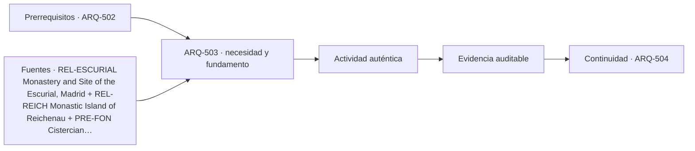

# ARQ-503 · Monasterios, claustros y vida comunitaria

**Parte 51 · Fase II · Clase desarrollada · Incorporada en v0.28.0.**

Prerrequisitos conceptuales: ARQ-502. Sin calendario. Casos, cantidades y resultados son ficticios salvo antecedentes expresamente atribuidos. Material educativo: no constituye proyecto ejecutable, cálculo firmado, autorización, certificación ni habilitación profesional. Revisión externa especializada pendiente.

## Pregunta central

¿Cómo estudiar **monasterios, claustros y vida comunitaria** como problema arquitectónico completo, relacionando historia, personas, geometría, técnica y operación sin convertir un ejemplo en receta universal?

## Resultado y continuidad

Al terminar podrás describir el tipo mediante actividades, secuencias, interfaces, sistemas y evidencias; reconstruirás un caso numérico acotado y señalarás qué información falta antes de decidir. La continuidad hacia ARQ-504 conserva el método, no traslada automáticamente cifras ni conclusiones.

## 1. Alcance tipológico e histórico

El monasterio es un sistema de vida colectiva, no una iglesia rodeada de anexos. Alojamiento, refectorio, trabajo, estudio, hospitalidad, oración, almacenamiento, agua, huertos y servicios se articulan mediante patios y recorridos. Los conjuntos históricos varían por orden, región y época; por eso conviene estudiar relaciones y ritmos cotidianos antes de copiar una planta.

La primera tarea es separar **tipo**, **caso histórico** y **proyecto contemporáneo**. Un tipo es una herramienta para comparar relaciones; un caso posee contexto, cronología y transformaciones; un proyecto nuevo debe responder a usuarios, regulación, clima, tecnología y recursos actuales. Copiar una silueta histórica no reproduce ni su sistema espacial ni su significado.

## 2. Programa, actores y secuencias de uso

Conviene describir quién llega, quién permanece, quién trabaja, quién mantiene y quién utiliza espacios de apoyo. Después se siguen actividades completas: llegada, orientación, transición, estancia, servicio, salida y estados extraordinarios pertinentes. Las actividades simultáneas revelan conflictos que un listado de recintos no muestra.

En edificios históricos, además se distinguen uso original documentado, usos posteriores e interpretación actual. No se inventan funciones para completar una planta. En proyectos contemporáneos, las preferencias de una comunidad o mandante no sustituyen las verificaciones técnicas y legales.

## 3. Forma, estructura y materialidad

La geometría debe leerse junto con el camino de cargas, la construcción y los cambios en el tiempo. Muros, cubiertas, torres, patios, vanos y elementos verticales pueden cumplir varias funciones simultáneas. Un componente que parece decorativo puede pertenecer a la estructura o a la gestión ambiental; uno resistente puede adquirir significado cultural. La documentación debe distinguir observación, interpretación y cálculo.

## 4. Ambiente, sonido, luz y territorio

Orientación, luz, acústica, agua, viento, temperatura y relación con el paisaje participan en la experiencia y la conservación. No existe una única condición adecuada para todas las actividades. La clase exige declarar qué servicio se analiza y bajo qué estado. Un indicador medio puede ocultar diferencias locales; una fotografía puede ocultar estaciones, horas y usos.

## 5. Accesibilidad, seguridad y operación

La adaptación contemporánea requiere estudiar recorridos completos, salidas, apoyos, servicios, mantenimiento e instalaciones. En patrimonio, una intervención debe considerar además valor cultural, reversibilidad o posibilidad de retirada cuando sea pertinente, y evidencia arqueológica. Ninguna de estas capas se resuelve colocando un símbolo sobre una planta.

## Caso trabajado

MON-01 dispone un claustro cuadrado de 24 m de lado con galería perimetral de 3 m de ancho hacia el interior. El patio libre mide 18×18=324 m²; el conjunto patio+galería, 576 m²; la galería ocupa 252 m². Una persona que recorre el eje medio de las cuatro galerías completa aproximadamente 84 m por vuelta, no 96: el eje está desplazado 1,5 m desde cada borde exterior.

### Cómo interpretar el resultado

El cálculo comprueba únicamente las relaciones declaradas. Para transferirlo a un edificio real habría que verificar levantamiento, fases, materiales, estructura, normativa, uso, gestión y condiciones del sitio. Si cambia una hipótesis, el caso se convierte en otra variante y debe identificarse como tal.

## Profundización: cinco preguntas de proyecto

- **¿Qué debe permanecer?** Distingue valor, función y evidencia antes de conservar una forma por costumbre.

- **¿Qué puede cambiar?** Identifica transformaciones reversibles, dependencias y documentos que deben actualizarse.

- **¿Quién valida?** Separa conocimiento de usuarios, investigación histórica, especialidades técnicas y autoridad administrativa.

- **¿Qué estado se está estudiando?** Uso ordinario, evento, mantenimiento y obra pueden requerir configuraciones distintas.

- **¿Qué afirmación excede la evidencia?** Una cuenta correcta no valida automáticamente estructura, seguridad, significado o desempeño.

## Errores frecuentes y controles de calidad

Evita tratar toda una tradición como un estilo homogéneo, extrapolar desde un monumento famoso a cualquier proyecto, confundir área con capacidad, usar una reconstrucción como si fuera levantamiento, trasladar una norma extranjera como autorización local o esconder datos desconocidos detrás de un promedio. Comprueba unidades, versión, procedencia y escala de cada dato.

## Práctica independiente

Para un claustro exterior de 30×24 m con galería interior de 3 m, calcula patio libre, superficie de galería y longitud de una vuelta por el eje medio. Después explica qué actividades necesitarían accesos directos y cuáles podrían admitir recorridos largos.

Solución razonada

El patio libre es 24×18=432 m²; el total es 720 y la galería ocupa 288 m². El eje medio forma un rectángulo de 27×21 m, perímetro 96 m. Estas magnitudes permiten comparar recorridos, pero no determinan organización monástica, accesibilidad ni uso contemporáneo.

La solución pertenece al modelo educativo declarado. En un caso real deben confirmarse historia, terreno, programa, legislación, permisos, productos, ensayos, responsabilidades profesionales, operación y mantenimiento.

## Autoevaluación y transferencia

Puedes avanzar cuando explicas el tipo sin reducirlo a una imagen, reconstruyes la cuenta sin mirar la respuesta, identificas al menos una conclusión respaldada y otra que permanece abierta, y describes qué fuente, medición o especialista permitiría resolverla. La transferencia correcta conserva el razonamiento y cambia los parámetros cuando cambia el caso.

*Figura 503. Esquema conceptual original. No constituye plano, reconstrucción histórica ni detalle ejecutable.*

<!-- pedagogia-2026:inicio -->
## Decisión pedagógica y posición curricular

### Por qué existe

Esta clase existe para resolver una necesidad concreta del recorrido: ¿Cómo estudiar monasterios, claustros y vida comunitaria como problema arquitectónico completo, relacionando historia, personas, geometría, técnica y operación sin convertir un ejemplo en receta universal?

### Por qué está exactamente aquí

Ocupa el lugar 3 de la Parte 51. Se estudia después de ARQ-502 · Basílicas, catedrales y grandes naves porque usa esa base para responder «¿Cómo estudiar monasterios, claustros y vida comunitaria como problema arquitectónico completo, relacionando historia, personas, geometría, técnica y operación sin convertir un ejemplo en receta universal?». Se ubica antes de ARQ-504 · Mezquitas, patios y orientación ritual porque la evidencia producida aquí debe estar disponible para ese paso.

- **Prerrequisitos:** `ARQ-502`
- **Capacidad que introduce:** Al terminar podrás describir el tipo mediante actividades, secuencias, interfaces, sistemas y evidencias; reconstruirás un caso numérico acotado y señalarás qué información falta antes de decidir. La continuidad hacia ARQ-504 conserva el método, no traslada automáticamente cifras ni conclusiones.
- **Clases o experiencias que dependen de ella:** `ARQ-504`

El diagrama permite comprobar una relación que el texto lineal oculta con facilidad: esta clase recibe capacidades previas, toma decisiones apoyadas por fuentes, exige una experiencia y produce evidencia que habilita trabajo posterior. No representa un procedimiento de obra.

## Resultado observable, evidencia y evaluación

1. Identificar y delimitar las condiciones necesarias para responder la pregunta central de monasterios, claustros y vida comunitaria.
2. Producir y comprobar la evidencia declarada por la clase: Al terminar podrás describir el tipo mediante actividades, secuencias, interfaces, sistemas y evidencias; reconstruirás un caso numérico acotado y señalarás qué información falta antes de decidir. La continuidad hacia ARQ-504 conserva el método, no traslada automáticamente cifras ni conclusiones.
3. Justificar una decisión de monasterios, claustros y vida comunitaria mediante fuentes, supuestos, alternativas y límites explícitos.

## Actividad, evidencia y criterio de aceptación

**Actividad:** Para un claustro exterior de 30×24 m con galería interior de 3 m, calcula patio libre, superficie de galería y longitud de una vuelta por el eje medio. Después explica qué actividades necesitarían accesos directos y cuáles podrían admitir recorridos largos.

**Evidencia mínima:** Al terminar podrás describir el tipo mediante actividades, secuencias, interfaces, sistemas y evidencias; reconstruirás un caso numérico acotado y señalarás qué información falta antes de decidir. La continuidad hacia ARQ-504 conserva el método, no traslada automáticamente cifras ni conclusiones.

**Archivo sugerido:** `evidence/ARQ-503/evidencia.md`.

**Criterio de aceptación:** la entrega se acepta cuando:

- La entrega responde explícitamente a la pregunta: ¿Cómo estudiar monasterios, claustros y vida comunitaria como problema arquitectónico completo, relacionando historia, personas, geometría, técnica y operación sin convertir un ejemplo en receta universal?
- La actividad conserva las fronteras del caso y permite reconstruir el procedimiento: Para un claustro exterior de 30×24 m con galería interior de 3 m, calcula patio libre, superficie de galería y longitud de una vuelta por el eje medio. Después explica qué actividades necesitarían accesos directos y cuáles podrían admitir recorridos largos.
- Cada afirmación externa puede seguirse hasta una fuente, su alcance consultado y su límite.
- La evidencia deja disponible una entrada comprobable para ARQ-504.
- Evita tratar toda una tradición como un estilo homogéneo, extrapolar desde un monumento famoso a cualquier proyecto, confundir área con capacidad, usar una reconstrucción como si fuera levantamiento, trasladar una norma extranjera como autorización local o esconder datos desconocidos detrás de un promedio. Comprueba unidades, versión, procedencia y escala de cada dato.

La [rúbrica común](../../docs/RUBRICA_COMUN.md) complementa estos criterios; no los reemplaza. Una entrega puede superar un promedio y continuar pendiente si oculta una condición crítica.

## Trazabilidad de las decisiones

| # | Decisión o fundamento | Fuente utilizada | Aplicación y límite en esta clase |
|---:|---|---|---|
| 1 | Programa complejo organizado por patios: monasterio, iglesia, palacio, escuela, seminario y biblioteca. | [REL-ESCURIAL Monastery and Site of the Escurial, Madrid](https://whc.unesco.org/en/list/318/) | Consulta: Ficha oficial y síntesis del conjunto monástico-palaciego. Límite: No se usa como plantilla funcional universal de monasterio. |
| 2 | Relación entre comunidad monástica, paisaje, iglesias y producción cultural. | [REL-REICH Monastic Island of Reichenau](https://whc.unesco.org/en/list/974/) | Consulta: Ficha oficial del conjunto monástico y sus iglesias. Límite: No proporciona programa contemporáneo ni rutas exactas del ejercicio. |
| 3 | Conjunto monástico, actividades y edificios asociados, no solamente iglesia. | [PRE-FON Cistercian Abbey of Fontenay](https://whc.unesco.org/en/list/165/) | Consulta: Página HTML consultada: descripción y secciones pertinentes. Sin copiar imágenes ni documentos normativos completos. Límite: No prueba autosuficiencia económica absoluta ni aporta el plano ficticio del ejercicio. |

La tabla permite auditar las relaciones; la explicación, el caso y la práctica de la clase siguen siendo la documentación principal.

## Autoevaluación, recuperación y continuidad

### Errores diagnósticos

Antes de avanzar, comprueba si puedes reconstruir cada resultado sin mirar la solución, señalar qué evidencia lo sostiene y nombrar una condición que obligaría a revisar tu decisión. Conserva la primera versión, la objeción recibida y la revisión.

**Conexión siguiente:** La continuidad inmediata es ARQ-504 · Mezquitas, patios y orientación ritual; conserva el método y vuelve a verificar datos y límites.
<!-- pedagogia-2026:fin -->

## Fuentes y alcance de uso

### [[REL-ESCURIAL]](#FUENTE-REL-ESCURIAL) Monastery and Site of the Escurial, Madrid

UNESCO World Heritage Centre. [https://whc.unesco.org/en/list/318/](https://whc.unesco.org/en/list/318/)

**Consulta:** Ficha oficial y síntesis del conjunto monástico-palaciego. **Apoyo:** Programa complejo organizado por patios: monasterio, iglesia, palacio, escuela, seminario y biblioteca. **Límite:** No se usa como plantilla funcional universal de monasterio.

### [[REL-REICH]](#FUENTE-REL-REICH) Monastic Island of Reichenau

UNESCO World Heritage Centre. [https://whc.unesco.org/en/list/974/](https://whc.unesco.org/en/list/974/)

**Consulta:** Ficha oficial del conjunto monástico y sus iglesias. **Apoyo:** Relación entre comunidad monástica, paisaje, iglesias y producción cultural. **Límite:** No proporciona programa contemporáneo ni rutas exactas del ejercicio.

### [[PRE-FON]](#FUENTE-PRE-FON) Cistercian Abbey of Fontenay

UNESCO World Heritage Centre. [https://whc.unesco.org/en/list/165/](https://whc.unesco.org/en/list/165/)

**Consulta:** Página HTML consultada: descripción y secciones pertinentes. Sin copiar imágenes ni documentos normativos completos. **Apoyo:** Conjunto monástico, actividades y edificios asociados, no solamente iglesia. **Límite:** No prueba autosuficiencia económica absoluta ni aporta el plano ficticio del ejercicio.
