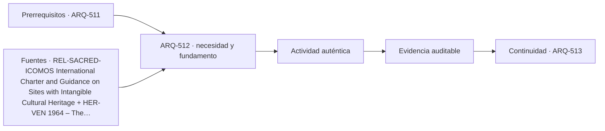

# ARQ-512 · Castillo medieval: recinto, torre y patio

**Parte 52 · Fase II · Clase desarrollada · Incorporada en v0.28.0.**

Prerrequisitos conceptuales: ARQ-511. Sin calendario. Casos, cantidades y resultados son ficticios salvo antecedentes expresamente atribuidos. Material educativo: no constituye proyecto ejecutable, cálculo firmado, autorización, certificación ni habilitación profesional. Revisión externa especializada pendiente.

## Pregunta central

¿Cómo estudiar **castillo medieval: recinto, torre y patio** como problema arquitectónico completo, relacionando historia, personas, geometría, técnica y operación sin convertir un ejemplo en receta universal?

## Resultado y continuidad

Al terminar podrás describir el tipo mediante actividades, secuencias, interfaces, sistemas y evidencias; reconstruirás un caso numérico acotado y señalarás qué información falta antes de decidir. La continuidad hacia ARQ-513 conserva el método, no traslada automáticamente cifras ni conclusiones.

## 1. Alcance tipológico e histórico

El castillo medieval reúne defensa, residencia, almacenamiento, representación, administración y servicio. Torres, murallas, patios, capilla, cocinas, establos y cisternas forman un organismo que cambia en el tiempo. No conviene interpretarlo como una fortaleza homogénea construida de una sola vez.

La primera tarea es separar **tipo**, **caso histórico** y **proyecto contemporáneo**. Un tipo es una herramienta para comparar relaciones; un caso posee contexto, cronología y transformaciones; un proyecto nuevo debe responder a usuarios, regulación, clima, tecnología y recursos actuales. Copiar una silueta histórica no reproduce ni su sistema espacial ni su significado.

## 2. Programa, actores y secuencias de uso

Conviene describir quién llega, quién permanece, quién trabaja, quién mantiene y quién utiliza espacios de apoyo. Después se siguen actividades completas: llegada, orientación, transición, estancia, servicio, salida y estados extraordinarios pertinentes. Las actividades simultáneas revelan conflictos que un listado de recintos no muestra.

En edificios históricos, además se distinguen uso original documentado, usos posteriores e interpretación actual. No se inventan funciones para completar una planta. En proyectos contemporáneos, las preferencias de una comunidad o mandante no sustituyen las verificaciones técnicas y legales.

## 3. Forma, estructura y materialidad

La geometría debe leerse junto con el camino de cargas, la construcción y los cambios en el tiempo. Muros, cubiertas, torres, patios, vanos y elementos verticales pueden cumplir varias funciones simultáneas. Un componente que parece decorativo puede pertenecer a la estructura o a la gestión ambiental; uno resistente puede adquirir significado cultural. La documentación debe distinguir observación, interpretación y cálculo.

## 4. Ambiente, sonido, luz y territorio

Orientación, luz, acústica, agua, viento, temperatura y relación con el paisaje participan en la experiencia y la conservación. No existe una única condición adecuada para todas las actividades. La clase exige declarar qué servicio se analiza y bajo qué estado. Un indicador medio puede ocultar diferencias locales; una fotografía puede ocultar estaciones, horas y usos.

## 5. Accesibilidad, seguridad y operación

La adaptación contemporánea requiere estudiar recorridos completos, salidas, apoyos, servicios, mantenimiento e instalaciones. En patrimonio, una intervención debe considerar además valor cultural, reversibilidad o posibilidad de retirada cuando sea pertinente, y evidencia arqueológica. Ninguna de estas capas se resuelve colocando un símbolo sobre una planta.

## Caso trabajado

CAST-01 idealiza un recinto exterior de 60×45 m y un patio interior de 42×27 m. El anillo edificado ocupa 2.700−1.134=1.566 m² de huella. Si solo 420 m² corresponden a estancias habitables en una fase, eso representa 26,8 % del anillo, no del recinto total. La elección del denominador cambia el significado.

### Cómo interpretar el resultado

El cálculo comprueba únicamente las relaciones declaradas. Para transferirlo a un edificio real habría que verificar levantamiento, fases, materiales, estructura, normativa, uso, gestión y condiciones del sitio. Si cambia una hipótesis, el caso se convierte en otra variante y debe identificarse como tal.

## Profundización: cinco preguntas de proyecto

- **¿Qué debe permanecer?** Distingue valor, función y evidencia antes de conservar una forma por costumbre.

- **¿Qué puede cambiar?** Identifica transformaciones reversibles, dependencias y documentos que deben actualizarse.

- **¿Quién valida?** Separa conocimiento de usuarios, investigación histórica, especialidades técnicas y autoridad administrativa.

- **¿Qué estado se está estudiando?** Uso ordinario, evento, mantenimiento y obra pueden requerir configuraciones distintas.

- **¿Qué afirmación excede la evidencia?** Una cuenta correcta no valida automáticamente estructura, seguridad, significado o desempeño.

## Errores frecuentes y controles de calidad

Evita tratar toda una tradición como un estilo homogéneo, extrapolar desde un monumento famoso a cualquier proyecto, confundir área con capacidad, usar una reconstrucción como si fuera levantamiento, trasladar una norma extranjera como autorización local o esconder datos desconocidos detrás de un promedio. Comprueba unidades, versión, procedencia y escala de cada dato.

## Práctica independiente

Un recinto mide 72×50 m y el patio 50×28 m. Calcula huella del anillo y porcentaje del anillo ocupado por 600 m² de estancias. Indica por qué no puedes deducir población histórica.

Solución razonada

Anillo=3.600−1.400=2.200 m². 600/2.200=27,27 %. La población requiere fases, usos, temporalidad, guarnición, servicio, visitantes y evidencia arqueológica; superficie no equivale a habitantes.

La solución pertenece al modelo educativo declarado. En un caso real deben confirmarse historia, terreno, programa, legislación, permisos, productos, ensayos, responsabilidades profesionales, operación y mantenimiento.

## Autoevaluación y transferencia

Puedes avanzar cuando explicas el tipo sin reducirlo a una imagen, reconstruyes la cuenta sin mirar la respuesta, identificas al menos una conclusión respaldada y otra que permanece abierta, y describes qué fuente, medición o especialista permitiría resolverla. La transferencia correcta conserva el razonamiento y cambia los parámetros cuando cambia el caso.

*Figura 512. Esquema conceptual original. No constituye plano, reconstrucción histórica ni detalle ejecutable.*

<!-- pedagogia-2026:inicio -->
## Decisión pedagógica y posición curricular

### Por qué existe

Esta clase existe para resolver una necesidad concreta del recorrido: ¿Cómo estudiar castillo medieval: recinto, torre y patio como problema arquitectónico completo, relacionando historia, personas, geometría, técnica y operación sin convertir un ejemplo en receta universal?

### Por qué está exactamente aquí

Ocupa el lugar 2 de la Parte 52. Se estudia después de ARQ-511 · Fortificación y paisaje defensivo porque usa esa base para responder «¿Cómo estudiar castillo medieval: recinto, torre y patio como problema arquitectónico completo, relacionando historia, personas, geometría, técnica y operación sin convertir un ejemplo en receta universal?». Se ubica antes de ARQ-513 · Murallas, bastiones y artillería porque la evidencia producida aquí debe estar disponible para ese paso.

- **Prerrequisitos:** `ARQ-511`
- **Capacidad que introduce:** Al terminar podrás describir el tipo mediante actividades, secuencias, interfaces, sistemas y evidencias; reconstruirás un caso numérico acotado y señalarás qué información falta antes de decidir. La continuidad hacia ARQ-513 conserva el método, no traslada automáticamente cifras ni conclusiones.
- **Clases o experiencias que dependen de ella:** `ARQ-513`

El diagrama permite comprobar una relación que el texto lineal oculta con facilidad: esta clase recibe capacidades previas, toma decisiones apoyadas por fuentes, exige una experiencia y produce evidencia que habilita trabajo posterior. No representa un procedimiento de obra.

## Resultado observable, evidencia y evaluación

1. Identificar y delimitar las condiciones necesarias para responder la pregunta central de castillo medieval: recinto, torre y patio.
2. Producir y comprobar la evidencia declarada por la clase: Al terminar podrás describir el tipo mediante actividades, secuencias, interfaces, sistemas y evidencias; reconstruirás un caso numérico acotado y señalarás qué información falta antes de decidir. La continuidad hacia ARQ-513 conserva el método, no traslada automáticamente cifras ni conclusiones.
3. Justificar una decisión de castillo medieval: recinto, torre y patio mediante fuentes, supuestos, alternativas y límites explícitos.

## Actividad, evidencia y criterio de aceptación

**Actividad:** Un recinto mide 72×50 m y el patio 50×28 m. Calcula huella del anillo y porcentaje del anillo ocupado por 600 m² de estancias. Indica por qué no puedes deducir población histórica.

**Evidencia mínima:** Al terminar podrás describir el tipo mediante actividades, secuencias, interfaces, sistemas y evidencias; reconstruirás un caso numérico acotado y señalarás qué información falta antes de decidir. La continuidad hacia ARQ-513 conserva el método, no traslada automáticamente cifras ni conclusiones.

**Archivo sugerido:** `evidence/ARQ-512/evidencia.md`.

**Criterio de aceptación:** la entrega se acepta cuando:

- La entrega responde explícitamente a la pregunta: ¿Cómo estudiar castillo medieval: recinto, torre y patio como problema arquitectónico completo, relacionando historia, personas, geometría, técnica y operación sin convertir un ejemplo en receta universal?
- La actividad conserva las fronteras del caso y permite reconstruir el procedimiento: Un recinto mide 72×50 m y el patio 50×28 m. Calcula huella del anillo y porcentaje del anillo ocupado por 600 m² de estancias. Indica por qué no puedes deducir población histórica.
- Cada afirmación externa puede seguirse hasta una fuente, su alcance consultado y su límite.
- La evidencia deja disponible una entrada comprobable para ARQ-513.
- Evita tratar toda una tradición como un estilo homogéneo, extrapolar desde un monumento famoso a cualquier proyecto, confundir área con capacidad, usar una reconstrucción como si fuera levantamiento, trasladar una norma extranjera como autorización local o esconder datos desconocidos detrás de un promedio. Comprueba unidades, versión, procedencia y escala de cada dato.

La [rúbrica común](../../docs/RUBRICA_COMUN.md) complementa estos criterios; no los reemplaza. Una entrega puede superar un promedio y continuar pendiente si oculta una condición crítica.

## Trazabilidad de las decisiones

| # | Decisión o fundamento | Fuente utilizada | Aplicación y límite en esta clase |
|---:|---|---|---|
| 1 | Fortificaciones como paisajes, sistemas y patrimonio con múltiples escalas y periodos. | [REL-SACRED-ICOMOS International Charter and Guidance on Sites with…](https://www.icomos.org/charters-and-doctrinal-texts/) | Consulta: Página oficial de textos doctrinales; referencia a las directrices de 2021 sobre fortificaciones y patrimonio militar. Límite: No se reproduce el documento íntegro ni se usa como norma de proyecto contemporáneo. |
| 2 | Existencia y contexto de la Carta de Venecia | [HER-VEN 1964 – The Venice Charter](https://landscapes.icomos.org/the-venice-charter-1964/) | Consulta: Página institucional de contexto Límite: No se atribuyen artículos concretos sin consultar el texto de la carta. Conservación local requiere normativa y especialistas. |

La tabla permite auditar las relaciones; la explicación, el caso y la práctica de la clase siguen siendo la documentación principal.

## Autoevaluación, recuperación y continuidad

### Errores diagnósticos

Antes de avanzar, comprueba si puedes reconstruir cada resultado sin mirar la solución, señalar qué evidencia lo sostiene y nombrar una condición que obligaría a revisar tu decisión. Conserva la primera versión, la objeción recibida y la revisión.

**Conexión siguiente:** La continuidad inmediata es ARQ-513 · Murallas, bastiones y artillería; conserva el método y vuelve a verificar datos y límites.
<!-- pedagogia-2026:fin -->

## Fuentes y alcance de uso

### [[FORT-ICOMOS]](#FUENTE-FORT-ICOMOS) ICOMOS Guidelines on Fortifications and Military Heritage

ICOMOS. [https://www.icomos.org/charters-and-doctrinal-texts/](https://www.icomos.org/charters-and-doctrinal-texts/)

**Consulta:** Página oficial de textos doctrinales; referencia a las directrices de 2021 sobre fortificaciones y patrimonio militar. **Apoyo:** Fortificaciones como paisajes, sistemas y patrimonio con múltiples escalas y periodos. **Límite:** No se reproduce el documento íntegro ni se usa como norma de proyecto contemporáneo.

### [[HER-VEN]](#FUENTE-HER-VEN) 1964 – The Venice Charter

ICOMOS, Comité Científico Internacional de Paisajes Culturales. [https://landscapes.icomos.org/the-venice-charter-1964/](https://landscapes.icomos.org/the-venice-charter-1964/)

**Consulta:** Página institucional de contexto **Apoyo:** Existencia y contexto de la Carta de Venecia **Límite:** No se atribuyen artículos concretos sin consultar el texto de la carta. Conservación local requiere normativa y especialistas.
