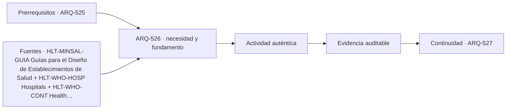

# ARQ-526 · Logística, farmacia y suministros

**Parte 53 · Fase II · Clase desarrollada · Incorporada en v0.29.0.**

Prerrequisitos conceptuales: ARQ-525. Sin calendario. Casos, capacidades y resultados son ficticios salvo antecedentes expresamente atribuidos. Material educativo: no constituye proyecto ejecutable, programa clínico u operacional aprobado, cálculo firmado, autorización, certificación ni habilitación profesional. Revisión externa especializada pendiente.

## Pregunta central

¿Cómo hacer visible la arquitectura logística del hospital sin relegarla a espacios residuales?

## Resultado y continuidad

Al terminar podrás representar el problema mediante actividades, flujos, capacidades, interfaces y estados; reconstruirás un caso cuantitativo limitado y distinguirás qué evidencia requiere un proyecto real. La continuidad desde ARQ-525 conserva métodos, no cifras. El siguiente capítulo, ARQ-527, recibe la lógica y vuelve a declarar sus propios parámetros.

## 1. El tipo como sistema, no como imagen

Un hospital funciona porque recibe, almacena, prepara, distribuye y retira materiales continuamente. Farmacia, esterilización, alimentos, ropa, residuos, equipamiento y mantenimiento tienen condiciones diferentes. La planificación debe separar cantidades, calidad, seguridad, tiempos y accesos; compartir una ruta no significa compartir un mismo estado sanitario [[HLT-MINSAL-GUIA]](#FUENTE-HLT-MINSAL-GUIA) [[HLT-WHO-CONT]](#FUENTE-HLT-WHO-CONT).

La arquitectura hospitalaria trabaja con estados: día ordinario, aumento de demanda, limpieza, mantenimiento, falla de un sistema y emergencia. Un plano único no representa todos esos estados. El expediente necesita mostrar qué puertas, redes, recorridos y recintos cambian entre ellos.

## 2. Cinco capas que deben coordinarse

La clase utiliza cinco capas de lectura: **recepción y despacho**, **almacenamiento**, **farmacia y esterilización**, **residuos y retornos** y **logística vertical**. No forman una secuencia obligatoria ni una clasificación normativa. Sirven para evitar que una decisión se optimice en una sola capa y traslade el problema a otra.

En la primera capa se define el servicio y quién lo utiliza. En la segunda se siguen recorridos, tiempos y cambios de estado. La tercera convierte esas relaciones en un programa espacial comprobable. La cuarta identifica estructura, envolvente, instalaciones, equipamiento y mantenimiento. La quinta pregunta qué sucede cuando cambia la demanda, falla un componente o se interviene el edificio.

## 3. Programa y flujos: conservar fronteras

Un flujo no es solamente una línea. Tiene origen, destino, objeto o persona que se mueve, restricciones, estado temporal y dependencias. Dos flujos pueden compartir un corredor y seguir siendo distintos; también pueden necesitar separación por privacidad, seguridad, operación o control ambiental. La justificación debe nombrar el motivo, no usar colores como explicación.

Los cuadros de áreas tampoco sustituyen geometría. Que una suma cierre no prueba que los recintos quepan, que sus relaciones funcionen o que las instalaciones puedan coordinarse. Cuando se transfiere superficie entre categorías, la clase obliga a identificar qué evidencia previa deja de ser válida.

## 4. Tecnología e infraestructura

La arquitectura necesita reservar espacio y acceso para sistemas que sostienen el servicio. Esos sistemas pueden incluir energía, agua, aire, datos, transporte interno, equipamiento especializado y soporte técnico, según la tipología. La reserva debe existir en planta, sección y secuencia de mantenimiento, no solo en una memoria.

La privacidad no se limita a cerrar una puerta. Incluye conversación, exposición visual, información, acompañamiento y separación entre quienes esperan y quienes reciben atención. El proyecto debe describir la actividad antes de elegir la solución.

Un dato técnico siempre conserva su procedencia. Una capacidad nominal de equipo, una dimensión de catálogo o un requisito de una guía extranjera no se transforma automáticamente en prestación del edificio ni en exigencia legal local. El proyecto debe indicar fuente, edición, condiciones, quién revisa y qué se desconoce.

## 5. Operación, accesibilidad y estados no ordinarios

La experiencia se evalúa como cadena completa: llegar, orientarse, atravesar procesos, usar el servicio, acceder a apoyos y salir. Una condición favorable en un tramo no compensa una interrupción en otro. Accesibilidad, información y asistencia deben estudiarse en todos los estados relevantes, no solamente durante operación ideal.

También se representan mantenimiento, limpieza, obra y fallas. Si una alternativa depende de que siempre exista un equipo, puerta o conexión, esa dependencia queda escrita. La redundancia requiere independencia suficiente; duplicar dos componentes que comparten un único nodo crítico puede conservar la misma falla única.

## Caso trabajado

LOG-STOCK-01 comienza con 420 unidades de un insumo ficticio. Durante tres intervalos entran 180, 0 y 240; salen 250, 220 y 180. Los saldos son 350, 130 y 190. El total recibido 420 y entregado 650 no basta para identificar continuidad: el mínimo ocurre después del segundo intervalo. Si la reserva operativa ficticia fuera 150, el sistema cae 20 unidades por debajo de esa referencia aun terminando con 190.

### Qué demuestra y qué no demuestra

El resultado permite comprobar únicamente las relaciones aritméticas o geométricas declaradas. No valida seguridad, control de infecciones, operación aeronáutica, capacidad clínica, accesibilidad reglamentaria ni cumplimiento. Para transferirlo a un caso real hacen falta programa validado, levantamiento, datos de demanda, normativa vigente, especialidades, pruebas y autorizaciones pertinentes.

## 6. Profundización: cómo revisar una propuesta

- **Reconstruye la necesidad.** Escribe qué servicio se pretende prestar y bajo qué estado.

- **Sigue una tarea completa.** No saltes del acceso al destino ignorando decisiones, esperas o apoyos.

- **Localiza interfaces.** Identifica dónde dos actividades, disciplinas o autoridades necesitan una misma condición.

- **Conserva versiones.** Si cambia programa, capacidad o geometría, vuelve a comprobar documentos dependientes.

- **Declara lo desconocido.** No reemplaces una medición ausente por un valor cómodo ni una referencia extranjera por regulación local.

## Errores frecuentes y controles de calidad

Evita usar promedios para ocultar picos, asumir que más superficie mejora automáticamente el servicio, tratar toda circulación como desperdicio, confundir capacidad teórica con operación real, dibujar rutas sin estados de puertas o controles, y considerar un equipo redundante sin revisar su alimentación y dependencias. Comprueba unidades, ventana temporal, denominadores y límites del modelo.

## Práctica independiente

Con 300 iniciales, entradas 100, 200, 0 y salidas 220, 180, 150, calcula saldos y mínimo. ¿Terminar con saldo positivo garantiza mantener una reserva de 100?

Además de la cuenta, redacta dos afirmaciones respaldadas y dos que todavía no pueden sostenerse. Para cada pendiente indica qué dato, documento, prueba o especialista permitiría resolverla.

Solución razonada

Los saldos son 180, 200 y 50. Termina positivo, pero baja a 50; por tanto no mantiene una reserva de 100. El ejercicio no define stock clínico real ni política farmacéutica.

Una respuesta completa conserva la frontera del ejercicio y no amplía sus conclusiones. Si una variante cambia el caso, debe recibir un identificador y reabrir las verificaciones dependientes.

## Autoevaluación y transferencia

Puedes avanzar cuando reconstruyes el caso sin mirar la solución, explicas por qué una suma correcta no prueba funcionamiento integral, dibujas al menos una cadena de uso con sus estados y nombras una evidencia que falta. La transferencia correcta mantiene el razonamiento y sustituye los parámetros cuando cambia el proyecto.

*Figura 526. Esquema conceptual original. No constituye plano, protocolo clínico, procedimiento aeronáutico ni detalle ejecutable.*

<!-- pedagogia-2026:inicio -->
## Decisión pedagógica y posición curricular

### Por qué existe

Esta clase existe para resolver una necesidad concreta del recorrido: ¿Cómo hacer visible la arquitectura logística del hospital sin relegarla a espacios residuales?

### Por qué está exactamente aquí

Ocupa el lugar 6 de la Parte 53. Se estudia después de ARQ-525 · Ambulatorio y atención primaria porque usa esa base para responder «¿Cómo hacer visible la arquitectura logística del hospital sin relegarla a espacios residuales?». Se ubica antes de ARQ-527 · Aislamiento, aire y control ambiental porque la evidencia producida aquí debe estar disponible para ese paso.

- **Prerrequisitos:** `ARQ-525`
- **Capacidad que introduce:** Al terminar podrás representar el problema mediante actividades, flujos, capacidades, interfaces y estados; reconstruirás un caso cuantitativo limitado y distinguirás qué evidencia requiere un proyecto real. La continuidad desde ARQ-525 conserva métodos, no cifras. El siguiente capítulo, ARQ-527, recibe la lógica y vuelve a declarar sus propios parámetros.
- **Clases o experiencias que dependen de ella:** `ARQ-527`

El diagrama permite comprobar una relación que el texto lineal oculta con facilidad: esta clase recibe capacidades previas, toma decisiones apoyadas por fuentes, exige una experiencia y produce evidencia que habilita trabajo posterior. No representa un procedimiento de obra.

## Resultado observable, evidencia y evaluación

1. Identificar y delimitar las condiciones necesarias para responder la pregunta central de logística, farmacia y suministros.
2. Producir y comprobar la evidencia declarada por la clase: Al terminar podrás representar el problema mediante actividades, flujos, capacidades, interfaces y estados; reconstruirás un caso cuantitativo limitado y distinguirás qué evidencia requiere un proyecto real. La continuidad desde ARQ-525 conserva métodos, no cifras. El siguiente capítulo, ARQ-527, recibe la lógica y vuelve a declarar sus propios parámetros.
3. Justificar una decisión de logística, farmacia y suministros mediante fuentes, supuestos, alternativas y límites explícitos.

## Actividad, evidencia y criterio de aceptación

**Actividad:** Con 300 iniciales, entradas 100, 200, 0 y salidas 220, 180, 150, calcula saldos y mínimo. ¿Terminar con saldo positivo garantiza mantener una reserva de 100? Además de la cuenta, redacta dos afirmaciones respaldadas y dos que todavía no pueden sostenerse.

**Evidencia mínima:** Al terminar podrás representar el problema mediante actividades, flujos, capacidades, interfaces y estados; reconstruirás un caso cuantitativo limitado y distinguirás qué evidencia requiere un proyecto real. La continuidad desde ARQ-525 conserva métodos, no cifras. El siguiente capítulo, ARQ-527, recibe la lógica y vuelve a declarar sus propios parámetros.

**Archivo sugerido:** `evidence/ARQ-526/evidencia.md`.

**Criterio de aceptación:** la entrega se acepta cuando:

- La entrega responde explícitamente a la pregunta: ¿Cómo hacer visible la arquitectura logística del hospital sin relegarla a espacios residuales?
- La actividad conserva las fronteras del caso y permite reconstruir el procedimiento: Con 300 iniciales, entradas 100, 200, 0 y salidas 220, 180, 150, calcula saldos y mínimo. ¿Terminar con saldo positivo garantiza mantener una reserva de 100? Además de la cuenta, redacta dos afirmaciones respaldadas y dos que todavía no pueden sostenerse.
- Cada afirmación externa puede seguirse hasta una fuente, su alcance consultado y su límite.
- La evidencia deja disponible una entrada comprobable para ARQ-527.
- Evita usar promedios para ocultar picos, asumir que más superficie mejora automáticamente el servicio, tratar toda circulación como desperdicio, confundir capacidad teórica con operación real, dibujar rutas sin estados de puertas o controles, y considerar un equipo redundante sin revisar su alimentación y dependencias. Comprueba unidades, ventana temporal, denominadores y límites del modelo.

La [rúbrica común](../../docs/RUBRICA_COMUN.md) complementa estos criterios; no los reemplaza. Una entrega puede superar un promedio y continuar pendiente si oculta una condición crítica.

## Trazabilidad de las decisiones

| # | Decisión o fundamento | Fuente utilizada | Aplicación y límite en esta clase |
|---:|---|---|---|
| 1 | Planificación hospitalaria, relaciones funcionales, unidades, coordinación arquitectónica, técnica, energética y de vulnerabilidades en el contexto chileno. | [HLT-MINSAL-GUIA Guías para el Diseño de Establecimientos de Salud](https://plandeinversionesensalud.minsal.cl/guias-para-el-diseno-de-establecimientos-de-salud/) | Consulta: Página oficial que reúne la Guía de Diseño para establecimientos hospitalarios de mediana y alta complejidad, documentos por unidades y fichas de recintos tipo. Límite: Las guías y fichas deben revisarse en su versión vigente y junto con normativa aplicable; el programa no reproduce íntegramente sus documentos ni autoriza un proyecto. |
| 2 | Hospital como infraestructura compleja que debe responder a necesidades comunitarias, tecnologías, servicios críticos y emergencias. | [HLT-WHO-HOSP Hospitals](https://www.who.int/health-topics/hospitals) | Consulta: Página temática institucional sobre hospitales, usuarios, infraestructura, resiliencia y continuidad de servicios. Límite: No contiene programa arquitectónico dimensional ni reemplaza regulación nacional. |
| 3 | Relación entre funciones críticas, dependencias, recursos y planes de continuidad en establecimientos de salud. | [HLT-WHO-CONT Health service continuity planning for public health…](https://www.who.int/publications/b/59454) | Consulta: Ficha pública del manual para planificación de continuidad de servicios de salud. Límite: No se implementa el manual completo ni se definen prioridades clínicas mediante los ejercicios. |

La tabla permite auditar las relaciones; la explicación, el caso y la práctica de la clase siguen siendo la documentación principal.

## Autoevaluación, recuperación y continuidad

### Errores diagnósticos

Antes de avanzar, comprueba si puedes reconstruir cada resultado sin mirar la solución, señalar qué evidencia lo sostiene y nombrar una condición que obligaría a revisar tu decisión. Conserva la primera versión, la objeción recibida y la revisión.

**Conexión siguiente:** La continuidad inmediata es ARQ-527 · Aislamiento, aire y control ambiental; conserva el método y vuelve a verificar datos y límites.
<!-- pedagogia-2026:fin -->

## Fuentes y alcance de uso

### [[HLT-MINSAL-GUIA]](#FUENTE-HLT-MINSAL-GUIA) Guías para el Diseño de Establecimientos de Salud

Ministerio de Salud de Chile - Plan de Inversiones en Salud. [https://plandeinversionesensalud.minsal.cl/guias-para-el-diseno-de-establecimientos-de-salud/](https://plandeinversionesensalud.minsal.cl/guias-para-el-diseno-de-establecimientos-de-salud/)

**Consulta:** Página oficial que reúne la Guía de Diseño para establecimientos hospitalarios de mediana y alta complejidad, documentos por unidades y fichas de recintos tipo. **Apoyo:** Planificación hospitalaria, relaciones funcionales, unidades, coordinación arquitectónica, técnica, energética y de vulnerabilidades en el contexto chileno. **Límite:** Las guías y fichas deben revisarse en su versión vigente y junto con normativa aplicable; el programa no reproduce íntegramente sus documentos ni autoriza un proyecto.

### [[HLT-WHO-HOSP]](#FUENTE-HLT-WHO-HOSP) Hospitals

World Health Organization. [https://www.who.int/health-topics/hospitals](https://www.who.int/health-topics/hospitals)

**Consulta:** Página temática institucional sobre hospitales, usuarios, infraestructura, resiliencia y continuidad de servicios. **Apoyo:** Hospital como infraestructura compleja que debe responder a necesidades comunitarias, tecnologías, servicios críticos y emergencias. **Límite:** No contiene programa arquitectónico dimensional ni reemplaza regulación nacional.

### [[HLT-WHO-CONT]](#FUENTE-HLT-WHO-CONT) Health service continuity planning for public health emergencies

World Health Organization. [https://www.who.int/publications/b/59454](https://www.who.int/publications/b/59454)

**Consulta:** Ficha pública del manual para planificación de continuidad de servicios de salud. **Apoyo:** Relación entre funciones críticas, dependencias, recursos y planes de continuidad en establecimientos de salud. **Límite:** No se implementa el manual completo ni se definen prioridades clínicas mediante los ejercicios.
