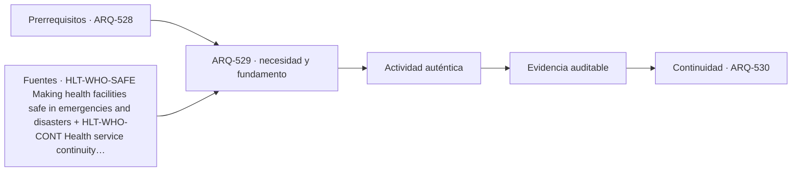

# ARQ-529 · Expansión, resiliencia y continuidad

**Parte 53 · Fase II · Clase desarrollada · Incorporada en v0.29.0.**

Prerrequisitos conceptuales: ARQ-528. Sin calendario. Casos, capacidades y resultados son ficticios salvo antecedentes expresamente atribuidos. Material educativo: no constituye proyecto ejecutable, programa clínico u operacional aprobado, cálculo firmado, autorización, certificación ni habilitación profesional. Revisión externa especializada pendiente.

## Pregunta central

¿Cómo diseñar un hospital capaz de continuar y transformarse sin confundir redundancia con duplicación indiscriminada?

## Resultado y continuidad

Al terminar podrás representar el problema mediante actividades, flujos, capacidades, interfaces y estados; reconstruirás un caso cuantitativo limitado y distinguirás qué evidencia requiere un proyecto real. La continuidad desde ARQ-528 conserva métodos, no cifras. El siguiente capítulo, ARQ-530, recibe la lógica y vuelve a declarar sus propios parámetros.

## 1. El tipo como sistema, no como imagen

Continuidad significa preservar servicios definidos frente a fallas y cambios. La OMS vincula seguridad hospitalaria con infraestructura, equipos, recursos y servicios críticos [[HLT-WHO-SAFE]](#FUENTE-HLT-WHO-SAFE). La arquitectura debe identificar dependencias: energía, agua, comunicaciones, acceso, gases clínicos cuando corresponda, logística y personal. Una reserva solo es útil si su conexión, mantenimiento y capacidad están disponibles en el estado de interés.

La arquitectura hospitalaria trabaja con estados: día ordinario, aumento de demanda, limpieza, mantenimiento, falla de un sistema y emergencia. Un plano único no representa todos esos estados. El expediente necesita mostrar qué puertas, redes, recorridos y recintos cambian entre ellos.

## 2. Cinco capas que deben coordinarse

La clase utiliza cinco capas de lectura: **energía y agua**, **datos y comunicaciones**, **suministros críticos**, **redundancia real** y **expansión**. No forman una secuencia obligatoria ni una clasificación normativa. Sirven para evitar que una decisión se optimice en una sola capa y traslade el problema a otra.

En la primera capa se define el servicio y quién lo utiliza. En la segunda se siguen recorridos, tiempos y cambios de estado. La tercera convierte esas relaciones en un programa espacial comprobable. La cuarta identifica estructura, envolvente, instalaciones, equipamiento y mantenimiento. La quinta pregunta qué sucede cuando cambia la demanda, falla un componente o se interviene el edificio.

## 3. Programa y flujos: conservar fronteras

Un flujo no es solamente una línea. Tiene origen, destino, objeto o persona que se mueve, restricciones, estado temporal y dependencias. Dos flujos pueden compartir un corredor y seguir siendo distintos; también pueden necesitar separación por privacidad, seguridad, operación o control ambiental. La justificación debe nombrar el motivo, no usar colores como explicación.

Los cuadros de áreas tampoco sustituyen geometría. Que una suma cierre no prueba que los recintos quepan, que sus relaciones funcionen o que las instalaciones puedan coordinarse. Cuando se transfiere superficie entre categorías, la clase obliga a identificar qué evidencia previa deja de ser válida.

## 4. Tecnología e infraestructura

La arquitectura necesita reservar espacio y acceso para sistemas que sostienen el servicio. Esos sistemas pueden incluir energía, agua, aire, datos, transporte interno, equipamiento especializado y soporte técnico, según la tipología. La reserva debe existir en planta, sección y secuencia de mantenimiento, no solo en una memoria.

La privacidad no se limita a cerrar una puerta. Incluye conversación, exposición visual, información, acompañamiento y separación entre quienes esperan y quienes reciben atención. El proyecto debe describir la actividad antes de elegir la solución.

Un dato técnico siempre conserva su procedencia. Una capacidad nominal de equipo, una dimensión de catálogo o un requisito de una guía extranjera no se transforma automáticamente en prestación del edificio ni en exigencia legal local. El proyecto debe indicar fuente, edición, condiciones, quién revisa y qué se desconoce.

## 5. Operación, accesibilidad y estados no ordinarios

La experiencia se evalúa como cadena completa: llegar, orientarse, atravesar procesos, usar el servicio, acceder a apoyos y salir. Una condición favorable en un tramo no compensa una interrupción en otro. Accesibilidad, información y asistencia deben estudiarse en todos los estados relevantes, no solamente durante operación ideal.

También se representan mantenimiento, limpieza, obra y fallas. Si una alternativa depende de que siempre exista un equipo, puerta o conexión, esa dependencia queda escrita. La redundancia requiere independencia suficiente; duplicar dos componentes que comparten un único nodo crítico puede conservar la misma falla única.

## Caso trabajado

RES-HOSP-01 modela cuatro servicios ficticios. Diagnóstico depende de energía E y datos D; urgencias de E y agua W; hospitalización de E y W; farmacia de E y D. Una segunda alimentación eléctrica E2 reduce la dependencia de una única fuente solo si el conmutador y la red aguas abajo permanecen disponibles. El grafo muestra que duplicar E sin revisar el nodo común C puede mantener una falla única.

### Qué demuestra y qué no demuestra

El resultado permite comprobar únicamente las relaciones aritméticas o geométricas declaradas. No valida seguridad, control de infecciones, operación aeronáutica, capacidad clínica, accesibilidad reglamentaria ni cumplimiento. Para transferirlo a un caso real hacen falta programa validado, levantamiento, datos de demanda, normativa vigente, especialidades, pruebas y autorizaciones pertinentes.

## 6. Profundización: cómo revisar una propuesta

- **Reconstruye la necesidad.** Escribe qué servicio se pretende prestar y bajo qué estado.

- **Sigue una tarea completa.** No saltes del acceso al destino ignorando decisiones, esperas o apoyos.

- **Localiza interfaces.** Identifica dónde dos actividades, disciplinas o autoridades necesitan una misma condición.

- **Conserva versiones.** Si cambia programa, capacidad o geometría, vuelve a comprobar documentos dependientes.

- **Declara lo desconocido.** No reemplaces una medición ausente por un valor cómodo ni una referencia extranjera por regulación local.

## Errores frecuentes y controles de calidad

Evita usar promedios para ocultar picos, asumir que más superficie mejora automáticamente el servicio, tratar toda circulación como desperdicio, confundir capacidad teórica con operación real, dibujar rutas sin estados de puertas o controles, y considerar un equipo redundante sin revisar su alimentación y dependencias. Comprueba unidades, ventana temporal, denominadores y límites del modelo.

## Práctica independiente

Propón una red con E1 y E2 que convergen en un único tablero C. ¿Qué sucede si falla C? ¿Qué información falta para afirmar continuidad?

Además de la cuenta, redacta dos afirmaciones respaldadas y dos que todavía no pueden sostenerse. Para cada pendiente indica qué dato, documento, prueba o especialista permitiría resolverla.

Solución razonada

Ambas fuentes quedan inutilizadas para los servicios aguas abajo si C falla. Faltan capacidades, independencia física, combustible o autonomía si aplica, mantenimiento, lógica de transferencia, cargas críticas y pruebas funcionales.

Una respuesta completa conserva la frontera del ejercicio y no amplía sus conclusiones. Si una variante cambia el caso, debe recibir un identificador y reabrir las verificaciones dependientes.

## Autoevaluación y transferencia

Puedes avanzar cuando reconstruyes el caso sin mirar la solución, explicas por qué una suma correcta no prueba funcionamiento integral, dibujas al menos una cadena de uso con sus estados y nombras una evidencia que falta. La transferencia correcta mantiene el razonamiento y sustituye los parámetros cuando cambia el proyecto.

*Figura 529. Esquema conceptual original. No constituye plano, protocolo clínico, procedimiento aeronáutico ni detalle ejecutable.*

<!-- pedagogia-2026:inicio -->
## Decisión pedagógica y posición curricular

### Por qué existe

Esta clase existe para resolver una necesidad concreta del recorrido: ¿Cómo diseñar un hospital capaz de continuar y transformarse sin confundir redundancia con duplicación indiscriminada?

### Por qué está exactamente aquí

Ocupa el lugar 9 de la Parte 53. Se estudia después de ARQ-528 · Circulaciones separadas y orientación porque usa esa base para responder «¿Cómo diseñar un hospital capaz de continuar y transformarse sin confundir redundancia con duplicación indiscriminada?». Se ubica antes de ARQ-530 · Proyecto integrado de hospital porque la evidencia producida aquí debe estar disponible para ese paso.

- **Prerrequisitos:** `ARQ-528`
- **Capacidad que introduce:** Al terminar podrás representar el problema mediante actividades, flujos, capacidades, interfaces y estados; reconstruirás un caso cuantitativo limitado y distinguirás qué evidencia requiere un proyecto real. La continuidad desde ARQ-528 conserva métodos, no cifras. El siguiente capítulo, ARQ-530, recibe la lógica y vuelve a declarar sus propios parámetros.
- **Clases o experiencias que dependen de ella:** `ARQ-530`

El diagrama permite comprobar una relación que el texto lineal oculta con facilidad: esta clase recibe capacidades previas, toma decisiones apoyadas por fuentes, exige una experiencia y produce evidencia que habilita trabajo posterior. No representa un procedimiento de obra.

## Resultado observable, evidencia y evaluación

1. Identificar y delimitar las condiciones necesarias para responder la pregunta central de expansión, resiliencia y continuidad.
2. Producir y comprobar la evidencia declarada por la clase: Al terminar podrás representar el problema mediante actividades, flujos, capacidades, interfaces y estados; reconstruirás un caso cuantitativo limitado y distinguirás qué evidencia requiere un proyecto real. La continuidad desde ARQ-528 conserva métodos, no cifras. El siguiente capítulo, ARQ-530, recibe la lógica y vuelve a declarar sus propios parámetros.
3. Justificar una decisión de expansión, resiliencia y continuidad mediante fuentes, supuestos, alternativas y límites explícitos.

## Actividad, evidencia y criterio de aceptación

**Actividad:** Propón una red con E1 y E2 que convergen en un único tablero C. ¿Qué sucede si falla C? ¿Qué información falta para afirmar continuidad?

**Evidencia mínima:** Al terminar podrás representar el problema mediante actividades, flujos, capacidades, interfaces y estados; reconstruirás un caso cuantitativo limitado y distinguirás qué evidencia requiere un proyecto real. La continuidad desde ARQ-528 conserva métodos, no cifras. El siguiente capítulo, ARQ-530, recibe la lógica y vuelve a declarar sus propios parámetros.

**Archivo sugerido:** `evidence/ARQ-529/evidencia.md`.

**Criterio de aceptación:** la entrega se acepta cuando:

- La entrega responde explícitamente a la pregunta: ¿Cómo diseñar un hospital capaz de continuar y transformarse sin confundir redundancia con duplicación indiscriminada?
- La actividad conserva las fronteras del caso y permite reconstruir el procedimiento: Propón una red con E1 y E2 que convergen en un único tablero C. ¿Qué sucede si falla C? ¿Qué información falta para afirmar continuidad?
- Cada afirmación externa puede seguirse hasta una fuente, su alcance consultado y su límite.
- La evidencia deja disponible una entrada comprobable para ARQ-530.
- Evita usar promedios para ocultar picos, asumir que más superficie mejora automáticamente el servicio, tratar toda circulación como desperdicio, confundir capacidad teórica con operación real, dibujar rutas sin estados de puertas o controles, y considerar un equipo redundante sin revisar su alimentación y dependencias. Comprueba unidades, ventana temporal, denominadores y límites del modelo.

La [rúbrica común](../../docs/RUBRICA_COMUN.md) complementa estos criterios; no los reemplaza. Una entrega puede superar un promedio y continuar pendiente si oculta una condición crítica.

## Trazabilidad de las decisiones

| # | Decisión o fundamento | Fuente utilizada | Aplicación y límite en esta clase |
|---:|---|---|---|
| 1 | Continuidad de infraestructura, servicios críticos, equipamiento, personal y Hospital Safety Index como marco de evaluación. | [HLT-WHO-SAFE Making health facilities safe in emergencies and disasters](https://www.who.int/activities/making-health-facilities-safe-in-emergencies-and-disasters) | Consulta: Página oficial del programa de establecimientos de salud seguros. Límite: No se calcula un índice real ni se certifica seguridad o resiliencia de un hospital del curso. |
| 2 | Relación entre funciones críticas, dependencias, recursos y planes de continuidad en establecimientos de salud. | [HLT-WHO-CONT Health service continuity planning for public health…](https://www.who.int/publications/b/59454) | Consulta: Ficha pública del manual para planificación de continuidad de servicios de salud. Límite: No se implementa el manual completo ni se definen prioridades clínicas mediante los ejercicios. |
| 3 | Flexibilidad, seguridad, confort, higiene, resiliencia y transformación de hospitales nuevos y existentes. | [HLT-WHO-FUTURE Hospitals of the future: a technical brief on…](https://www.who.int/europe/publications/i/item/WHO-EURO-2023-7525-47292-69380) | Consulta: Ficha pública y resumen del documento técnico de 2023. Límite: Contexto europeo y documento de orientación; no se adoptan dimensiones ni requisitos como normativa chilena. |

La tabla permite auditar las relaciones; la explicación, el caso y la práctica de la clase siguen siendo la documentación principal.

## Autoevaluación, recuperación y continuidad

### Errores diagnósticos

Antes de avanzar, comprueba si puedes reconstruir cada resultado sin mirar la solución, señalar qué evidencia lo sostiene y nombrar una condición que obligaría a revisar tu decisión. Conserva la primera versión, la objeción recibida y la revisión.

**Conexión siguiente:** La continuidad inmediata es ARQ-530 · Proyecto integrado de hospital; conserva el método y vuelve a verificar datos y límites.
<!-- pedagogia-2026:fin -->

## Fuentes y alcance de uso

### [[HLT-WHO-SAFE]](#FUENTE-HLT-WHO-SAFE) Making health facilities safe in emergencies and disasters

World Health Organization. [https://www.who.int/activities/making-health-facilities-safe-in-emergencies-and-disasters](https://www.who.int/activities/making-health-facilities-safe-in-emergencies-and-disasters)

**Consulta:** Página oficial del programa de establecimientos de salud seguros. **Apoyo:** Continuidad de infraestructura, servicios críticos, equipamiento, personal y Hospital Safety Index como marco de evaluación. **Límite:** No se calcula un índice real ni se certifica seguridad o resiliencia de un hospital del curso.

### [[HLT-WHO-CONT]](#FUENTE-HLT-WHO-CONT) Health service continuity planning for public health emergencies

World Health Organization. [https://www.who.int/publications/b/59454](https://www.who.int/publications/b/59454)

**Consulta:** Ficha pública del manual para planificación de continuidad de servicios de salud. **Apoyo:** Relación entre funciones críticas, dependencias, recursos y planes de continuidad en establecimientos de salud. **Límite:** No se implementa el manual completo ni se definen prioridades clínicas mediante los ejercicios.

### [[HLT-WHO-FUTURE]](#FUENTE-HLT-WHO-FUTURE) Hospitals of the future: a technical brief on re-thinking the architecture of hospitals

WHO Regional Office for Europe. [https://www.who.int/europe/publications/i/item/WHO-EURO-2023-7525-47292-69380](https://www.who.int/europe/publications/i/item/WHO-EURO-2023-7525-47292-69380)

**Consulta:** Ficha pública y resumen del documento técnico de 2023. **Apoyo:** Flexibilidad, seguridad, confort, higiene, resiliencia y transformación de hospitales nuevos y existentes. **Límite:** Contexto europeo y documento de orientación; no se adoptan dimensiones ni requisitos como normativa chilena.
