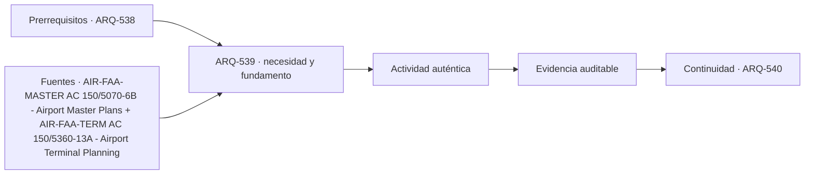

# ARQ-539 · Expansión modular y operación continua

**Parte 54 · Fase II · Clase desarrollada · Incorporada en v0.29.0.**

Prerrequisitos conceptuales: ARQ-538. Sin calendario. Casos, capacidades y resultados son ficticios salvo antecedentes expresamente atribuidos. Material educativo: no constituye proyecto ejecutable, programa clínico u operacional aprobado, cálculo firmado, autorización, certificación ni habilitación profesional. Revisión externa especializada pendiente.

## Pregunta central

¿Cómo ampliar una terminal sin suponer que la futura fase puede construirse sin afectar la operación actual?

## Resultado y continuidad

Al terminar podrás representar el problema mediante actividades, flujos, capacidades, interfaces y estados; reconstruirás un caso cuantitativo limitado y distinguirás qué evidencia requiere un proyecto real. La continuidad desde ARQ-538 conserva métodos, no cifras. El siguiente capítulo, ARQ-540, recibe la lógica y vuelve a declarar sus propios parámetros.

## 1. El tipo como sistema, no como imagen

Un master plan relaciona demanda, capacidad, suelo, fases y reservas. La modularidad no significa repetir un módulo indiferenciado; cada ampliación afecta equipaje, controles, puertas, redes, caminos y obra. Deben representarse estados inicial, intermedio y final, manteniendo recorridos seguros y funciones críticas. La planificación aeroportuaria utiliza escenarios y fases precisamente porque demanda y operación cambian [[AIR-FAA-MASTER]](#FUENTE-AIR-FAA-MASTER).

La frontera landside/airside es operativa, no una simple línea gráfica. Cambiar una puerta, una zona de control o una ruta de servicio puede modificar qué personas y objetos pueden atravesarla y bajo qué estado.

## 2. Cinco capas que deben coordinarse

La clase utiliza cinco capas de lectura: **pronóstico**, **reserva**, **fase de obra**, **operación intermedia** y **estado final**. No forman una secuencia obligatoria ni una clasificación normativa. Sirven para evitar que una decisión se optimice en una sola capa y traslade el problema a otra.

En la primera capa se define el servicio y quién lo utiliza. En la segunda se siguen recorridos, tiempos y cambios de estado. La tercera convierte esas relaciones en un programa espacial comprobable. La cuarta identifica estructura, envolvente, instalaciones, equipamiento y mantenimiento. La quinta pregunta qué sucede cuando cambia la demanda, falla un componente o se interviene el edificio.

## 3. Programa y flujos: conservar fronteras

Un flujo no es solamente una línea. Tiene origen, destino, objeto o persona que se mueve, restricciones, estado temporal y dependencias. Dos flujos pueden compartir un corredor y seguir siendo distintos; también pueden necesitar separación por privacidad, seguridad, operación o control ambiental. La justificación debe nombrar el motivo, no usar colores como explicación.

Los cuadros de áreas tampoco sustituyen geometría. Que una suma cierre no prueba que los recintos quepan, que sus relaciones funcionen o que las instalaciones puedan coordinarse. Cuando se transfiere superficie entre categorías, la clase obliga a identificar qué evidencia previa deja de ser válida.

## 4. Tecnología e infraestructura

La arquitectura necesita reservar espacio y acceso para sistemas que sostienen el servicio. Esos sistemas pueden incluir energía, agua, aire, datos, transporte interno, equipamiento especializado y soporte técnico, según la tipología. La reserva debe existir en planta, sección y secuencia de mantenimiento, no solo en una memoria.

En aeropuertos, el mismo espacio puede estar condicionado por procesos civiles, aeronáuticos, de seguridad, comerciales y de mantenimiento. Una decisión arquitectónica aparentemente local puede cambiar colas, equipajes, posiciones de aeronaves o rutas de servicio.

Un dato técnico siempre conserva su procedencia. Una capacidad nominal de equipo, una dimensión de catálogo o un requisito de una guía extranjera no se transforma automáticamente en prestación del edificio ni en exigencia legal local. El proyecto debe indicar fuente, edición, condiciones, quién revisa y qué se desconoce.

## 5. Operación, accesibilidad y estados no ordinarios

La experiencia se evalúa como cadena completa: llegar, orientarse, atravesar procesos, usar el servicio, acceder a apoyos y salir. Una condición favorable en un tramo no compensa una interrupción en otro. Accesibilidad, información y asistencia deben estudiarse en todos los estados relevantes, no solamente durante operación ideal.

También se representan mantenimiento, limpieza, obra y fallas. Si una alternativa depende de que siempre exista un equipo, puerta o conexión, esa dependencia queda escrita. La redundancia requiere independencia suficiente; duplicar dos componentes que comparten un único nodo crítico puede conservar la misma falla única.

## Caso trabajado

APT-PHASE-01 tiene 60.000 m² iniciales y una expansión conceptual de 15.000. Durante obra, 4.000 m² del terminal existente quedan temporalmente fuera de servicio. La superficie operativa del estado intermedio es 56.000, no 60.000 ni 75.000. Al terminar, si los 15.000 se incorporan y los 4.000 vuelven, el total llega a 75.000.

### Qué demuestra y qué no demuestra

El resultado permite comprobar únicamente las relaciones aritméticas o geométricas declaradas. No valida seguridad, control de infecciones, operación aeronáutica, capacidad clínica, accesibilidad reglamentaria ni cumplimiento. Para transferirlo a un caso real hacen falta programa validado, levantamiento, datos de demanda, normativa vigente, especialidades, pruebas y autorizaciones pertinentes.

## 6. Profundización: cómo revisar una propuesta

- **Reconstruye la necesidad.** Escribe qué servicio se pretende prestar y bajo qué estado.

- **Sigue una tarea completa.** No saltes del acceso al destino ignorando decisiones, esperas o apoyos.

- **Localiza interfaces.** Identifica dónde dos actividades, disciplinas o autoridades necesitan una misma condición.

- **Conserva versiones.** Si cambia programa, capacidad o geometría, vuelve a comprobar documentos dependientes.

- **Declara lo desconocido.** No reemplaces una medición ausente por un valor cómodo ni una referencia extranjera por regulación local.

## Errores frecuentes y controles de calidad

Evita usar promedios para ocultar picos, asumir que más superficie mejora automáticamente el servicio, tratar toda circulación como desperdicio, confundir capacidad teórica con operación real, dibujar rutas sin estados de puertas o controles, y considerar un equipo redundante sin revisar su alimentación y dependencias. Comprueba unidades, ventana temporal, denominadores y límites del modelo.

## Práctica independiente

Terminal 48.000 m², ampliación 12.000, con 3.500 existentes temporalmente fuera. Calcula área operativa intermedia y final.

Además de la cuenta, redacta dos afirmaciones respaldadas y dos que todavía no pueden sostenerse. Para cada pendiente indica qué dato, documento, prueba o especialista permitiría resolverla.

Solución razonada

Intermedia 44.500 m²; final 60.000. Las cifras no prueban que la operación pueda mantenerse: faltan flujos, sistemas, seguridad, obra y permisos.

Una respuesta completa conserva la frontera del ejercicio y no amplía sus conclusiones. Si una variante cambia el caso, debe recibir un identificador y reabrir las verificaciones dependientes.

## Autoevaluación y transferencia

Puedes avanzar cuando reconstruyes el caso sin mirar la solución, explicas por qué una suma correcta no prueba funcionamiento integral, dibujas al menos una cadena de uso con sus estados y nombras una evidencia que falta. La transferencia correcta mantiene el razonamiento y sustituye los parámetros cuando cambia el proyecto.

*Figura 539. Esquema conceptual original. No constituye plano, protocolo clínico, procedimiento aeronáutico ni detalle ejecutable.*

<!-- pedagogia-2026:inicio -->
## Decisión pedagógica y posición curricular

### Por qué existe

Esta clase existe para resolver una necesidad concreta del recorrido: ¿Cómo ampliar una terminal sin suponer que la futura fase puede construirse sin afectar la operación actual?

### Por qué está exactamente aquí

Ocupa el lugar 9 de la Parte 54. Se estudia después de ARQ-538 · Accesos, estacionamientos e intermodalidad porque usa esa base para responder «¿Cómo ampliar una terminal sin suponer que la futura fase puede construirse sin afectar la operación actual?». Se ubica antes de ARQ-540 · Proyecto de terminal aeroportuaria porque la evidencia producida aquí debe estar disponible para ese paso.

- **Prerrequisitos:** `ARQ-538`
- **Capacidad que introduce:** Al terminar podrás representar el problema mediante actividades, flujos, capacidades, interfaces y estados; reconstruirás un caso cuantitativo limitado y distinguirás qué evidencia requiere un proyecto real. La continuidad desde ARQ-538 conserva métodos, no cifras. El siguiente capítulo, ARQ-540, recibe la lógica y vuelve a declarar sus propios parámetros.
- **Clases o experiencias que dependen de ella:** `ARQ-540`

El diagrama permite comprobar una relación que el texto lineal oculta con facilidad: esta clase recibe capacidades previas, toma decisiones apoyadas por fuentes, exige una experiencia y produce evidencia que habilita trabajo posterior. No representa un procedimiento de obra.

## Resultado observable, evidencia y evaluación

1. Identificar y delimitar las condiciones necesarias para responder la pregunta central de expansión modular y operación continua.
2. Producir y comprobar la evidencia declarada por la clase: Al terminar podrás representar el problema mediante actividades, flujos, capacidades, interfaces y estados; reconstruirás un caso cuantitativo limitado y distinguirás qué evidencia requiere un proyecto real. La continuidad desde ARQ-538 conserva métodos, no cifras. El siguiente capítulo, ARQ-540, recibe la lógica y vuelve a declarar sus propios parámetros.
3. Justificar una decisión de expansión modular y operación continua mediante fuentes, supuestos, alternativas y límites explícitos.

## Actividad, evidencia y criterio de aceptación

**Actividad:** Terminal 48.000 m², ampliación 12.000, con 3.500 existentes temporalmente fuera. Calcula área operativa intermedia y final. Además de la cuenta, redacta dos afirmaciones respaldadas y dos que todavía no pueden sostenerse.

**Evidencia mínima:** Al terminar podrás representar el problema mediante actividades, flujos, capacidades, interfaces y estados; reconstruirás un caso cuantitativo limitado y distinguirás qué evidencia requiere un proyecto real. La continuidad desde ARQ-538 conserva métodos, no cifras. El siguiente capítulo, ARQ-540, recibe la lógica y vuelve a declarar sus propios parámetros.

**Archivo sugerido:** `evidence/ARQ-539/evidencia.md`.

**Criterio de aceptación:** la entrega se acepta cuando:

- La entrega responde explícitamente a la pregunta: ¿Cómo ampliar una terminal sin suponer que la futura fase puede construirse sin afectar la operación actual?
- La actividad conserva las fronteras del caso y permite reconstruir el procedimiento: Terminal 48.000 m², ampliación 12.000, con 3.500 existentes temporalmente fuera. Calcula área operativa intermedia y final. Además de la cuenta, redacta dos afirmaciones respaldadas y dos que todavía no pueden sostenerse.
- Cada afirmación externa puede seguirse hasta una fuente, su alcance consultado y su límite.
- La evidencia deja disponible una entrada comprobable para ARQ-540.
- Evita usar promedios para ocultar picos, asumir que más superficie mejora automáticamente el servicio, tratar toda circulación como desperdicio, confundir capacidad teórica con operación real, dibujar rutas sin estados de puertas o controles, y considerar un equipo redundante sin revisar su alimentación y dependencias. Comprueba unidades, ventana temporal, denominadores y límites del modelo.

La [rúbrica común](../../docs/RUBRICA_COMUN.md) complementa estos criterios; no los reemplaza. Una entrega puede superar un promedio y continuar pendiente si oculta una condición crítica.

## Trazabilidad de las decisiones

| # | Decisión o fundamento | Fuente utilizada | Aplicación y límite en esta clase |
|---:|---|---|---|
| 1 | Relación entre pronóstico, capacidad, alternativas, airside, landside, apoyo y desarrollo por etapas. | [AIR-FAA-MASTER AC 150/5070-6B - Airport Master Plans](https://www.faa.gov/airports/resources/advisory_circulars/index.cfm/go/document.current/documentnumber/150_5070-6) | Consulta: Ficha oficial de la circular activa sobre planes maestros aeroportuarios. Límite: No se prepara un master plan FAA ni se importan procedimientos como normativa de Chile. |
| 2 | Proceso de planificación de terminales, flujos, áreas funcionales, niveles de planificación y relación con operación. | [AIR-FAA-TERM AC 150/5360-13A - Airport Terminal Planning](https://www.faa.gov/regulations_policies/advisory_circulars/index.cfm/go/document.information/documentID/1033908) | Consulta: Ficha oficial de la circular activa sobre planificación de terminales de pasajeros. Límite: Referencia estadounidense; no constituye regulación chilena ni se aplica íntegramente en los ejercicios. |

La tabla permite auditar las relaciones; la explicación, el caso y la práctica de la clase siguen siendo la documentación principal.

## Autoevaluación, recuperación y continuidad

### Errores diagnósticos

Antes de avanzar, comprueba si puedes reconstruir cada resultado sin mirar la solución, señalar qué evidencia lo sostiene y nombrar una condición que obligaría a revisar tu decisión. Conserva la primera versión, la objeción recibida y la revisión.

**Conexión siguiente:** La continuidad inmediata es ARQ-540 · Proyecto de terminal aeroportuaria; conserva el método y vuelve a verificar datos y límites.
<!-- pedagogia-2026:fin -->

## Fuentes y alcance de uso

### [[AIR-FAA-MASTER]](#FUENTE-AIR-FAA-MASTER) AC 150/5070-6B - Airport Master Plans

Federal Aviation Administration. [https://www.faa.gov/airports/resources/advisory_circulars/index.cfm/go/document.current/documentnumber/150_5070-6](https://www.faa.gov/airports/resources/advisory_circulars/index.cfm/go/document.current/documentnumber/150_5070-6)

**Consulta:** Ficha oficial de la circular activa sobre planes maestros aeroportuarios. **Apoyo:** Relación entre pronóstico, capacidad, alternativas, airside, landside, apoyo y desarrollo por etapas. **Límite:** No se prepara un master plan FAA ni se importan procedimientos como normativa de Chile.

### [[AIR-FAA-TERM]](#FUENTE-AIR-FAA-TERM) AC 150/5360-13A - Airport Terminal Planning

Federal Aviation Administration. [https://www.faa.gov/regulations_policies/advisory_circulars/index.cfm/go/document.information/documentID/1033908](https://www.faa.gov/regulations_policies/advisory_circulars/index.cfm/go/document.information/documentID/1033908)

**Consulta:** Ficha oficial de la circular activa sobre planificación de terminales de pasajeros. **Apoyo:** Proceso de planificación de terminales, flujos, áreas funcionales, niveles de planificación y relación con operación. **Límite:** Referencia estadounidense; no constituye regulación chilena ni se aplica íntegramente en los ejercicios.
