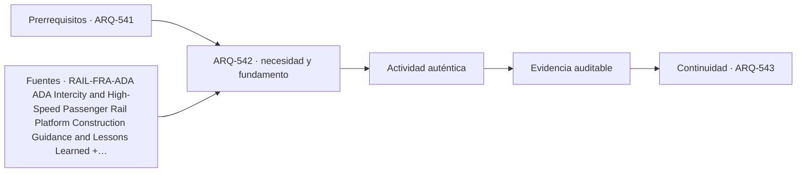

# ARQ-542 · Plataformas, gálibos y circulación

**Parte 55 · Fase II · Clase desarrollada · Incorporada en v0.30.0.**

Prerrequisitos conceptuales: ARQ-541. Sin calendario. Casos, capacidades y parámetros son ficticios salvo antecedentes expresamente atribuidos. Material educativo: no constituye proyecto ejecutable, operación ferroviaria aprobada, cálculo de puente firmado, autorización, certificación ni habilitación profesional. Revisión externa especializada pendiente.

## Pregunta central

¿Cómo relacionar plataforma, tren, borde y circulación sin tratar una dimensión aislada como accesibilidad o seguridad completas?

## Resultado y continuidad

Al terminar podrás descomponer el sistema ferroviario en servicio, geometría, flujos o camino de cargas, interfaces y estados; reconstruirás un caso cuantitativo limitado y separarás cálculo de decisión profesional. La continuidad desde ARQ-541 conserva métodos, no cifras. ARQ-543 recibe esta lógica y declara sus propios parámetros.

## 1. El tipo como sistema

La plataforma tiene zonas de espera, circulación, mobiliario, estructura, información y relación geométrica con el vehículo. Altura, separación y gálibo dependen de material rodante y sistema ferroviario. La accesibilidad es una cadena desde la calle hasta el interior del tren; una plataforma “correcta” no resuelve un ascensor fuera de servicio ni una puerta que no coincide.

La estación ferroviaria debe leerse en sección y en el tiempo. Un andén que parece amplio fuera de la hora punta puede recibir una descarga concentrada cuando llega un tren; una conexión que funciona con todos los ascensores disponibles puede fallar como cadena accesible durante mantenimiento. Por eso planta, sección y diagrama operacional deben referirse al mismo estado.

## 2. Cinco capas coordinadas

Trabajaremos con cinco capas: **plataforma**, **borde**, **gálibo**, **circulación** y **embarque**. No son una clasificación normativa. Obligan a explicar qué función cumple cada elemento y qué otra capa depende de él.

Una decisión madura identifica, como mínimo, el servicio, el objeto físico, el estado temporal, los sistemas que interfieren y la evidencia requerida. El dibujo puede comunicar esas relaciones, pero no reemplaza la medición, el cálculo o la autorización correspondiente.

## 3. Geometría, capacidad y frontera

Los números necesitan frontera. Una capacidad por hora depende del período, del estado operativo y de cómo llega la demanda. Una fuerza o desplazamiento depende del modelo, los apoyos y las acciones. Un área libre depende de qué superficies se excluyeron. Por eso cada ejercicio conserva unidades, hipótesis y denominadores.

También se evita convertir el promedio en extremo. En estaciones, un promedio horario puede ocultar la descarga de un tren; en puentes, una carga total correcta no entrega automáticamente el máximo momento, la fatiga o la reacción de cada apoyo. La aritmética se interpreta dentro del sistema que la produjo.

## 4. Interfaces técnicas y de operación

En sistemas ferroviarios, la arquitectura convive con disciplina de vía, señalización, potencia, comunicaciones y material rodante. La clase no prescribe esos sistemas: identifica sus interfaces espaciales y documentales para que no aparezcan como equipos que “caben al final”.

La interfaz se registra con posición, función, estado, documento de origen y responsable. Si cambia un tren, una plataforma, una junta, un apoyo o una secuencia de montaje, se revisan los documentos que dependían de esa condición. No se mantiene una marca de “coordinado” sobre una geometría distinta.

## 5. Accesibilidad, seguridad, inspección y mantenimiento

El proyecto debe poder usarse, operarse e inspeccionarse. En una estación esto incluye recorridos completos, información, embarque, estados de cierre y acceso de emergencia. En un puente incluye accesibilidad para inspección, drenaje, apoyos, juntas, protección, reparación y posibles restricciones de tráfico.

Las referencias extranjeras se usan para comprender preguntas y vocabulario. No se convierten en normativa chilena. En un proyecto real deben identificarse ley, reglamentos, normas, manuales del propietario y especialistas aplicables.

## Caso trabajado

PLAT-01 tiene 180 m de largo y una franja útil ficticia de 5 m: 900 m². Una banda de borde de 1 m ocupa 180 m² y dos núcleos de circulación de 36 m² cada uno dejan 648 m² para espera/circulación restante. El balance de área no prueba capacidad ni seguridad.

### Qué demuestra y qué no

Demuestra únicamente las relaciones calculadas bajo las hipótesis declaradas. No verifica seguridad integral, capacidad reglamentaria, accesibilidad, desempeño ferroviario, resistencia estructural, fatiga, socavación, construcción o mantenimiento reales.

## 6. Método de revisión profesional

- Define el servicio y el estado analizado.

- Dibuja el camino completo: de una persona, un vehículo o una carga.

- Identifica cuellos de botella e interfaces compartidas.

- Comprueba unidades, signos, referencias y cronología.

- Separa requisito, dato, hipótesis, resultado y pendiente.

- Reabre verificaciones cuando cambie geometría, capacidad, material o secuencia.

## Errores frecuentes

Confundir superficie con capacidad; usar una distancia como tiempo sin sumar esperas; tratar una ruta dibujada como disponible en todos los estados; suponer que menos apoyos significa un puente mejor; convertir un equilibrio ideal en dimensionamiento; sumar máximos de estados incompatibles; olvidar mantenimiento e inspección; o utilizar una guía extranjera como permiso local.

## Práctica independiente

Plataforma de 150 m × 6 m, banda de borde 1,2 m y tres núcleos de 30 m². Calcula área restante.

Además del resultado, escribe dos conclusiones que sí estén respaldadas y dos que todavía requieran evidencia.

Solución razonada

Área total 900 m²; borde 180 m²; núcleos 90 m²; quedan 630 m². Debe verificarse geometría efectiva, ubicación de tren, mobiliario, flujos y criterios aplicables.

Una respuesta completa conserva la frontera del ejercicio. Si detectas un conflicto, no lo “corrijas” cambiando silenciosamente un dato: crea una variante y revisa las dependencias.

## Profundización y transferencia

Compara el caso con una alternativa distinta. Pregunta qué cambiaría si aumenta la demanda, falla una conexión, se interviene una parte durante operación o aparece una restricción de mantenimiento. La transferencia correcta conserva el método y reemplaza los parámetros.

## Autoevaluación

Puedes avanzar cuando reconstruyes el caso sin mirar la solución, explicas un límite del modelo, identificas una interfaz entre disciplinas y nombras la evidencia necesaria antes de construir u operar.

*Figura 542. Esquema conceptual original. No constituye plano ferroviario, cálculo de puente, señalización operacional ni detalle ejecutable.*

<!-- pedagogia-2026:inicio -->
## Decisión pedagógica y posición curricular

### Por qué existe

Esta clase existe para resolver una necesidad concreta del recorrido: ¿Cómo relacionar plataforma, tren, borde y circulación sin tratar una dimensión aislada como accesibilidad o seguridad completas?

### Por qué está exactamente aquí

Ocupa el lugar 2 de la Parte 55. Se estudia después de ARQ-541 · Estación ferroviaria: ciudad, andén y vestíbulo porque usa esa base para responder «¿Cómo relacionar plataforma, tren, borde y circulación sin tratar una dimensión aislada como accesibilidad o seguridad completas?». Se ubica antes de ARQ-543 · Intercambios y conexiones multimodales porque la evidencia producida aquí debe estar disponible para ese paso.

- **Prerrequisitos:** `ARQ-541`
- **Capacidad que introduce:** Al terminar podrás descomponer el sistema ferroviario en servicio, geometría, flujos o camino de cargas, interfaces y estados; reconstruirás un caso cuantitativo limitado y separarás cálculo de decisión profesional. La continuidad desde ARQ-541 conserva métodos, no cifras. ARQ-543 recibe esta lógica y declara sus propios parámetros.
- **Clases o experiencias que dependen de ella:** `ARQ-543`

El diagrama permite comprobar una relación que el texto lineal oculta con facilidad: esta clase recibe capacidades previas, toma decisiones apoyadas por fuentes, exige una experiencia y produce evidencia que habilita trabajo posterior. No representa un procedimiento de obra.

## Resultado observable, evidencia y evaluación

1. Identificar y delimitar las condiciones necesarias para responder la pregunta central de plataformas, gálibos y circulación.
2. Producir y comprobar la evidencia declarada por la clase: Al terminar podrás descomponer el sistema ferroviario en servicio, geometría, flujos o camino de cargas, interfaces y estados; reconstruirás un caso cuantitativo limitado y separarás cálculo de decisión profesional. La continuidad desde ARQ-541 conserva métodos, no cifras. ARQ-543 recibe esta lógica y declara sus propios parámetros.
3. Justificar una decisión de plataformas, gálibos y circulación mediante fuentes, supuestos, alternativas y límites explícitos.

## Actividad, evidencia y criterio de aceptación

**Actividad:** Plataforma de 150 m × 6 m, banda de borde 1,2 m y tres núcleos de 30 m². Calcula área restante. Además del resultado, escribe dos conclusiones que sí estén respaldadas y dos que todavía requieran evidencia.

**Evidencia mínima:** Al terminar podrás descomponer el sistema ferroviario en servicio, geometría, flujos o camino de cargas, interfaces y estados; reconstruirás un caso cuantitativo limitado y separarás cálculo de decisión profesional. La continuidad desde ARQ-541 conserva métodos, no cifras. ARQ-543 recibe esta lógica y declara sus propios parámetros.

**Archivo sugerido:** `evidence/ARQ-542/evidencia.md`.

**Criterio de aceptación:** la entrega se acepta cuando:

- La entrega responde explícitamente a la pregunta: ¿Cómo relacionar plataforma, tren, borde y circulación sin tratar una dimensión aislada como accesibilidad o seguridad completas?
- La actividad conserva las fronteras del caso y permite reconstruir el procedimiento: Plataforma de 150 m × 6 m, banda de borde 1,2 m y tres núcleos de 30 m². Calcula área restante. Además del resultado, escribe dos conclusiones que sí estén respaldadas y dos que todavía requieran evidencia.
- Cada afirmación externa puede seguirse hasta una fuente, su alcance consultado y su límite.
- La evidencia deja disponible una entrada comprobable para ARQ-543.
- Confundir superficie con capacidad; usar una distancia como tiempo sin sumar esperas; tratar una ruta dibujada como disponible en todos los estados; suponer que menos apoyos significa un puente mejor; convertir un equilibrio ideal en dimensionamiento; sumar máximos de estados incompatibles; olvidar mantenimiento e inspección; o utilizar una guía extranjera como permiso local.

La [rúbrica común](../../docs/RUBRICA_COMUN.md) complementa estos criterios; no los reemplaza. Una entrega puede superar un promedio y continuar pendiente si oculta una condición crítica.

## Trazabilidad de las decisiones

| # | Decisión o fundamento | Fuente utilizada | Aplicación y límite en esta clase |
|---:|---|---|---|
| 1 | Relación entre plataforma, tren, embarque, construcción y accesibilidad. | [RAIL-FRA-ADA ADA Intercity and High-Speed Passenger Rail Platform…](https://railroads.dot.gov/elibrary/americans-disabilities-act-1990-ada-intercity-and-high-speed-passenger-rail-platform) | Consulta: Ficha oficial y guía de 2022 sobre plataformas y accesibilidad. Límite: Ámbito estadounidense; no reemplaza la normativa chilena ni se copian dimensiones como requisitos locales. |
| 2 | Distinguir nivel de plataforma, acceso al vehículo y desempeño de la cadena de embarque. | [RAIL-DOT-ADA Transportation for Individuals with Disabilities at…](https://www.transportation.gov/regulations/federal-register-documents/2011-23576) | Consulta: Regla final y resumen público sobre embarque accesible en plataformas nuevas o modificadas. Límite: Regulación estadounidense; se utiliza como referencia metodológica. |
| 3 | Cruces, plataformas, advertencias, cierres y separación entre circulación peatonal y trenes. | [RAIL-FRA-SAFE Pedestrian Crossing Safety at or Near Passenger Stations](https://railroads.dot.gov/elibrary/dot-issues-guidance-pedestrian-safety-train-stations) | Consulta: Página oficial y resumen de la guía de seguridad peatonal en estaciones. Límite: Referencia estadounidense; no se adoptan dimensiones ni dispositivos como normativa chilena. |

La tabla permite auditar las relaciones; la explicación, el caso y la práctica de la clase siguen siendo la documentación principal.

## Autoevaluación, recuperación y continuidad

### Errores diagnósticos

Antes de avanzar, comprueba si puedes reconstruir cada resultado sin mirar la solución, señalar qué evidencia lo sostiene y nombrar una condición que obligaría a revisar tu decisión. Conserva la primera versión, la objeción recibida y la revisión.

**Conexión siguiente:** La continuidad inmediata es ARQ-543 · Intercambios y conexiones multimodales; conserva el método y vuelve a verificar datos y límites.
<!-- pedagogia-2026:fin -->

## Fuentes y alcance de uso

### [[RAIL-FRA-ADA]](#FUENTE-RAIL-FRA-ADA) ADA Intercity and High-Speed Passenger Rail Platform Construction Guidance and Lessons Learned

Federal Railroad Administration. [https://railroads.dot.gov/elibrary/americans-disabilities-act-1990-ada-intercity-and-high-speed-passenger-rail-platform](https://railroads.dot.gov/elibrary/americans-disabilities-act-1990-ada-intercity-and-high-speed-passenger-rail-platform)

**Consulta:** Ficha oficial y guía de 2022 sobre plataformas y accesibilidad. **Apoyo:** Relación entre plataforma, tren, embarque, construcción y accesibilidad. **Límite:** Ámbito estadounidense; no reemplaza la normativa chilena ni se copian dimensiones como requisitos locales.

### [[RAIL-DOT-ADA]](#FUENTE-RAIL-DOT-ADA) Transportation for Individuals with Disabilities at Passenger Railroad Station Platforms

U.S. Department of Transportation. [https://www.transportation.gov/regulations/federal-register-documents/2011-23576](https://www.transportation.gov/regulations/federal-register-documents/2011-23576)

**Consulta:** Regla final y resumen público sobre embarque accesible en plataformas nuevas o modificadas. **Apoyo:** Distinguir nivel de plataforma, acceso al vehículo y desempeño de la cadena de embarque. **Límite:** Regulación estadounidense; se utiliza como referencia metodológica.

### [[RAIL-FRA-SAFE]](#FUENTE-RAIL-FRA-SAFE) Pedestrian Crossing Safety at or Near Passenger Stations

Federal Railroad Administration. [https://railroads.dot.gov/elibrary/dot-issues-guidance-pedestrian-safety-train-stations](https://railroads.dot.gov/elibrary/dot-issues-guidance-pedestrian-safety-train-stations)

**Consulta:** Página oficial y resumen de la guía de seguridad peatonal en estaciones. **Apoyo:** Cruces, plataformas, advertencias, cierres y separación entre circulación peatonal y trenes. **Límite:** Referencia estadounidense; no se adoptan dimensiones ni dispositivos como normativa chilena.
