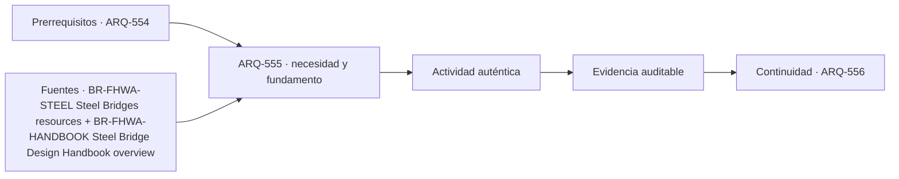

# ARQ-555 · Puentes atirantados

**Parte 56 · Fase II · Clase desarrollada · Incorporada en v0.30.0.**

Prerrequisitos conceptuales: ARQ-554. Sin calendario. Casos, capacidades y parámetros son ficticios salvo antecedentes expresamente atribuidos. Material educativo: no constituye proyecto ejecutable, operación ferroviaria aprobada, cálculo de puente firmado, autorización, certificación ni habilitación profesional. Revisión externa especializada pendiente.

## Pregunta central

¿Cómo coordinan tablero, pilono y tirantes un puente atirantado sin tratar los cables como soportes independientes?

## Resultado y continuidad

Al terminar podrás descomponer el sistema de puente en servicio, geometría, flujos o camino de cargas, interfaces y estados; reconstruirás un caso cuantitativo limitado y separarás cálculo de decisión profesional. La continuidad desde ARQ-554 conserva métodos, no cifras. ARQ-556 recibe esta lógica y declara sus propios parámetros.

## 1. El tipo como sistema

Los tirantes conectan el tablero directamente con uno o más pilonos. Su geometría, pretensión y secuencia de montaje influyen en deformaciones y fuerzas. El tablero y pilono participan en equilibrio global; modificar un tirante redistribuye acciones. La tipología exige además inspección y acceso a anclajes.

Un puente no se elige únicamente por su luz máxima. La topografía, el obstáculo cruzado, la posibilidad de apoyos, las condiciones geotécnicas, la construcción, el tráfico durante obra, el acceso de inspección y la vida de servicio participan desde el anteproyecto. Cambiar la tipología cambia también cómo se construye y mantiene.

## 2. Cinco capas coordinadas

Trabajaremos con cinco capas: **tablero**, **tirantes**, **pilono**, **anclajes** y **montaje**. No son una clasificación normativa. Obligan a explicar qué función cumple cada elemento y qué otra capa depende de él.

Una decisión madura identifica, como mínimo, el servicio, el objeto físico, el estado temporal, los sistemas que interfieren y la evidencia requerida. El dibujo puede comunicar esas relaciones, pero no reemplaza la medición, el cálculo o la autorización correspondiente.

## 3. Geometría, capacidad y frontera

Los números necesitan frontera. Una capacidad por hora depende del período, del estado operativo y de cómo llega la demanda. Una fuerza o desplazamiento depende del modelo, los apoyos y las acciones. Un área libre depende de qué superficies se excluyeron. Por eso cada ejercicio conserva unidades, hipótesis y denominadores.

También se evita convertir el promedio en extremo. En estaciones, un promedio horario puede ocultar la descarga de un tren; en puentes, una carga total correcta no entrega automáticamente el máximo momento, la fatiga o la reacción de cada apoyo. La aritmética se interpreta dentro del sistema que la produjo.

## 4. Interfaces técnicas y de operación

El detalle estructural y el mantenimiento están relacionados. Una junta que drena mal puede afectar apoyos; un detalle de acero sensible a fatiga requiere acceso de inspección; una solución acelerada modifica estados de montaje. La clase conserva esos vínculos sin sustituir el cálculo especializado.

La interfaz se registra con posición, función, estado, documento de origen y responsable. Si cambia un tren, una plataforma, una junta, un apoyo o una secuencia de montaje, se revisan los documentos que dependían de esa condición. No se mantiene una marca de “coordinado” sobre una geometría distinta.

## 5. Accesibilidad, seguridad, inspección y mantenimiento

El proyecto debe poder usarse, operarse e inspeccionarse. En una estación esto incluye recorridos completos, información, embarque, estados de cierre y acceso de emergencia. En un puente incluye accesibilidad para inspección, drenaje, apoyos, juntas, protección, reparación y posibles restricciones de tráfico.

Las referencias extranjeras se usan para comprender preguntas y vocabulario. No se convierten en normativa chilena. En un proyecto real deben identificarse ley, reglamentos, normas, manuales del propietario y especialistas aplicables.

## Caso trabajado

CABLESTAY-01 considera un tirante con componente vertical requerida 1.000 kN y ángulo 35° respecto de la horizontal. T=1000/sin35°≈1.743,4 kN; su componente horizontal≈1.428 kN. Esta componente debe equilibrarse en el sistema.

### Qué demuestra y qué no

Demuestra únicamente las relaciones calculadas bajo las hipótesis declaradas. No verifica seguridad integral, capacidad reglamentaria, accesibilidad, desempeño ferroviario, resistencia estructural, fatiga, socavación, construcción o mantenimiento reales.

## 6. Método de revisión profesional

- Define el servicio y el estado analizado.

- Dibuja el camino completo: de una persona, un vehículo o una carga.

- Identifica cuellos de botella e interfaces compartidas.

- Comprueba unidades, signos, referencias y cronología.

- Separa requisito, dato, hipótesis, resultado y pendiente.

- Reabre verificaciones cuando cambie geometría, capacidad, material o secuencia.

## Errores frecuentes

Confundir superficie con capacidad; usar una distancia como tiempo sin sumar esperas; tratar una ruta dibujada como disponible en todos los estados; suponer que menos apoyos significa un puente mejor; convertir un equilibrio ideal en dimensionamiento; sumar máximos de estados incompatibles; olvidar mantenimiento e inspección; o utilizar una guía extranjera como permiso local.

## Práctica independiente

Componente vertical 800 kN y ángulo 40°. Calcula T y componente horizontal.

Además del resultado, escribe dos conclusiones que sí estén respaldadas y dos que todavía requieran evidencia.

Solución razonada

T=800/sin40°≈1.244,6 kN; H≈953,4 kN. No son capacidades ni fuerzas de un puente real.

Una respuesta completa conserva la frontera del ejercicio. Si detectas un conflicto, no lo “corrijas” cambiando silenciosamente un dato: crea una variante y revisa las dependencias.

## Profundización y transferencia

Compara el caso con una alternativa distinta. Pregunta qué cambiaría si aumenta la demanda, falla una conexión, se interviene una parte durante operación o aparece una restricción de mantenimiento. La transferencia correcta conserva el método y reemplaza los parámetros.

## Autoevaluación

Puedes avanzar cuando reconstruyes el caso sin mirar la solución, explicas un límite del modelo, identificas una interfaz entre disciplinas y nombras la evidencia necesaria antes de construir u operar.

*Figura 555. Esquema conceptual original. No constituye plano ferroviario, cálculo de puente, señalización operacional ni detalle ejecutable.*

<!-- pedagogia-2026:inicio -->
## Decisión pedagógica y posición curricular

### Por qué existe

Esta clase existe para resolver una necesidad concreta del recorrido: ¿Cómo coordinan tablero, pilono y tirantes un puente atirantado sin tratar los cables como soportes independientes?

### Por qué está exactamente aquí

Ocupa el lugar 5 de la Parte 56. Se estudia después de ARQ-554 · Puentes de celosía porque usa esa base para responder «¿Cómo coordinan tablero, pilono y tirantes un puente atirantado sin tratar los cables como soportes independientes?». Se ubica antes de ARQ-556 · Puentes colgantes porque la evidencia producida aquí debe estar disponible para ese paso.

- **Prerrequisitos:** `ARQ-554`
- **Capacidad que introduce:** Al terminar podrás descomponer el sistema de puente en servicio, geometría, flujos o camino de cargas, interfaces y estados; reconstruirás un caso cuantitativo limitado y separarás cálculo de decisión profesional. La continuidad desde ARQ-554 conserva métodos, no cifras. ARQ-556 recibe esta lógica y declara sus propios parámetros.
- **Clases o experiencias que dependen de ella:** `ARQ-556`

El diagrama permite comprobar una relación que el texto lineal oculta con facilidad: esta clase recibe capacidades previas, toma decisiones apoyadas por fuentes, exige una experiencia y produce evidencia que habilita trabajo posterior. No representa un procedimiento de obra.

## Resultado observable, evidencia y evaluación

1. Identificar y delimitar las condiciones necesarias para responder la pregunta central de puentes atirantados.
2. Producir y comprobar la evidencia declarada por la clase: Al terminar podrás descomponer el sistema de puente en servicio, geometría, flujos o camino de cargas, interfaces y estados; reconstruirás un caso cuantitativo limitado y separarás cálculo de decisión profesional. La continuidad desde ARQ-554 conserva métodos, no cifras. ARQ-556 recibe esta lógica y declara sus propios parámetros.
3. Justificar una decisión de puentes atirantados mediante fuentes, supuestos, alternativas y límites explícitos.

## Actividad, evidencia y criterio de aceptación

**Actividad:** Componente vertical 800 kN y ángulo 40°. Calcula T y componente horizontal. Además del resultado, escribe dos conclusiones que sí estén respaldadas y dos que todavía requieran evidencia.

**Evidencia mínima:** Al terminar podrás descomponer el sistema de puente en servicio, geometría, flujos o camino de cargas, interfaces y estados; reconstruirás un caso cuantitativo limitado y separarás cálculo de decisión profesional. La continuidad desde ARQ-554 conserva métodos, no cifras. ARQ-556 recibe esta lógica y declara sus propios parámetros.

**Archivo sugerido:** `evidence/ARQ-555/evidencia.md`.

**Criterio de aceptación:** la entrega se acepta cuando:

- La entrega responde explícitamente a la pregunta: ¿Cómo coordinan tablero, pilono y tirantes un puente atirantado sin tratar los cables como soportes independientes?
- La actividad conserva las fronteras del caso y permite reconstruir el procedimiento: Componente vertical 800 kN y ángulo 40°. Calcula T y componente horizontal. Además del resultado, escribe dos conclusiones que sí estén respaldadas y dos que todavía requieran evidencia.
- Cada afirmación externa puede seguirse hasta una fuente, su alcance consultado y su límite.
- La evidencia deja disponible una entrada comprobable para ARQ-556.
- Confundir superficie con capacidad; usar una distancia como tiempo sin sumar esperas; tratar una ruta dibujada como disponible en todos los estados; suponer que menos apoyos significa un puente mejor; convertir un equilibrio ideal en dimensionamiento; sumar máximos de estados incompatibles; olvidar mantenimiento e inspección; o utilizar una guía extranjera como permiso local.

La [rúbrica común](../../docs/RUBRICA_COMUN.md) complementa estos criterios; no los reemplaza. Una entrega puede superar un promedio y continuar pendiente si oculta una condición crítica.

## Trazabilidad de las decisiones

| # | Decisión o fundamento | Fuente utilizada | Aplicación y límite en esta clase |
|---:|---|---|---|
| 1 | Tipologías, diseño, fatiga, fabricación, estabilidad y mantenimiento de puentes de acero. | [BR-FHWA-STEEL Steel Bridges resources](https://www.fhwa.dot.gov/bridge/steel.cfm) | Consulta: Portal oficial de manuales y recursos de puentes de acero. Límite: No se aplican especificaciones LRFD ni coeficientes de diseño en los ejercicios. |
| 2 | Puente como sistema donde tipología, fabricación, construcción y mantenimiento se coordinan. | [BR-FHWA-HANDBOOK Steel Bridge Design Handbook overview](https://www.fhwa.dot.gov/publications/focus/13mar/13mar01.cfm) | Consulta: Artículo oficial que enumera los volúmenes del handbook, incluida selección de tipo, cargas, análisis, constructibilidad y fatiga. Límite: Resumen institucional; no sustituye el handbook ni AASHTO. |

La tabla permite auditar las relaciones; la explicación, el caso y la práctica de la clase siguen siendo la documentación principal.

## Autoevaluación, recuperación y continuidad

### Errores diagnósticos

Antes de avanzar, comprueba si puedes reconstruir cada resultado sin mirar la solución, señalar qué evidencia lo sostiene y nombrar una condición que obligaría a revisar tu decisión. Conserva la primera versión, la objeción recibida y la revisión.

**Conexión siguiente:** La continuidad inmediata es ARQ-556 · Puentes colgantes; conserva el método y vuelve a verificar datos y límites.
<!-- pedagogia-2026:fin -->

## Fuentes y alcance de uso

### [[BR-FHWA-STEEL]](#FUENTE-BR-FHWA-STEEL) Steel Bridges resources

Federal Highway Administration. [https://www.fhwa.dot.gov/bridge/steel.cfm](https://www.fhwa.dot.gov/bridge/steel.cfm)

**Consulta:** Portal oficial de manuales y recursos de puentes de acero. **Apoyo:** Tipologías, diseño, fatiga, fabricación, estabilidad y mantenimiento de puentes de acero. **Límite:** No se aplican especificaciones LRFD ni coeficientes de diseño en los ejercicios.

### [[BR-FHWA-HANDBOOK]](#FUENTE-BR-FHWA-HANDBOOK) Steel Bridge Design Handbook overview

Federal Highway Administration. [https://www.fhwa.dot.gov/publications/focus/13mar/13mar01.cfm](https://www.fhwa.dot.gov/publications/focus/13mar/13mar01.cfm)

**Consulta:** Artículo oficial que enumera los volúmenes del handbook, incluida selección de tipo, cargas, análisis, constructibilidad y fatiga. **Apoyo:** Puente como sistema donde tipología, fabricación, construcción y mantenimiento se coordinan. **Límite:** Resumen institucional; no sustituye el handbook ni AASHTO.
