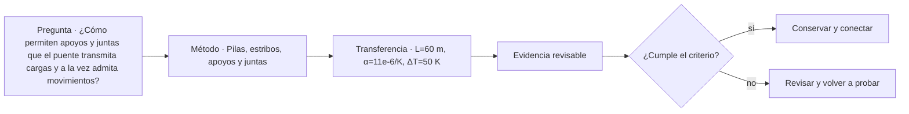

# ARQ-558 · Pilas, estribos, apoyos y juntas

**Parte 56 · Fase II · Clase desarrollada · Incorporada en v0.30.0.**

Prerrequisitos conceptuales: ARQ-557. Sin calendario. Casos, capacidades y parámetros son ficticios salvo antecedentes expresamente atribuidos. Material educativo: no constituye proyecto ejecutable, operación ferroviaria aprobada, cálculo de puente firmado, autorización, certificación ni habilitación profesional. Revisión externa especializada pendiente.

## Pregunta central

¿Cómo permiten apoyos y juntas que el puente transmita cargas y a la vez admita movimientos?

## Resultado y continuidad

Al terminar podrás descomponer el sistema de puente en servicio, geometría, flujos o camino de cargas, interfaces y estados; reconstruirás un caso cuantitativo limitado y separarás cálculo de decisión profesional. La continuidad desde ARQ-557 conserva métodos, no cifras. ARQ-559 recibe esta lógica y declara sus propios parámetros.

## 1. El tipo como sistema

Pilas y estribos reciben la superestructura y conectan con fundaciones y terreno. Los apoyos pueden permitir o restringir traslaciones y giros; las juntas acomodan movimientos y afectan drenaje, ruido y mantenimiento. Un detalle pequeño puede convertirse en punto crítico de durabilidad.

Un puente no se elige únicamente por su luz máxima. La topografía, el obstáculo cruzado, la posibilidad de apoyos, las condiciones geotécnicas, la construcción, el tráfico durante obra, el acceso de inspección y la vida de servicio participan desde el anteproyecto. Cambiar la tipología cambia también cómo se construye y mantiene.

## 2. Cinco capas coordinadas

Trabajaremos con cinco capas: **tablero**, **apoyos**, **juntas**, **pilas** y **estribos**. No son una clasificación normativa. Obligan a explicar qué función cumple cada elemento y qué otra capa depende de él.

Una decisión madura identifica, como mínimo, el servicio, el objeto físico, el estado temporal, los sistemas que interfieren y la evidencia requerida. El dibujo puede comunicar esas relaciones, pero no reemplaza la medición, el cálculo o la autorización correspondiente.

## 3. Geometría, capacidad y frontera

Los números necesitan frontera. Una capacidad por hora depende del período, del estado operativo y de cómo llega la demanda. Una fuerza o desplazamiento depende del modelo, los apoyos y las acciones. Un área libre depende de qué superficies se excluyeron. Por eso cada ejercicio conserva unidades, hipótesis y denominadores.

También se evita convertir el promedio en extremo. En estaciones, un promedio horario puede ocultar la descarga de un tren; en puentes, una carga total correcta no entrega automáticamente el máximo momento, la fatiga o la reacción de cada apoyo. La aritmética se interpreta dentro del sistema que la produjo.

## 4. Interfaces técnicas y de operación

El detalle estructural y el mantenimiento están relacionados. Una junta que drena mal puede afectar apoyos; un detalle de acero sensible a fatiga requiere acceso de inspección; una solución acelerada modifica estados de montaje. La clase conserva esos vínculos sin sustituir el cálculo especializado.

La interfaz se registra con posición, función, estado, documento de origen y responsable. Si cambia un tren, una plataforma, una junta, un apoyo o una secuencia de montaje, se revisan los documentos que dependían de esa condición. No se mantiene una marca de “coordinado” sobre una geometría distinta.

## 5. Accesibilidad, seguridad, inspección y mantenimiento

El proyecto debe poder usarse, operarse e inspeccionarse. En una estación esto incluye recorridos completos, información, embarque, estados de cierre y acceso de emergencia. En un puente incluye accesibilidad para inspección, drenaje, apoyos, juntas, protección, reparación y posibles restricciones de tráfico.

Las referencias extranjeras se usan para comprender preguntas y vocabulario. No se convierten en normativa chilena. En un proyecto real deben identificarse ley, reglamentos, normas, manuales del propietario y especialistas aplicables.

## Caso trabajado

BEARING-01 tiene longitud de tablero 80 m y coeficiente térmico ficticio 12e-6/K. Para ΔT=40 K, expansión libre=80×12e-6×40=0,0384 m=38,4 mm. Una junta debe estudiarse con movimientos adicionales y tolerancias, no solo ese valor.

### Qué demuestra y qué no

Demuestra únicamente las relaciones calculadas bajo las hipótesis declaradas. No verifica seguridad integral, capacidad reglamentaria, accesibilidad, desempeño ferroviario, resistencia estructural, fatiga, socavación, construcción o mantenimiento reales.

## 6. Método de revisión profesional

- Define el servicio y el estado analizado.

- Dibuja el camino completo: de una persona, un vehículo o una carga.

- Identifica cuellos de botella e interfaces compartidas.

- Comprueba unidades, signos, referencias y cronología.

- Separa requisito, dato, hipótesis, resultado y pendiente.

- Reabre verificaciones cuando cambie geometría, capacidad, material o secuencia.

## Errores frecuentes

Confundir superficie con capacidad; usar una distancia como tiempo sin sumar esperas; tratar una ruta dibujada como disponible en todos los estados; suponer que menos apoyos significa un puente mejor; convertir un equilibrio ideal en dimensionamiento; sumar máximos de estados incompatibles; olvidar mantenimiento e inspección; o utilizar una guía extranjera como permiso local.

## Práctica independiente

L=60 m, α=11e-6/K, ΔT=50 K. Calcula expansión libre.

Además del resultado, escribe dos conclusiones que sí estén respaldadas y dos que todavía requieran evidencia.

Solución razonada

ΔL=0,033 m=33 mm. No es ancho de junta recomendado; faltan retracción, fluencia, sismo, tolerancias y estados.

Una respuesta completa conserva la frontera del ejercicio. Si detectas un conflicto, no lo “corrijas” cambiando silenciosamente un dato: crea una variante y revisa las dependencias.

## Profundización y transferencia

Compara el caso con una alternativa distinta. Pregunta qué cambiaría si aumenta la demanda, falla una conexión, se interviene una parte durante operación o aparece una restricción de mantenimiento. La transferencia correcta conserva el método y reemplaza los parámetros.

## Autoevaluación

Puedes avanzar cuando reconstruyes el caso sin mirar la solución, explicas un límite del modelo, identificas una interfaz entre disciplinas y nombras la evidencia necesaria antes de construir u operar.

*Figura 558. Esquema conceptual original. No constituye plano ferroviario, cálculo de puente, señalización operacional ni detalle ejecutable.*

<!-- pedagogia-2026:inicio -->
## Mapa visual de aprendizaje

El diagrama representa el ciclo de aprendizaje de esta clase, no una secuencia de obra ni un procedimiento profesional.

## Resultado observable, evidencia y evaluación

**Tipo de clase:** cuantitativa.

**Evidencia mínima:** desarrollo reproducible con datos, unidades, hipótesis, control independiente y conclusión limitada al modelo.

**Archivo sugerido:** `evidence/ARQ-558/evidencia.md`.

| Criterio | Evidencia observable |
|---|---|
| Precisión y representación · 20 % | Los conceptos, unidades y convenciones se usan de forma coherente y pueden ser reconstruidos por otra persona. |
| Evidencia y trazabilidad · 25 % | Cada afirmación importante se vincula con dato, cálculo, observación o fuente; hipótesis y desconocidos permanecen visibles. |
| Decisión y alternativas · 25 % | La decisión responde a la pregunta, compara al menos una alternativa y declara qué condición la haría cambiar. |
| Integración y ciclo de vida · 20 % | Se identifica una interfaz y una consecuencia para construcción, uso, mantenimiento, adaptación o fin de vida. |
| Comunicación, ética y límites · 10 % | El alcance se entiende sin explicación oral adicional y no se atribuyen permisos, competencias o certezas inexistentes. |

**Criterio de aceptación:** 80/100 y ningún criterio bajo 60 %. Una entrega genérica que podría reutilizarse sin cambios en otra clase no demuestra dominio. Si existe una condición crítica de seguridad, accesibilidad, evidencia o responsabilidad sin resolver, la entrega permanece pendiente aunque el promedio supere 80.

### Errores diagnósticos

En esta clase conviene vigilar especialmente: perder unidades; ocultar hipótesis; redondear antes de tiempo; convertir el resultado del modelo en autorización.

## Autoevaluación, recuperación y continuidad

Antes de avanzar, responde sin consultar la solución:

1. ¿Qué decisión concreta puedes tomar ahora que no podías justificar antes?
2. ¿Qué evidencia de tu entrega es comprobada y cuál continúa siendo una hipótesis?
3. ¿Qué cambio de contexto invalidaría la transferencia realizada?

Revisa la entrega a las 24–48 horas y nuevamente al cerrar la parte. Conserva la primera versión, la crítica recibida y la versión revisada: el aprendizaje se demuestra también mediante el cambio entre versiones.
<!-- pedagogia-2026:fin -->

## Fuentes y alcance de uso

### [[BR-FHWA-LTBP]](#FUENTE-BR-FHWA-LTBP) Long-Term Bridge Performance protocols

Federal Highway Administration. [https://www.fhwa.dot.gov/publications/research/infrastructure/structures/ltbp/16007/005.cfm](https://www.fhwa.dot.gov/publications/research/infrastructure/structures/ltbp/16007/005.cfm)

**Consulta:** Página del programa LTBP con protocolos de inspección de acero, concreto, apoyos y juntas. **Apoyo:** Inspección como sistema de datos de condición y deterioro, no solo revisión visual informal. **Límite:** No se ejecutan ensayos no destructivos ni se extrapolan procedimientos a Chile.

### [[BR-FHWA-INSPECT]](#FUENTE-BR-FHWA-INSPECT) Bridge Inspection

Federal Highway Administration. [https://www.fhwa.dot.gov/bridge/inspection/](https://www.fhwa.dot.gov/bridge/inspection/)

**Consulta:** Portal oficial de inspección, NBIS, manuales y recursos actualizados. **Apoyo:** Inspección periódica, condición, carga, socavación y seguimiento como parte del ciclo de vida. **Límite:** Programa estadounidense; no fija obligaciones para Chile.
