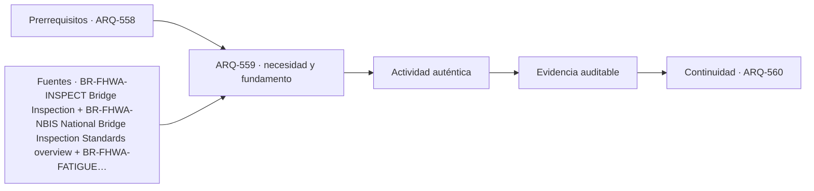

# ARQ-559 · Montaje, inspección, fatiga y corrosión

**Parte 56 · Fase II · Clase desarrollada · Incorporada en v0.30.0.**

Prerrequisitos conceptuales: ARQ-558. Sin calendario. Casos, capacidades y parámetros son ficticios salvo antecedentes expresamente atribuidos. Material educativo: no constituye proyecto ejecutable, operación ferroviaria aprobada, cálculo de puente firmado, autorización, certificación ni habilitación profesional. Revisión externa especializada pendiente.

## Pregunta central

¿Cómo cambia el diseño del puente cuando se considera desde el inicio fabricación, montaje, inspección, fatiga, corrosión y reparación?

## Resultado y continuidad

Al terminar podrás descomponer el sistema de puente en servicio, geometría, flujos o camino de cargas, interfaces y estados; reconstruirás un caso cuantitativo limitado y separarás cálculo de decisión profesional. La continuidad desde ARQ-558 conserva métodos, no cifras. ARQ-560 recibe esta lógica y declara sus propios parámetros.

## 1. El tipo como sistema

El puente existe en estados temporales antes de alcanzar su sistema final. Montaje puede cambiar apoyos y estabilidad; inspección necesita acceso; fatiga depende de ciclos y detalles; corrosión depende de exposición, drenaje y protección. La durabilidad no se añade al final como pintura genérica.

Un puente no se elige únicamente por su luz máxima. La topografía, el obstáculo cruzado, la posibilidad de apoyos, las condiciones geotécnicas, la construcción, el tráfico durante obra, el acceso de inspección y la vida de servicio participan desde el anteproyecto. Cambiar la tipología cambia también cómo se construye y mantiene.

## 2. Cinco capas coordinadas

Trabajaremos con cinco capas: **fabricación**, **montaje**, **inspección**, **fatiga** y **corrosión**. No son una clasificación normativa. Obligan a explicar qué función cumple cada elemento y qué otra capa depende de él.

Una decisión madura identifica, como mínimo, el servicio, el objeto físico, el estado temporal, los sistemas que interfieren y la evidencia requerida. El dibujo puede comunicar esas relaciones, pero no reemplaza la medición, el cálculo o la autorización correspondiente.

## 3. Geometría, capacidad y frontera

Los números necesitan frontera. Una capacidad por hora depende del período, del estado operativo y de cómo llega la demanda. Una fuerza o desplazamiento depende del modelo, los apoyos y las acciones. Un área libre depende de qué superficies se excluyeron. Por eso cada ejercicio conserva unidades, hipótesis y denominadores.

También se evita convertir el promedio en extremo. En estaciones, un promedio horario puede ocultar la descarga de un tren; en puentes, una carga total correcta no entrega automáticamente el máximo momento, la fatiga o la reacción de cada apoyo. La aritmética se interpreta dentro del sistema que la produjo.

## 4. Interfaces técnicas y de operación

El detalle estructural y el mantenimiento están relacionados. Una junta que drena mal puede afectar apoyos; un detalle de acero sensible a fatiga requiere acceso de inspección; una solución acelerada modifica estados de montaje. La clase conserva esos vínculos sin sustituir el cálculo especializado.

La interfaz se registra con posición, función, estado, documento de origen y responsable. Si cambia un tren, una plataforma, una junta, un apoyo o una secuencia de montaje, se revisan los documentos que dependían de esa condición. No se mantiene una marca de “coordinado” sobre una geometría distinta.

## 5. Accesibilidad, seguridad, inspección y mantenimiento

El proyecto debe poder usarse, operarse e inspeccionarse. En una estación esto incluye recorridos completos, información, embarque, estados de cierre y acceso de emergencia. En un puente incluye accesibilidad para inspección, drenaje, apoyos, juntas, protección, reparación y posibles restricciones de tráfico.

Las referencias extranjeras se usan para comprender preguntas y vocabulario. No se convierten en normativa chilena. En un proyecto real deben identificarse ley, reglamentos, normas, manuales del propietario y especialistas aplicables.

## Caso trabajado

FAT-01 compara dos detalles sometidos a un rango de tensión ficticio de 50 MPa. Si uno acumula 2 millones de ciclos y otro 5 millones, contar ciclos no permite declarar cuál falla antes sin curva o categoría de fatiga. El ejercicio registra demanda y evidencia faltante.

### Qué demuestra y qué no

Demuestra únicamente las relaciones calculadas bajo las hipótesis declaradas. No verifica seguridad integral, capacidad reglamentaria, accesibilidad, desempeño ferroviario, resistencia estructural, fatiga, socavación, construcción o mantenimiento reales.

## 6. Método de revisión profesional

- Define el servicio y el estado analizado.

- Dibuja el camino completo: de una persona, un vehículo o una carga.

- Identifica cuellos de botella e interfaces compartidas.

- Comprueba unidades, signos, referencias y cronología.

- Separa requisito, dato, hipótesis, resultado y pendiente.

- Reabre verificaciones cuando cambie geometría, capacidad, material o secuencia.

## Errores frecuentes

Confundir superficie con capacidad; usar una distancia como tiempo sin sumar esperas; tratar una ruta dibujada como disponible en todos los estados; suponer que menos apoyos significa un puente mejor; convertir un equilibrio ideal en dimensionamiento; sumar máximos de estados incompatibles; olvidar mantenimiento e inspección; o utilizar una guía extranjera como permiso local.

## Práctica independiente

Detalle A: 3 millones de ciclos a 40 MPa; B: 1 millón a 65 MPa. ¿Cuál es “mejor”?

Además del resultado, escribe dos conclusiones que sí estén respaldadas y dos que todavía requieran evidencia.

Solución razonada

No puede decidirse con esos dos pares sin relación de fatiga, material, detalle y criterio. La respuesta correcta conserva datos y solicita evidencia pertinente.

Una respuesta completa conserva la frontera del ejercicio. Si detectas un conflicto, no lo “corrijas” cambiando silenciosamente un dato: crea una variante y revisa las dependencias.

## Profundización y transferencia

Compara el caso con una alternativa distinta. Pregunta qué cambiaría si aumenta la demanda, falla una conexión, se interviene una parte durante operación o aparece una restricción de mantenimiento. La transferencia correcta conserva el método y reemplaza los parámetros.

## Autoevaluación

Puedes avanzar cuando reconstruyes el caso sin mirar la solución, explicas un límite del modelo, identificas una interfaz entre disciplinas y nombras la evidencia necesaria antes de construir u operar.

*Figura 559. Esquema conceptual original. No constituye plano ferroviario, cálculo de puente, señalización operacional ni detalle ejecutable.*

<!-- pedagogia-2026:inicio -->
## Decisión pedagógica y posición curricular

### Por qué existe

Esta clase existe para resolver una necesidad concreta del recorrido: ¿Cómo cambia el diseño del puente cuando se considera desde el inicio fabricación, montaje, inspección, fatiga, corrosión y reparación?

### Por qué está exactamente aquí

Ocupa el lugar 9 de la Parte 56. Se estudia después de ARQ-558 · Pilas, estribos, apoyos y juntas porque usa esa base para responder «¿Cómo cambia el diseño del puente cuando se considera desde el inicio fabricación, montaje, inspección, fatiga, corrosión y reparación?». Se ubica antes de ARQ-560 · Anteproyecto comparado de puente porque la evidencia producida aquí debe estar disponible para ese paso.

- **Prerrequisitos:** `ARQ-558`
- **Capacidad que introduce:** Al terminar podrás descomponer el sistema de puente en servicio, geometría, flujos o camino de cargas, interfaces y estados; reconstruirás un caso cuantitativo limitado y separarás cálculo de decisión profesional. La continuidad desde ARQ-558 conserva métodos, no cifras. ARQ-560 recibe esta lógica y declara sus propios parámetros.
- **Clases o experiencias que dependen de ella:** `ARQ-560`

El diagrama permite comprobar una relación que el texto lineal oculta con facilidad: esta clase recibe capacidades previas, toma decisiones apoyadas por fuentes, exige una experiencia y produce evidencia que habilita trabajo posterior. No representa un procedimiento de obra.

## Resultado observable, evidencia y evaluación

1. Identificar y delimitar las condiciones necesarias para responder la pregunta central de montaje, inspección, fatiga y corrosión.
2. Producir y comprobar la evidencia declarada por la clase: Al terminar podrás descomponer el sistema de puente en servicio, geometría, flujos o camino de cargas, interfaces y estados; reconstruirás un caso cuantitativo limitado y separarás cálculo de decisión profesional. La continuidad desde ARQ-558 conserva métodos, no cifras. ARQ-560 recibe esta lógica y declara sus propios parámetros.
3. Justificar una decisión de montaje, inspección, fatiga y corrosión mediante fuentes, supuestos, alternativas y límites explícitos.

## Actividad, evidencia y criterio de aceptación

**Actividad:** Detalle A: 3 millones de ciclos a 40 MPa; B: 1 millón a 65 MPa. ¿Cuál es “mejor”? Además del resultado, escribe dos conclusiones que sí estén respaldadas y dos que todavía requieran evidencia.

**Evidencia mínima:** Al terminar podrás descomponer el sistema de puente en servicio, geometría, flujos o camino de cargas, interfaces y estados; reconstruirás un caso cuantitativo limitado y separarás cálculo de decisión profesional. La continuidad desde ARQ-558 conserva métodos, no cifras. ARQ-560 recibe esta lógica y declara sus propios parámetros.

**Archivo sugerido:** `evidence/ARQ-559/evidencia.md`.

**Criterio de aceptación:** la entrega se acepta cuando:

- La entrega responde explícitamente a la pregunta: ¿Cómo cambia el diseño del puente cuando se considera desde el inicio fabricación, montaje, inspección, fatiga, corrosión y reparación?
- La actividad conserva las fronteras del caso y permite reconstruir el procedimiento: Detalle A: 3 millones de ciclos a 40 MPa; B: 1 millón a 65 MPa. ¿Cuál es “mejor”? Además del resultado, escribe dos conclusiones que sí estén respaldadas y dos que todavía requieran evidencia.
- Cada afirmación externa puede seguirse hasta una fuente, su alcance consultado y su límite.
- La evidencia deja disponible una entrada comprobable para ARQ-560.
- Confundir superficie con capacidad; usar una distancia como tiempo sin sumar esperas; tratar una ruta dibujada como disponible en todos los estados; suponer que menos apoyos significa un puente mejor; convertir un equilibrio ideal en dimensionamiento; sumar máximos de estados incompatibles; olvidar mantenimiento e inspección; o utilizar una guía extranjera como permiso local.

La [rúbrica común](../../docs/RUBRICA_COMUN.md) complementa estos criterios; no los reemplaza. Una entrega puede superar un promedio y continuar pendiente si oculta una condición crítica.

## Trazabilidad de las decisiones

| # | Decisión o fundamento | Fuente utilizada | Aplicación y límite en esta clase |
|---:|---|---|---|
| 1 | Inspección periódica, condición, carga, socavación y seguimiento como parte del ciclo de vida. | [BR-FHWA-INSPECT Bridge Inspection](https://www.fhwa.dot.gov/bridge/inspection/) | Consulta: Portal oficial de inspección, NBIS, manuales y recursos actualizados. Límite: Programa estadounidense; no fija obligaciones para Chile. |
| 2 | Necesidad de inventario, inspección y gestión de condición. | [BR-FHWA-NBIS National Bridge Inspection Standards overview](https://www.fhwa.dot.gov/bridge/nbis.cfm) | Consulta: Página pública que describe los estándares federales de inspección y su actualización de 2022. Límite: No se adopta como normativa chilena ni se utiliza para determinar intervalos reales. |
| 3 | Relación entre detalles, ciclos, evaluación, reparación e inspección. | [BR-FHWA-FATIGUE Design and Evaluation of Steel Bridges for Fatigue and…](https://www.fhwa.dot.gov/bridge/steel/pubs/nhi16016.pdf) | Consulta: Manual público de referencia sobre fatiga y fractura de puentes de acero. Límite: No se ejecuta su procedimiento de diseño ni se establecen categorías de detalle. |
| 4 | Construcción por fases, prefabricación y reducción del impacto de obra sobre movilidad. | [BR-FHWA-ABC Accelerated Bridge Construction](https://www.fhwa.dot.gov/bridge/abc/) | Consulta: Portal oficial de planificación, soluciones estructurales y construcción acelerada. Límite: No se elige un método constructivo real ni se cuantifican beneficios sin datos del proyecto. |

La tabla permite auditar las relaciones; la explicación, el caso y la práctica de la clase siguen siendo la documentación principal.

## Autoevaluación, recuperación y continuidad

### Errores diagnósticos

Antes de avanzar, comprueba si puedes reconstruir cada resultado sin mirar la solución, señalar qué evidencia lo sostiene y nombrar una condición que obligaría a revisar tu decisión. Conserva la primera versión, la objeción recibida y la revisión.

**Conexión siguiente:** La continuidad inmediata es ARQ-560 · Anteproyecto comparado de puente; conserva el método y vuelve a verificar datos y límites.
<!-- pedagogia-2026:fin -->

## Fuentes y alcance de uso

### [[BR-FHWA-INSPECT]](#FUENTE-BR-FHWA-INSPECT) Bridge Inspection

Federal Highway Administration. [https://www.fhwa.dot.gov/bridge/inspection/](https://www.fhwa.dot.gov/bridge/inspection/)

**Consulta:** Portal oficial de inspección, NBIS, manuales y recursos actualizados. **Apoyo:** Inspección periódica, condición, carga, socavación y seguimiento como parte del ciclo de vida. **Límite:** Programa estadounidense; no fija obligaciones para Chile.

### [[BR-FHWA-NBIS]](#FUENTE-BR-FHWA-NBIS) National Bridge Inspection Standards overview

Federal Highway Administration. [https://www.fhwa.dot.gov/bridge/nbis.cfm](https://www.fhwa.dot.gov/bridge/nbis.cfm)

**Consulta:** Página pública que describe los estándares federales de inspección y su actualización de 2022. **Apoyo:** Necesidad de inventario, inspección y gestión de condición. **Límite:** No se adopta como normativa chilena ni se utiliza para determinar intervalos reales.

### [[BR-FHWA-FATIGUE]](#FUENTE-BR-FHWA-FATIGUE) Design and Evaluation of Steel Bridges for Fatigue and Fracture Reference Manual

Federal Highway Administration. [https://www.fhwa.dot.gov/bridge/steel/pubs/nhi16016.pdf](https://www.fhwa.dot.gov/bridge/steel/pubs/nhi16016.pdf)

**Consulta:** Manual público de referencia sobre fatiga y fractura de puentes de acero. **Apoyo:** Relación entre detalles, ciclos, evaluación, reparación e inspección. **Límite:** No se ejecuta su procedimiento de diseño ni se establecen categorías de detalle.

### [[BR-FHWA-ABC]](#FUENTE-BR-FHWA-ABC) Accelerated Bridge Construction

Federal Highway Administration. [https://www.fhwa.dot.gov/bridge/abc/](https://www.fhwa.dot.gov/bridge/abc/)

**Consulta:** Portal oficial de planificación, soluciones estructurales y construcción acelerada. **Apoyo:** Construcción por fases, prefabricación y reducción del impacto de obra sobre movilidad. **Límite:** No se elige un método constructivo real ni se cuantifican beneficios sin datos del proyecto.
