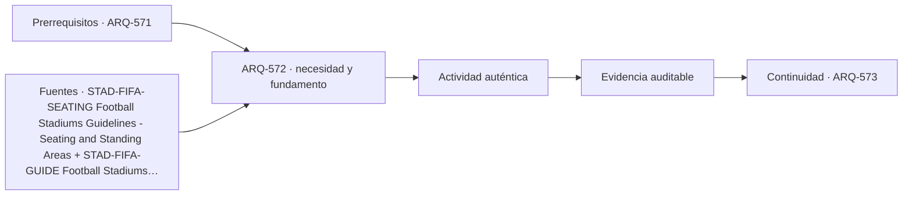

# ARQ-572 · Visibilidad y geometría de graderíos

**Parte 58 · Fase II · Clase desarrollada · Incorporada en v0.31.0.**

Prerrequisitos conceptuales: ARQ-571. Sin calendario. Los casos, parámetros y capacidades son ficticios salvo antecedentes expresamente atribuidos. Material educativo: no constituye proyecto ejecutable, plan de emergencia, operación aprobada, cálculo firmado, autorización, certificación ni habilitación profesional. Revisión externa especializada pendiente.

## Pregunta central

¿Cómo construir graderíos con buenas líneas de visión sin reducir la experiencia a una sola pendiente o a copiar un “C-value” fuera de contexto?

## Resultado y continuidad

Al terminar podrás explicar el problema como sistema, reconstruir el caso cuantitativo, señalar al menos una interfaz y separar resultado, hipótesis y evidencia pendiente. La continuidad desde ARQ-571 conserva métodos, no cifras. ARQ-573 recibe esta lógica y declara sus propios parámetros.

## 1. El tipo como sistema

La visibilidad depende de punto de observación, punto de interés, altura de ojos, posición de la fila anterior, tread, rise, barandas, cámaras, publicidad y personas de pie. La geometría es acumulativa: una pequeña decisión repetida por muchas filas modifica altura total, estructura y evacuación.

Un estadio o arena es un edificio de estados variables: evento completo, parcial, entrenamiento, concierto, montaje, mantenimiento y día sin público. Capacidad nominal, capacidad operativa, cantidad de asientos instalados y cantidad vendible pueden diferir. Cada clase conserva el recorrido desde ciudad y perímetro hasta bowl, asiento o campo, y vuelve a la salida, operación y legado.

## 2. Fundamentos que no deben mezclarse

En lugar de memorizar un número, podemos comprobar una línea de visión con coordenadas. Para un espectador actual, se traza la línea entre sus ojos y el punto de interés. En la posición horizontal de la fila anterior se calcula la altura de esa línea y se compara con la altura de ojos de la persona anterior. La diferencia es un despeje geométrico en ese modelo.

FIFA trata seating, standing, clearways y sightlines como componentes relacionados del bowl. La clase utiliza geometría original y no adopta dimensiones de la guía como norma local. La pendiente más fuerte puede mejorar vista y empeorar accesibilidad, vértigo, estructura o evacuación; debe coordinarse.

Una forma útil de estudiar el tema es separar **objeto**, **función**, **estado**, **magnitud** y **evidencia**. Objeto identifica qué componente o espacio analizamos; función, para qué existe; estado, en qué condición temporal; magnitud, qué medimos o calculamos; evidencia, qué permite defender la conclusión. Si una de esas cinco piezas falta, la frase suele sonar más segura de lo que realmente está respaldada.

## 3. Geometría, cantidades y escala

La geometría debe poder reconstruirse. Cotas y coordenadas necesitan referencia; áreas, volúmenes, caudales y fuerzas deben conservar unidades. Un cambio de sección no se describe solo por un porcentaje porque puede afectar de manera diferente perímetro, volumen, rigidez, circulación o superficie de mantenimiento. La escala de observación también importa: una relación válida en un metro de túnel o una fila de graderío no representa automáticamente todo el sistema.

Los modelos numéricos se usan para aprender relaciones, no para proporcionar valores de proyecto. Antes de usar un resultado pregunta qué entradas fueron fijadas, cuáles fueron medidas, cuáles son ficticias y qué fenómenos se excluyeron. Esa disciplina es la misma que ya apareció en estructuras, energía, agua y riesgos durante la Fase I.

## 4. Interfaces de proyecto

Las interfaces conectan bowl, estructura, cubierta, sistemas, servicios, producción y ciudad. Un cambio de graderío altera sightlines, rutas y estructura; un escenario temporal modifica asientos, cargas y emergencia; una cubierta afecta clima, iluminación, sonido y mantenimiento. Por eso cada configuración necesita su propia versión documentada, no una planta genérica que se supone válida para cualquier evento.

La coordinación se registra mediante identificador, posición, versión, función, responsable y comprobación siguiente. Si cambia una condición base, deben reabrirse las evidencias que dependían de ella. No se borra la versión anterior porque permite rastrear por qué se modificó la propuesta.

## 5. Construcción, operación, accesibilidad y mantenimiento

La seguridad se coordina con accesibilidad y operación. Las guías de FIFA, UEFA y SGSA son referencias internacionales de alcance distinto y no sustituyen normativa ni autorizaciones locales. Los cálculos de flujo incluidos son balances docentes, no tiempos seguros de evacuación, aforos aprobados ni instrucciones de control de multitudes.

Construibilidad y mantenibilidad son verificaciones distintas. Una solución puede construirse con medios especiales y ser difícil de mantener, o ser accesible durante obra y quedar encerrada al terminar. El expediente debe mostrar rutas y estados suficientes para que esas preguntas aparezcan antes de la entrega.

## Caso trabajado

SIGHT-01 usa punto de interés en (0,0). Espectador actual: x=20 m, ojos z=8,0 m. Fila anterior: x=19,2 m y ojos z=7,60 m. La línea desde (20,8) al origen tiene z=0,4x; en x=19,2 alcanza 7,68 m. El despeje sobre ojos anteriores es 0,08 m = 80 mm.

### Qué demuestra y qué no

Demuestra únicamente las relaciones aritméticas o geométricas declaradas. No verifica seguridad integral, comportamiento estructural completo, geotecnia, incendio, evacuación, accesibilidad reglamentaria, impacto, costo, operación o mantenimiento reales. Cualquier criterio de aceptación debe identificarse en la fuente y jurisdicción correspondiente.

## 6. Evidencia y documentos que deberían conectarse

Una revisión profesional necesitaría documentos compatibles entre sí: base topográfica y de sitio, geometría, requisitos de servicio, modelo técnico, interfaces, estados temporales, especificaciones, plan de pruebas y registro de cambios. No todos tendrán el mismo autor ni la misma autoridad. El objetivo pedagógico es que puedas preguntar quién produce cada evidencia, quién la revisa y qué decisión depende de ella.

Cuando una fuente es internacional, registra su jurisdicción y propósito. Cuando es una guía de buenas prácticas, no la rotules como ley. Cuando solo se consultó una página pública, no presentes el manual completo como leído. Esta distinción protege el programa frente a una falsa apariencia normativa.

## 7. Fallas de razonamiento frecuentes

Errores frecuentes son tratar capacidad como área dividida por un número; diseñar sightlines desde una sola fila; sumar capacidades de etapas consecutivas; contar asientos bloqueados; confundir ruta de mantenimiento con circulación pública; suponer que menos apoyos o una cubierta más ligera son siempre mejores; o aplicar un criterio de competición internacional como autorización legal local.

También es un error corregir una incompatibilidad cambiando silenciosamente el dato que la provoca. Si una geometría, capacidad o secuencia cambia, crea una variante identificada y vuelve a las verificaciones afectadas. La trazabilidad es parte del aprendizaje.

## 8. Preguntas de profundización

- ¿Qué condición del sitio podría invalidar la geometría adoptada?

- ¿Qué elemento comparte función con otra disciplina y necesita una interfaz explícita?

- ¿Qué estado temporal es más exigente que el estado final?

- ¿Qué dato sería peligroso sustituir por un promedio?

- ¿Qué cambio futuro exigiría reabrir la decisión?

Responderlas no requiere fingir certezas. Una buena respuesta puede concluir que falta evidencia y especificar cuál.

## Práctica independiente

Punto de interés (0,0). Espectador actual x=25 m, z=10 m; fila anterior x=24,1 m, ojos z=9,50 m. Calcula altura de línea en x=24,1 y despeje.

Además del cálculo, escribe dos conclusiones que sí estén respaldadas, dos que no puedas sostener y una comprobación que debería realizar un especialista antes de construir u operar.

Solución razonada

La recta tiene z=(10/25)x=0,4x. En 24,1 m: z=9,64 m. Despeje 9,64-9,50=0,14 m = 140 mm. No es un criterio reglamentario ni prueba visibilidad de todos los puntos del campo.

La solución conserva la frontera del problema. Si el resultado parece contradictorio con tu intuición, revisa unidades, estado y denominador antes de alterar el caso. Una respuesta numéricamente correcta puede seguir siendo insuficiente para una decisión real.

## Transferencia a otras tipologías

El método puede trasladarse a otras obras, pero no sus parámetros. En un túnel cambian terreno, sección, método, ventilación y emergencia; en un estadio cambian deporte, capacidad, bowl, evento y operación. La transferencia correcta mantiene preguntas y reemplaza datos, normativa y responsables.

## Autoevaluación

Puedes avanzar cuando: 1) reconstruyes el caso sin mirar la solución; 2) distingues lo calculado de lo supuesto; 3) identificas una interfaz; 4) nombras un estado temporal relevante; 5) explicas qué evidencia falta; y 6) evitas presentar la fuente internacional como autorización local.

*Figura 572. Esquema conceptual original. No constituye plano de túnel, cálculo estructural, plan de evacuación, graderío ejecutable ni detalle de obra.*

<!-- pedagogia-2026:inicio -->
## Decisión pedagógica y posición curricular

### Por qué existe

Esta clase existe para resolver una necesidad concreta del recorrido: ¿Cómo construir graderíos con buenas líneas de visión sin reducir la experiencia a una sola pendiente o a copiar un “C-value” fuera de contexto?

### Por qué está exactamente aquí

Ocupa el lugar 2 de la Parte 58. Se estudia después de ARQ-571 · Estadio: bowl, campo y ciudad porque usa esa base para responder «¿Cómo construir graderíos con buenas líneas de visión sin reducir la experiencia a una sola pendiente o a copiar un “C-value” fuera de contexto?». Se ubica antes de ARQ-573 · Acceso, control y distribución de multitudes porque la evidencia producida aquí debe estar disponible para ese paso.

- **Prerrequisitos:** `ARQ-571`
- **Capacidad que introduce:** Al terminar podrás explicar el problema como sistema, reconstruir el caso cuantitativo, señalar al menos una interfaz y separar resultado, hipótesis y evidencia pendiente. La continuidad desde ARQ-571 conserva métodos, no cifras. ARQ-573 recibe esta lógica y declara sus propios parámetros.
- **Clases o experiencias que dependen de ella:** `ARQ-573`

El diagrama permite comprobar una relación que el texto lineal oculta con facilidad: esta clase recibe capacidades previas, toma decisiones apoyadas por fuentes, exige una experiencia y produce evidencia que habilita trabajo posterior. No representa un procedimiento de obra.

## Resultado observable, evidencia y evaluación

1. Identificar y delimitar las condiciones necesarias para responder la pregunta central de visibilidad y geometría de graderíos.
2. Producir y comprobar la evidencia declarada por la clase: Al terminar podrás explicar el problema como sistema, reconstruir el caso cuantitativo, señalar al menos una interfaz y separar resultado, hipótesis y evidencia pendiente. La continuidad desde ARQ-571 conserva métodos, no cifras. ARQ-573 recibe esta lógica y declara sus propios parámetros.
3. Justificar una decisión de visibilidad y geometría de graderíos mediante fuentes, supuestos, alternativas y límites explícitos.

## Actividad, evidencia y criterio de aceptación

**Actividad:** Punto de interés (0,0). Espectador actual x=25 m, z=10 m; fila anterior x=24,1 m, ojos z=9,50 m. Calcula altura de línea en x=24,1 y despeje.

**Evidencia mínima:** Al terminar podrás explicar el problema como sistema, reconstruir el caso cuantitativo, señalar al menos una interfaz y separar resultado, hipótesis y evidencia pendiente. La continuidad desde ARQ-571 conserva métodos, no cifras. ARQ-573 recibe esta lógica y declara sus propios parámetros.

**Archivo sugerido:** `evidence/ARQ-572/evidencia.md`.

**Criterio de aceptación:** la entrega se acepta cuando:

- La entrega responde explícitamente a la pregunta: ¿Cómo construir graderíos con buenas líneas de visión sin reducir la experiencia a una sola pendiente o a copiar un “C-value” fuera de contexto?
- La actividad conserva las fronteras del caso y permite reconstruir el procedimiento: Punto de interés (0,0). Espectador actual x=25 m, z=10 m; fila anterior x=24,1 m, ojos z=9,50 m. Calcula altura de línea en x=24,1 y despeje.
- Cada afirmación externa puede seguirse hasta una fuente, su alcance consultado y su límite.
- La evidencia deja disponible una entrada comprobable para ARQ-573.
- Puedes avanzar cuando: 1) reconstruyes el caso sin mirar la solución; 2) distingues lo calculado de lo supuesto; 3) identificas una interfaz; 4) nombras un estado temporal relevante; 5) explicas qué evidencia falta; y 6) evitas presentar la fuente internacional como autorización local. Figura 572.

La [rúbrica común](../../docs/RUBRICA_COMUN.md) complementa estos criterios; no los reemplaza. Una entrega puede superar un promedio y continuar pendiente si oculta una condición crítica.

## Trazabilidad de las decisiones

| # | Decisión o fundamento | Fuente utilizada | Aplicación y límite en esta clase |
|---:|---|---|---|
| 1 | Relacionar geometría del bowl, visibilidad, filas, circulación y experiencia de espectadores. | [STAD-FIFA-SEATING Football Stadiums Guidelines - Seating and Standing…](https://publications.fifa.com/es/football-stadiums-guidelines/technical-guideline/stadium-guidelines/seating-and-standing-areas/) | Consulta: Sección oficial sobre graderíos, asientos, pasillos, accesibilidad y sightlines. Límite: No se trasladan dimensiones internacionales como mínimos reglamentarios para Chile. |
| 2 | Estadio como proyecto desde factibilidad, diseño y construcción hasta operación, seguridad y sostenibilidad. | [STAD-FIFA-GUIDE Football Stadiums Guidelines](https://inside.fifa.com/innovation/stadium-guidelines) | Consulta: Portal oficial de las Stadium Guidelines y su estructura de proceso y recomendaciones técnicas. Límite: Guía global; no reemplaza requisitos legales, licencia de operación ni regulación chilena. |

La tabla permite auditar las relaciones; la explicación, el caso y la práctica de la clase siguen siendo la documentación principal.

## Autoevaluación, recuperación y continuidad

### Errores diagnósticos

Antes de avanzar, comprueba si puedes reconstruir cada resultado sin mirar la solución, señalar qué evidencia lo sostiene y nombrar una condición que obligaría a revisar tu decisión. Conserva la primera versión, la objeción recibida y la revisión.

**Conexión siguiente:** La continuidad inmediata es ARQ-573 · Acceso, control y distribución de multitudes; conserva el método y vuelve a verificar datos y límites.
<!-- pedagogia-2026:fin -->

## Fuentes y alcance de uso

### [[STAD-FIFA-SEATING]](#FUENTE-STAD-FIFA-SEATING) Football Stadiums Guidelines - Seating and Standing Areas

FIFA. [https://publications.fifa.com/es/football-stadiums-guidelines/technical-guideline/stadium-guidelines/seating-and-standing-areas/](https://publications.fifa.com/es/football-stadiums-guidelines/technical-guideline/stadium-guidelines/seating-and-standing-areas/)

**Consulta:** Sección oficial sobre graderíos, asientos, pasillos, accesibilidad y sightlines. **Apoyo:** Relacionar geometría del bowl, visibilidad, filas, circulación y experiencia de espectadores. **Límite:** No se trasladan dimensiones internacionales como mínimos reglamentarios para Chile.

### [[STAD-FIFA-GUIDE]](#FUENTE-STAD-FIFA-GUIDE) Football Stadiums Guidelines

FIFA. [https://inside.fifa.com/innovation/stadium-guidelines](https://inside.fifa.com/innovation/stadium-guidelines)

**Consulta:** Portal oficial de las Stadium Guidelines y su estructura de proceso y recomendaciones técnicas. **Apoyo:** Estadio como proyecto desde factibilidad, diseño y construcción hasta operación, seguridad y sostenibilidad. **Límite:** Guía global; no reemplaza requisitos legales, licencia de operación ni regulación chilena.
