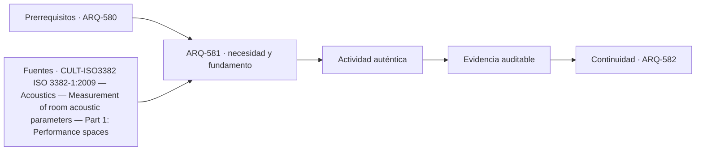

# ARQ-581 · Teatro: escena, sala y backstage

**Parte 59 · Fase II · Clase desarrollada · Incorporada en v0.32.0.**

Prerrequisitos conceptuales: ARQ-580. Sin calendario. Los casos, parámetros, capacidades y dimensiones son ficticios salvo antecedentes expresamente atribuidos. Material educativo: no constituye proyecto ejecutable, certificación, protocolo clínico o de bioseguridad, plan de emergencia, cálculo firmado ni habilitación profesional. Revisión externa especializada pendiente.

## Pregunta central

¿Cómo organizar un teatro para que público, artistas, escenografía, técnicos y mantenimiento compartan edificio sin cruzar flujos incompatibles?

## Resultado y continuidad

Al terminar podrás explicar la tipología como sistema, reconstruir el caso cuantitativo, identificar al menos una interfaz crítica y separar resultado, hipótesis y evidencia pendiente. La siguiente clase desarrolla otra capa de la misma tipología.

## 1. El tipo arquitectónico como sistema

El teatro reúne al menos dos edificios superpuestos: el del público y el de producción escénica. La sala, foyer y accesos deben coordinarse con escenario, alas, camerinos, muelles, talleres, almacenamiento y rutas técnicas. Una planta que funciona en función puede dejar de funcionar durante carga, cambio de escenografía o mantenimiento.

Una forma útil de estudiar el tema es separar **objeto**, **función**, **estado**, **magnitud** y **evidencia**. El objeto indica qué componente o espacio se analiza; la función explica por qué existe; el estado fija la condición temporal; la magnitud define qué se mide o calcula; la evidencia establece qué permite defender la conclusión. Si falta alguna de esas piezas, la frase suele sonar más precisa de lo que realmente está respaldada.

## 2. Organización espacial, técnica y operativa

La relación escena-sala define visibilidad, acústica y proximidad, pero backstage define la viabilidad de producir. Un escenario no termina en el borde visible: necesita profundidad, alas, almacenamiento temporal, rutas de piezas y acceso técnico. La caja escénica agrega altura y equipos; un teatro sin espacio de carga puede depender de movimientos manuales por recorridos públicos.

Conviene dibujar al menos cuatro redes: público, artistas, escenografía y personal técnico. Después se superponen para localizar interfaces inevitables y cruces que requieren control. La arquitectura debe distinguir estado de función, montaje, ensayo, limpieza y emergencia; la puerta que sirve en un estado puede estar bloqueada por utilería en otro.

La sala y la escena tampoco son solo superficies. Alturas, pendientes, proscenio, volumen acústico y posición de puentes técnicos afectan el tipo de producción. El proyecto debe declarar qué repertorio intenta admitir en vez de anunciar “flexibilidad total”.

La planta, la sección y la secuencia de uso deben leerse juntas. Un espacio puede caber en área y fallar por altura, recorrido, mantenimiento, ruido, vibración o seguridad. Del mismo modo, una capacidad agregada puede ocultar un cuello de botella local. Por ello los modelos de esta clase se comprueban por balance y luego se limitan explícitamente.

## 3. Interfaces que deben coordinarse

Las interfaces son lugares donde dos decisiones dependen una de otra: público-producción, colección-instalaciones, rack-enfriamiento, laboratorio-extracción, equipo-estructura, seguridad-operación. Cada interfaz necesita versión, posición, función, estado y responsable. Resolver un cruce geométrico no verifica automáticamente su desempeño.

En un proyecto real también hay interfaces documentales: especificación, modelo, plano, plan de pruebas y manual de operación deben referir la misma configuración. Si cambia una base, se reabren las evidencias dependientes en lugar de mantener una marca de “aprobado” heredada.

## 4. Caso trabajado

TEA-FLUJO-01 tiene una sala de 800 asientos y cuatro puertas hacia foyer, cada una con capacidad docente de 300 personas por intervalo. La salida aritmética agregada es 1.200 por intervalo, pero un corredor común posterior limita a 700. El sistema queda condicionado por ese elemento común; sumar puertas aisladas sobreestima la capacidad de la cadena.

### Qué demuestra y qué no

Demuestra las relaciones aritméticas o geométricas declaradas dentro de las hipótesis. No verifica seguridad integral, incendio, accesibilidad reglamentaria, estructura completa, continuidad, conservación, bioseguridad, ciberseguridad, operación o autorización real. Los criterios de aceptación deben identificarse en las fuentes y jurisdicción correspondientes.

## 5. Construcción, operación y mantenimiento

Diseñar esta tipología exige considerar estados temporales. Montaje, mantenimiento, cambio de exposición, sustitución de equipos, limpieza, calibración o ampliación pueden ser más exigentes que el estado final. Las rutas técnicas deben existir cuando el edificio está ocupado y no solo en un plano vacío.

La mantenibilidad requiere espacio de acceso, aislamiento de servicios, piezas reemplazables, información actualizada y posibilidad de volver a verificar. Una solución muy compacta puede reducir superficie y aumentar indisponibilidad futura. El programa enseña a hacer visible ese compromiso, no a elegirlo automáticamente.

## 6. Errores de razonamiento frecuentes

Errores típicos son sumar capacidades de etapas consecutivas; promediar datos que representan posiciones distintas; tratar una guía internacional como regulación local; confundir indicador con resultado de servicio; suponer que duplicar componentes elimina dependencias compartidas; y declarar “flexible” o “redundante” una configuración sin ensayar estados.

También es un error corregir una incompatibilidad cambiando silenciosamente el dato base. Una modificación crea una variante identificada y obliga a repetir las verificaciones afectadas. La trazabilidad forma parte del proyecto.

## 7. Preguntas de profundización

- ¿Qué dato del programa podría cambiar la geometría completa?

- ¿Qué estado temporal es más exigente que el uso ordinario?

- ¿Qué punto común puede invalidar una supuesta redundancia?

- ¿Qué magnitud sería peligroso convertir en un promedio?

- ¿Qué evidencia debe provenir de especialista, ensayo o autoridad?

## Práctica independiente

Una sala de 600 asientos tiene tres puertas de 250 personas por intervalo y un corredor común de 500. Calcula la capacidad de la cadena. Luego propone dos interfaces que deban revisarse durante montaje escénico.

Además del cálculo, escribe dos conclusiones que sí estén respaldadas, dos que no puedas sostener y una comprobación que debería realizar un especialista antes de construir u operar.

Solución razonada

Las puertas sumarían 750, pero el corredor limita la cadena a 500 personas por intervalo bajo este modelo. El cálculo no es tiempo seguro ni aforo aprobado. Deben revisarse además cruces de carga, puertas ocupadas por producción, accesibilidad, incendio y estados reales.

La solución conserva la frontera del problema. Si el resultado parece contradictorio con la intuición, revisa unidades, estado, denominador y dependencias antes de alterar el caso. Una respuesta numéricamente correcta puede seguir siendo insuficiente para una decisión real.

## Transferencia

El método puede trasladarse a otras tipologías, pero no sus parámetros. Teatro, museo, centro de datos y laboratorio comparten necesidad de coordinación y evidencia, pero sus cargas, riesgos, operación y referencias son distintos. La transferencia correcta conserva preguntas y reemplaza datos, normas y responsables.

## Autoevaluación

Puedes avanzar cuando: 1) reconstruyes el caso sin mirar la solución; 2) distingues lo calculado de lo supuesto; 3) identificas una interfaz; 4) nombras un estado temporal relevante; 5) explicas qué evidencia falta; y 6) evitas presentar una fuente institucional como autorización universal.

*Figura 581. Esquema conceptual original. No constituye plano ejecutable, certificación de conservación, diseño de data center, laboratorio aprobado ni protocolo de seguridad.*

<!-- pedagogia-2026:inicio -->
## Decisión pedagógica y posición curricular

### Por qué existe

Esta clase existe para resolver una necesidad concreta del recorrido: ¿Cómo organizar un teatro para que público, artistas, escenografía, técnicos y mantenimiento compartan edificio sin cruzar flujos incompatibles?

### Por qué está exactamente aquí

Abre la Parte 59 porque plantea primero el problema «¿Cómo organizar un teatro para que público, artistas, escenografía, técnicos y mantenimiento compartan edificio sin cruzar flujos incompatibles?». La transición desde ARQ-580 · Proyecto integrado de estadio o arena conserva métodos de evidencia y límites, pero no traslada parámetros del bloque anterior. Establece la pregunta y el producto base que ARQ-582 · Auditorio: visión y acústica desarrollará a continuación.

- **Prerrequisitos:** `ARQ-580`
- **Capacidad que introduce:** Al terminar podrás explicar la tipología como sistema, reconstruir el caso cuantitativo, identificar al menos una interfaz crítica y separar resultado, hipótesis y evidencia pendiente. La siguiente clase desarrolla otra capa de la misma tipología.
- **Clases o experiencias que dependen de ella:** `ARQ-582`

El diagrama permite comprobar una relación que el texto lineal oculta con facilidad: esta clase recibe capacidades previas, toma decisiones apoyadas por fuentes, exige una experiencia y produce evidencia que habilita trabajo posterior. No representa un procedimiento de obra.

## Resultado observable, evidencia y evaluación

1. Identificar y delimitar las condiciones necesarias para responder la pregunta central de teatro: escena, sala y backstage.
2. Producir y comprobar la evidencia declarada por la clase: Al terminar podrás explicar la tipología como sistema, reconstruir el caso cuantitativo, identificar al menos una interfaz crítica y separar resultado, hipótesis y evidencia pendiente. La siguiente clase desarrolla otra capa de la misma tipología.
3. Justificar una decisión de teatro: escena, sala y backstage mediante fuentes, supuestos, alternativas y límites explícitos.

## Actividad, evidencia y criterio de aceptación

**Actividad:** Una sala de 600 asientos tiene tres puertas de 250 personas por intervalo y un corredor común de 500. Calcula la capacidad de la cadena. Luego propone dos interfaces que deban revisarse durante montaje escénico.

**Evidencia mínima:** Al terminar podrás explicar la tipología como sistema, reconstruir el caso cuantitativo, identificar al menos una interfaz crítica y separar resultado, hipótesis y evidencia pendiente. La siguiente clase desarrolla otra capa de la misma tipología.

**Archivo sugerido:** `evidence/ARQ-581/evidencia.md`.

**Criterio de aceptación:** la entrega se acepta cuando:

- La entrega responde explícitamente a la pregunta: ¿Cómo organizar un teatro para que público, artistas, escenografía, técnicos y mantenimiento compartan edificio sin cruzar flujos incompatibles?
- La actividad conserva las fronteras del caso y permite reconstruir el procedimiento: Una sala de 600 asientos tiene tres puertas de 250 personas por intervalo y un corredor común de 500. Calcula la capacidad de la cadena. Luego propone dos interfaces que deban revisarse durante montaje escénico.
- Cada afirmación externa puede seguirse hasta una fuente, su alcance consultado y su límite.
- La evidencia deja disponible una entrada comprobable para ARQ-582.
- Errores típicos son sumar capacidades de etapas consecutivas; promediar datos que representan posiciones distintas; tratar una guía internacional como regulación local; confundir indicador con resultado de servicio; suponer que duplicar componentes elimina dependencias compartidas; y declarar “flexible” o “redundante” una configuración sin ensayar estados. También es un error corregir una incompatibilidad cambiando silenciosamente el dato base.

La [rúbrica común](../../docs/RUBRICA_COMUN.md) complementa estos criterios; no los reemplaza. Una entrega puede superar un promedio y continuar pendiente si oculta una condición crítica.

## Trazabilidad de las decisiones

| # | Decisión o fundamento | Fuente utilizada | Aplicación y límite en esta clase |
|---:|---|---|---|
| 1 | Medición de tiempo de reverberación y otros parámetros acústicos en espacios de interpretación. | [CULT-ISO3382 ISO 3382-1:2009 — Acoustics — Measurement of room…](https://www.iso.org/standard/40979.html) | Consulta: Ficha pública de la edición vigente, confirmada en 2021; existe una revisión en desarrollo. Límite: No se leyó ni implementó el texto íntegro; no fija por sí sola una acústica “correcta” para todo teatro o auditorio. |

La tabla permite auditar las relaciones; la explicación, el caso y la práctica de la clase siguen siendo la documentación principal.

## Autoevaluación, recuperación y continuidad

### Errores diagnósticos

Antes de avanzar, comprueba si puedes reconstruir cada resultado sin mirar la solución, señalar qué evidencia lo sostiene y nombrar una condición que obligaría a revisar tu decisión. Conserva la primera versión, la objeción recibida y la revisión.

**Conexión siguiente:** La continuidad inmediata es ARQ-582 · Auditorio: visión y acústica; conserva el método y vuelve a verificar datos y límites.
<!-- pedagogia-2026:fin -->

## Fuentes y alcance de uso

### [[CULT-ISO3382]](#FUENTE-CULT-ISO3382) ISO 3382-1:2009 — Acoustics — Measurement of room acoustic parameters — Part 1: Performance spaces

ISO. [https://www.iso.org/standard/40979.html](https://www.iso.org/standard/40979.html)

**Consulta:** Ficha pública de la edición vigente, confirmada en 2021; existe una revisión en desarrollo. **Apoyo:** Medición de tiempo de reverberación y otros parámetros acústicos en espacios de interpretación. **Límite:** No se leyó ni implementó el texto íntegro; no fija por sí sola una acústica “correcta” para todo teatro o auditorio.
