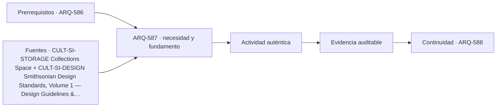

# ARQ-587 · Depósitos, talleres y logística cultural

**Parte 59 · Fase II · Clase desarrollada · Incorporada en v0.32.0.**

Prerrequisitos conceptuales: ARQ-586. Sin calendario. Los casos, parámetros, capacidades y dimensiones son ficticios salvo antecedentes expresamente atribuidos. Material educativo: no constituye proyecto ejecutable, certificación, protocolo clínico o de bioseguridad, plan de emergencia, cálculo firmado ni habilitación profesional. Revisión externa especializada pendiente.

## Pregunta central

¿Por qué los depósitos y talleres culturales deben diseñarse como infraestructura de colección y no como espacios sobrantes detrás de la exposición?

## Resultado y continuidad

Al terminar podrás explicar la tipología como sistema, reconstruir el caso cuantitativo, identificar al menos una interfaz crítica y separar resultado, hipótesis y evidencia pendiente. La siguiente clase desarrolla otra capa de la misma tipología.

## 1. El tipo arquitectónico como sistema

Depósito, conservación y taller concentran objetos frágiles, equipos, embalajes, documentación y trabajo especializado. Su calidad depende de acceso, carga, seguridad, ambiente, circulación y capacidad de crecer.

Una forma útil de estudiar el tema es separar **objeto**, **función**, **estado**, **magnitud** y **evidencia**. El objeto indica qué componente o espacio se analiza; la función explica por qué existe; el estado fija la condición temporal; la magnitud define qué se mide o calcula; la evidencia establece qué permite defender la conclusión. Si falta alguna de esas piezas, la frase suele sonar más precisa de lo que realmente está respaldada.

## 2. Organización espacial, técnica y operativa

El recorrido de una pieza puede incluir recepción, aclimatación, registro, fotografía, tratamiento, almacenamiento y montaje. Cada etapa necesita condiciones distintas. El movimiento debe considerar caja o embalaje, no solo objeto desnudo.

El espacio de depósito se mide por volumen y accesibilidad, no solo por metros cuadrados. Pasillos, estanterías, altura útil y capacidad de manipulación consumen superficie pero hacen utilizable el almacenamiento. Compactar al máximo puede aumentar riesgo y dificultar respuesta ante incidentes.

La logística también necesita separar materiales limpios, herramientas, residuos y embalajes. Un taller puede producir polvo o vibración incompatible con almacenamiento adyacente. Smithsonian recomienda separaciones entre espacios públicos/terminados y áreas de soporte precisamente por mantenimiento, ruido, vibración y olores.

La planta, la sección y la secuencia de uso deben leerse juntas. Un espacio puede caber en área y fallar por altura, recorrido, mantenimiento, ruido, vibración o seguridad. Del mismo modo, una capacidad agregada puede ocultar un cuello de botella local. Por ello los modelos de esta clase se comprueban por balance y luego se limitan explícitamente.

## 3. Interfaces que deben coordinarse

Las interfaces son lugares donde dos decisiones dependen una de otra: público-producción, colección-instalaciones, rack-enfriamiento, laboratorio-extracción, equipo-estructura, seguridad-operación. Cada interfaz necesita versión, posición, función, estado y responsable. Resolver un cruce geométrico no verifica automáticamente su desempeño.

En un proyecto real también hay interfaces documentales: especificación, modelo, plano, plan de pruebas y manual de operación deben referir la misma configuración. Si cambia una base, se reabren las evidencias dependientes en lugar de mantener una marca de “aprobado” heredada.

## 4. Caso trabajado

DEP-EST-01 tiene 20 módulos de estantería de 1,0×0,6 m, cinco niveles. Huella de estanterías=12 m²; superficie horizontal de bandejas=60 m². Esa multiplicación no crea 60 m² de piso ni garantiza acceso.

### Qué demuestra y qué no

Demuestra las relaciones aritméticas o geométricas declaradas dentro de las hipótesis. No verifica seguridad integral, incendio, accesibilidad reglamentaria, estructura completa, continuidad, conservación, bioseguridad, ciberseguridad, operación o autorización real. Los criterios de aceptación deben identificarse en las fuentes y jurisdicción correspondientes.

## 5. Construcción, operación y mantenimiento

Diseñar esta tipología exige considerar estados temporales. Montaje, mantenimiento, cambio de exposición, sustitución de equipos, limpieza, calibración o ampliación pueden ser más exigentes que el estado final. Las rutas técnicas deben existir cuando el edificio está ocupado y no solo en un plano vacío.

La mantenibilidad requiere espacio de acceso, aislamiento de servicios, piezas reemplazables, información actualizada y posibilidad de volver a verificar. Una solución muy compacta puede reducir superficie y aumentar indisponibilidad futura. El programa enseña a hacer visible ese compromiso, no a elegirlo automáticamente.

## 6. Errores de razonamiento frecuentes

Errores típicos son sumar capacidades de etapas consecutivas; promediar datos que representan posiciones distintas; tratar una guía internacional como regulación local; confundir indicador con resultado de servicio; suponer que duplicar componentes elimina dependencias compartidas; y declarar “flexible” o “redundante” una configuración sin ensayar estados.

También es un error corregir una incompatibilidad cambiando silenciosamente el dato base. Una modificación crea una variante identificada y obliga a repetir las verificaciones afectadas. La trazabilidad forma parte del proyecto.

## 7. Preguntas de profundización

- ¿Qué dato del programa podría cambiar la geometría completa?

- ¿Qué estado temporal es más exigente que el uso ordinario?

- ¿Qué punto común puede invalidar una supuesta redundancia?

- ¿Qué magnitud sería peligroso convertir en un promedio?

- ¿Qué evidencia debe provenir de especialista, ensayo o autoridad?

## Práctica independiente

Dieciocho módulos de 1,2×0,5 m con cuatro niveles. Calcula huella y superficie de bandejas. Explica por qué capacidad real puede ser menor.

Además del cálculo, escribe dos conclusiones que sí estén respaldadas, dos que no puedas sostener y una comprobación que debería realizar un especialista antes de construir u operar.

Solución razonada

Huella=10,8 m²; bandejas=43,2 m². Pueden reducirla tamaños de objetos, alturas, carga, pasillos, incompatibilidades y reservas.

La solución conserva la frontera del problema. Si el resultado parece contradictorio con la intuición, revisa unidades, estado, denominador y dependencias antes de alterar el caso. Una respuesta numéricamente correcta puede seguir siendo insuficiente para una decisión real.

## Transferencia

El método puede trasladarse a otras tipologías, pero no sus parámetros. Teatro, museo, centro de datos y laboratorio comparten necesidad de coordinación y evidencia, pero sus cargas, riesgos, operación y referencias son distintos. La transferencia correcta conserva preguntas y reemplaza datos, normas y responsables.

## Autoevaluación

Puedes avanzar cuando: 1) reconstruyes el caso sin mirar la solución; 2) distingues lo calculado de lo supuesto; 3) identificas una interfaz; 4) nombras un estado temporal relevante; 5) explicas qué evidencia falta; y 6) evitas presentar una fuente institucional como autorización universal.

*Figura 587. Esquema conceptual original. No constituye plano ejecutable, certificación de conservación, diseño de data center, laboratorio aprobado ni protocolo de seguridad.*

<!-- pedagogia-2026:inicio -->
## Decisión pedagógica y posición curricular

### Por qué existe

Esta clase existe para resolver una necesidad concreta del recorrido: ¿Por qué los depósitos y talleres culturales deben diseñarse como infraestructura de colección y no como espacios sobrantes detrás de la exposición?

### Por qué está exactamente aquí

Ocupa el lugar 7 de la Parte 59. Se estudia después de ARQ-586 · Centros culturales híbridos porque usa esa base para responder «¿Por qué los depósitos y talleres culturales deben diseñarse como infraestructura de colección y no como espacios sobrantes detrás de la exposición?». Se ubica antes de ARQ-588 · Acústica, luz y conservación integradas porque la evidencia producida aquí debe estar disponible para ese paso.

- **Prerrequisitos:** `ARQ-586`
- **Capacidad que introduce:** Al terminar podrás explicar la tipología como sistema, reconstruir el caso cuantitativo, identificar al menos una interfaz crítica y separar resultado, hipótesis y evidencia pendiente. La siguiente clase desarrolla otra capa de la misma tipología.
- **Clases o experiencias que dependen de ella:** `ARQ-588`

El diagrama permite comprobar una relación que el texto lineal oculta con facilidad: esta clase recibe capacidades previas, toma decisiones apoyadas por fuentes, exige una experiencia y produce evidencia que habilita trabajo posterior. No representa un procedimiento de obra.

## Resultado observable, evidencia y evaluación

1. Identificar y delimitar las condiciones necesarias para responder la pregunta central de depósitos, talleres y logística cultural.
2. Producir y comprobar la evidencia declarada por la clase: Al terminar podrás explicar la tipología como sistema, reconstruir el caso cuantitativo, identificar al menos una interfaz crítica y separar resultado, hipótesis y evidencia pendiente. La siguiente clase desarrolla otra capa de la misma tipología.
3. Justificar una decisión de depósitos, talleres y logística cultural mediante fuentes, supuestos, alternativas y límites explícitos.

## Actividad, evidencia y criterio de aceptación

**Actividad:** Dieciocho módulos de 1,2×0,5 m con cuatro niveles. Calcula huella y superficie de bandejas. Explica por qué capacidad real puede ser menor.

**Evidencia mínima:** Al terminar podrás explicar la tipología como sistema, reconstruir el caso cuantitativo, identificar al menos una interfaz crítica y separar resultado, hipótesis y evidencia pendiente. La siguiente clase desarrolla otra capa de la misma tipología.

**Archivo sugerido:** `evidence/ARQ-587/evidencia.md`.

**Criterio de aceptación:** la entrega se acepta cuando:

- La entrega responde explícitamente a la pregunta: ¿Por qué los depósitos y talleres culturales deben diseñarse como infraestructura de colección y no como espacios sobrantes detrás de la exposición?
- La actividad conserva las fronteras del caso y permite reconstruir el procedimiento: Dieciocho módulos de 1,2×0,5 m con cuatro niveles. Calcula huella y superficie de bandejas. Explica por qué capacidad real puede ser menor.
- Cada afirmación externa puede seguirse hasta una fuente, su alcance consultado y su límite.
- La evidencia deja disponible una entrada comprobable para ARQ-588.
- Errores típicos son sumar capacidades de etapas consecutivas; promediar datos que representan posiciones distintas; tratar una guía internacional como regulación local; confundir indicador con resultado de servicio; suponer que duplicar componentes elimina dependencias compartidas; y declarar “flexible” o “redundante” una configuración sin ensayar estados. También es un error corregir una incompatibilidad cambiando silenciosamente el dato base.

La [rúbrica común](../../docs/RUBRICA_COMUN.md) complementa estos criterios; no los reemplaza. Una entrega puede superar un promedio y continuar pendiente si oculta una condición crítica.

## Trazabilidad de las decisiones

| # | Decisión o fundamento | Fuente utilizada | Aplicación y límite en esta clase |
|---:|---|---|---|
| 1 | Entender depósito de colecciones como infraestructura de largo plazo y no como superficie residual. | [CULT-SI-STORAGE Collections Space](https://ncp.si.edu/collections-space) | Consulta: Página institucional sobre planificación de espacios de colección, accesibilidad, seguridad y conservación. Límite: Datos Smithsonian no representan porcentajes o necesidades de cualquier museo. |
| 2 | Relaciones entre espacios de exposición, colección, staging, mantenimiento y áreas públicas. | [CULT-SI-DESIGN Smithsonian Design Standards, Volume 1 — Design…](https://www.wbdg.org/FFC/SI/si_sds_vol1.pdf) | Consulta: Documento público de estándares de diseño Smithsonian; se consultaron apartados de museos, almacenamiento y separación de áreas de apoyo. Límite: Estándar institucional estadounidense; no se presenta como código chileno ni se trasladan todas sus dimensiones. |

La tabla permite auditar las relaciones; la explicación, el caso y la práctica de la clase siguen siendo la documentación principal.

## Autoevaluación, recuperación y continuidad

### Errores diagnósticos

Antes de avanzar, comprueba si puedes reconstruir cada resultado sin mirar la solución, señalar qué evidencia lo sostiene y nombrar una condición que obligaría a revisar tu decisión. Conserva la primera versión, la objeción recibida y la revisión.

**Conexión siguiente:** La continuidad inmediata es ARQ-588 · Acústica, luz y conservación integradas; conserva el método y vuelve a verificar datos y límites.
<!-- pedagogia-2026:fin -->

## Fuentes y alcance de uso

### [[CULT-SI-STORAGE]](#FUENTE-CULT-SI-STORAGE) Collections Space

Smithsonian National Collections Program. [https://ncp.si.edu/collections-space](https://ncp.si.edu/collections-space)

**Consulta:** Página institucional sobre planificación de espacios de colección, accesibilidad, seguridad y conservación. **Apoyo:** Entender depósito de colecciones como infraestructura de largo plazo y no como superficie residual. **Límite:** Datos Smithsonian no representan porcentajes o necesidades de cualquier museo.

### [[CULT-SI-DESIGN]](#FUENTE-CULT-SI-DESIGN) Smithsonian Design Standards, Volume 1 — Design Guidelines & Technical Sections

Smithsonian Institution. [https://www.wbdg.org/FFC/SI/si_sds_vol1.pdf](https://www.wbdg.org/FFC/SI/si_sds_vol1.pdf)

**Consulta:** Documento público de estándares de diseño Smithsonian; se consultaron apartados de museos, almacenamiento y separación de áreas de apoyo. **Apoyo:** Relaciones entre espacios de exposición, colección, staging, mantenimiento y áreas públicas. **Límite:** Estándar institucional estadounidense; no se presenta como código chileno ni se trasladan todas sus dimensiones.
