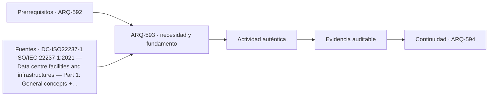

# ARQ-593 · Energía, UPS y generación de respaldo

**Parte 60 · Fase II · Clase desarrollada · Incorporada en v0.32.0.**

Prerrequisitos conceptuales: ARQ-592. Sin calendario. Los casos, parámetros, capacidades y dimensiones son ficticios salvo antecedentes expresamente atribuidos. Material educativo: no constituye proyecto ejecutable, certificación, protocolo clínico o de bioseguridad, plan de emergencia, cálculo firmado ni habilitación profesional. Revisión externa especializada pendiente.

## Pregunta central

¿Cómo coordinar red, UPS, baterías y generación sin confundir autonomía energética con continuidad garantizada?

## Resultado y continuidad

Al terminar podrás explicar la tipología como sistema, reconstruir el caso cuantitativo, identificar al menos una interfaz crítica y separar resultado, hipótesis y evidencia pendiente. La siguiente clase desarrolla otra capa de la misma tipología.

## 1. El tipo arquitectónico como sistema

Los centros de datos usan cadenas de energía con transformadores, tableros, UPS, baterías, generadores y distribución. Cada transición tiene potencia, energía, tiempo, mantenimiento y control. La batería cubre una ventana; el generador necesita arrancar, estabilizar y disponer de combustible.

Una forma útil de estudiar el tema es separar **objeto**, **función**, **estado**, **magnitud** y **evidencia**. El objeto indica qué componente o espacio se analiza; la función explica por qué existe; el estado fija la condición temporal; la magnitud define qué se mide o calcula; la evidencia establece qué permite defender la conclusión. Si falta alguna de esas piezas, la frase suele sonar más precisa de lo que realmente está respaldada.

## 2. Organización espacial, técnica y operativa

Potencia y energía no son intercambiables. Una batería de 1 MWh no puede entregar cualquier potencia; un generador de 2 MW no proporciona energía ilimitada sin combustible. El proyecto debe conservar ambas restricciones.

La redundancia eléctrica requiere rutas y selectividad, pero el edificio también necesita espacio, ventilación, mantenimiento, reposición y seguridad. Un cuarto de baterías o combustible no es un rectángulo residual.

Los escenarios deben modelar secuencia temporal: pérdida de red, transferencia UPS, arranque, operación prolongada, retorno y prueba. Una prueba de arranque no demuestra duración de combustible ni comportamiento bajo carga.

La planta, la sección y la secuencia de uso deben leerse juntas. Un espacio puede caber en área y fallar por altura, recorrido, mantenimiento, ruido, vibración o seguridad. Del mismo modo, una capacidad agregada puede ocultar un cuello de botella local. Por ello los modelos de esta clase se comprueban por balance y luego se limitan explícitamente.

## 3. Interfaces que deben coordinarse

Las interfaces son lugares donde dos decisiones dependen una de otra: público-producción, colección-instalaciones, rack-enfriamiento, laboratorio-extracción, equipo-estructura, seguridad-operación. Cada interfaz necesita versión, posición, función, estado y responsable. Resolver un cruce geométrico no verifica automáticamente su desempeño.

En un proyecto real también hay interfaces documentales: especificación, modelo, plano, plan de pruebas y manual de operación deben referir la misma configuración. Si cambia una base, se reabren las evidencias dependientes en lugar de mantener una marca de “aprobado” heredada.

## 4. Caso trabajado

UPS-01 alimenta 900 kW y dispone de 180 kWh utilizables. Ignorando límites de potencia y pérdidas adicionales, autonomía energética=180/900=0,2 h=12 min. No es tiempo garantizado de servicio.

### Qué demuestra y qué no

Demuestra las relaciones aritméticas o geométricas declaradas dentro de las hipótesis. No verifica seguridad integral, incendio, accesibilidad reglamentaria, estructura completa, continuidad, conservación, bioseguridad, ciberseguridad, operación o autorización real. Los criterios de aceptación deben identificarse en las fuentes y jurisdicción correspondientes.

## 5. Construcción, operación y mantenimiento

Diseñar esta tipología exige considerar estados temporales. Montaje, mantenimiento, cambio de exposición, sustitución de equipos, limpieza, calibración o ampliación pueden ser más exigentes que el estado final. Las rutas técnicas deben existir cuando el edificio está ocupado y no solo en un plano vacío.

La mantenibilidad requiere espacio de acceso, aislamiento de servicios, piezas reemplazables, información actualizada y posibilidad de volver a verificar. Una solución muy compacta puede reducir superficie y aumentar indisponibilidad futura. El programa enseña a hacer visible ese compromiso, no a elegirlo automáticamente.

## 6. Errores de razonamiento frecuentes

Errores típicos son sumar capacidades de etapas consecutivas; promediar datos que representan posiciones distintas; tratar una guía internacional como regulación local; confundir indicador con resultado de servicio; suponer que duplicar componentes elimina dependencias compartidas; y declarar “flexible” o “redundante” una configuración sin ensayar estados.

También es un error corregir una incompatibilidad cambiando silenciosamente el dato base. Una modificación crea una variante identificada y obliga a repetir las verificaciones afectadas. La trazabilidad forma parte del proyecto.

## 7. Preguntas de profundización

- ¿Qué dato del programa podría cambiar la geometría completa?

- ¿Qué estado temporal es más exigente que el uso ordinario?

- ¿Qué punto común puede invalidar una supuesta redundancia?

- ¿Qué magnitud sería peligroso convertir en un promedio?

- ¿Qué evidencia debe provenir de especialista, ensayo o autoridad?

## Práctica independiente

Carga=1.200 kW y batería utilizable=300 kWh. Calcula autonomía ideal. Si el arranque de respaldo requiere 8 min, ¿qué margen energético queda en tiempo ideal?

Además del cálculo, escribe dos conclusiones que sí estén respaldadas, dos que no puedas sostener y una comprobación que debería realizar un especialista antes de construir u operar.

Solución razonada

Autonomía=0,25 h=15 min. Margen ideal 7 min, sin pérdidas ni degradación. Deben revisarse potencia, estado de carga, temperatura, envejecimiento y transición.

La solución conserva la frontera del problema. Si el resultado parece contradictorio con la intuición, revisa unidades, estado, denominador y dependencias antes de alterar el caso. Una respuesta numéricamente correcta puede seguir siendo insuficiente para una decisión real.

## Transferencia

El método puede trasladarse a otras tipologías, pero no sus parámetros. Teatro, museo, centro de datos y laboratorio comparten necesidad de coordinación y evidencia, pero sus cargas, riesgos, operación y referencias son distintos. La transferencia correcta conserva preguntas y reemplaza datos, normas y responsables.

## Autoevaluación

Puedes avanzar cuando: 1) reconstruyes el caso sin mirar la solución; 2) distingues lo calculado de lo supuesto; 3) identificas una interfaz; 4) nombras un estado temporal relevante; 5) explicas qué evidencia falta; y 6) evitas presentar una fuente institucional como autorización universal.

*Figura 593. Esquema conceptual original. No constituye plano ejecutable, certificación de conservación, diseño de data center, laboratorio aprobado ni protocolo de seguridad.*

<!-- pedagogia-2026:inicio -->
## Decisión pedagógica y posición curricular

### Por qué existe

Esta clase existe para resolver una necesidad concreta del recorrido: ¿Cómo coordinar red, UPS, baterías y generación sin confundir autonomía energética con continuidad garantizada?

### Por qué está exactamente aquí

Ocupa el lugar 3 de la Parte 60. Se estudia después de ARQ-592 · Redundancia, disponibilidad y topologías porque usa esa base para responder «¿Cómo coordinar red, UPS, baterías y generación sin confundir autonomía energética con continuidad garantizada?». Se ubica antes de ARQ-594 · Enfriamiento, flujo de aire y agua porque la evidencia producida aquí debe estar disponible para ese paso.

- **Prerrequisitos:** `ARQ-592`
- **Capacidad que introduce:** Al terminar podrás explicar la tipología como sistema, reconstruir el caso cuantitativo, identificar al menos una interfaz crítica y separar resultado, hipótesis y evidencia pendiente. La siguiente clase desarrolla otra capa de la misma tipología.
- **Clases o experiencias que dependen de ella:** `ARQ-594`

El diagrama permite comprobar una relación que el texto lineal oculta con facilidad: esta clase recibe capacidades previas, toma decisiones apoyadas por fuentes, exige una experiencia y produce evidencia que habilita trabajo posterior. No representa un procedimiento de obra.

## Resultado observable, evidencia y evaluación

1. Identificar y delimitar las condiciones necesarias para responder la pregunta central de energía, ups y generación de respaldo.
2. Producir y comprobar la evidencia declarada por la clase: Al terminar podrás explicar la tipología como sistema, reconstruir el caso cuantitativo, identificar al menos una interfaz crítica y separar resultado, hipótesis y evidencia pendiente. La siguiente clase desarrolla otra capa de la misma tipología.
3. Justificar una decisión de energía, ups y generación de respaldo mediante fuentes, supuestos, alternativas y límites explícitos.

## Actividad, evidencia y criterio de aceptación

**Actividad:** Carga=1.200 kW y batería utilizable=300 kWh. Calcula autonomía ideal. Si el arranque de respaldo requiere 8 min, ¿qué margen energético queda en tiempo ideal?

**Evidencia mínima:** Al terminar podrás explicar la tipología como sistema, reconstruir el caso cuantitativo, identificar al menos una interfaz crítica y separar resultado, hipótesis y evidencia pendiente. La siguiente clase desarrolla otra capa de la misma tipología.

**Archivo sugerido:** `evidence/ARQ-593/evidencia.md`.

**Criterio de aceptación:** la entrega se acepta cuando:

- La entrega responde explícitamente a la pregunta: ¿Cómo coordinar red, UPS, baterías y generación sin confundir autonomía energética con continuidad garantizada?
- La actividad conserva las fronteras del caso y permite reconstruir el procedimiento: Carga=1.200 kW y batería utilizable=300 kWh. Calcula autonomía ideal. Si el arranque de respaldo requiere 8 min, ¿qué margen energético queda en tiempo ideal?
- Cada afirmación externa puede seguirse hasta una fuente, su alcance consultado y su límite.
- La evidencia deja disponible una entrada comprobable para ARQ-594.
- Errores típicos son sumar capacidades de etapas consecutivas; promediar datos que representan posiciones distintas; tratar una guía internacional como regulación local; confundir indicador con resultado de servicio; suponer que duplicar componentes elimina dependencias compartidas; y declarar “flexible” o “redundante” una configuración sin ensayar estados. También es un error corregir una incompatibilidad cambiando silenciosamente el dato base.

La [rúbrica común](../../docs/RUBRICA_COMUN.md) complementa estos criterios; no los reemplaza. Una entrega puede superar un promedio y continuar pendiente si oculta una condición crítica.

## Trazabilidad de las decisiones

| # | Decisión o fundamento | Fuente utilizada | Aplicación y límite en esta clase |
|---:|---|---|---|
| 1 | Principios generales, modelos de referencia, disponibilidad, seguridad y eficiencia durante la vida del centro de datos. | [DC-ISO22237-1 ISO/IEC 22237-1:2021 — Data centre facilities and…](https://www.iso.org/standard/78550.html) | Consulta: Ficha pública de la edición 2021. Límite: No se leyó íntegramente la norma ni se asigna una clase de disponibilidad al ejercicio. |
| 2 | Distinguir resiliencia, dependabilidad, tolerancia a fallos y disponibilidad en infraestructura de centros de datos. | [DC-ISO22237-31 ISO/IEC TS 22237-31:2026 — Key performance indicators…](https://www.iso.org/standard/88711.html) | Consulta: Ficha pública de la edición 2, publicada en febrero de 2026. Límite: No se calculan niveles normativos de resiliencia ni se certifica continuidad. |

La tabla permite auditar las relaciones; la explicación, el caso y la práctica de la clase siguen siendo la documentación principal.

## Autoevaluación, recuperación y continuidad

### Errores diagnósticos

Antes de avanzar, comprueba si puedes reconstruir cada resultado sin mirar la solución, señalar qué evidencia lo sostiene y nombrar una condición que obligaría a revisar tu decisión. Conserva la primera versión, la objeción recibida y la revisión.

**Conexión siguiente:** La continuidad inmediata es ARQ-594 · Enfriamiento, flujo de aire y agua; conserva el método y vuelve a verificar datos y límites.
<!-- pedagogia-2026:fin -->

## Fuentes y alcance de uso

### [[DC-ISO22237-1]](#FUENTE-DC-ISO22237-1) ISO/IEC 22237-1:2021 — Data centre facilities and infrastructures — Part 1: General concepts

ISO/IEC. [https://www.iso.org/standard/78550.html](https://www.iso.org/standard/78550.html)

**Consulta:** Ficha pública de la edición 2021. **Apoyo:** Principios generales, modelos de referencia, disponibilidad, seguridad y eficiencia durante la vida del centro de datos. **Límite:** No se leyó íntegramente la norma ni se asigna una clase de disponibilidad al ejercicio.

### [[DC-ISO22237-31]](#FUENTE-DC-ISO22237-31) ISO/IEC TS 22237-31:2026 — Key performance indicators for resilience

ISO/IEC. [https://www.iso.org/standard/88711.html](https://www.iso.org/standard/88711.html)

**Consulta:** Ficha pública de la edición 2, publicada en febrero de 2026. **Apoyo:** Distinguir resiliencia, dependabilidad, tolerancia a fallos y disponibilidad en infraestructura de centros de datos. **Límite:** No se calculan niveles normativos de resiliencia ni se certifica continuidad.
