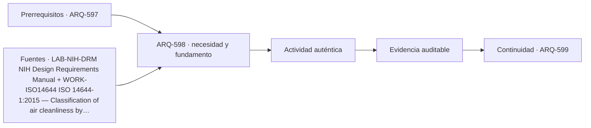

# ARQ-598 · Edificios científicos y equipos sensibles

**Parte 60 · Fase II · Clase desarrollada · Incorporada en v0.32.0.**

Prerrequisitos conceptuales: ARQ-597. Sin calendario. Los casos, parámetros, capacidades y dimensiones son ficticios salvo antecedentes expresamente atribuidos. Material educativo: no constituye proyecto ejecutable, certificación, protocolo clínico o de bioseguridad, plan de emergencia, cálculo firmado ni habilitación profesional. Revisión externa especializada pendiente.

## Pregunta central

¿Cómo diseñar alrededor de instrumentos cuya sensibilidad a vibración, temperatura, partículas o campos puede ser más exigente que la comodidad humana?

## Resultado y continuidad

Al terminar podrás explicar la tipología como sistema, reconstruir el caso cuantitativo, identificar al menos una interfaz crítica y separar resultado, hipótesis y evidencia pendiente. La siguiente clase desarrolla otra capa de la misma tipología.

## 1. El tipo arquitectónico como sistema

Edificios científicos pueden alojar microscopía, metrología, imágenes, óptica, prototipado y otros equipos sensibles. El programa debe recibir requisitos del fabricante y del protocolo, pero también comprobar cómo el edificio los sostiene en el tiempo.

Una forma útil de estudiar el tema es separar **objeto**, **función**, **estado**, **magnitud** y **evidencia**. El objeto indica qué componente o espacio se analiza; la función explica por qué existe; el estado fija la condición temporal; la magnitud define qué se mide o calcula; la evidencia establece qué permite defender la conclusión. Si falta alguna de esas piezas, la frase suele sonar más precisa de lo que realmente está respaldada.

## 2. Organización espacial, técnica y operativa

Vibración depende de fuente, trayectoria y receptor. Separar un equipo de una vía no garantiza desempeño si bombas o ventiladores transmiten energía por estructura. La solución puede requerir ubicación, masa, aislamiento o control de fuentes.

Las salas limpias clasifican limpieza por concentración de partículas; eso no equivale a contención biológica. ISO 14644-1 trata clasificación de limpieza del aire y muestreo, pero no sustituye evaluación de riesgo del laboratorio.

El equipo sensible impone logística: dimensiones, peso, instalación, mantenimiento, calibración y reemplazo. Una puerta que permite ingreso inicial puede no permitir retiro futuro si después se construyen particiones.

La planta, la sección y la secuencia de uso deben leerse juntas. Un espacio puede caber en área y fallar por altura, recorrido, mantenimiento, ruido, vibración o seguridad. Del mismo modo, una capacidad agregada puede ocultar un cuello de botella local. Por ello los modelos de esta clase se comprueban por balance y luego se limitan explícitamente.

## 3. Interfaces que deben coordinarse

Las interfaces son lugares donde dos decisiones dependen una de otra: público-producción, colección-instalaciones, rack-enfriamiento, laboratorio-extracción, equipo-estructura, seguridad-operación. Cada interfaz necesita versión, posición, función, estado y responsable. Resolver un cruce geométrico no verifica automáticamente su desempeño.

En un proyecto real también hay interfaces documentales: especificación, modelo, plano, plan de pruebas y manual de operación deben referir la misma configuración. Si cambia una base, se reabren las evidencias dependientes en lugar de mantener una marca de “aprobado” heredada.

## 4. Caso trabajado

SCI-VIB-01 modela una base de masa 4.000 kg y rigidez 10 MN/m. Frecuencia natural f=(1/2π)√(k/m)≈7,96 Hz. Ese número no certifica vibración aceptable; solo identifica una propiedad del oscilador ideal.

### Qué demuestra y qué no

Demuestra las relaciones aritméticas o geométricas declaradas dentro de las hipótesis. No verifica seguridad integral, incendio, accesibilidad reglamentaria, estructura completa, continuidad, conservación, bioseguridad, ciberseguridad, operación o autorización real. Los criterios de aceptación deben identificarse en las fuentes y jurisdicción correspondientes.

## 5. Construcción, operación y mantenimiento

Diseñar esta tipología exige considerar estados temporales. Montaje, mantenimiento, cambio de exposición, sustitución de equipos, limpieza, calibración o ampliación pueden ser más exigentes que el estado final. Las rutas técnicas deben existir cuando el edificio está ocupado y no solo en un plano vacío.

La mantenibilidad requiere espacio de acceso, aislamiento de servicios, piezas reemplazables, información actualizada y posibilidad de volver a verificar. Una solución muy compacta puede reducir superficie y aumentar indisponibilidad futura. El programa enseña a hacer visible ese compromiso, no a elegirlo automáticamente.

## 6. Errores de razonamiento frecuentes

Errores típicos son sumar capacidades de etapas consecutivas; promediar datos que representan posiciones distintas; tratar una guía internacional como regulación local; confundir indicador con resultado de servicio; suponer que duplicar componentes elimina dependencias compartidas; y declarar “flexible” o “redundante” una configuración sin ensayar estados.

También es un error corregir una incompatibilidad cambiando silenciosamente el dato base. Una modificación crea una variante identificada y obliga a repetir las verificaciones afectadas. La trazabilidad forma parte del proyecto.

## 7. Preguntas de profundización

- ¿Qué dato del programa podría cambiar la geometría completa?

- ¿Qué estado temporal es más exigente que el uso ordinario?

- ¿Qué punto común puede invalidar una supuesta redundancia?

- ¿Qué magnitud sería peligroso convertir en un promedio?

- ¿Qué evidencia debe provenir de especialista, ensayo o autoridad?

## Práctica independiente

m=6.000 kg, k=15 MN/m. Calcula f natural. Explica qué falta para evaluar un microscopio.

Además del cálculo, escribe dos conclusiones que sí estén respaldadas, dos que no puedas sostener y una comprobación que debería realizar un especialista antes de construir u operar.

Solución razonada

f≈7,96 Hz también. Faltan espectro de excitación, amortiguamiento, límites del equipo, caminos estructurales y medición.

La solución conserva la frontera del problema. Si el resultado parece contradictorio con la intuición, revisa unidades, estado, denominador y dependencias antes de alterar el caso. Una respuesta numéricamente correcta puede seguir siendo insuficiente para una decisión real.

## Transferencia

El método puede trasladarse a otras tipologías, pero no sus parámetros. Teatro, museo, centro de datos y laboratorio comparten necesidad de coordinación y evidencia, pero sus cargas, riesgos, operación y referencias son distintos. La transferencia correcta conserva preguntas y reemplaza datos, normas y responsables.

## Autoevaluación

Puedes avanzar cuando: 1) reconstruyes el caso sin mirar la solución; 2) distingues lo calculado de lo supuesto; 3) identificas una interfaz; 4) nombras un estado temporal relevante; 5) explicas qué evidencia falta; y 6) evitas presentar una fuente institucional como autorización universal.

*Figura 598. Esquema conceptual original. No constituye plano ejecutable, certificación de conservación, diseño de data center, laboratorio aprobado ni protocolo de seguridad.*

<!-- pedagogia-2026:inicio -->
## Decisión pedagógica y posición curricular

### Por qué existe

Esta clase existe para resolver una necesidad concreta del recorrido: ¿Cómo diseñar alrededor de instrumentos cuya sensibilidad a vibración, temperatura, partículas o campos puede ser más exigente que la comodidad humana?

### Por qué está exactamente aquí

Ocupa el lugar 8 de la Parte 60. Se estudia después de ARQ-597 · Laboratorios: programa y contención porque usa esa base para responder «¿Cómo diseñar alrededor de instrumentos cuya sensibilidad a vibración, temperatura, partículas o campos puede ser más exigente que la comodidad humana?». Se ubica antes de ARQ-599 · Continuidad, mantenimiento y expansión porque la evidencia producida aquí debe estar disponible para ese paso.

- **Prerrequisitos:** `ARQ-597`
- **Capacidad que introduce:** Al terminar podrás explicar la tipología como sistema, reconstruir el caso cuantitativo, identificar al menos una interfaz crítica y separar resultado, hipótesis y evidencia pendiente. La siguiente clase desarrolla otra capa de la misma tipología.
- **Clases o experiencias que dependen de ella:** `ARQ-599`

El diagrama permite comprobar una relación que el texto lineal oculta con facilidad: esta clase recibe capacidades previas, toma decisiones apoyadas por fuentes, exige una experiencia y produce evidencia que habilita trabajo posterior. No representa un procedimiento de obra.

## Resultado observable, evidencia y evaluación

1. Identificar y delimitar las condiciones necesarias para responder la pregunta central de edificios científicos y equipos sensibles.
2. Producir y comprobar la evidencia declarada por la clase: Al terminar podrás explicar la tipología como sistema, reconstruir el caso cuantitativo, identificar al menos una interfaz crítica y separar resultado, hipótesis y evidencia pendiente. La siguiente clase desarrolla otra capa de la misma tipología.
3. Justificar una decisión de edificios científicos y equipos sensibles mediante fuentes, supuestos, alternativas y límites explícitos.

## Actividad, evidencia y criterio de aceptación

**Actividad:** m=6.000 kg, k=15 MN/m. Calcula f natural. Explica qué falta para evaluar un microscopio.

**Evidencia mínima:** Al terminar podrás explicar la tipología como sistema, reconstruir el caso cuantitativo, identificar al menos una interfaz crítica y separar resultado, hipótesis y evidencia pendiente. La siguiente clase desarrolla otra capa de la misma tipología.

**Archivo sugerido:** `evidence/ARQ-598/evidencia.md`.

**Criterio de aceptación:** la entrega se acepta cuando:

- La entrega responde explícitamente a la pregunta: ¿Cómo diseñar alrededor de instrumentos cuya sensibilidad a vibración, temperatura, partículas o campos puede ser más exigente que la comodidad humana?
- La actividad conserva las fronteras del caso y permite reconstruir el procedimiento: m=6.000 kg, k=15 MN/m. Calcula f natural. Explica qué falta para evaluar un microscopio.
- Cada afirmación externa puede seguirse hasta una fuente, su alcance consultado y su límite.
- La evidencia deja disponible una entrada comprobable para ARQ-599.
- Errores típicos son sumar capacidades de etapas consecutivas; promediar datos que representan posiciones distintas; tratar una guía internacional como regulación local; confundir indicador con resultado de servicio; suponer que duplicar componentes elimina dependencias compartidas; y declarar “flexible” o “redundante” una configuración sin ensayar estados. También es un error corregir una incompatibilidad cambiando silenciosamente el dato base.

La [rúbrica común](../../docs/RUBRICA_COMUN.md) complementa estos criterios; no los reemplaza. Una entrega puede superar un promedio y continuar pendiente si oculta una condición crítica.

## Trazabilidad de las decisiones

| # | Decisión o fundamento | Fuente utilizada | Aplicación y límite en esta clase |
|---:|---|---|---|
| 1 | Programación, relaciones funcionales, flexibilidad, seguridad, tipos de laboratorio y crecimiento futuro. | [LAB-NIH-DRM NIH Design Requirements Manual](https://orf.od.nih.gov/TechnicalResources/Pages/DesignRequirementsManual.aspx) | Consulta: Portal oficial del DRM; se consultaron alcance y apartados actualizados de predesign de laboratorios. Límite: Manual institucional estadounidense; no se trasladan requisitos como legislación chilena. |
| 2 | Clasificación de limpieza del aire por concentración de partículas y necesidad de puntos de muestreo definidos. | [WORK-ISO14644 ISO 14644-1:2015 — Classification of air cleanliness by…](https://www.iso.org/standard/53394.html) | Consulta: Ficha pública de la edición vigente, confirmada en 2021. Límite: No se diseña ni certifica una sala limpia; no se extrapola limpieza de aire a contención biológica. |

La tabla permite auditar las relaciones; la explicación, el caso y la práctica de la clase siguen siendo la documentación principal.

## Autoevaluación, recuperación y continuidad

### Errores diagnósticos

Antes de avanzar, comprueba si puedes reconstruir cada resultado sin mirar la solución, señalar qué evidencia lo sostiene y nombrar una condición que obligaría a revisar tu decisión. Conserva la primera versión, la objeción recibida y la revisión.

**Conexión siguiente:** La continuidad inmediata es ARQ-599 · Continuidad, mantenimiento y expansión; conserva el método y vuelve a verificar datos y límites.
<!-- pedagogia-2026:fin -->

## Fuentes y alcance de uso

### [[LAB-NIH-DRM]](#FUENTE-LAB-NIH-DRM) NIH Design Requirements Manual

National Institutes of Health. [https://orf.od.nih.gov/TechnicalResources/Pages/DesignRequirementsManual.aspx](https://orf.od.nih.gov/TechnicalResources/Pages/DesignRequirementsManual.aspx)

**Consulta:** Portal oficial del DRM; se consultaron alcance y apartados actualizados de predesign de laboratorios. **Apoyo:** Programación, relaciones funcionales, flexibilidad, seguridad, tipos de laboratorio y crecimiento futuro. **Límite:** Manual institucional estadounidense; no se trasladan requisitos como legislación chilena.

### [[LAB-ISO14644]](#FUENTE-LAB-ISO14644) ISO 14644-1:2015 — Cleanrooms — Classification of air cleanliness by particle concentration

ISO. [https://www.iso.org/standard/53394.html](https://www.iso.org/standard/53394.html)

**Consulta:** Ficha pública de la edición vigente, confirmada en 2021. **Apoyo:** Clasificación de limpieza del aire por concentración de partículas y necesidad de puntos de muestreo definidos. **Límite:** No se diseña ni certifica una sala limpia; no se extrapola limpieza de aire a contención biológica.
