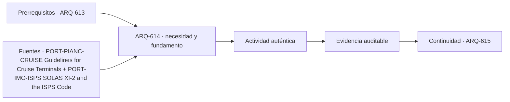

# ARQ-614 · Terminal de pasajeros y cruceros

**Parte 62 · Fase II · Clase desarrollada · Incorporada en v0.34.0.**

Prerrequisitos conceptuales: revisar las partes de proceso, estructura, instalaciones, seguridad, operación y gestión que correspondan. Sin calendario. Casos y parámetros son ficticios salvo antecedentes atribuidos. Material educativo; revisión externa especializada pendiente.

## Pregunta central

¿Cómo organizar un terminal de cruceros cuando miles de personas, equipaje, controles, buses y servicios cambian entre embarque y desembarque?

## Resultado de aprendizaje

Al terminar podrás construir una representación operativa de esta tipología, resolver un caso cuantitativo acotado, detectar al menos una dependencia compartida y redactar qué evidencia falta antes de convertir el estudio en proyecto. La entrega no es una autorización, memoria de cálculo, estudio de riesgos ni plan de operación real.

## 1. La tipología como sistema

La terminal de pasajeros es una infraestructura de picos. Debe coordinar ship-to-shore, apron, edificio, seguridad, equipaje, migración/aduanas donde corresponda, buses, taxis, accesibilidad y operación de turnaround. La misma sala puede admitir usos distintos si los estados están separados y comprobados.

Una buena planta no se evalúa solo por la superficie que ocupa. Debe explicar **qué entra, qué sale, quién interviene, qué se transforma, qué puede fallar, cómo se mantiene y cómo cambia con el tiempo**. En este programa, los diagramas se usan para hacer visibles esas relaciones, no para simular una precisión que los datos no tienen.

## 2. Capas de coordinación

### 1. Dibujar llegada y salida como procesos distintos

Esta dimensión debe registrarse con una frontera clara: qué objeto se observa, en qué estado, con qué unidades y quién depende de ese dato. En una tipología compleja, una decisión local puede cambiar recorridos, mantenimiento, seguridad o capacidad en otra parte del sistema. Por eso el capítulo no usa etiquetas como ‘flexible’, ‘seguro’ o ‘eficiente’ sin indicar qué evidencia las sostendría.

La representación mínima combina planta o diagrama de red con una tabla de estados. Cuando la variable es temporal, se conserva la secuencia; cuando es espacial, se conserva la posición; cuando es una capacidad, se identifica el cuello de botella y la unidad de servicio. Estas reglas evitan que un total correcto o un promedio favorable oculten una incompatibilidad.

### 2. Separar pasajeros, equipaje, tripulación y suministros

Esta dimensión debe registrarse con una frontera clara: qué objeto se observa, en qué estado, con qué unidades y quién depende de ese dato. En una tipología compleja, una decisión local puede cambiar recorridos, mantenimiento, seguridad o capacidad en otra parte del sistema. Por eso el capítulo no usa etiquetas como ‘flexible’, ‘seguro’ o ‘eficiente’ sin indicar qué evidencia las sostendría.

La representación mínima combina planta o diagrama de red con una tabla de estados. Cuando la variable es temporal, se conserva la secuencia; cuando es espacial, se conserva la posición; cuando es una capacidad, se identifica el cuello de botella y la unidad de servicio. Estas reglas evitan que un total correcto o un promedio favorable oculten una incompatibilidad.

### 3. Localizar controles sin bloquear evacuación ni accesibilidad

Esta dimensión debe registrarse con una frontera clara: qué objeto se observa, en qué estado, con qué unidades y quién depende de ese dato. En una tipología compleja, una decisión local puede cambiar recorridos, mantenimiento, seguridad o capacidad en otra parte del sistema. Por eso el capítulo no usa etiquetas como ‘flexible’, ‘seguro’ o ‘eficiente’ sin indicar qué evidencia las sostendría.

La representación mínima combina planta o diagrama de red con una tabla de estados. Cuando la variable es temporal, se conserva la secuencia; cuando es espacial, se conserva la posición; cuando es una capacidad, se identifica el cuello de botella y la unidad de servicio. Estas reglas evitan que un total correcto o un promedio favorable oculten una incompatibilidad.

### 4. Estudiar picos de embarque, desembarque y tránsito en el mismo día

Esta dimensión debe registrarse con una frontera clara: qué objeto se observa, en qué estado, con qué unidades y quién depende de ese dato. En una tipología compleja, una decisión local puede cambiar recorridos, mantenimiento, seguridad o capacidad en otra parte del sistema. Por eso el capítulo no usa etiquetas como ‘flexible’, ‘seguro’ o ‘eficiente’ sin indicar qué evidencia las sostendría.

La representación mínima combina planta o diagrama de red con una tabla de estados. Cuando la variable es temporal, se conserva la secuencia; cuando es espacial, se conserva la posición; cuando es una capacidad, se identifica el cuello de botella y la unidad de servicio. Estas reglas evitan que un total correcto o un promedio favorable oculten una incompatibilidad.

## 3. Geometría, capacidad y tiempo no son sinónimos

Una superficie puede alojar físicamente un equipo y aun no permitir operarlo, reemplazarlo o evacuar el área. Una capacidad por hora puede ser suficiente en promedio y fallar durante un pico. Un inventario puede caber por volumen y ser incompatible por segregación, accesibilidad o condición ambiental. La arquitectura debe mantener esas preguntas separadas hasta que exista evidencia que permita integrarlas.

Cuando aparezcan porcentajes, se conserva el denominador. Cuando aparezcan capacidades de etapas consecutivas, se busca la menor o se construye el balance temporal; **no se suman como si fueran alternativas paralelas**. Cuando dos rutas comparten un componente, no se presentan como redundancia independiente. Estas comprobaciones son transferibles entre tipologías.

## 4. Caso trabajado

CRU-01 desembarca 3.000 pasajeros en una ventana de 3 h: promedio 1.000/h. Seis posiciones de proceso de 180 personas/h suman 1.080/h, pero un control posterior común admite 800/h. Ese control gobierna la cadena. En tres horas solo procesaría 2.400 bajo el modelo, dejando 600 personas acumuladas si la llegada fuera uniforme.

El valor del caso no está en la cifra final sino en poder reconstruir qué hipótesis la producen. Cambiar la unidad de servicio, la ventana temporal o el estado operativo obliga a repetir el cálculo. Tampoco se extrapola una cifra didáctica a un proyecto real: faltan levantamientos, normativa aplicable, equipos, suelos, clima, contratos, especialistas y verificaciones específicas.

## 5. Arquitectura, construcción y operación

En fase de proyecto, dibuja la secuencia completa de uso y al menos un estado no ordinario: mantenimiento, limpieza, expansión, falla, inspección o montaje. En construcción, identifica qué elementos temporales condicionan el proceso y qué información debe conservarse al entregar. En operación, define quién observa una desviación, qué documento consulta y qué componente puede aislarse sin perder otras funciones.

El edificio o infraestructura debe poder cambiar sin que cada modificación borre la línea base. Una ampliación crea una variante; una reparación actualiza condición; una modificación de proceso reabre dependencias. Esta trazabilidad conecta la arquitectura con gestión de activos y evita que el modelo final sea una imagen desconectada de cómo se opera.

## 6. Riesgos de razonamiento

- Diseñar desde promedio anual.

- Mezclar equipaje y pasajeros sin control.

- Suponer que una sala flexible sirve a estados simultáneos.

- Confundir seguridad portuaria con barreras que bloquean recorridos.

- Convertir una fuente internacional en obligación local sin comprobar jurisdicción, edición y alcance.

- Presentar una prueba favorable de un componente como validación del sistema completo.

## 7. Profundización profesional

Para profundizar, prepara una matriz con: **función, actor, estado, dato, fuente, criterio, evidencia, responsable y decisión pendiente**. Después selecciona dos interfaces físicas y una operativa. Para cada una, identifica qué disciplina propone, quién revisa y qué cambio obliga a repetir la comprobación.

También construye un escenario de crecimiento o indisponibilidad. No necesitas adivinar el futuro: basta declarar qué componente cambia y conservar constantes los demás. El objetivo es aprender a comparar variantes sin reescribir silenciosamente el caso base.

## Práctica independiente

Un barco genera 2.400 pasajeros en 4 h. Cinco puestos admiten 150 personas/h y el paso común posterior 700/h. Determina capacidad de la cadena y acumulación ideal si la llegada es uniforme.

Además del cálculo, dibuja el flujo o la red del caso, identifica un punto común y escribe dos afirmaciones que sí puedas defender y dos que deban permanecer pendientes.

Solución razonada

Los cinco puestos suman 750/h, pero el paso común limita a 700/h. Llegada media 600/h, por lo que bajo estas cifras no se acumula por capacidad; existe margen nominal 100/h. Faltan variación real, equipaje, excepciones y tiempos de proceso.

La solución se limita al modelo declarado. Si el resultado parece favorable, comprueba que no hayas cambiado el denominador, omitido un estado o sumado capacidades incompatibles. Si parece desfavorable, evita reemplazarlo por una solución automática: formula primero qué decisión y qué evidencia hacen falta.

## Transferencia

La clase conecta con aeropuertos, pero el buque, apron y control marítimo cambian la interfaz y los ciclos.

La competencia principal es transferir **métodos** sin transferir **parámetros**. Dos tipologías pueden compartir diagramas de flujo, balances o matrices de riesgo y, sin embargo, necesitar criterios, autoridades y especialistas completamente distintos.

## Autoevaluación

Puedes avanzar cuando: 1) reconstruyes el caso sin mirar la respuesta; 2) distingues capacidad, inventario y flujo; 3) localizas una dependencia compartida; 4) representas un estado de mantenimiento o falla; 5) identificas una fuente con su límite; 6) señalas qué no puede concluirse; y 7) mantienes separados cálculo didáctico y aprobación profesional.

*Figura 614. Esquema conceptual original del capítulo. No es plano ejecutable ni certificación de capacidad, seguridad, proceso, protección ambiental o autorización portuaria.*

<!-- pedagogia-2026:inicio -->
## Decisión pedagógica y posición curricular

### Por qué existe

Esta clase existe para resolver una necesidad concreta del recorrido: ¿Cómo organizar un terminal de cruceros cuando miles de personas, equipaje, controles, buses y servicios cambian entre embarque y desembarque?

### Por qué está exactamente aquí

Ocupa el lugar 4 de la Parte 62. Se estudia después de ARQ-613 · Terminal de contenedores porque usa esa base para responder «¿Cómo organizar un terminal de cruceros cuando miles de personas, equipaje, controles, buses y servicios cambian entre embarque y desembarque?». Se ubica antes de ARQ-615 · Bodegas y edificios portuarios porque la evidencia producida aquí debe estar disponible para ese paso.

- **Prerrequisitos:** `ARQ-613`
- **Capacidad que introduce:** Al terminar podrás construir una representación operativa de esta tipología, resolver un caso cuantitativo acotado, detectar al menos una dependencia compartida y redactar qué evidencia falta antes de convertir el estudio en proyecto. La entrega no es una autorización, memoria de cálculo, estudio de riesgos ni plan de operación real.
- **Clases o experiencias que dependen de ella:** `ARQ-615`

El diagrama permite comprobar una relación que el texto lineal oculta con facilidad: esta clase recibe capacidades previas, toma decisiones apoyadas por fuentes, exige una experiencia y produce evidencia que habilita trabajo posterior. No representa un procedimiento de obra.

## Resultado observable, evidencia y evaluación

1. Identificar y delimitar las condiciones necesarias para responder la pregunta central de terminal de pasajeros y cruceros.
2. Producir y comprobar la evidencia declarada por la clase: Al terminar podrás construir una representación operativa de esta tipología, resolver un caso cuantitativo acotado, detectar al menos una dependencia compartida y redactar qué evidencia falta antes de convertir el estudio en proyecto. La entrega no es una autorización, memoria de cálculo, estudio de riesgos ni plan de operación real.
3. Justificar una decisión de terminal de pasajeros y cruceros mediante fuentes, supuestos, alternativas y límites explícitos.

## Actividad, evidencia y criterio de aceptación

**Actividad:** Un barco genera 2.400 pasajeros en 4 h. Cinco puestos admiten 150 personas/h y el paso común posterior 700/h. Determina capacidad de la cadena y acumulación ideal si la llegada es uniforme.

**Evidencia mínima:** Al terminar podrás construir una representación operativa de esta tipología, resolver un caso cuantitativo acotado, detectar al menos una dependencia compartida y redactar qué evidencia falta antes de convertir el estudio en proyecto. La entrega no es una autorización, memoria de cálculo, estudio de riesgos ni plan de operación real.

**Archivo sugerido:** `evidence/ARQ-614/evidencia.md`.

**Criterio de aceptación:** la entrega se acepta cuando:

- La entrega responde explícitamente a la pregunta: ¿Cómo organizar un terminal de cruceros cuando miles de personas, equipaje, controles, buses y servicios cambian entre embarque y desembarque?
- La actividad conserva las fronteras del caso y permite reconstruir el procedimiento: Un barco genera 2.400 pasajeros en 4 h. Cinco puestos admiten 150 personas/h y el paso común posterior 700/h. Determina capacidad de la cadena y acumulación ideal si la llegada es uniforme.
- Cada afirmación externa puede seguirse hasta una fuente, su alcance consultado y su límite.
- La evidencia deja disponible una entrada comprobable para ARQ-615.
- Puedes avanzar cuando: 1) reconstruyes el caso sin mirar la respuesta; 2) distingues capacidad, inventario y flujo; 3) localizas una dependencia compartida; 4) representas un estado de mantenimiento o falla; 5) identificas una fuente con su límite; 6) señalas qué no puede concluirse; y 7) mantienes separados cálculo didáctico y aprobación profesional. Figura 614.

La [rúbrica común](../../docs/RUBRICA_COMUN.md) complementa estos criterios; no los reemplaza. Una entrega puede superar un promedio y continuar pendiente si oculta una condición crítica.

## Trazabilidad de las decisiones

| # | Decisión o fundamento | Fuente utilizada | Aplicación y límite en esta clase |
|---:|---|---|---|
| 1 | Relaciones entre buque, apron, terminal de pasajeros, transporte terrestre, seguridad y flexibilidad. | [PORT-PIANC-CRUISE Guidelines for Cruise Terminals](https://www.pianc.org/publication/guidelines-for-cruise-terminals/) | Consulta: Ficha pública del informe MarCom WG 152 sobre terminales de cruceros. Límite: No se leyó íntegramente el informe ni se adoptan sus criterios como norma local. |
| 2 | Separar evaluación de seguridad, zonas controladas, planes y responsabilidades de la geometría del terminal. | [PORT-IMO-ISPS SOLAS XI-2 and the ISPS Code](https://www.imo.org/en/ourwork/security/pages/solas-xi-2%20isps%20code.aspx) | Consulta: Página oficial sobre el régimen de seguridad marítima y portuaria ISPS. Límite: No se reproduce el código ni se asigna nivel de seguridad a un puerto ficticio. |

La tabla permite auditar las relaciones; la explicación, el caso y la práctica de la clase siguen siendo la documentación principal.

## Autoevaluación, recuperación y continuidad

### Errores diagnósticos

Antes de avanzar, comprueba si puedes reconstruir cada resultado sin mirar la solución, señalar qué evidencia lo sostiene y nombrar una condición que obligaría a revisar tu decisión. Conserva la primera versión, la objeción recibida y la revisión.

**Conexión siguiente:** La continuidad inmediata es ARQ-615 · Bodegas y edificios portuarios; conserva el método y vuelve a verificar datos y límites.
<!-- pedagogia-2026:fin -->

## Fuentes y alcance de uso

### [[PORT-PIANC-CRUISE]](#FUENTE-PORT-PIANC-CRUISE) Guidelines for Cruise Terminals

PIANC. [https://www.pianc.org/publication/guidelines-for-cruise-terminals/](https://www.pianc.org/publication/guidelines-for-cruise-terminals/)

**Consulta:** Ficha pública del informe MarCom WG 152 sobre terminales de cruceros. **Apoyo:** Relaciones entre buque, apron, terminal de pasajeros, transporte terrestre, seguridad y flexibilidad. **Límite:** No se leyó íntegramente el informe ni se adoptan sus criterios como norma local.

### [[PORT-IMO-ISPS]](#FUENTE-PORT-IMO-ISPS) SOLAS XI-2 and the ISPS Code

International Maritime Organization. [https://www.imo.org/en/ourwork/security/pages/solas-xi-2%20isps%20code.aspx](https://www.imo.org/en/ourwork/security/pages/solas-xi-2%20isps%20code.aspx)

**Consulta:** Página oficial sobre el régimen de seguridad marítima y portuaria ISPS. **Apoyo:** Separar evaluación de seguridad, zonas controladas, planes y responsabilidades de la geometría del terminal. **Límite:** No se reproduce el código ni se asigna nivel de seguridad a un puerto ficticio.
