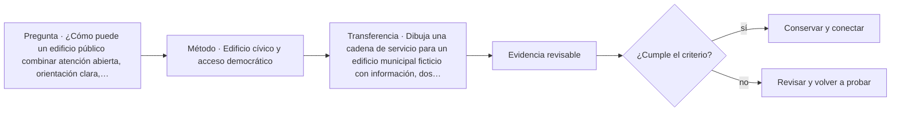

# ARQ-621 · Edificio cívico y acceso democrático

**Parte 63 · Clase desarrollada · Incorporada en v0.34.**

Material educativo con casos ficticios. No sustituye proyecto, normativa, habilitación profesional, evaluación de seguridad ni autorización de operación.

## Pregunta central

¿Cómo puede un edificio público combinar atención abierta, orientación clara, accesibilidad y protección sin transformar cada relación con la institución en un filtro opaco?

## Resultado de aprendizaje y continuidad

Construirás un programa cívico por servicios, usuarios y estados de operación. Diferenciarás acceso público, áreas de trabajo, soporte y zonas con control adicional, y justificarás cómo una persona completa un trámite sin conocer la organización interna del edificio.

## 1. Tipología y función

Un edificio cívico no se define por una fachada monumental sino por la capacidad de convertir servicios institucionales en recorridos comprensibles. La arquitectura debe permitir llegar, informarse, esperar, resolver una gestión, acceder a servicios de apoyo y salir sin atravesar zonas que no forman parte de la atención.

## 2. Programa y relaciones

La representación pública y la seguridad no deben tratarse como extremos incompatibles. Conviene separar tres preguntas: qué espacios deben ser visibles y legibles, qué actividades requieren privacidad o control, y qué operaciones internas necesitan independencia para continuar funcionando.

## 3. Personas, flujos y operación

El programa se construye con relaciones y no solo con superficies: vestíbulo, información, espera, atención general, atención reservada, salas de reunión, servicios higiénicos, administración, archivo, instalaciones y mantenimiento. Un cambio en un área puede modificar colas, acústica, privacidad y circulación.

## 4. Sistemas e interfaces

La accesibilidad se comprueba como cadena completa. Una entrada accesible que conduce a un mostrador inaccesible o a información incomprensible no resuelve la actividad. La referencia estadounidense de GSA sirve para organizar preguntas de edificios públicos, no para declarar cumplimiento en Chile.

## 5. Tiempo, cambio y límites

En proyectos reales también se debe distinguir horario ordinario, atención reducida, mantenimiento y contingencia. La planta puede ser la misma y las conexiones operativas cambiar. Por eso el estado de una puerta o un punto de información forma parte del servicio y debe documentarse.

## Caso trabajado: atención en tres etapas

Un centro cívico ficticio recibe 240 personas durante una hora punta. El proceso tiene orientación, atención breve y atención especializada. La orientación puede procesar 300 personas/h; la atención breve dispone de cuatro puestos de 70 personas/h cada uno; la especializada, tres puestos de 35 personas/h. Las capacidades son 300, 280 y 105 personas/h. Aunque las dos primeras etapas superan la demanda total, la tercera sería el límite si todas las 240 personas necesitaran ese servicio. Si solo el 30 % requiere atención especializada, llegan 72 personas/h y esa etapa dispone de margen nominal de 33 personas/h. La conclusión depende de esa distribución de demanda; no autoriza reducir puestos reales ni supone tiempos de espera nulos.

## Errores frecuentes y revisión crítica

No confundas una suma correcta con una decisión de proyecto completa; no conviertas capacidad nominal en aforo, disponibilidad, seguridad o calidad; no traslades referencias extranjeras como normativa local; no ocultes estados desconocidos. Cada resultado debe conservar unidad, frontera, tiempo y supuestos.

## Práctica independiente

Dibuja una cadena de servicio para un edificio municipal ficticio con información, dos tipos de atención y una sala comunitaria. Define qué conexiones deben estar abiertas al público y qué relaciones necesitan control. Luego analiza qué ocurre si el punto de información queda fuera de servicio.

## Solución razonada

Una respuesta sólida identifica que la falla de información puede afectar más de un destino aunque las puertas sigan abiertas. Debe proponer alternativas de orientación accesible, mantener separados espacios públicos y de trabajo, y marcar como pendiente cualquier requisito que dependa de normativa o seguridad específica.

## Autoevaluación y enlace

Puedes avanzar cuando distingues programa, operación y evidencia, reconstruyes el caso sin copiar la respuesta y puedes nombrar al menos una condición que el cálculo no resuelve. ARQ-622 profundiza la coexistencia de varios servicios municipales y sus horarios.

<!-- pedagogia-2026:inicio -->
## Mapa visual de aprendizaje

El diagrama representa el ciclo de aprendizaje de esta clase, no una secuencia de obra ni un procedimiento profesional.

## Resultado observable, evidencia y evaluación

**Tipo de clase:** proyectual.

**Evidencia mínima:** lámina o expediente con alternativas, representación pertinente, decisión argumentada, revisión y asuntos pendientes.

**Archivo sugerido:** `evidence/ARQ-621/evidencia.md`.

| Criterio | Evidencia observable |
|---|---|
| Precisión y representación · 20 % | Los conceptos, unidades y convenciones se usan de forma coherente y pueden ser reconstruidos por otra persona. |
| Evidencia y trazabilidad · 25 % | Cada afirmación importante se vincula con dato, cálculo, observación o fuente; hipótesis y desconocidos permanecen visibles. |
| Decisión y alternativas · 25 % | La decisión responde a la pregunta, compara al menos una alternativa y declara qué condición la haría cambiar. |
| Integración y ciclo de vida · 20 % | Se identifica una interfaz y una consecuencia para construcción, uso, mantenimiento, adaptación o fin de vida. |
| Comunicación, ética y límites · 10 % | El alcance se entiende sin explicación oral adicional y no se atribuyen permisos, competencias o certezas inexistentes. |

**Criterio de aceptación:** 80/100 y ningún criterio bajo 60 %. Una entrega genérica que podría reutilizarse sin cambios en otra clase no demuestra dominio. Si existe una condición crítica de seguridad, accesibilidad, evidencia o responsabilidad sin resolver, la entrega permanece pendiente aunque el promedio supere 80.

### Errores diagnósticos

En esta clase conviene vigilar especialmente: comparar alternativas con alcances distintos; defender la imagen antes que el servicio; borrar las huellas de la revisión.

## Autoevaluación, recuperación y continuidad

Antes de avanzar, responde sin consultar la solución:

1. ¿Qué decisión concreta puedes tomar ahora que no podías justificar antes?
2. ¿Qué evidencia de tu entrega es comprobada y cuál continúa siendo una hipótesis?
3. ¿Qué cambio de contexto invalidaría la transferencia realizada?

Revisa la entrega a las 24–48 horas y nuevamente al cerrar la parte. Conserva la primera versión, la crítica recibida y la versión revisada: el aprendizaje se demuestra también mediante el cambio entre versiones.
<!-- pedagogia-2026:fin -->

## Fuentes y alcance de uso

- [CIV-GSA] Facilities Standards for the Public Buildings Service (P100) — U.S. General Services Administration. https://www.gsa.gov/real-estate/facilities-standards-for-the-public-buildings-service

Uso y límite: Referencia de edificios públicos, desempeño, accesibilidad, coordinación y ciclo de vida. Ámbito federal estadounidense; no sustituye normativa chilena.

- [ADA-ST] ADA Accessibility Standards — U.S. Access Board. https://www.access-board.gov/ada/

Uso y límite: Accesibilidad de edificios, tribunales, detención, alojamiento temporal y áreas públicas. No se presenta como norma chilena.
