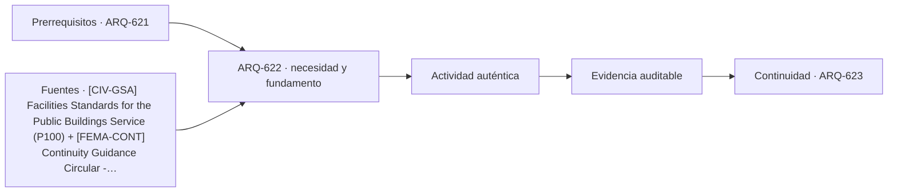

# ARQ-622 · Municipios y servicios públicos

**Parte 63 · Clase desarrollada · Incorporada en v0.34.**

Material educativo con casos ficticios. No sustituye proyecto, normativa, habilitación profesional, evaluación de seguridad ni autorización de operación.

## Pregunta central

¿Cómo organizar varios servicios públicos bajo un mismo techo sin crear recorridos contradictorios ni hacer que cada oficina funcione como un edificio aislado?

## Resultado de aprendizaje y continuidad

Analizarás servicios compartidos, picos de demanda y compatibilidad entre atención general, técnica y comunitaria. Entregarás una matriz de adyacencias y un escenario de operación parcial.

## 1. Tipología y función

Un municipio reúne funciones con ritmos diferentes: recepción de documentos, orientación, reuniones, trabajo técnico, atención reservada y actividades comunitarias. La arquitectura debe distinguir lo que se comparte de lo que necesita independencia.

## 2. Programa y relaciones

Compartir vestíbulo, servicios higiénicos o salas de reunión puede mejorar eficiencia, pero también crear cuellos de botella. La decisión requiere observar simultaneidad y no solo sumar superficies. Dos actividades compatibles en horario pueden ser incompatibles en privacidad o ruido.

## 3. Personas, flujos y operación

Las áreas de trabajo necesitan soporte documental, archivos de uso frecuente, espacios de concentración y comunicación entre equipos. Un esquema que optimiza la circulación pública puede alargar recorridos internos o hacer visible información que debería mantenerse reservada.

## 4. Sistemas e interfaces

La operación parcial es importante: un salón comunitario puede abrir fuera del horario administrativo. Si su acceso depende del vestíbulo principal, la estrategia de cierre debe analizar qué otras áreas quedan expuestas o requieren personal.

## 5. Tiempo, cambio y límites

La legibilidad espacial debe reducir la dependencia de conocer la institución. Señalización, visuales, nombres coherentes y secuencias claras complementan la geometría; ninguna de esas herramientas reemplaza accesibilidad física y comunicacional.

## Caso trabajado: sala compartida y horario extendido

Un edificio ficticio tiene una sala de 120 m² usada por atención ciudadana de 08:00 a 17:00 y por actividades comunitarias de 18:00 a 21:00. La ruta actual atraviesa un vestíbulo de 180 m² que también da acceso a oficinas. Abrir todo el vestíbulo fuera de horario aumenta el área operativa supervisada de 120 a 300 m². Una variante crea un acceso independiente de 25 m² de circulación: el área operativa pasa a 145 m², pero deben revisarse servicios higiénicos, accesibilidad, evacuación, control y mantenimiento. Menor área supervisada no demuestra automáticamente mejor solución.

## Errores frecuentes y revisión crítica

No confundas una suma correcta con una decisión de proyecto completa; no conviertas capacidad nominal en aforo, disponibilidad, seguridad o calidad; no traslades referencias extranjeras como normativa local; no ocultes estados desconocidos. Cada resultado debe conservar unidad, frontera, tiempo y supuestos.

## Práctica independiente

Propón dos esquemas para un municipio pequeño: uno con vestíbulo único y otro con dos accesos operativos. Compara recorridos, superficies activas fuera de horario y dependencias compartidas.

## Solución razonada

La solución debe declarar qué servicios permanecen disponibles en cada estado y qué funciones se duplican. No debe seleccionar una alternativa únicamente porque use menos metros cuadrados; tiene que conservar accesibilidad, información y operación.

## Autoevaluación y enlace

Puedes avanzar cuando distingues programa, operación y evidencia, reconstruyes el caso sin copiar la respuesta y puedes nombrar al menos una condición que el cálculo no resuelve. ARQ-623 lleva la separación de recorridos a tribunales, donde las relaciones funcionales son más estrictas.

<!-- pedagogia-2026:inicio -->
## Decisión pedagógica y posición curricular

### Por qué existe

Esta clase existe para resolver una necesidad concreta del recorrido: ¿Cómo organizar varios servicios públicos bajo un mismo techo sin crear recorridos contradictorios ni hacer que cada oficina funcione como un edificio aislado?

### Por qué está exactamente aquí

Ocupa el lugar 2 de la Parte 63. Se estudia después de ARQ-621 · Edificio cívico y acceso democrático porque usa esa base para responder «¿Cómo organizar varios servicios públicos bajo un mismo techo sin crear recorridos contradictorios ni hacer que cada oficina funcione como un edificio aislado?». Se ubica antes de ARQ-623 · Tribunales y recorridos diferenciados porque la evidencia producida aquí debe estar disponible para ese paso.

- **Prerrequisitos:** `ARQ-621`
- **Capacidad que introduce:** Analizarás servicios compartidos, picos de demanda y compatibilidad entre atención general, técnica y comunitaria. Entregarás una matriz de adyacencias y un escenario de operación parcial.
- **Clases o experiencias que dependen de ella:** `ARQ-623`

El diagrama permite comprobar una relación que el texto lineal oculta con facilidad: esta clase recibe capacidades previas, toma decisiones apoyadas por fuentes, exige una experiencia y produce evidencia que habilita trabajo posterior. No representa un procedimiento de obra.

## Resultado observable, evidencia y evaluación

1. Identificar y delimitar las condiciones necesarias para responder la pregunta central de municipios y servicios públicos.
2. Producir y comprobar la evidencia declarada por la clase: Analizarás servicios compartidos, picos de demanda y compatibilidad entre atención general, técnica y comunitaria. Entregarás una matriz de adyacencias y un escenario de operación parcial.
3. Justificar una decisión de municipios y servicios públicos mediante fuentes, supuestos, alternativas y límites explícitos.

## Actividad, evidencia y criterio de aceptación

**Actividad:** Propón dos esquemas para un municipio pequeño: uno con vestíbulo único y otro con dos accesos operativos. Compara recorridos, superficies activas fuera de horario y dependencias compartidas.

**Evidencia mínima:** Analizarás servicios compartidos, picos de demanda y compatibilidad entre atención general, técnica y comunitaria. Entregarás una matriz de adyacencias y un escenario de operación parcial.

**Archivo sugerido:** `evidence/ARQ-622/evidencia.md`.

**Criterio de aceptación:** la entrega se acepta cuando:

- La entrega responde explícitamente a la pregunta: ¿Cómo organizar varios servicios públicos bajo un mismo techo sin crear recorridos contradictorios ni hacer que cada oficina funcione como un edificio aislado?
- La actividad conserva las fronteras del caso y permite reconstruir el procedimiento: Propón dos esquemas para un municipio pequeño: uno con vestíbulo único y otro con dos accesos operativos. Compara recorridos, superficies activas fuera de horario y dependencias compartidas.
- Cada afirmación externa puede seguirse hasta una fuente, su alcance consultado y su límite.
- La evidencia deja disponible una entrada comprobable para ARQ-623.
- No confundas una suma correcta con una decisión de proyecto completa; no conviertas capacidad nominal en aforo, disponibilidad, seguridad o calidad; no traslades referencias extranjeras como normativa local; no ocultes estados desconocidos. Cada resultado debe conservar unidad, frontera, tiempo y supuestos.

La [rúbrica común](../../docs/RUBRICA_COMUN.md) complementa estos criterios; no los reemplaza. Una entrega puede superar un promedio y continuar pendiente si oculta una condición crítica.

## Trazabilidad de las decisiones

| # | Decisión o fundamento | Fuente utilizada | Aplicación y límite en esta clase |
|---:|---|---|---|
| 1 | Referencia de edificios públicos, desempeño, accesibilidad, coordinación y ciclo de vida. Ámbito federal estadounidense; no sustituye normativa chilena. | [[CIV-GSA] Facilities Standards for the Public Buildings Service (P100)](https://www.gsa.gov/real-estate/facilities-standards-for-the-public-buildings-service) | Consulta: Alcance consultado no documentado; debe completarse antes de ampliar la conclusión. Límite: Referencia de edificios públicos, desempeño, accesibilidad, coordinación y ciclo de vida. Ámbito federal estadounidense; no sustituye normativa chilena. |
| 2 | Continuidad de funciones esenciales, resiliencia y planificación organizacional. Referencia estadounidense. | [[FEMA-CONT] Continuity Guidance Circular - 2024 update](https://www.fema.gov/sites/default/files/documents/fema_continuity-guidance-circular_082024.pdf) | Consulta: Alcance consultado no documentado; debe completarse antes de ampliar la conclusión. Límite: Continuidad de funciones esenciales, resiliencia y planificación organizacional. Referencia estadounidense. |

La tabla permite auditar las relaciones; la explicación, el caso y la práctica de la clase siguen siendo la documentación principal.

## Autoevaluación, recuperación y continuidad

### Errores diagnósticos

Antes de avanzar, comprueba si puedes reconstruir cada resultado sin mirar la solución, señalar qué evidencia lo sostiene y nombrar una condición que obligaría a revisar tu decisión. Conserva la primera versión, la objeción recibida y la revisión.

**Conexión siguiente:** La continuidad inmediata es ARQ-623 · Tribunales y recorridos diferenciados; conserva el método y vuelve a verificar datos y límites.
<!-- pedagogia-2026:fin -->

## Fuentes y alcance de uso

- [CIV-GSA] Facilities Standards for the Public Buildings Service (P100) — U.S. General Services Administration. https://www.gsa.gov/real-estate/facilities-standards-for-the-public-buildings-service

Uso y límite: Referencia de edificios públicos, desempeño, accesibilidad, coordinación y ciclo de vida. Ámbito federal estadounidense; no sustituye normativa chilena.

- [FEMA-CONT] Continuity Guidance Circular - 2024 update — Federal Emergency Management Agency. https://www.fema.gov/sites/default/files/documents/fema_continuity-guidance-circular_082024.pdf

Uso y límite: Continuidad de funciones esenciales, resiliencia y planificación organizacional. Referencia estadounidense.
