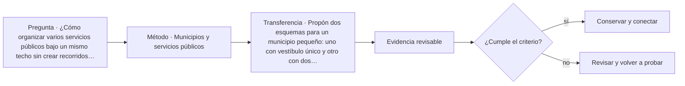

# ARQ-622 · Municipios y servicios públicos

**Parte 63 · Clase desarrollada · Incorporada en v0.34.**

Material educativo con casos ficticios. No sustituye proyecto, normativa, habilitación profesional, evaluación de seguridad ni autorización de operación.

## Pregunta central

¿Cómo organizar varios servicios públicos bajo un mismo techo sin crear recorridos contradictorios ni hacer que cada oficina funcione como un edificio aislado?

## Resultado de aprendizaje y continuidad

Analizarás servicios compartidos, picos de demanda y compatibilidad entre atención general, técnica y comunitaria. Entregarás una matriz de adyacencias y un escenario de operación parcial.

## 1. Tipología y función

Un municipio reúne funciones con ritmos diferentes: recepción de documentos, orientación, reuniones, trabajo técnico, atención reservada y actividades comunitarias. La arquitectura debe distinguir lo que se comparte de lo que necesita independencia.

## 2. Programa y relaciones

Compartir vestíbulo, servicios higiénicos o salas de reunión puede mejorar eficiencia, pero también crear cuellos de botella. La decisión requiere observar simultaneidad y no solo sumar superficies. Dos actividades compatibles en horario pueden ser incompatibles en privacidad o ruido.

## 3. Personas, flujos y operación

Las áreas de trabajo necesitan soporte documental, archivos de uso frecuente, espacios de concentración y comunicación entre equipos. Un esquema que optimiza la circulación pública puede alargar recorridos internos o hacer visible información que debería mantenerse reservada.

## 4. Sistemas e interfaces

La operación parcial es importante: un salón comunitario puede abrir fuera del horario administrativo. Si su acceso depende del vestíbulo principal, la estrategia de cierre debe analizar qué otras áreas quedan expuestas o requieren personal.

## 5. Tiempo, cambio y límites

La legibilidad espacial debe reducir la dependencia de conocer la institución. Señalización, visuales, nombres coherentes y secuencias claras complementan la geometría; ninguna de esas herramientas reemplaza accesibilidad física y comunicacional.

## Caso trabajado: sala compartida y horario extendido

Un edificio ficticio tiene una sala de 120 m² usada por atención ciudadana de 08:00 a 17:00 y por actividades comunitarias de 18:00 a 21:00. La ruta actual atraviesa un vestíbulo de 180 m² que también da acceso a oficinas. Abrir todo el vestíbulo fuera de horario aumenta el área operativa supervisada de 120 a 300 m². Una variante crea un acceso independiente de 25 m² de circulación: el área operativa pasa a 145 m², pero deben revisarse servicios higiénicos, accesibilidad, evacuación, control y mantenimiento. Menor área supervisada no demuestra automáticamente mejor solución.

## Errores frecuentes y revisión crítica

No confundas una suma correcta con una decisión de proyecto completa; no conviertas capacidad nominal en aforo, disponibilidad, seguridad o calidad; no traslades referencias extranjeras como normativa local; no ocultes estados desconocidos. Cada resultado debe conservar unidad, frontera, tiempo y supuestos.

## Práctica independiente

Propón dos esquemas para un municipio pequeño: uno con vestíbulo único y otro con dos accesos operativos. Compara recorridos, superficies activas fuera de horario y dependencias compartidas.

## Solución razonada

La solución debe declarar qué servicios permanecen disponibles en cada estado y qué funciones se duplican. No debe seleccionar una alternativa únicamente porque use menos metros cuadrados; tiene que conservar accesibilidad, información y operación.

## Autoevaluación y enlace

Puedes avanzar cuando distingues programa, operación y evidencia, reconstruyes el caso sin copiar la respuesta y puedes nombrar al menos una condición que el cálculo no resuelve. ARQ-623 lleva la separación de recorridos a tribunales, donde las relaciones funcionales son más estrictas.

<!-- pedagogia-2026:inicio -->
## Mapa visual de aprendizaje

El diagrama representa el ciclo de aprendizaje de esta clase, no una secuencia de obra ni un procedimiento profesional.

## Resultado observable, evidencia y evaluación

**Tipo de clase:** proyectual.

**Evidencia mínima:** lámina o expediente con alternativas, representación pertinente, decisión argumentada, revisión y asuntos pendientes.

**Archivo sugerido:** `evidence/ARQ-622/evidencia.md`.

| Criterio | Evidencia observable |
|---|---|
| Precisión y representación · 20 % | Los conceptos, unidades y convenciones se usan de forma coherente y pueden ser reconstruidos por otra persona. |
| Evidencia y trazabilidad · 25 % | Cada afirmación importante se vincula con dato, cálculo, observación o fuente; hipótesis y desconocidos permanecen visibles. |
| Decisión y alternativas · 25 % | La decisión responde a la pregunta, compara al menos una alternativa y declara qué condición la haría cambiar. |
| Integración y ciclo de vida · 20 % | Se identifica una interfaz y una consecuencia para construcción, uso, mantenimiento, adaptación o fin de vida. |
| Comunicación, ética y límites · 10 % | El alcance se entiende sin explicación oral adicional y no se atribuyen permisos, competencias o certezas inexistentes. |

**Criterio de aceptación:** 80/100 y ningún criterio bajo 60 %. Una entrega genérica que podría reutilizarse sin cambios en otra clase no demuestra dominio. Si existe una condición crítica de seguridad, accesibilidad, evidencia o responsabilidad sin resolver, la entrega permanece pendiente aunque el promedio supere 80.

### Errores diagnósticos

En esta clase conviene vigilar especialmente: comparar alternativas con alcances distintos; defender la imagen antes que el servicio; borrar las huellas de la revisión.

## Autoevaluación, recuperación y continuidad

Antes de avanzar, responde sin consultar la solución:

1. ¿Qué decisión concreta puedes tomar ahora que no podías justificar antes?
2. ¿Qué evidencia de tu entrega es comprobada y cuál continúa siendo una hipótesis?
3. ¿Qué cambio de contexto invalidaría la transferencia realizada?

Revisa la entrega a las 24–48 horas y nuevamente al cerrar la parte. Conserva la primera versión, la crítica recibida y la versión revisada: el aprendizaje se demuestra también mediante el cambio entre versiones.
<!-- pedagogia-2026:fin -->

## Fuentes y alcance de uso

- [CIV-GSA] Facilities Standards for the Public Buildings Service (P100) — U.S. General Services Administration. https://www.gsa.gov/real-estate/facilities-standards-for-the-public-buildings-service

Uso y límite: Referencia de edificios públicos, desempeño, accesibilidad, coordinación y ciclo de vida. Ámbito federal estadounidense; no sustituye normativa chilena.

- [FEMA-CONT] Continuity Guidance Circular - 2024 update — Federal Emergency Management Agency. https://www.fema.gov/sites/default/files/documents/fema_continuity-guidance-circular_082024.pdf

Uso y límite: Continuidad de funciones esenciales, resiliencia y planificación organizacional. Referencia estadounidense.
