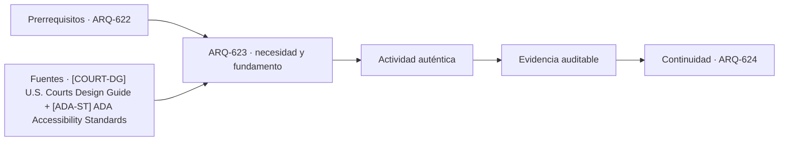

# ARQ-623 · Tribunales y recorridos diferenciados

**Parte 63 · Clase desarrollada · Incorporada en v0.34.**

Material educativo con casos ficticios. No sustituye proyecto, normativa, habilitación profesional, evaluación de seguridad ni autorización de operación.

## Pregunta central

¿Cómo puede un tribunal coordinar acceso público, trabajo judicial, soporte y custodia sin confundir separación funcional con aislamiento total del edificio?

## Resultado de aprendizaje y continuidad

Distinguirás familias de recorridos y sus puntos de interfaz. Construirás un grafo funcional y comprobarás dónde una conexión necesaria genera una intersección que debe ser resuelta por proyecto y operación.

## 1. Tipología y función

Los tribunales son útiles para aprender que los flujos no siempre deben mezclarse. Público, personal judicial, soporte y personas bajo custodia pueden requerir recorridos distintos y encuentros controlados en lugares específicos.

## 2. Programa y relaciones

La separación no se dibuja como líneas de colores que nunca se tocan. Audiencias, salas de entrevista, documentación, servicios y mantenimiento crean interfaces. Cada una necesita una razón, un estado operativo y responsabilidades definidas.

## 3. Personas, flujos y operación

La U.S. Courts Design Guide organiza requisitos y mejores prácticas para proyectos federales de tribunales. En este programa se utiliza para comprender la complejidad tipológica; no se trasladan detalles de seguridad ni se considera norma aplicable en Chile.

## 4. Sistemas e interfaces

Una sala de audiencia también es un espacio de comunicación: visuales, acústica, accesibilidad, interpretación y tecnología deben coordinarse. Aumentar distancia entre grupos puede afectar audibilidad y participación, por lo que seguridad espacial y función judicial necesitan resolverse conjuntamente.

## 5. Tiempo, cambio y límites

El edificio debe poder mantener partes en operación cuando otras se cierran. Mantenimiento, emergencia y cambios de agenda pueden alterar rutas; por eso los diagramas deben incorporar estados y no una única planta supuestamente permanente.

## Caso trabajado: grafo de tres recorridos

Se modelan cuatro nodos públicos P1-P4, tres de trabajo J1-J3 y dos de custodia C1-C2. La sala A conecta P3, J2 y C2 mediante accesos diferenciados. Si el corredor J1-J2 se cierra por mantenimiento, J2 solo conserva acceso desde J3. El público sigue llegando a A, pero la operación judicial depende de la conexión J3-J2. El caso muestra que una sala puede estar físicamente accesible para un grupo y funcionalmente indisponible para el sistema completo.

## Errores frecuentes y revisión crítica

No confundas una suma correcta con una decisión de proyecto completa; no conviertas capacidad nominal en aforo, disponibilidad, seguridad o calidad; no traslades referencias extranjeras como normativa local; no ocultes estados desconocidos. Cada resultado debe conservar unidad, frontera, tiempo y supuestos.

## Práctica independiente

Construye un grafo de un tribunal ficticio con vestíbulo, dos salas, atención, áreas de trabajo y una zona de custodia conceptual. Marca interfaces y analiza un cierre parcial sin proponer detalles de seguridad física.

## Solución razonada

La solución debe conservar al menos tres familias de recorrido, identificar interfaces inevitables y mostrar qué función falla cuando una conexión se pierde. No corresponde describir técnicas de evasión, vigilancia o neutralización de controles.

## Autoevaluación y enlace

Puedes avanzar cuando distingues programa, operación y evidencia, reconstruyes el caso sin copiar la respuesta y puedes nombrar al menos una condición que el cálculo no resuelve. ARQ-624 estudia edificios legislativos y deliberativos desde representación, cámara y espacios públicos.

<!-- pedagogia-2026:inicio -->
## Decisión pedagógica y posición curricular

### Por qué existe

Esta clase existe para resolver una necesidad concreta del recorrido: ¿Cómo puede un tribunal coordinar acceso público, trabajo judicial, soporte y custodia sin confundir separación funcional con aislamiento total del edificio?

### Por qué está exactamente aquí

Ocupa el lugar 3 de la Parte 63. Se estudia después de ARQ-622 · Municipios y servicios públicos porque usa esa base para responder «¿Cómo puede un tribunal coordinar acceso público, trabajo judicial, soporte y custodia sin confundir separación funcional con aislamiento total del edificio?». Se ubica antes de ARQ-624 · Edificios legislativos y deliberación porque la evidencia producida aquí debe estar disponible para ese paso.

- **Prerrequisitos:** `ARQ-622`
- **Capacidad que introduce:** Distinguirás familias de recorridos y sus puntos de interfaz. Construirás un grafo funcional y comprobarás dónde una conexión necesaria genera una intersección que debe ser resuelta por proyecto y operación.
- **Clases o experiencias que dependen de ella:** `ARQ-624`

El diagrama permite comprobar una relación que el texto lineal oculta con facilidad: esta clase recibe capacidades previas, toma decisiones apoyadas por fuentes, exige una experiencia y produce evidencia que habilita trabajo posterior. No representa un procedimiento de obra.

## Resultado observable, evidencia y evaluación

1. Identificar y delimitar las condiciones necesarias para responder la pregunta central de tribunales y recorridos diferenciados.
2. Producir y comprobar la evidencia declarada por la clase: Distinguirás familias de recorridos y sus puntos de interfaz. Construirás un grafo funcional y comprobarás dónde una conexión necesaria genera una intersección que debe ser resuelta por proyecto y operación.
3. Justificar una decisión de tribunales y recorridos diferenciados mediante fuentes, supuestos, alternativas y límites explícitos.

## Actividad, evidencia y criterio de aceptación

**Actividad:** Construye un grafo de un tribunal ficticio con vestíbulo, dos salas, atención, áreas de trabajo y una zona de custodia conceptual. Marca interfaces y analiza un cierre parcial sin proponer detalles de seguridad física.

**Evidencia mínima:** Distinguirás familias de recorridos y sus puntos de interfaz. Construirás un grafo funcional y comprobarás dónde una conexión necesaria genera una intersección que debe ser resuelta por proyecto y operación.

**Archivo sugerido:** `evidence/ARQ-623/evidencia.md`.

**Criterio de aceptación:** la entrega se acepta cuando:

- La entrega responde explícitamente a la pregunta: ¿Cómo puede un tribunal coordinar acceso público, trabajo judicial, soporte y custodia sin confundir separación funcional con aislamiento total del edificio?
- La actividad conserva las fronteras del caso y permite reconstruir el procedimiento: Construye un grafo de un tribunal ficticio con vestíbulo, dos salas, atención, áreas de trabajo y una zona de custodia conceptual. Marca interfaces y analiza un cierre parcial sin proponer detalles de seguridad física.
- Cada afirmación externa puede seguirse hasta una fuente, su alcance consultado y su límite.
- La evidencia deja disponible una entrada comprobable para ARQ-624.
- No confundas una suma correcta con una decisión de proyecto completa; no conviertas capacidad nominal en aforo, disponibilidad, seguridad o calidad; no traslades referencias extranjeras como normativa local; no ocultes estados desconocidos. Cada resultado debe conservar unidad, frontera, tiempo y supuestos.

La [rúbrica común](../../docs/RUBRICA_COMUN.md) complementa estos criterios; no los reemplaza. Una entrega puede superar un promedio y continuar pendiente si oculta una condición crítica.

## Trazabilidad de las decisiones

| # | Decisión o fundamento | Fuente utilizada | Aplicación y límite en esta clase |
|---:|---|---|---|
| 1 | Organización funcional de tribunales, recorridos diferenciados y soporte operativo. Ámbito de tribunales federales de EE. UU. | [[COURT-DG] U.S. Courts Design Guide](https://www.uscourts.gov/administration-policies/judiciary-policies/us-courts-design-guide) | Consulta: Alcance consultado no documentado; debe completarse antes de ampliar la conclusión. Límite: Organización funcional de tribunales, recorridos diferenciados y soporte operativo. Ámbito de tribunales federales de EE. UU. |
| 2 | Accesibilidad de edificios, tribunales, detención, alojamiento temporal y áreas públicas. No se presenta como norma chilena. | [[ADA-ST] ADA Accessibility Standards](https://www.access-board.gov/ada/) | Consulta: Alcance consultado no documentado; debe completarse antes de ampliar la conclusión. Límite: Accesibilidad de edificios, tribunales, detención, alojamiento temporal y áreas públicas. No se presenta como norma chilena. |

La tabla permite auditar las relaciones; la explicación, el caso y la práctica de la clase siguen siendo la documentación principal.

## Autoevaluación, recuperación y continuidad

### Errores diagnósticos

Antes de avanzar, comprueba si puedes reconstruir cada resultado sin mirar la solución, señalar qué evidencia lo sostiene y nombrar una condición que obligaría a revisar tu decisión. Conserva la primera versión, la objeción recibida y la revisión.

**Conexión siguiente:** La continuidad inmediata es ARQ-624 · Edificios legislativos y deliberación; conserva el método y vuelve a verificar datos y límites.
<!-- pedagogia-2026:fin -->

## Fuentes y alcance de uso

- [COURT-DG] U.S. Courts Design Guide — Administrative Office of the U.S. Courts. https://www.uscourts.gov/administration-policies/judiciary-policies/us-courts-design-guide

Uso y límite: Organización funcional de tribunales, recorridos diferenciados y soporte operativo. Ámbito de tribunales federales de EE. UU.

- [ADA-ST] ADA Accessibility Standards — U.S. Access Board. https://www.access-board.gov/ada/

Uso y límite: Accesibilidad de edificios, tribunales, detención, alojamiento temporal y áreas públicas. No se presenta como norma chilena.
