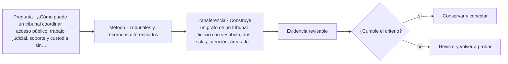

# ARQ-623 · Tribunales y recorridos diferenciados

**Parte 63 · Clase desarrollada · Incorporada en v0.34.**

Material educativo con casos ficticios. No sustituye proyecto, normativa, habilitación profesional, evaluación de seguridad ni autorización de operación.

## Pregunta central

¿Cómo puede un tribunal coordinar acceso público, trabajo judicial, soporte y custodia sin confundir separación funcional con aislamiento total del edificio?

## Resultado de aprendizaje y continuidad

Distinguirás familias de recorridos y sus puntos de interfaz. Construirás un grafo funcional y comprobarás dónde una conexión necesaria genera una intersección que debe ser resuelta por proyecto y operación.

## 1. Tipología y función

Los tribunales son útiles para aprender que los flujos no siempre deben mezclarse. Público, personal judicial, soporte y personas bajo custodia pueden requerir recorridos distintos y encuentros controlados en lugares específicos.

## 2. Programa y relaciones

La separación no se dibuja como líneas de colores que nunca se tocan. Audiencias, salas de entrevista, documentación, servicios y mantenimiento crean interfaces. Cada una necesita una razón, un estado operativo y responsabilidades definidas.

## 3. Personas, flujos y operación

La U.S. Courts Design Guide organiza requisitos y mejores prácticas para proyectos federales de tribunales. En este programa se utiliza para comprender la complejidad tipológica; no se trasladan detalles de seguridad ni se considera norma aplicable en Chile.

## 4. Sistemas e interfaces

Una sala de audiencia también es un espacio de comunicación: visuales, acústica, accesibilidad, interpretación y tecnología deben coordinarse. Aumentar distancia entre grupos puede afectar audibilidad y participación, por lo que seguridad espacial y función judicial necesitan resolverse conjuntamente.

## 5. Tiempo, cambio y límites

El edificio debe poder mantener partes en operación cuando otras se cierran. Mantenimiento, emergencia y cambios de agenda pueden alterar rutas; por eso los diagramas deben incorporar estados y no una única planta supuestamente permanente.

## Caso trabajado: grafo de tres recorridos

Se modelan cuatro nodos públicos P1-P4, tres de trabajo J1-J3 y dos de custodia C1-C2. La sala A conecta P3, J2 y C2 mediante accesos diferenciados. Si el corredor J1-J2 se cierra por mantenimiento, J2 solo conserva acceso desde J3. El público sigue llegando a A, pero la operación judicial depende de la conexión J3-J2. El caso muestra que una sala puede estar físicamente accesible para un grupo y funcionalmente indisponible para el sistema completo.

## Errores frecuentes y revisión crítica

No confundas una suma correcta con una decisión de proyecto completa; no conviertas capacidad nominal en aforo, disponibilidad, seguridad o calidad; no traslades referencias extranjeras como normativa local; no ocultes estados desconocidos. Cada resultado debe conservar unidad, frontera, tiempo y supuestos.

## Práctica independiente

Construye un grafo de un tribunal ficticio con vestíbulo, dos salas, atención, áreas de trabajo y una zona de custodia conceptual. Marca interfaces y analiza un cierre parcial sin proponer detalles de seguridad física.

## Solución razonada

La solución debe conservar al menos tres familias de recorrido, identificar interfaces inevitables y mostrar qué función falla cuando una conexión se pierde. No corresponde describir técnicas de evasión, vigilancia o neutralización de controles.

## Autoevaluación y enlace

Puedes avanzar cuando distingues programa, operación y evidencia, reconstruyes el caso sin copiar la respuesta y puedes nombrar al menos una condición que el cálculo no resuelve. ARQ-624 estudia edificios legislativos y deliberativos desde representación, cámara y espacios públicos.

<!-- pedagogia-2026:inicio -->
## Mapa visual de aprendizaje

El diagrama representa el ciclo de aprendizaje de esta clase, no una secuencia de obra ni un procedimiento profesional.

## Resultado observable, evidencia y evaluación

**Tipo de clase:** proyectual.

**Evidencia mínima:** lámina o expediente con alternativas, representación pertinente, decisión argumentada, revisión y asuntos pendientes.

**Archivo sugerido:** `evidence/ARQ-623/evidencia.md`.

| Criterio | Evidencia observable |
|---|---|
| Precisión y representación · 20 % | Los conceptos, unidades y convenciones se usan de forma coherente y pueden ser reconstruidos por otra persona. |
| Evidencia y trazabilidad · 25 % | Cada afirmación importante se vincula con dato, cálculo, observación o fuente; hipótesis y desconocidos permanecen visibles. |
| Decisión y alternativas · 25 % | La decisión responde a la pregunta, compara al menos una alternativa y declara qué condición la haría cambiar. |
| Integración y ciclo de vida · 20 % | Se identifica una interfaz y una consecuencia para construcción, uso, mantenimiento, adaptación o fin de vida. |
| Comunicación, ética y límites · 10 % | El alcance se entiende sin explicación oral adicional y no se atribuyen permisos, competencias o certezas inexistentes. |

**Criterio de aceptación:** 80/100 y ningún criterio bajo 60 %. Una entrega genérica que podría reutilizarse sin cambios en otra clase no demuestra dominio. Si existe una condición crítica de seguridad, accesibilidad, evidencia o responsabilidad sin resolver, la entrega permanece pendiente aunque el promedio supere 80.

### Errores diagnósticos

En esta clase conviene vigilar especialmente: comparar alternativas con alcances distintos; defender la imagen antes que el servicio; borrar las huellas de la revisión.

## Autoevaluación, recuperación y continuidad

Antes de avanzar, responde sin consultar la solución:

1. ¿Qué decisión concreta puedes tomar ahora que no podías justificar antes?
2. ¿Qué evidencia de tu entrega es comprobada y cuál continúa siendo una hipótesis?
3. ¿Qué cambio de contexto invalidaría la transferencia realizada?

Revisa la entrega a las 24–48 horas y nuevamente al cerrar la parte. Conserva la primera versión, la crítica recibida y la versión revisada: el aprendizaje se demuestra también mediante el cambio entre versiones.
<!-- pedagogia-2026:fin -->

## Fuentes y alcance de uso

- [COURT-DG] U.S. Courts Design Guide — Administrative Office of the U.S. Courts. https://www.uscourts.gov/administration-policies/judiciary-policies/us-courts-design-guide

Uso y límite: Organización funcional de tribunales, recorridos diferenciados y soporte operativo. Ámbito de tribunales federales de EE. UU.

- [ADA-ST] ADA Accessibility Standards — U.S. Access Board. https://www.access-board.gov/ada/

Uso y límite: Accesibilidad de edificios, tribunales, detención, alojamiento temporal y áreas públicas. No se presenta como norma chilena.
