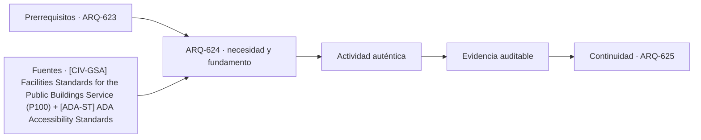

# ARQ-624 · Edificios legislativos y deliberación

**Parte 63 · Clase desarrollada · Incorporada en v0.34.**

Material educativo con casos ficticios. No sustituye proyecto, normativa, habilitación profesional, evaluación de seguridad ni autorización de operación.

## Pregunta central

¿Cómo se traduce la deliberación colectiva en una arquitectura que permita ver, oír, acceder, reunirse y documentar sin reducir el edificio a una gran cámara?

## Resultado de aprendizaje y continuidad

Analizarás cámara, comisiones, galerías, circulaciones y soporte. Diferenciarás capacidad geométrica, calidad de participación y funcionamiento institucional.

## 1. Tipología y función

La tipología legislativa combina espacios de deliberación formal, trabajo en grupos pequeños, reuniones, atención pública, prensa, archivo y administración. La cámara principal es importante, pero el edificio funciona mediante una red de espacios asociados.

## 2. Programa y relaciones

La geometría de la cámara condiciona distancias visuales y acústicas. Disposiciones semicirculares, enfrentadas o radiales producen relaciones distintas entre participantes y público; el curso no presenta una forma como políticamente superior.

## 3. Personas, flujos y operación

Las galerías públicas deben integrarse a una cadena de llegada, orientación, accesibilidad y salida. La posibilidad de observar una sesión no equivale a que el edificio completo sea accesible o comprensible.

## 4. Sistemas e interfaces

La infraestructura audiovisual cambia el proyecto: cámaras, interpretación, votación, redes y mantenimiento requieren espacios y rutas. Debe evitarse que las instalaciones ocupen después las áreas previstas para accesibilidad o circulación.

## 5. Tiempo, cambio y límites

En edificios existentes, adaptar una cámara puede afectar patrimonio, acústica, estructura y tecnología. La intervención necesita priorizar funciones y evidencias, no simplemente replicar el aspecto histórico.

## Caso trabajado: distancia y visibilidad

Una cámara ficticia tiene filas dispuestas en un arco de radio interior 8 m y exterior 18 m. Un observador situado en la fila exterior está aproximadamente 10 m más lejos del centro que uno de la primera fila. Si un monitor de apoyo reduce la necesidad de leer detalles a distancia, mejora una condición informativa pero no cambia la geometría ni garantiza audibilidad. El ejercicio separa soporte tecnológico de condiciones espaciales.

## Errores frecuentes y revisión crítica

No confundas una suma correcta con una decisión de proyecto completa; no conviertas capacidad nominal en aforo, disponibilidad, seguridad o calidad; no traslades referencias extranjeras como normativa local; no ocultes estados desconocidos. Cada resultado debe conservar unidad, frontera, tiempo y supuestos.

## Práctica independiente

Compara dos esquemas de cámara para 120 participantes: uno semicircular y otro rectangular. No elijas un ganador; identifica efectos sobre distancia máxima, circulación, galerías y flexibilidad.

## Solución razonada

La respuesta debe registrar ventajas y compromisos sin atribuirlos a ideologías o partidos. Debe marcar como pendientes acústica, accesibilidad, estructura, incendio y tecnología específica.

## Autoevaluación y enlace

Puedes avanzar cuando distingues programa, operación y evidencia, reconstruyes el caso sin copiar la respuesta y puedes nombrar al menos una condición que el cálculo no resuelve. ARQ-625 cambia a edificios policiales y atención pública, separando servicio, trabajo interno y soporte operativo.

<!-- pedagogia-2026:inicio -->
## Decisión pedagógica y posición curricular

### Por qué existe

Esta clase existe para resolver una necesidad concreta del recorrido: ¿Cómo se traduce la deliberación colectiva en una arquitectura que permita ver, oír, acceder, reunirse y documentar sin reducir el edificio a una gran cámara?

### Por qué está exactamente aquí

Ocupa el lugar 4 de la Parte 63. Se estudia después de ARQ-623 · Tribunales y recorridos diferenciados porque usa esa base para responder «¿Cómo se traduce la deliberación colectiva en una arquitectura que permita ver, oír, acceder, reunirse y documentar sin reducir el edificio a una gran cámara?». Se ubica antes de ARQ-625 · Comisarías y atención pública porque la evidencia producida aquí debe estar disponible para ese paso.

- **Prerrequisitos:** `ARQ-623`
- **Capacidad que introduce:** Analizarás cámara, comisiones, galerías, circulaciones y soporte. Diferenciarás capacidad geométrica, calidad de participación y funcionamiento institucional.
- **Clases o experiencias que dependen de ella:** `ARQ-625`

El diagrama permite comprobar una relación que el texto lineal oculta con facilidad: esta clase recibe capacidades previas, toma decisiones apoyadas por fuentes, exige una experiencia y produce evidencia que habilita trabajo posterior. No representa un procedimiento de obra.

## Resultado observable, evidencia y evaluación

1. Identificar y delimitar las condiciones necesarias para responder la pregunta central de edificios legislativos y deliberación.
2. Producir y comprobar la evidencia declarada por la clase: Analizarás cámara, comisiones, galerías, circulaciones y soporte. Diferenciarás capacidad geométrica, calidad de participación y funcionamiento institucional.
3. Justificar una decisión de edificios legislativos y deliberación mediante fuentes, supuestos, alternativas y límites explícitos.

## Actividad, evidencia y criterio de aceptación

**Actividad:** Compara dos esquemas de cámara para 120 participantes: uno semicircular y otro rectangular. No elijas un ganador; identifica efectos sobre distancia máxima, circulación, galerías y flexibilidad.

**Evidencia mínima:** Analizarás cámara, comisiones, galerías, circulaciones y soporte. Diferenciarás capacidad geométrica, calidad de participación y funcionamiento institucional.

**Archivo sugerido:** `evidence/ARQ-624/evidencia.md`.

**Criterio de aceptación:** la entrega se acepta cuando:

- La entrega responde explícitamente a la pregunta: ¿Cómo se traduce la deliberación colectiva en una arquitectura que permita ver, oír, acceder, reunirse y documentar sin reducir el edificio a una gran cámara?
- La actividad conserva las fronteras del caso y permite reconstruir el procedimiento: Compara dos esquemas de cámara para 120 participantes: uno semicircular y otro rectangular. No elijas un ganador; identifica efectos sobre distancia máxima, circulación, galerías y flexibilidad.
- Cada afirmación externa puede seguirse hasta una fuente, su alcance consultado y su límite.
- La evidencia deja disponible una entrada comprobable para ARQ-625.
- No confundas una suma correcta con una decisión de proyecto completa; no conviertas capacidad nominal en aforo, disponibilidad, seguridad o calidad; no traslades referencias extranjeras como normativa local; no ocultes estados desconocidos. Cada resultado debe conservar unidad, frontera, tiempo y supuestos.

La [rúbrica común](../../docs/RUBRICA_COMUN.md) complementa estos criterios; no los reemplaza. Una entrega puede superar un promedio y continuar pendiente si oculta una condición crítica.

## Trazabilidad de las decisiones

| # | Decisión o fundamento | Fuente utilizada | Aplicación y límite en esta clase |
|---:|---|---|---|
| 1 | Referencia de edificios públicos, desempeño, accesibilidad, coordinación y ciclo de vida. Ámbito federal estadounidense; no sustituye normativa chilena. | [[CIV-GSA] Facilities Standards for the Public Buildings Service (P100)](https://www.gsa.gov/real-estate/facilities-standards-for-the-public-buildings-service) | Consulta: Alcance consultado no documentado; debe completarse antes de ampliar la conclusión. Límite: Referencia de edificios públicos, desempeño, accesibilidad, coordinación y ciclo de vida. Ámbito federal estadounidense; no sustituye normativa chilena. |
| 2 | Accesibilidad de edificios, tribunales, detención, alojamiento temporal y áreas públicas. No se presenta como norma chilena. | [[ADA-ST] ADA Accessibility Standards](https://www.access-board.gov/ada/) | Consulta: Alcance consultado no documentado; debe completarse antes de ampliar la conclusión. Límite: Accesibilidad de edificios, tribunales, detención, alojamiento temporal y áreas públicas. No se presenta como norma chilena. |

La tabla permite auditar las relaciones; la explicación, el caso y la práctica de la clase siguen siendo la documentación principal.

## Autoevaluación, recuperación y continuidad

### Errores diagnósticos

Antes de avanzar, comprueba si puedes reconstruir cada resultado sin mirar la solución, señalar qué evidencia lo sostiene y nombrar una condición que obligaría a revisar tu decisión. Conserva la primera versión, la objeción recibida y la revisión.

**Conexión siguiente:** La continuidad inmediata es ARQ-625 · Comisarías y atención pública; conserva el método y vuelve a verificar datos y límites.
<!-- pedagogia-2026:fin -->

## Fuentes y alcance de uso

- [CIV-GSA] Facilities Standards for the Public Buildings Service (P100) — U.S. General Services Administration. https://www.gsa.gov/real-estate/facilities-standards-for-the-public-buildings-service

Uso y límite: Referencia de edificios públicos, desempeño, accesibilidad, coordinación y ciclo de vida. Ámbito federal estadounidense; no sustituye normativa chilena.

- [ADA-ST] ADA Accessibility Standards — U.S. Access Board. https://www.access-board.gov/ada/

Uso y límite: Accesibilidad de edificios, tribunales, detención, alojamiento temporal y áreas públicas. No se presenta como norma chilena.
