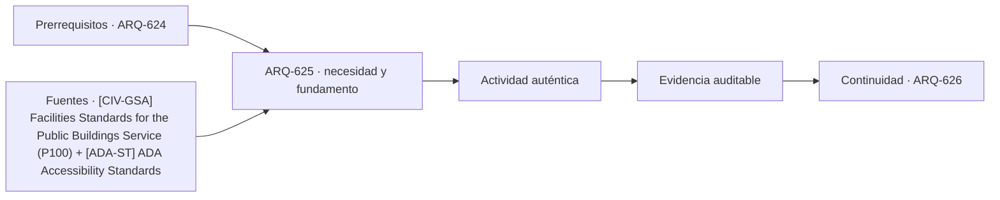

# ARQ-625 · Comisarías y atención pública

**Parte 63 · Clase desarrollada · Incorporada en v0.34.**

Material educativo con casos ficticios. No sustituye proyecto, normativa, habilitación profesional, evaluación de seguridad ni autorización de operación.

## Pregunta central

¿Cómo diseñar una instalación policial que permita atención digna y accesible al público mientras mantiene independientes las operaciones que no forman parte de ese servicio?

## Resultado de aprendizaje y continuidad

Organizarás atención, espera, entrevistas, personal, soporte y logística como capas funcionales. Evitarás convertir la clase en un manual táctico de seguridad.

## 1. Tipología y función

Una comisaría tiene una dimensión pública: información, recepción de denuncias, entrevistas, orientación y coordinación con otros servicios. Esa experiencia necesita privacidad, accesibilidad y comprensión, no solo control.

## 2. Programa y relaciones

Las áreas de trabajo interno, almacenamiento especializado, descanso y soporte operativo tienen requisitos diferentes. El proyecto debe evitar que la circulación pública se convierta en ruta de servicio o que las zonas de soporte dependan de atravesar la espera.

## 3. Personas, flujos y operación

Las entrevistas pueden necesitar distintos grados de privacidad acústica y visual. El diseño no debe asumir que una puerta cerrada garantiza confidencialidad; también importan transmisión sonora, circulación y gestión de información.

## 4. Sistemas e interfaces

La operación cambia entre atención ordinaria y situaciones excepcionales. Los espacios de espera y acceso pueden requerir capacidad de reorganización sin bloquear rutas accesibles o servicios esenciales.

## 5. Tiempo, cambio y límites

Por seguridad, esta clase mantiene el análisis a nivel de zonificación, flujos y continuidad. No detalla procedimientos de vigilancia, barreras, rutas de custodia ni vulnerabilidades que puedan facilitar evasión o daño.

## Caso trabajado: espera y entrevistas

Un centro ficticio recibe 24 personas en una hora. Cuatro salas de entrevista atienden en promedio una persona cada 20 minutos bajo la hipótesis del ejercicio: capacidad nominal 12 personas/h. Si la mitad de las llegadas requiere entrevista, la demanda es 12/h y no existe margen nominal. Una variación pequeña de duración o simultaneidad produciría cola. El cálculo demuestra sensibilidad, no una dotación recomendada.

## Errores frecuentes y revisión crítica

No confundas una suma correcta con una decisión de proyecto completa; no conviertas capacidad nominal en aforo, disponibilidad, seguridad o calidad; no traslades referencias extranjeras como normativa local; no ocultes estados desconocidos. Cada resultado debe conservar unidad, frontera, tiempo y supuestos.

## Práctica independiente

Dibuja un esquema de atención con recepción, espera, dos tipos de entrevista y servicios de apoyo. Analiza cómo conservar privacidad y accesibilidad sin describir sistemas tácticos de seguridad.

## Solución razonada

Una buena solución separa claramente atención pública y trabajo interno, identifica la entrevista como interfaz y reconoce que los tiempos de servicio ficticios no determinan un programa real.

## Autoevaluación y enlace

Puedes avanzar cuando distingues programa, operación y evidencia, reconstruyes el caso sin copiar la respuesta y puedes nombrar al menos una condición que el cálculo no resuelve. ARQ-626 estudia instalaciones penitenciarias desde dignidad, salud, vida cotidiana y operación, sin tácticas de seguridad.

<!-- pedagogia-2026:inicio -->
## Decisión pedagógica y posición curricular

### Por qué existe

Esta clase existe para resolver una necesidad concreta del recorrido: ¿Cómo diseñar una instalación policial que permita atención digna y accesible al público mientras mantiene independientes las operaciones que no forman parte de ese servicio?

### Por qué está exactamente aquí

Ocupa el lugar 5 de la Parte 63. Se estudia después de ARQ-624 · Edificios legislativos y deliberación porque usa esa base para responder «¿Cómo diseñar una instalación policial que permita atención digna y accesible al público mientras mantiene independientes las operaciones que no forman parte de ese servicio?». Se ubica antes de ARQ-626 · Prisiones: seguridad, dignidad y operación porque la evidencia producida aquí debe estar disponible para ese paso.

- **Prerrequisitos:** `ARQ-624`
- **Capacidad que introduce:** Organizarás atención, espera, entrevistas, personal, soporte y logística como capas funcionales. Evitarás convertir la clase en un manual táctico de seguridad.
- **Clases o experiencias que dependen de ella:** `ARQ-626`

El diagrama permite comprobar una relación que el texto lineal oculta con facilidad: esta clase recibe capacidades previas, toma decisiones apoyadas por fuentes, exige una experiencia y produce evidencia que habilita trabajo posterior. No representa un procedimiento de obra.

## Resultado observable, evidencia y evaluación

1. Identificar y delimitar las condiciones necesarias para responder la pregunta central de comisarías y atención pública.
2. Producir y comprobar la evidencia declarada por la clase: Organizarás atención, espera, entrevistas, personal, soporte y logística como capas funcionales. Evitarás convertir la clase en un manual táctico de seguridad.
3. Justificar una decisión de comisarías y atención pública mediante fuentes, supuestos, alternativas y límites explícitos.

## Actividad, evidencia y criterio de aceptación

**Actividad:** Dibuja un esquema de atención con recepción, espera, dos tipos de entrevista y servicios de apoyo. Analiza cómo conservar privacidad y accesibilidad sin describir sistemas tácticos de seguridad.

**Evidencia mínima:** Organizarás atención, espera, entrevistas, personal, soporte y logística como capas funcionales. Evitarás convertir la clase en un manual táctico de seguridad.

**Archivo sugerido:** `evidence/ARQ-625/evidencia.md`.

**Criterio de aceptación:** la entrega se acepta cuando:

- La entrega responde explícitamente a la pregunta: ¿Cómo diseñar una instalación policial que permita atención digna y accesible al público mientras mantiene independientes las operaciones que no forman parte de ese servicio?
- La actividad conserva las fronteras del caso y permite reconstruir el procedimiento: Dibuja un esquema de atención con recepción, espera, dos tipos de entrevista y servicios de apoyo. Analiza cómo conservar privacidad y accesibilidad sin describir sistemas tácticos de seguridad.
- Cada afirmación externa puede seguirse hasta una fuente, su alcance consultado y su límite.
- La evidencia deja disponible una entrada comprobable para ARQ-626.
- No confundas una suma correcta con una decisión de proyecto completa; no conviertas capacidad nominal en aforo, disponibilidad, seguridad o calidad; no traslades referencias extranjeras como normativa local; no ocultes estados desconocidos. Cada resultado debe conservar unidad, frontera, tiempo y supuestos.

La [rúbrica común](../../docs/RUBRICA_COMUN.md) complementa estos criterios; no los reemplaza. Una entrega puede superar un promedio y continuar pendiente si oculta una condición crítica.

## Trazabilidad de las decisiones

| # | Decisión o fundamento | Fuente utilizada | Aplicación y límite en esta clase |
|---:|---|---|---|
| 1 | Referencia de edificios públicos, desempeño, accesibilidad, coordinación y ciclo de vida. Ámbito federal estadounidense; no sustituye normativa chilena. | [[CIV-GSA] Facilities Standards for the Public Buildings Service (P100)](https://www.gsa.gov/real-estate/facilities-standards-for-the-public-buildings-service) | Consulta: Alcance consultado no documentado; debe completarse antes de ampliar la conclusión. Límite: Referencia de edificios públicos, desempeño, accesibilidad, coordinación y ciclo de vida. Ámbito federal estadounidense; no sustituye normativa chilena. |
| 2 | Accesibilidad de edificios, tribunales, detención, alojamiento temporal y áreas públicas. No se presenta como norma chilena. | [[ADA-ST] ADA Accessibility Standards](https://www.access-board.gov/ada/) | Consulta: Alcance consultado no documentado; debe completarse antes de ampliar la conclusión. Límite: Accesibilidad de edificios, tribunales, detención, alojamiento temporal y áreas públicas. No se presenta como norma chilena. |

La tabla permite auditar las relaciones; la explicación, el caso y la práctica de la clase siguen siendo la documentación principal.

## Autoevaluación, recuperación y continuidad

### Errores diagnósticos

Antes de avanzar, comprueba si puedes reconstruir cada resultado sin mirar la solución, señalar qué evidencia lo sostiene y nombrar una condición que obligaría a revisar tu decisión. Conserva la primera versión, la objeción recibida y la revisión.

**Conexión siguiente:** La continuidad inmediata es ARQ-626 · Prisiones: seguridad, dignidad y operación; conserva el método y vuelve a verificar datos y límites.
<!-- pedagogia-2026:fin -->

## Fuentes y alcance de uso

- [CIV-GSA] Facilities Standards for the Public Buildings Service (P100) — U.S. General Services Administration. https://www.gsa.gov/real-estate/facilities-standards-for-the-public-buildings-service

Uso y límite: Referencia de edificios públicos, desempeño, accesibilidad, coordinación y ciclo de vida. Ámbito federal estadounidense; no sustituye normativa chilena.

- [ADA-ST] ADA Accessibility Standards — U.S. Access Board. https://www.access-board.gov/ada/

Uso y límite: Accesibilidad de edificios, tribunales, detención, alojamiento temporal y áreas públicas. No se presenta como norma chilena.
