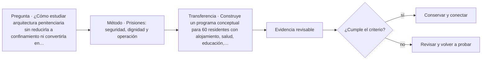

# ARQ-626 · Prisiones: seguridad, dignidad y operación

**Parte 63 · Clase desarrollada · Incorporada en v0.34.**

Material educativo con casos ficticios. No sustituye proyecto, normativa, habilitación profesional, evaluación de seguridad ni autorización de operación.

## Pregunta central

¿Cómo estudiar arquitectura penitenciaria sin reducirla a confinamiento ni convertirla en un manual de seguridad?

## Resultado de aprendizaje y continuidad

Relacionarás alojamiento, salud, actividad, visitas, trabajo, educación, patios, servicios y operación con principios de dignidad y reintegración. El análisis permanecerá en nivel programático y espacial.

## 1. Tipología y función

Las instalaciones penitenciarias son edificios habitados durante largos periodos y deben estudiarse como entornos de vida además de sistemas de control. Alojamiento, higiene, salud, alimentación, actividad, educación, visitas y acceso al aire libre forman parte del programa.

## 2. Programa y relaciones

Las Nelson Mandela Rules constituyen un marco internacional sobre tratamiento y condiciones de detención. El curso las usa para recordar que seguridad y dignidad no son objetivos excluyentes; no se traducen directamente en un detalle constructivo o un régimen operativo.

## 3. Personas, flujos y operación

La arquitectura necesita distinguir alojamiento, servicios comunes, atención de salud, administración y visitas. La segregación espacial puede tener consecuencias humanas y operativas; por ello no se prescribe una distribución universal.

## 4. Sistemas e interfaces

Iluminación, ventilación, saneamiento y mantenimiento son fundamentales porque una falla afecta personas que no pueden abandonar libremente el edificio. La continuidad de agua, energía y salud requiere planificación explícita.

## 5. Tiempo, cambio y límites

Por seguridad, no se incluyen especificaciones de perímetros, cerraduras, vigilancia, tiempos de respuesta, rutas de evasión o vulnerabilidades. El objetivo es comprender la tipología y sus obligaciones de habitabilidad.

## Caso trabajado: capacidad de un servicio común

Un módulo ficticio aloja 72 personas. Un espacio educativo admite 18 por sesión y puede operar cuatro sesiones diarias: 72 plazas-sesión. Eso permite, en teoría, una sesión por persona al día si la población completa usa el servicio y no existen interrupciones. Si una sesión se cancela, quedan 54 plazas-sesión. El cálculo muestra cómo la continuidad operativa influye en acceso al servicio; no determina un régimen penitenciario.

## Errores frecuentes y revisión crítica

No confundas una suma correcta con una decisión de proyecto completa; no conviertas capacidad nominal en aforo, disponibilidad, seguridad o calidad; no traslades referencias extranjeras como normativa local; no ocultes estados desconocidos. Cada resultado debe conservar unidad, frontera, tiempo y supuestos.

## Práctica independiente

Construye un programa conceptual para 60 residentes con alojamiento, salud, educación, visitas y patio. Explica qué servicios no deberían depender de un único espacio si su interrupción elimina toda la prestación.

## Solución razonada

La solución debe mostrar relaciones de dignidad, salud y actividad, mantener separados residentes, visitantes y operación solo donde exista una razón funcional, y evitar detalles de seguridad explotables.

## Autoevaluación y enlace

Puedes avanzar cuando distingues programa, operación y evidencia, reconstruyes el caso sin copiar la respuesta y puedes nombrar al menos una condición que el cálculo no resuelve. ARQ-627 cambia a edificios de archivo, donde la custodia se centra en información y objetos documentales.

<!-- pedagogia-2026:inicio -->
## Mapa visual de aprendizaje

El diagrama representa el ciclo de aprendizaje de esta clase, no una secuencia de obra ni un procedimiento profesional.

## Resultado observable, evidencia y evaluación

**Tipo de clase:** proyectual.

**Evidencia mínima:** lámina o expediente con alternativas, representación pertinente, decisión argumentada, revisión y asuntos pendientes.

**Archivo sugerido:** `evidence/ARQ-626/evidencia.md`.

| Criterio | Evidencia observable |
|---|---|
| Precisión y representación · 20 % | Los conceptos, unidades y convenciones se usan de forma coherente y pueden ser reconstruidos por otra persona. |
| Evidencia y trazabilidad · 25 % | Cada afirmación importante se vincula con dato, cálculo, observación o fuente; hipótesis y desconocidos permanecen visibles. |
| Decisión y alternativas · 25 % | La decisión responde a la pregunta, compara al menos una alternativa y declara qué condición la haría cambiar. |
| Integración y ciclo de vida · 20 % | Se identifica una interfaz y una consecuencia para construcción, uso, mantenimiento, adaptación o fin de vida. |
| Comunicación, ética y límites · 10 % | El alcance se entiende sin explicación oral adicional y no se atribuyen permisos, competencias o certezas inexistentes. |

**Criterio de aceptación:** 80/100 y ningún criterio bajo 60 %. Una entrega genérica que podría reutilizarse sin cambios en otra clase no demuestra dominio. Si existe una condición crítica de seguridad, accesibilidad, evidencia o responsabilidad sin resolver, la entrega permanece pendiente aunque el promedio supere 80.

### Errores diagnósticos

En esta clase conviene vigilar especialmente: comparar alternativas con alcances distintos; defender la imagen antes que el servicio; borrar las huellas de la revisión.

## Autoevaluación, recuperación y continuidad

Antes de avanzar, responde sin consultar la solución:

1. ¿Qué decisión concreta puedes tomar ahora que no podías justificar antes?
2. ¿Qué evidencia de tu entrega es comprobada y cuál continúa siendo una hipótesis?
3. ¿Qué cambio de contexto invalidaría la transferencia realizada?

Revisa la entrega a las 24–48 horas y nuevamente al cerrar la parte. Conserva la primera versión, la crítica recibida y la versión revisada: el aprendizaje se demuestra también mediante el cambio entre versiones.
<!-- pedagogia-2026:fin -->

## Fuentes y alcance de uso

- [UNODC-MR] United Nations Standard Minimum Rules for the Treatment of Prisoners (Nelson Mandela Rules) — United Nations Office on Drugs and Crime. https://www.unodc.org/unodc/en/justice-and-prison-reform/nelsonmandelarules.html

Uso y límite: Marco internacional de dignidad, salud, alojamiento y gestión penitenciaria. No es manual táctico ni especificación de seguridad física.

- [ADA-ST] ADA Accessibility Standards — U.S. Access Board. https://www.access-board.gov/ada/

Uso y límite: Accesibilidad de edificios, tribunales, detención, alojamiento temporal y áreas públicas. No se presenta como norma chilena.
