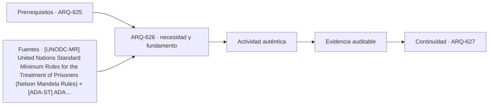

# ARQ-626 · Prisiones: seguridad, dignidad y operación

**Parte 63 · Clase desarrollada · Incorporada en v0.34.**

Material educativo con casos ficticios. No sustituye proyecto, normativa, habilitación profesional, evaluación de seguridad ni autorización de operación.

## Pregunta central

¿Cómo estudiar arquitectura penitenciaria sin reducirla a confinamiento ni convertirla en un manual de seguridad?

## Resultado de aprendizaje y continuidad

Relacionarás alojamiento, salud, actividad, visitas, trabajo, educación, patios, servicios y operación con principios de dignidad y reintegración. El análisis permanecerá en nivel programático y espacial.

## 1. Tipología y función

Las instalaciones penitenciarias son edificios habitados durante largos periodos y deben estudiarse como entornos de vida además de sistemas de control. Alojamiento, higiene, salud, alimentación, actividad, educación, visitas y acceso al aire libre forman parte del programa.

## 2. Programa y relaciones

Las Nelson Mandela Rules constituyen un marco internacional sobre tratamiento y condiciones de detención. El curso las usa para recordar que seguridad y dignidad no son objetivos excluyentes; no se traducen directamente en un detalle constructivo o un régimen operativo.

## 3. Personas, flujos y operación

La arquitectura necesita distinguir alojamiento, servicios comunes, atención de salud, administración y visitas. La segregación espacial puede tener consecuencias humanas y operativas; por ello no se prescribe una distribución universal.

## 4. Sistemas e interfaces

Iluminación, ventilación, saneamiento y mantenimiento son fundamentales porque una falla afecta personas que no pueden abandonar libremente el edificio. La continuidad de agua, energía y salud requiere planificación explícita.

## 5. Tiempo, cambio y límites

Por seguridad, no se incluyen especificaciones de perímetros, cerraduras, vigilancia, tiempos de respuesta, rutas de evasión o vulnerabilidades. El objetivo es comprender la tipología y sus obligaciones de habitabilidad.

## Caso trabajado: capacidad de un servicio común

Un módulo ficticio aloja 72 personas. Un espacio educativo admite 18 por sesión y puede operar cuatro sesiones diarias: 72 plazas-sesión. Eso permite, en teoría, una sesión por persona al día si la población completa usa el servicio y no existen interrupciones. Si una sesión se cancela, quedan 54 plazas-sesión. El cálculo muestra cómo la continuidad operativa influye en acceso al servicio; no determina un régimen penitenciario.

## Errores frecuentes y revisión crítica

No confundas una suma correcta con una decisión de proyecto completa; no conviertas capacidad nominal en aforo, disponibilidad, seguridad o calidad; no traslades referencias extranjeras como normativa local; no ocultes estados desconocidos. Cada resultado debe conservar unidad, frontera, tiempo y supuestos.

## Práctica independiente

Construye un programa conceptual para 60 residentes con alojamiento, salud, educación, visitas y patio. Explica qué servicios no deberían depender de un único espacio si su interrupción elimina toda la prestación.

## Solución razonada

La solución debe mostrar relaciones de dignidad, salud y actividad, mantener separados residentes, visitantes y operación solo donde exista una razón funcional, y evitar detalles de seguridad explotables.

## Autoevaluación y enlace

Puedes avanzar cuando distingues programa, operación y evidencia, reconstruyes el caso sin copiar la respuesta y puedes nombrar al menos una condición que el cálculo no resuelve. ARQ-627 cambia a edificios de archivo, donde la custodia se centra en información y objetos documentales.

<!-- pedagogia-2026:inicio -->
## Decisión pedagógica y posición curricular

### Por qué existe

Esta clase existe para resolver una necesidad concreta del recorrido: ¿Cómo estudiar arquitectura penitenciaria sin reducirla a confinamiento ni convertirla en un manual de seguridad?

### Por qué está exactamente aquí

Ocupa el lugar 6 de la Parte 63. Se estudia después de ARQ-625 · Comisarías y atención pública porque usa esa base para responder «¿Cómo estudiar arquitectura penitenciaria sin reducirla a confinamiento ni convertirla en un manual de seguridad?». Se ubica antes de ARQ-627 · Archivos y edificios de custodia porque la evidencia producida aquí debe estar disponible para ese paso.

- **Prerrequisitos:** `ARQ-625`
- **Capacidad que introduce:** Relacionarás alojamiento, salud, actividad, visitas, trabajo, educación, patios, servicios y operación con principios de dignidad y reintegración. El análisis permanecerá en nivel programático y espacial.
- **Clases o experiencias que dependen de ella:** `ARQ-627`

El diagrama permite comprobar una relación que el texto lineal oculta con facilidad: esta clase recibe capacidades previas, toma decisiones apoyadas por fuentes, exige una experiencia y produce evidencia que habilita trabajo posterior. No representa un procedimiento de obra.

## Resultado observable, evidencia y evaluación

1. Identificar y delimitar las condiciones necesarias para responder la pregunta central de prisiones: seguridad, dignidad y operación.
2. Producir y comprobar la evidencia declarada por la clase: Relacionarás alojamiento, salud, actividad, visitas, trabajo, educación, patios, servicios y operación con principios de dignidad y reintegración. El análisis permanecerá en nivel programático y espacial.
3. Justificar una decisión de prisiones: seguridad, dignidad y operación mediante fuentes, supuestos, alternativas y límites explícitos.

## Actividad, evidencia y criterio de aceptación

**Actividad:** Construye un programa conceptual para 60 residentes con alojamiento, salud, educación, visitas y patio. Explica qué servicios no deberían depender de un único espacio si su interrupción elimina toda la prestación.

**Evidencia mínima:** Relacionarás alojamiento, salud, actividad, visitas, trabajo, educación, patios, servicios y operación con principios de dignidad y reintegración. El análisis permanecerá en nivel programático y espacial.

**Archivo sugerido:** `evidence/ARQ-626/evidencia.md`.

**Criterio de aceptación:** la entrega se acepta cuando:

- La entrega responde explícitamente a la pregunta: ¿Cómo estudiar arquitectura penitenciaria sin reducirla a confinamiento ni convertirla en un manual de seguridad?
- La actividad conserva las fronteras del caso y permite reconstruir el procedimiento: Construye un programa conceptual para 60 residentes con alojamiento, salud, educación, visitas y patio. Explica qué servicios no deberían depender de un único espacio si su interrupción elimina toda la prestación.
- Cada afirmación externa puede seguirse hasta una fuente, su alcance consultado y su límite.
- La evidencia deja disponible una entrada comprobable para ARQ-627.
- No confundas una suma correcta con una decisión de proyecto completa; no conviertas capacidad nominal en aforo, disponibilidad, seguridad o calidad; no traslades referencias extranjeras como normativa local; no ocultes estados desconocidos. Cada resultado debe conservar unidad, frontera, tiempo y supuestos.

La [rúbrica común](../../docs/RUBRICA_COMUN.md) complementa estos criterios; no los reemplaza. Una entrega puede superar un promedio y continuar pendiente si oculta una condición crítica.

## Trazabilidad de las decisiones

| # | Decisión o fundamento | Fuente utilizada | Aplicación y límite en esta clase |
|---:|---|---|---|
| 1 | Marco internacional de dignidad, salud, alojamiento y gestión penitenciaria. No es manual táctico ni especificación de seguridad física. | [[UNODC-MR] United Nations Standard Minimum Rules for the Treatment of…](https://www.unodc.org/unodc/en/justice-and-prison-reform/nelsonmandelarules.html) | Consulta: Alcance consultado no documentado; debe completarse antes de ampliar la conclusión. Límite: Marco internacional de dignidad, salud, alojamiento y gestión penitenciaria. No es manual táctico ni especificación de seguridad física. |
| 2 | Accesibilidad de edificios, tribunales, detención, alojamiento temporal y áreas públicas. No se presenta como norma chilena. | [[ADA-ST] ADA Accessibility Standards](https://www.access-board.gov/ada/) | Consulta: Alcance consultado no documentado; debe completarse antes de ampliar la conclusión. Límite: Accesibilidad de edificios, tribunales, detención, alojamiento temporal y áreas públicas. No se presenta como norma chilena. |

La tabla permite auditar las relaciones; la explicación, el caso y la práctica de la clase siguen siendo la documentación principal.

## Autoevaluación, recuperación y continuidad

### Errores diagnósticos

Antes de avanzar, comprueba si puedes reconstruir cada resultado sin mirar la solución, señalar qué evidencia lo sostiene y nombrar una condición que obligaría a revisar tu decisión. Conserva la primera versión, la objeción recibida y la revisión.

**Conexión siguiente:** La continuidad inmediata es ARQ-627 · Archivos y edificios de custodia; conserva el método y vuelve a verificar datos y límites.
<!-- pedagogia-2026:fin -->

## Fuentes y alcance de uso

- [UNODC-MR] United Nations Standard Minimum Rules for the Treatment of Prisoners (Nelson Mandela Rules) — United Nations Office on Drugs and Crime. https://www.unodc.org/unodc/en/justice-and-prison-reform/nelsonmandelarules.html

Uso y límite: Marco internacional de dignidad, salud, alojamiento y gestión penitenciaria. No es manual táctico ni especificación de seguridad física.

- [ADA-ST] ADA Accessibility Standards — U.S. Access Board. https://www.access-board.gov/ada/

Uso y límite: Accesibilidad de edificios, tribunales, detención, alojamiento temporal y áreas públicas. No se presenta como norma chilena.
